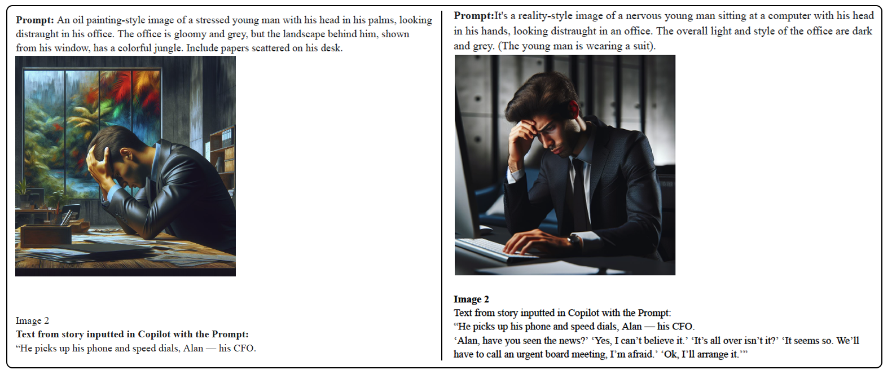

[ART 1TI3](README.md)

-------------------------------------------------------------------------------

<h1 style="color: darkred;">AI-Generated Graphic Novel with Microsoft Co-Pilot – Part 1</h1>

<figure style="width: 100%; margin: auto;">
  
  <figcaption style="text-align: center; font-style: italic; margin-top: 0.5em;">
     Recreation images from Hafidz’s *The Rapid Decline* short story as Part 1 experiments.
  </figcaption>
</figure>

## Objective

In this session, you will explore **AI-supported visual storytelling** by creating an **alternative visual interpretation** of Hafidz Zulkifli’s *The Rapid Decline*. You will experiment with **Microsoft Copilot**, refine your prompting strategies, analyze AI bias, and document your creative process in a shared online journal.  

This part of the project focuses on:  
**learning the tool → experimenting → documenting → reflecting**  

---

## Materials Required

- Computer with internet Access
- [Microsoft Copilot](https://copilot.cloud.microsoft/){:target="_blank"}
  > Log in with your McMaster account  

---

## Activities  
**Complete the following in order. Ask your professor or TA for support or feedback.**

---

<h3 style="color: darkred;">[10 min] Set Up a Journal (Individual Work) </h3>

Create a document and include the following sections:

1. General Info
   - Your name
   - Group number
   - Tool used (Microsoft Copilot)
2. Experimentation
3. Final Story

---

<h3 style="color: darkred;">[1h20m] Learn & Experiment (Individual Work)</h3>

#### ✅ Tutorials & Resources
 
- **Read:** Hafidz Zulkifli's article *[Writing Stories with Illustrations with GPT-3 and DALL-E — A Short Exploration](imgs/Article-Copilot.pdf){:target="_blank"}*  
- **Learn about Prompting:**

<iframe width="560" height="315" src="https://www.youtube.com/embed/6RAStep_3OI?si=6FOOlug8p2g1TGrG" title="YouTube video player" frameborder="0" allow="accelerometer; autoplay; clipboard-write; encrypted-media; gyroscope; picture-in-picture; web-share" referrerpolicy="strict-origin-when-cross-origin" allowfullscreen></iframe>

#### ✅ Creative Task

In your **Experimentation** section, create an alternative visual narrative of *The Rapid Decline*:  

- Generate a series of images that follow the **structure, tone, and emotional arc** of the story.
- Maintain **stylistic cohesion** so your visuals feel like a unified graphic novel.
- **Actively challenge AI bias**.
  > Copilot often defaults to white or stereotypical characters. Intentionally diversify representation, avoid generic “AI aesthetics” (plastic textures, smooth unrealistic lighting, hyper-glossy detail), and push toward personal, meaningful styles.

#### ✅ Document Your Process

Create a table with four columns in the **Experimentation** section. For each attempted image (including the ones that failed), include:

1. **Story Section**
   - Copy/paste the excerpt from The Rapid Decline that you visualized.
2. **Image**
   - Insert all generated images—even unsuccessful ones.
3. **Prompt**
   - Copy/paste the exact prompt you used.
4. **Comments** (4–5 sentences). Reflect on:
   - What limitations or failures occurred?
   - What forms of bias did you notice?
   - How did you adjust your prompts?

Your grade values creative **risk-taking**, **thoughtful reflection**, and **clear documentation**.

#### ✅ Assemble Your Story

In the **Final Story** section:
1. Select **one image per story section**.
2. Arrange the **story excerpt** + **chosen image** in sequence to form your graphic narrative.

---

<h3 style="color: darkred;">📤 Submission</h3>

| Type       | Description                          | Who Submits     |
|------------|--------------------------------------|-----------------|
| Individual | `Lastname-Name-Experimentation.pdf`  | Each student    |

> ⚠️ **Follow the submission protocols carefully. Incorrect submissions may result in lost points.**

---
