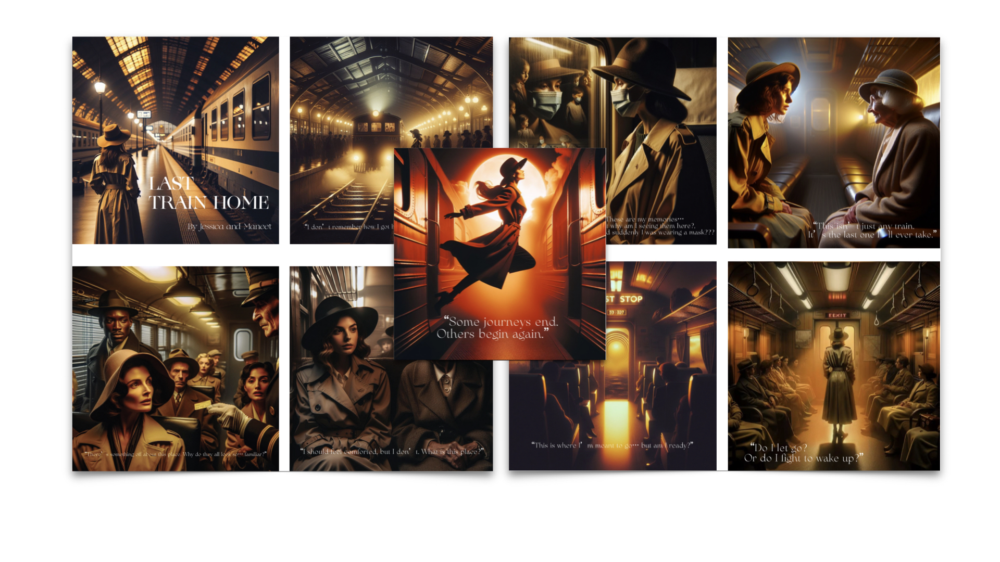

[ART 1TI3](README.md)

-------------------------------------------------------------------------------

<h1 style="color: darkred;">AI-Generated Graphic Novel with Microsoft Co-Pilot – Part 2</h1>

<figure style="width: 100%; margin: auto;">
  
  <figcaption style="text-align: center; font-style: italic; margin-top: 0.5em;">
    Graphic Novel Screenshots from a Final Project by previous students.
  </figcaption>
</figure>

## Objective

In this session, students will **create an artistic project** by applying the skills developed in Part 1. The focus is on **cohesion**, **refinement**, and **documentation** of the creative process. This phase emphasizes:
- Conceptual consistency  
- Technical execution  
- Critical reflection on artistic and technical challenges
  
---

## Materials Required

- Computer with internet Access
- Microsoft Copilot](https://copilot.cloud.microsoft/){:target="_blank"}
  > Log in with your McMaster account  
- Online collaborative journal (Google Docs or Microsoft Word Online)
- Photo editing software *(e.g., Photoshop, GIMP, Canva)* for final refinements 

---

## Activities  
**Complete the following in order. Ask your professor or TA for support or feedback.**

---

<h3 style="color: darkred;">[10 min] Set Up an Online Collaborative Journal</h3>

Create a shared document with the following sections:

1. General Info
   - Names
   - Group number
   - Tool used (Microsoft Copilot)
   - Project
   - Reflection
2. `Student 1 Name`: Work-in-progress  
3. `Student 2 Name`: Work-in-progress  

Ensure that editing access is granted to both group members.

---

<h3 style="color: darkred;">[20 min] Conceptualize Your Project (Group Work)</h3>

In your journal (under **"Project"**), answer:  

1. Chosen Tool
  - Why did you choose **Microsoft Copilot** for this project?  
  - What discoveries or surprises came up during your individual experiments?
  - What will you do differently now that you have a better understanding of the tool?
2. Project Direction
  - What is your story about? What is the theme or genre of your story? *(e.g., sci-fi, fantasy, documentary, surreal)* What mood or tone are you aiming for?
  - What aesthetic or thematic elements do you want to keep or emphasize in the final project? How can you maintain a **cohesive visual style** across all images? *(e.g., consistent color tones, lighting, filters)*
3. Process & Collaboration
  - How will you divide roles in the group? *(each student is expected to do half the work, or half the images)*  
  - How will you document progress? *(e.g., screenshots, prompts, short notes)*

---

<h3 style="color: darkred;">[1h10m] Work on Your Project</h3>

**Goal:** Develop a **fictional story** and present it as a **graphic novel** using **6–10 AI-generated images**. Ensure **cohesion** in visual storytelling through consistent style, color scheme, and framing and composition. 

### Documentation

In your journal, under your name, document everything. Create a table with four columns. For each attempted image (including the ones that failed), include:

1. **Story Section**
   - Excerpt of **your story** that you visualized.
2. **Image**
   - Insert all generated images—even unsuccessful ones.
3. **Prompt**
   - Copy/paste the exact prompt you used.
4. **Comments** (4–5 sentences). Reflect on:
   - What worked well and why?
   - What limitations or failures occurred?
   - If it didn't work, How will you adjust your prompt?

### Steps for image creation

1. Prompt Exploration & Style Refinement
  - Create a **reference image** using Microsoft Copilot  
  - Generate **at least 15 iterations** to refine visual style  
  - Take **screenshots of all iterations** and add them to your **collaborative journal**
2. Refine Prompts for Final Illustrations
  - Select **5–8 key scenes** from your story to illustrate  
  - Write detailed prompts specifying style (e.g., *watercolor, cyberpunk, comic book*)  
  - Generate **multiple variations** per scene to maintain graphic consistency  
  - Document your prompting process and iterations in the journal

---

<h3 style="color: darkred;">[15 min] Reflection</h3>

In your journal (under **"Reflection"**), answer:

- How did your concept evolve from the initial idea to the final composition?  
- What were the biggest technical challenges you encountered, and how did you resolve them? 
- What are the artistic and ethical implications of using AI in creative work?

When all of your notes and documentation is ready:
➡️ **Export as PDF**  
📄 **Filename:** `Group-#-Documentation.pdf`

---

<h3 style="color: darkred;">[20m] Assemble Graphic Novel </h3>

Prepare a **Graphic Novel PDF** that includes your final visual narrative.

Follow these guidelines:

- Use **graphic editing software** (e.g., Photoshop, Canva, InDesign)  
- Combine **text and visuals** creatively into a **single PDF document**  
- The **visual composition and layout choices will be graded**, so be intentional with your design decisions  
- You may choose one of the following approaches:
  - Present **one image per page**, using any aspect ratio
  - Use a **comic-style layout**, combining multiple panels per page
- Add a Cover Page with a representative or introductory image, the title of the story, your names as authors, and year

➡️ **Export as PDF**  
📄 **Filename:** `Group-#-GraphicNovel.pdf`

---

<h3 style="color: darkred;">📤 Submissions</h3>

| Type       | File Name                                 | Who Submits     |
|------------|-------------------------------------------|-----------------|
| Group      | `Group-#-Documentation.pdf`               | One per group   |
| Group      | `Group-#-GraphicNovel.pdf`                | One per group   |

> ⚠️ **Follow the submission protocols carefully. Incorrect submissions may result in lost points.**

---

---
