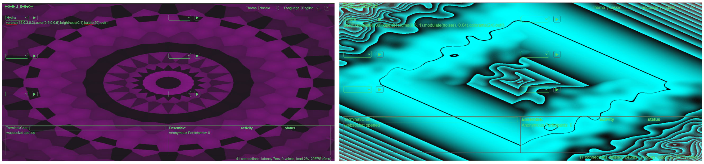

<h1 style="color: darkred;">Generative Visuals with Hydra – Part 1</h1>

<figure style="width: 100%; margin: auto;">
  
  <figcaption style="text-align: center; font-style: italic; margin-top: 0.5em;">
    Handcrafted intervention using pastel, thread, and ink on printed video frames.
  </figcaption>
</figure>

## Objective

Students will explore **generative visuals** by experimenting with **Hydra** via Estuary. This session focuses on **tool exploration**, **visual experimentation**, and **process documentation** through collaborative planning and individual learning.

---

## Materials Required

- Computer with internet Access
- [Hydra via Estuary](http://estuary.mcmaster.ca/){:target="_blank"} 
- Online collaborative journal (Google Docs or Microsoft Word Online)

---

## Activities  
**Complete the following in order. Ask your professor or TA for support or feedback.**

---

<h3 style="color: darkred;">[5 min] Set Up an Online Collaborative Journal</h3>

Create a shared document with the following tabs/sections:

- General Notes  
- `Student 1 Name`: Work-in-progress  
- `Student 2 Name`: Work-in-progress  
- Collective Work  

Ensure that editing access is granted to both group members.

---

<h3 style="color: darkred;">[20 min] Conceptualize Your Project</h3>

In your journal (under **"General Notes"**), answer the following:  
> Add the **date** at the beginning of this entry.

#### Choosing a Tool
- Why are we choosing Hydra for our project?  
- How does it support our creative vision?

#### Project Direction
- What kind of generative visuals do we want to explore?  
- Will they reflect a specific emotion, idea, or theme?  
- What color palettes, shapes, and textures will we experiment with?  
- How will we ensure visual connection across all compositions?

#### Process & Collaboration
- How will we divide roles in the group?  
- How will we document progress? *(e.g., screenshots, prompts, short notes)*

---

<h3 style="color: darkred;">[5 min] Share your journal's link</h3>

This is your only **Avenue To Learn** submission for this session.

➡️ Share your journal using **no-restriction access** (anyone with the link can view)  
📄 Submit the link directly on Avenue To Learn  
⚠️ Incorrect or inaccessible links will result in a grade reduction  

---

<h3 style="color: darkred;">[80 min] Learn & Experiment with Hydra</h3>

Each student must complete the following Hydra tutorials:

- [Hydra: Intro](https://jac307.github.io/documentation-Estuary/Tutorials/English-Version/Languages/MiniTidal-Intro.html){:target="_blank"}  
- [Hydra: Transformers](https://jac307.github.io/documentation-Estuary/Tutorials/English-Version/Languages/MiniTidal-TranformPatterns.html){:target="_blank"}  
- [Hydra: Modulators and Operators](https://jac307.github.io/documentation-Estuary/Tutorials/English-Version/Languages/MiniTidal-AdvanceReferences.html){:target="_blank"}  
- [Hydra Cheatsheet](https://jac307.github.io/documentation-Estuary/Tutorials/English-Version/Languages/MiniTidal-Cheatsheet.html){:target="_blank"}

Then:

- Experiment freely with different **sources** and **transformations**  
- Take **screenshots of at least 10 unique experiments**  
- Paste them into your individual section of the journal  
- For each screenshot, include a **4–5 sentence reflection**:
  - What challenges did you face?  
  - How did the tool respond to your changes?  
  - What creative potential do you see in Hydra?

---

<h3 style="color: darkred;">📤 Submissions on Journal</h3>

| Type       | Description                          | Who Submits     |
|------------|--------------------------------------|-----------------|
| Group      | Brainstorming Notes                  | One per group   |
| Individual | Learning process & experimentation   | Each student    |

> ⚠️ **Follow the submission protocols carefully. Incorrect submissions may result in lost points.**

---
