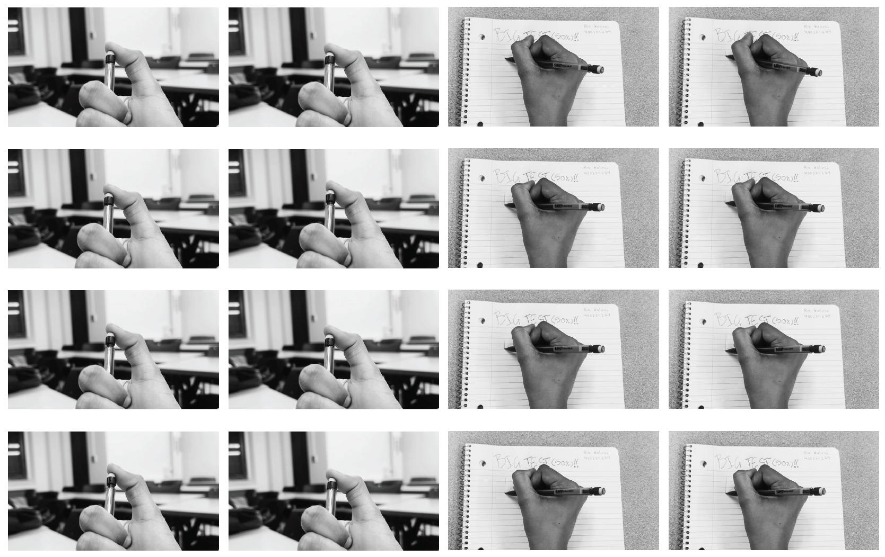
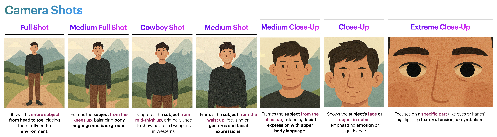
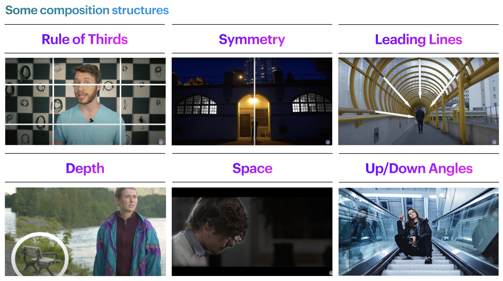
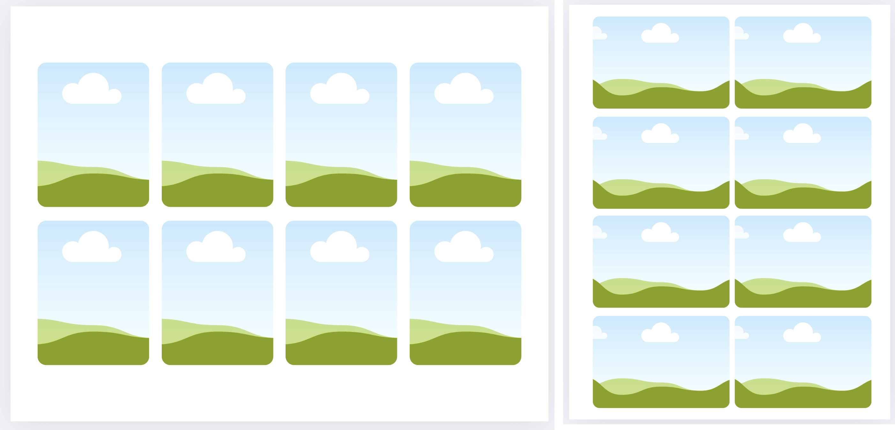

[ART 1TI3](README.md)

-------------------------------------------------------------------------------

<h1 style="color: darkred;">Digital Mixed Media Animation – Part 1</h1>

<figure style="width: 100%; margin: auto; display: flex; justify-content: center; gap: 1em;">
  
  
</figure>
<figcaption style="text-align: center; font-style: italic; margin-top: 0.5em;">
  Samples from test (work-in-progress) video compositions.
</figcaption>

## Objective

Create a **30-second storytelling short** using video footage. This video will become the foundation for your final mixed-media animation project. You will record video, convert it into printable frames, and later enhance it using hand-drawn and physical elements.

This first stage focuses on structure, clarity, and visual storytelling using **DaVinci Resolve**.

---

## Materials Required

- Smartphone or personal camera: [Setup your Smartphone Camera for Video](Setup.md) 
- Computer with DaVinci Resolve (download <a href="https://www.blackmagicdesign.com/products/davinciresolve" target="_blank" rel="noopener noreferrer">here</a>)
  > *DaVinci Resolve is also available for Tablets through the corresponding App Store, but editing on tablets is **not recommended** due to limited screen space and functionality.*
- Optional: Headphones (recommended for audio design)
- Optional: tripod or phone stabilizer  

---

## Activities  
**Complete the following in order. Ask your professor or TA for support or feedback.**

---

<h3 style="color: darkred;">[20 min] Conceptualize Your Project (Group Work)</h3>

Work in groups. Open a Word or Google Doc and answer the following:

### Conceptual
- What message or emotion will your story convey?
- How will the story unfold in 30 seconds? (Beginning → Middle → End)
- References
  - [How to TELL A STORY in 30 seconds](https://www.youtube.com/watch?v=dQY-jZrN5aA)
  - [Transforming my Cinematography with Mixed Media Animation Vol. 2](https://www.youtube.com/watch?v=1tOaWcN-P88)

### Artistic and Technical
- Where will you film? (Indoors is recommended for consistent artificial lighting)
- What framing or composition styles will you use?
  > For this project, you may use **close-ups, medium close-ups, medium shots, cowboy shots, medium full shots, and full shots**.  
  > Consider how each framing choice offers a distinct perspective and supports your storytelling goals.

➡️ **Export as PDF**  
📄 **Filename:** `Group-#-Notes.pdf` (Replace # with your group number)  
> Include both names + student numbers

---

<h3 style="color: darkred;">[40 min] Record (Group Work)</h3>

Film your raw material for the 30-second short.  

### Tips:
- Record more than you need so you have options  
- Keep shots stable and well-lit  
- Apply cinematic techniques from class:
  - **Composition Structures:** Rule of Thirds, Symmetry, Leading Lines, etc.  
  - **Camera Shots:** Close-Up, Medium Shot, Full Shot, etc.  
  - **Angles:** Eye-level, High, Low, Tilted

### References

  

  

---

<h3 style="color: darkred;">[20 min] Edit Your Video in DaVinci Resolve (Group Work)</h3>

Edit your 30-second video using **DaVinci Resolve**.

Review the tutorials: <a href="https://jac307.github.io/MediaArtTutorials/Others/index.html?file=DaVinci.json" target="_blank" rel="noopener noreferrer">Video Editing in DaVinci Resolve</a>

### Editing Guidelines:
- Final video must be in **black and white**  
- Avoid underexposure — increase brightness considering you will print the frames in B&W.
- Ensure smooth pacing and clear storytelling  
- Use simple transitions and cuts (no text or sound yet)

➡️ **Export as MP4**  
📄 **Filename:** `Group-#-Video.mp4`

### Additional Resources

<iframe width="80%" src="https://www.youtube.com/embed/Wq5NbRANm3c?si=6kbsx6urUx5-u07-" title="YouTube video player" frameborder="0" allow="accelerometer; autoplay; clipboard-write; encrypted-media; gyroscope; picture-in-picture; web-share" referrerpolicy="strict-origin-when-cross-origin" allowfullscreen></iframe>

---

<h3 style="color: darkred;">[5 min] Export Frames (Group Work)</h3>

Export your video into still frames using the tutorial provided. You should get **480 frames** or individual images after exporting your video.  

<iframe src="https://www.iorad.com/player/2600841/DaVinci-Resolve--Export-video-as-sequence-of-images?src=iframe&oembed=1" width="100%" height="500px" style="width: 100%; height: 500px; border-bottom: 1px solid #ccc;" referrerpolicy="strict-origin-when-cross-origin" frameborder="0" webkitallowfullscreen="webkitallowfullscreen" mozallowfullscreen="mozallowfullscreen" allowfullscreen="allowfullscreen" allow="camera; microphone; clipboard-write;" sandbox="allow-scripts allow-forms allow-same-origin allow-presentation allow-downloads allow-modals allow-popups allow-popups-to-escape-sandbox allow-top-navigation allow-top-navigation-by-user-activation"></iframe>  

--- 

<h3 style="color: darkred;"> Create A Printable Frame Grid (Individual Work)</h3>

Divide the frames evenly among your group. **Each student must have 160 frames/images**. Individually, design your own printable grid layout using your assigned frames. Requirements:  

- **Paper Size:** Letter (8.5 × 11 in)  
- **Orientation:** Portrait or Landscape (depending on how you filmed your video) 
- Arrange in a grid (2x4) layout using:
  > PowerPoint, Word, Canva, Pages, or Keynote
  > Keep all frames evenly spaced and the same size
  > See examples bellow
- ➡️ **Export as PDF**
  > 📄 **Filename:** `Lastname-Name-Frames.pdf`
- 📌 **Print your grid in black and white** and bring it to class for *Part 2*.
  > ⚠️ Failure to bring your printed frames will result in a grade deduction.  

---

<h3 style="color: darkred;">For the Next Class, Bring:</h3>

- **Printed black-and-white grid** 
- **Mixed-media materials**:
  - Markers, crayons, pastels, paint  
  - Coloured paper, cut-outs, thread, fabric  
  - Tape, glue, scissors  
  - Optional: stamps, found textures, magazine clippings

---

<h3 style="color: darkred;">📤 Submissions</h3>

| Type       | File Name                                 | Who Submits     |
|------------|-------------------------------------------|-----------------|
| Group      | `Group-#-Notes.pdf`                       | One per group   |
| Group      | `Group-#-Video.mp4`                       | One per group   |
| Individual | `Lastname-Name-Frames.pdf`                | Each student    |

> ⚠️ **Follow the submission protocols carefully. Incorrect submissions may result in lost points.**

---
