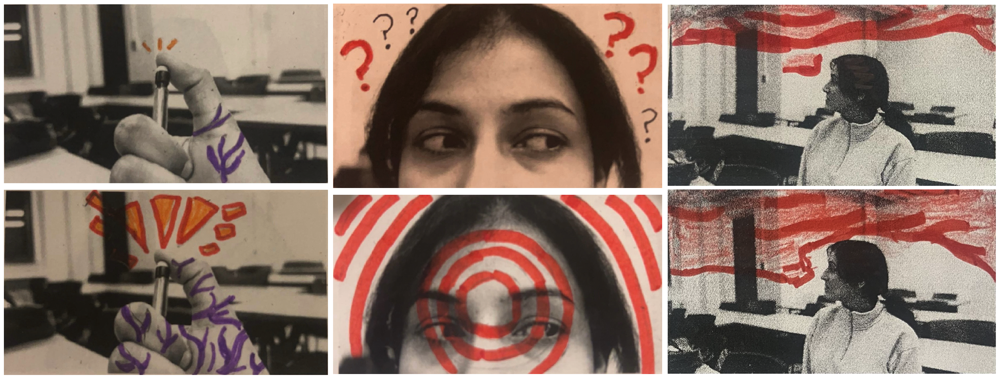

[ART 1TI3](README.md)

-------------------------------------------------------------------------------

<h1 style="color: darkred;">Digital Mixed Media Animation – Part 2</h1>

<figure style="width: 100%; margin: auto;">
  
  <figcaption style="text-align: center; font-style: italic; margin-top: 0.5em;">
    Handcrafted intervention using pastel, thread, and ink on printed video frames.
  </figcaption>
</figure>

## Objective

Transform your printed black-and-white frame grids into a **mixed-media animation sequence** by applying physical interventions such as drawing, collage, painting, and texture.

This stage explores analogue creativity and material storytelling, adding expressive and tactile qualities to your digital footage.

---

## Materials Required

- **Printed black-and-white frame grids** (from Part 1)  
- **Mixed-media materials**:
  - Markers, crayons, pastels, paint  
  - Coloured paper, cut-outs, thread, fabric  
  - Tape, glue, scissors  
  - Optional: stamps, found textures, magazine clippings

---

## Activities  
**Complete the following activities in class. Ask your professor or TA for guidance or feedback.**

---

<h3 style="color: darkred;">[Class Time] Animate Frame by Frame</h3>

Apply physical interventions to each printed frame to create a dynamic, evolving sequence.

### Approaches to Try:
- **Hand-Drawn Animation**  
  - Gradually change drawings or marks from frame to frame to simulate motion.
- **Collage & Cutouts**  
  - Add paper textures, geometric shapes, or layered silhouettes.
- **Painting & Color Interventions**  
  - Use ink, watercolour, or pastel to bring emotion and transformation.
- **Thread & Textiles**  
  - Stitch or glue fabric, thread, or yarn across frames.
- **Erasure & Reconstruction**  
  - Modify or partially erase parts of frames to show visual evolution.

> **Goal**: Make each frame different while maintaining flow across your sequence.

---

<h3 style="color: darkred;">Digitize and Prepare Your Frames</h3>

After completing your analogue interventions, you must digitize your frames and prepare them as individual image files for use in Part 3 of the project.  

## Step 1 — Digitize Your Artwork (Scan or Photograph)  

### If Scanning (recommended):
- Use a **flatbed scanner** at 300 DPI  
- Scan entire page or individual frames  
- Save as **PNG** or **high-resolution JPEG**  
- Align frames before scanning

### If Photographing:
- Photograph each frame **individually**  
- Use consistent lighting and angle  
- Mount paper on a wall or table  
- Avoid shadows, distortion, or reflections  
- Use a plain white or neutral background

## Step 2 — Separate Frames Into Individual Images 

After scanning/photographing, you must create one file per frame.  
- You can separate your frames using: Canvas, PowerPoint, or any basic image-editing tool
- Crop each frame cleanly
- Export each frame as its own PNG or JPEG

## Step 3 — Correct Naming Protocol (Mandatory)  

Each student must prepare and name their own images using the following format: `Lastname-Image-#`

- Files must be numbered sequentially
- Only your own last name should appear in your filenames
- Do not submit group-named files — each student submits their own set

## Step 4 — ZIP Your Files 

Once all your image files are ready and correctly named:
1. Place all your images into one folder
2. Name the folder using the format: `Lastname-FirstName-MixedMediaFrames`
3. ZIP the folder
4. Check that the ZIP file opens correctly and contains:
   - Individual images
   - Correct naming format
   - No duplicates or missing files
  
### Tutorials

<iframe width="560" height="315" src="https://www.youtube.com/embed/pfOeWdpaWvE?si=0l7FTOElSXN0Z8U4" title="YouTube video player" frameborder="0" allow="accelerometer; autoplay; clipboard-write; encrypted-media; gyroscope; picture-in-picture; web-share" referrerpolicy="strict-origin-when-cross-origin" allowfullscreen></iframe>  

<iframe width="560" height="315" src="https://www.youtube.com/embed/kJUaKbc3Zyw?si=DgbYiJMtaZA-tUk6" title="YouTube video player" frameborder="0" allow="accelerometer; autoplay; clipboard-write; encrypted-media; gyroscope; picture-in-picture; web-share" referrerpolicy="strict-origin-when-cross-origin" allowfullscreen></iframe>  

---

<h3 style="color: darkred;">📤 Submissions</h3>

| Type       | File Name                                 | Who Submits     |
|------------|-------------------------------------------|-----------------|
| Individual | `Lastname-FirstName-MixedMediaFrames.zip` | Each student    |

📄 Submit all 160 altered (and individually digitalized) frames with the correct naming protocol into a ZIP file.

> ⚠️ **Use exact filenames. Incorrect submissions may result in lost points.**

---
