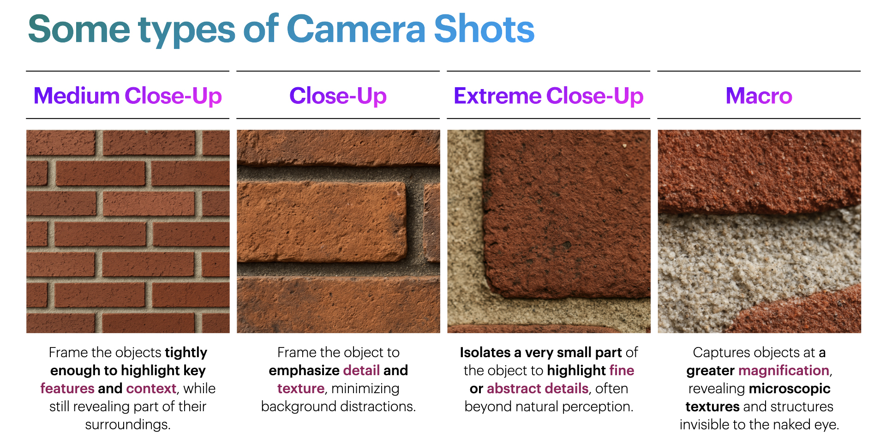
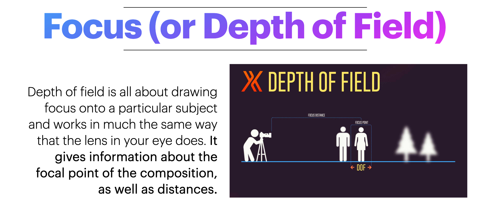
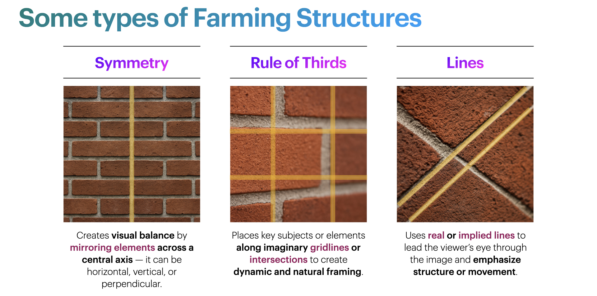
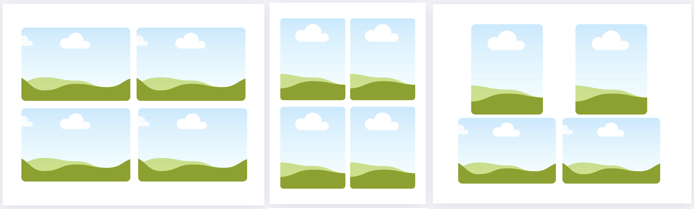

[ART 1TI3](README.md)

-------------------------------------------------------------------------------

<h1 style="color: darkred;">Video Composition of the Mundane – Part 1</h1>

<figure style="width: 100%; margin: auto;">
  
  <figcaption style="text-align: center; font-style: italic; margin-top: 0.5em;">
    Photographs from previous students using close-up techniques.
  </figcaption>
</figure>

## Objective

Document the McMaster campus through the lens of **the beauty of the mundane**, using only **medium close-up, close-up, extreme close-up, and macro** photography techniques.

---

## Materials Required

- Smartphone or personal camera: [Setup your Smartphone Camera for Photo](Setup.md) 
- Computer  
- Optional: headphones (for tutorials)

---

## Activities  
**Complete the following in order. Ask your professor or TA for help as needed.**

---

<h3 style="color: darkred;">[15 min] Conceptualize Your Project (Group Work)</h3>

With your partner, open a document (Word or Google Docs) and answer the following:

### Conceptual
- What story, emotion, or theme do we want to convey?
- How can we highlight the uniqueness of the space through the mundane?
- References:
  - <a href="https://photzy.com/7-ways-to-shoot-the-mundane/" target="_blank" rel="noopener noreferrer">7 Ways to Shoot the Mundane</a>
  - <a href="https://www.boredpanda.com/close-up-photography-pyanek/" target="_blank" rel="noopener noreferrer">28 Stunning Close-Up Photos Of Everyday Objects By Self-Taught Photographer</a>

### Artistic
- What specific locations on campus will we photograph?
- How will framing, textures, or colours make our images more compelling?
- How does light shape our composition?

### Technical
- What devices are we using?
- How will we ensure focus, resolution, and lighting consistency?
- How will we apply medium close-up, close-up, and extreme close-up photography techniques?
  > Macro photography is optional. Check if your phone or camera supports it before including it in your shoot.

➡️ **Export as PDF**  
📄 **Filename:** `Group-#-Notes.pdf`  
> Include **both names + student numbers**

---

<h3 style="color: darkred;">[40–60 min] Photograph (Individual and Group Work)</h3>

‼️ Before taking photos, make sure you follow these instructions to [setup your Smartphone Camera for Photo and Video](Setup.md).  

Take **40–60 photographs** using **only** the following techniques:
- Medium Close-Up  
- Close-Up  
- Extreme Close-Up  
- Macro (optional)

> **Goal**: capture detailed, overlooked aspects of campus space.

### Restrictions
- ❌ No staged objects or interventions  
- ✅ Use only observational photography techniques  

### Recommendations  
- Seek interesting textures, lighting, reflections  
- Carefully consider focus, exposure, and framing  
- Avoid blurring or overexposure  
- Try unexpected points of view: **look up, lay on the ground, get close to edges or corners**—shift your perspective to see familiar spaces in unfamiliar ways

### References

  

  

### Other Helpful Resources

<iframe width="560" height="315" src="https://www.youtube.com/embed/nKM3jkEOpuE?si=X3OO9E7NsZZp46x0" title="YouTube video player" frameborder="0" allow="accelerometer; autoplay; clipboard-write; encrypted-media; gyroscope; picture-in-picture; web-share" referrerpolicy="strict-origin-when-cross-origin" allowfullscreen></iframe>

  

<iframe width="560" height="315" src="https://www.youtube.com/embed/VfaZXlJso-s?si=aoDZe-vi8WO-zWXH" title="YouTube video player" frameborder="0" allow="accelerometer; autoplay; clipboard-write; encrypted-media; gyroscope; picture-in-picture; web-share" referrerpolicy="strict-origin-when-cross-origin" allowfullscreen></iframe>

  

<iframe width="560" height="315" src="https://www.youtube.com/embed/vp55RypeK_g?si=LFWhWFJm1VPb-d9Z" title="YouTube video player" frameborder="0" allow="accelerometer; autoplay; clipboard-write; encrypted-media; gyroscope; picture-in-picture; web-share" referrerpolicy="strict-origin-when-cross-origin" allowfullscreen></iframe>

  

---

<h3 style="color: darkred;">[20 min] Photo Selection (Individual Work)</h3>

### Create Your Photo Grid

- Select **12 best images**, 24 for both students.
- **Paper Size:** Letter (8.5 × 11 in)  
- **Orientation:** Portrait or Landscape (depending on your photographs) 
- Arrange in a grid (2x2) layout using:
  - PowerPoint, Word, Canva, Pages, or Keynote
  - See examples bellow
- Export as **PDF**

📄 **Filename:** `Lastname-Name-Photogrid.pdf`

---

<h3 style="color: darkred;">Before Next Class:</h3>

Install DaVinci Resolve in your computer (download <a href="https://www.blackmagicdesign.com/products/davinciresolve" target="_blank" rel="noopener noreferrer">here</a>)
  > *DaVinci Resolve is also available for Tablets through the corresponding App Store, but editing on tablets is **not recommended** due to limited screen space and functionality.*

---

<h3 style="color: darkred;">📤 Submission</h3>

| Type       | File Name                     | Who Submits     |
|------------|-------------------------------|-----------------|
| Group      | `Group-#-Notes.pdf`           | One per group   |
| Individual | `Lastname-Name-Photogrid.pdf` | Each student    |

> ⚠️ **Follow the submission protocols carefully. Incorrect submissions may result in lost points.**

---
