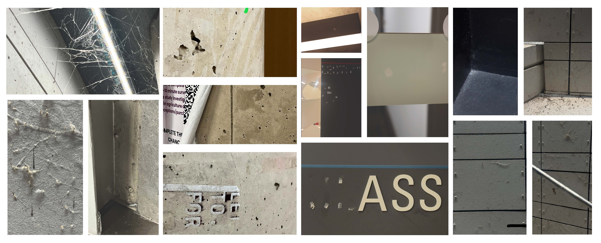

<h1 style="color: darkred;">Video Composition of the Mundane – Part 1</h1>

<figure style="width: 100%; margin: auto;">
  
  <figcaption style="text-align: center; font-style: italic; margin-top: 0.5em;">
    Photographs from previous students using close-up techniques.
  </figcaption>
</figure>

## Objective

Document the McMaster campus through the lens of **the beauty of the mundane**, using only **medium close-up, close-up, extreme close-up, and macro** photography techniques.

---

## Materials Required

- Smartphone or personal camera  
- Computer  
- Optional: headphones (for tutorials)

---

## Activities  
**Complete the following in order. Ask your professor or TA for help as needed.**

---

<h3 style="color: darkred;">[15 min] Conceptualize Your Project</h3>

With your partner, open a document (Word or Google Docs) and answer the following:

### Conceptual
- What story, emotion, or theme do we want to convey?
- How can we highlight the uniqueness of the space through the mundane?

### Artistic
- What specific locations on campus will we photograph?
- How will framing, textures, or colours make our images more compelling?
- How does light shape our composition?

### Technical
- What devices are we using?
- How will we ensure focus, resolution, and lighting consistency?

➡️ **Export as PDF**  
**Filename:** `Group-#-Notes.pdf`  
Include **both names + student numbers**

---

<h3 style="color: darkred;">[15 min] Set Up Your Equipment</h3>

Make sure your camera is set correctly:

- File format: **JPEG**  
- Enable **gridlines** or **rule of thirds**  
- Clean your lens  
- Test focus and exposure

### Tutorials (Choose based on your device):

#### Enable Gridlines

<iframe width="560" height="315" src="https://www.youtube.com/embed/osvmY_YtolI?si=8H9chgmRc49_wi5O" title="YouTube video player" frameborder="0" allow="accelerometer; autoplay; clipboard-write; encrypted-media; gyroscope; picture-in-picture; web-share" referrerpolicy="strict-origin-when-cross-origin" allowfullscreen></iframe>

<iframe width="560" height="315" src="https://www.youtube.com/embed/lcrEk7afOE8?si=y53NZlbjGormpDah" title="YouTube video player" frameborder="0" allow="accelerometer; autoplay; clipboard-write; encrypted-media; gyroscope; picture-in-picture; web-share" referrerpolicy="strict-origin-when-cross-origin" allowfullscreen></iframe>

#### General improvements

<iframe width="560" height="315" src="https://www.youtube.com/embed/FRLTOBBkm2I?si=a7ED7JXuVh0gDpmJ" title="YouTube video player" frameborder="0" allow="accelerometer; autoplay; clipboard-write; encrypted-media; gyroscope; picture-in-picture; web-share" referrerpolicy="strict-origin-when-cross-origin" allowfullscreen></iframe>

<iframe width="560" height="315" src="https://www.youtube.com/embed/v-Jeu7YsvGk?si=6ol6-Hck33WBEMGN" title="YouTube video player" frameborder="0" allow="accelerometer; autoplay; clipboard-write; encrypted-media; gyroscope; picture-in-picture; web-share" referrerpolicy="strict-origin-when-cross-origin" allowfullscreen></iframe>

---

<h3 style="color: darkred;">[40–60 min] Photograph</h3>

Take **40–60 photographs** using **only** the following techniques:
- Medium Close-Up  
- Close-Up  
- Extreme Close-Up  
- Macro

> **Goal**: capture detailed, overlooked aspects of campus space.

### Restrictions
- ❌ No staged objects or interventions  
- ✅ Use only observational photography techniques  

### Recommendations
- Seek interesting textures, lighting, reflections  
- Carefully consider focus, exposure, and framing  
- Avoid blurring or overexposure

### Helpful Resources
- *Close-up Shots in Film – Guide to Lighting & Framing*  
- *4 Framing & Composition Techniques for Beginners*  
- *iPhone 13 Pro Macro Photography Tips and Tricks*

---

<h3 style="color: darkred;">[20 min] Photo Selection</h3>

### Create Your Photo Grid

- Select **24 best images**, 12 per student.
- Arrange in a grid layout (max 4 per page) using:
  - PowerPoint, Word, Canva, Pages, or Keynote  
- Export as **PDF**

📄 **Filename:** `Lastname-Name-Photogrid.pdf`

---

<h3 style="color: darkred;">📤 Submissiont</h3>

| Type       | File Name                     | Who Submits     |
|------------|-------------------------------|-----------------|
| Group      | `Group-#-Notes.pdf`           | One per group   |
| Individual | `Lastname-Name-Photogrid.pdf` | Each student    |

> 📝 **Follow naming formats exactly. Submissions not matching protocol may lose points.**

---
