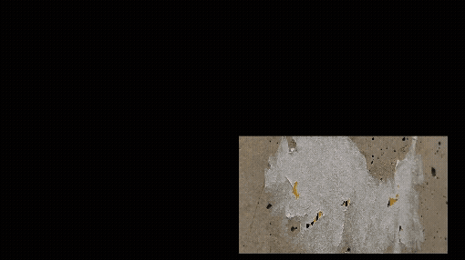
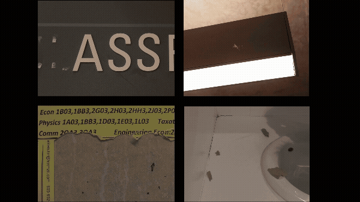

[ART 1TI3](README.md)

-------------------------------------------------------------------------------

<h1 style="color: darkred;">Video Composition of the Mundane – Part 2</h1>

<figure style="width: 100%; margin: auto; display: flex; justify-content: center; gap: 1em;">
  
  
</figure>
<figcaption style="text-align: center; font-style: italic; margin-top: 0.5em;">
  Samples from test (work-in-progress) video compositions.
</figcaption>

## Objective

Create a **first iteration (rough cut)** of an experimental video composition using only the photographs from Part 1. This version should explore rhythm, repetition, movement, and transitions using non-linear editing in **DaVinci Resolve**.

This is not a final polished piece—your goal is to **experiment with visual storytelling and editing techniques**.

---

## Software Required

- Computer with DaVinci Resolve (download <a href="https://www.blackmagicdesign.com/products/davinciresolve" target="_blank" rel="noopener noreferrer">here</a>)
  > *DaVinci Resolve is also available for Tablets through the corresponding App Store, but editing on an iPad is **not recommended** due to limited screen space and functionality.*
- Headphones (recommended for audio design)  

---

## Activities  
**Complete the following in order. Ask your professor or TA for help as needed.**

---

<h3 style="color: darkred;">[40 min] Learn the Tools</h3>

### Individual Work: Create one short test video using DaVinci Resolve.

Follow the provided beginner tutorials and practice:

1. **Intro to DaVinci Resolve**  
   - Learn timeline navigation, cuts, imports, transitions  
2. **Collage Techniques**  
   - Experiment with position, opacity, filters, and audio

➡️ Export your test video as an **MP4**

📄 **Filename:** `Lastname-Name-TestVideo.mp4`

> 📝 Submit your test video before you begin your rough cut composition.

---

<h3 style="color: darkred;">[20 min] Conceptualize Your Composition</h3>

With your partner, open a document (Word or Google Docs) and answer the following:

### Conceptual
- What mood, story, or atmosphere do we want to convey?
- How do our selected photographs support this?

### Artistic
- What transitions, audio, or effects will we use to elevate the visuals?
- What experimental techniques might we include?

### Technical
- What aspect ratio fits our idea (e.g., horizontal, vertical)?
- How will we animate images using keyframes (e.g., scale, opacity, position)?

### Collaborative
- How will you divide the work?
- Each group member must edit **approximately half of the video**, but **plan and design the composition as a unified whole**.

➡️ **Export as PDF**  
📄 **Filename:** `Group-#-Notes.pdf`  
Include **both names + student numbers**

---

<h3 style="color: darkred;">[40 min] Create a Rough Cut of Your Composition</h3>

A **rough cut** is the first editable version of your video. It includes all major elements (visuals, movement, transitions), but does not need to be fully refined or finalized. You will improve this in the next session.

### Editing Instructions:

- Use **10–12 photographs only**
- Total length: **1–2 minutes**  
  → Split the time equally between both group members  
- Include **movement, layering, and transitions**  
- Use the same resolution: **minimum 720p**  
- Maintain consistency in pacing, colour, and tone across both halves

### Allowed Tools:
- Keyframe animation (zoom, pan, opacity)
- Transitions (crossfades, wipes, etc.)
- Filters, effects, and colour grading
- Titles and text (optional)

❌ **No external visual material allowed**  
✅ **Only use your own photographs from Part 1**

➡️ Export your rough cut as an **MP4**
📄 **Filename:** `Lastname-Name-RoughCut.mp4`

---

<h3 style="color: darkred;">📤 Submissions</h3>

| Type       | File Name                         | Who Submits     |
|------------|-----------------------------------|-----------------|
| Individual | `Lastname-Name-TestVideo.mp4`     | Each student    |
| Group      | `Group-#-Notes.pdf`               | One per group   |
| Individual | `Lastname-Name-RoughCut.mp4`      | Each student    |

> 📝 **Follow naming formats exactly. Submissions that do not follow the required format may lose points.**
