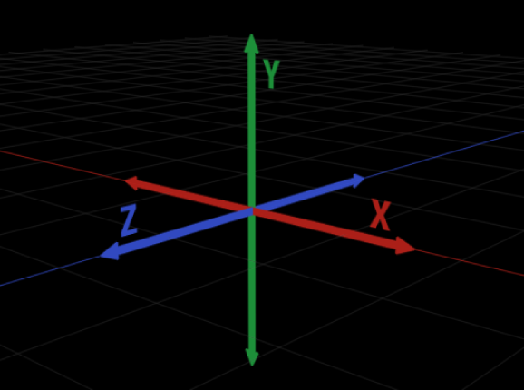
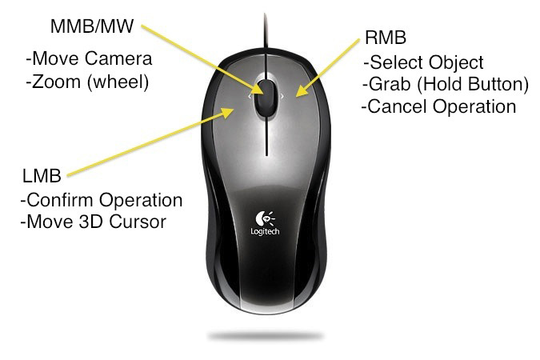

[Blender Tutorials](README.md) | [Home](../../README.md)

-------------------------------------------------------------------------------

# 🧱 QuickStart Blender Guide

**Activity**: Interface, Navigation & Object Manipulation  
**Time**: Monday 9:45–10:45 AM  

---

## Blender Basics

1. **Open Blender**
2. Start with the default cube – that’s your first object!

### Understanding the X, Y, Z Axes in Blender

Blender’s 3D space is built around three axes that define direction and position:

- **X Axis (Red)** → Left ↔ Right  
- **Y Axis (Green)** → Front ↔ Back  
- **Z Axis (Blue)** → Up ↕ Down  

Each axis helps you move, rotate, or scale objects with precision.

---

## Navigation in 3D View

| **Action**              | **Mouse / Shortcut**             |
|-------------------------|----------------------------------|
| Orbit / Rotate View     | Middle Mouse Button (MMB)        |
| Pan View                | Shift + MMB                      |
| Zoom                    | Scroll Wheel                     |

➡️ **MMB = Middle Mouse Button**

📺 <a href="https://www.youtube.com/watch?v=EPP4a0_P2vI" target="_blank"><strong>YouTube Tutorial: How to Move Around in Blender: Viewport Navigation – 1:27 min – by Michelle Guru</strong></a> 

---

## Basic Object Controls

| **Action**          | **Shortcut**        | **Description**                                         |
|---------------------|---------------------|---------------------------------------------------------|
| Select              | Left Click          | Select objects                                          |
| Move                | G                   | Grab/move object                                        |
| Rotate              | R                   | Rotate object                                           |
| Scale               | S                   | Resize object                                           |
| Confirm / Cancel    | Left Click / Esc    | Finalize or cancel the action                           |
| New Mesh            | Shift + A           | Add a new mesh: plane, cube, cylinder, sphere…         |

📺 YouTube Tutorial: <a href="https://youtu.be/ENzqrkOGIRI?si=QPKLtfaUyirMCQDm&t=50" target="_blank"><strong>Blender Tutorial for Beginners: Move, Rotate and Scale in Blender</strong></a> – min 0:55–2:50 by MH Tutorials

📺 YouTube Tutorial: <a href="https://www.youtube.com/watch?v=JYj6e-72RDs" target="_blank"><strong>ABSOLUTE Beginner Basic</strong></a> – 8:35 min – by RoBuilder

---

## Practice Activity

Try these three things in Blender:

- ✅ Move your cube above the ground  
- ✅ Scale your cube to make it bigger  
- ✅ Rotate your cube  
- ✅ Add a new mesh. Move, scale, and rotate the new mesh  

**Save your file**:  
Go to **Top Menu** → **File** → **Save** (your file will be saved as `.blend`)

---

## 📝 Reflection

- How does it feel to move in a 3D space?  
- What’s harder—navigating the view or moving objects?
