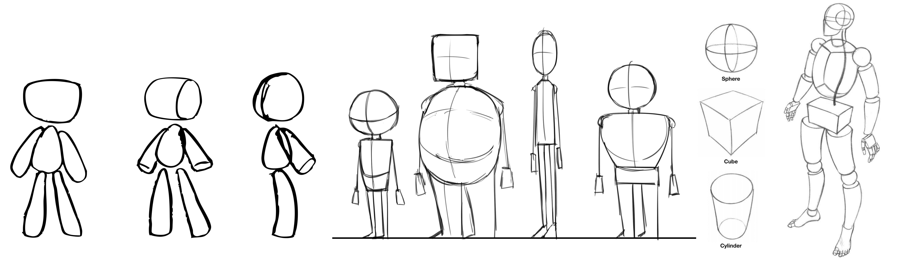

[Blender Tutorials](README.md) | [Home](../../README.md)

-------------------------------------------------------------------------------

# ✏️ Creature Sketch Activity

**Activity:** Draw Your Ideal Character 

---

## 🎯 Goal  
Design a creature or character that express personality or emotion.  
You’ll build this in Blender today, so keep your ideas clear and **not too detailed**.

---

## 🔍 Step 1: Brainstorm (3–5 min)

Use a piece of paper to answer the following:

- What is your character’s name?  
- What kind of being is it? (Animal, robot, alien, blob?)  
- What’s one emotion or personality trait it has?  
- Is it from a certain place? (Desert, dream world, underwater?)  

---

## 🎨 Step 2: Sketch Your Character (15–20 min)

Sketch your character on a piece of paper. Focus on:

- Basic body shape (round? tall? jagged?)  
- 2–3 key features: big eyes? horns? one leg?  
- Clear silhouette — can you recognize it from the outline alone?

**❗ Try to avoid:**

- Too much detail like fingers, fur, or tiny features  
- Complex limbs or overlapping parts (they’re hard to model quickly!)

---

## ✏️ Step 3: Add Notes

Next to your drawing, add relevant notes answering these questions:

- What kind of movement or pose do you imagine?  
- Does your character have a catchphrase or sound?  
- What inspired your idea? 
- Any other ideas? Texture? Light? Color?

---

## 📝 Reflection

**What makes your creature unique?**  
You’ll present your drawing briefly before jumping into Blender modeling!

