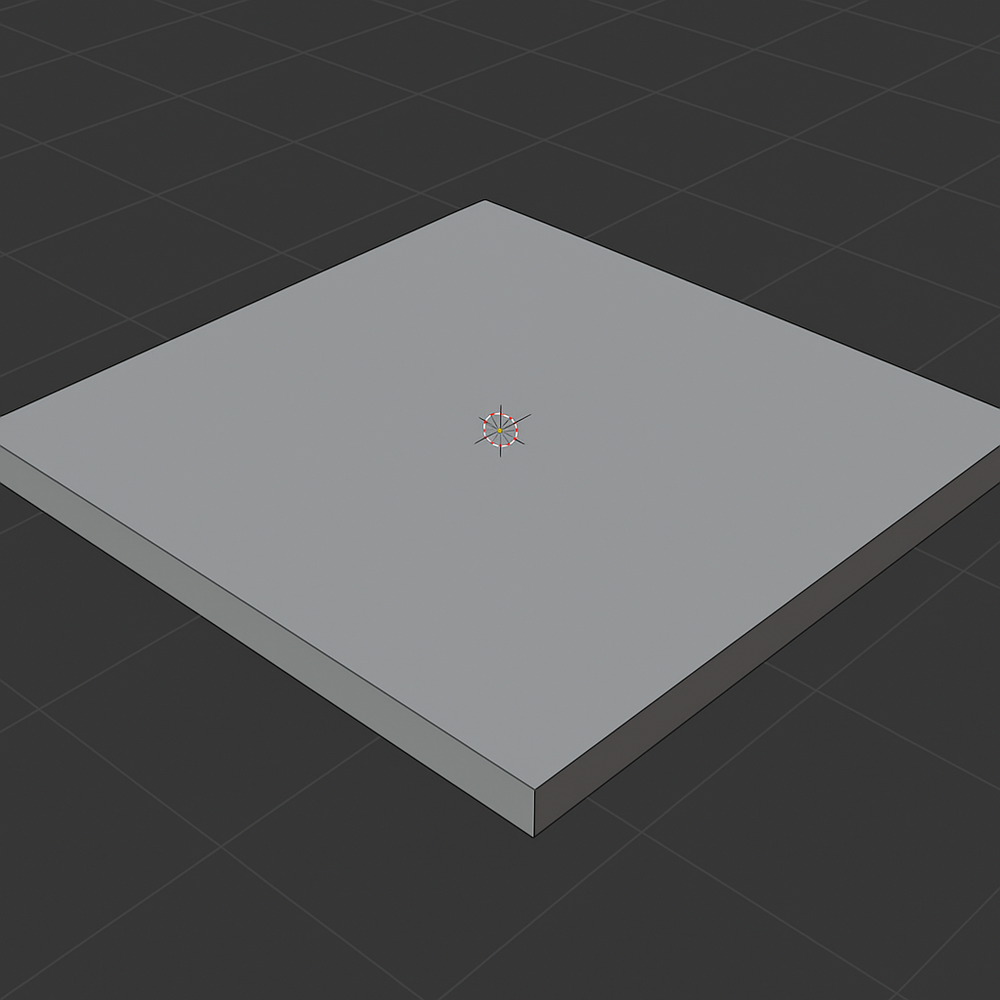
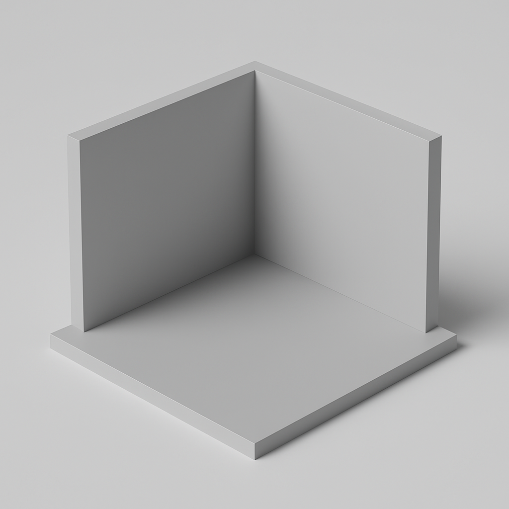
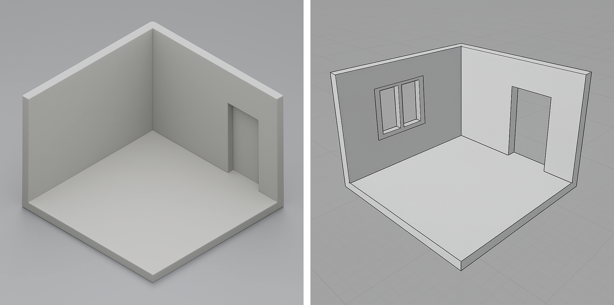

[Blender Tutorials](README.md) | [Home](../../README.md)

---

# 🌆 Environment Modeling Instructions  
**🕒 Time:** 45 min

---

## Plan and Prepare

### Create a New Blender File
- Go to `File → New → General`
- Save your file as: `YourName_SceneModel.blend`

### Think Small (But Meaningful)
You're only building a **section** of your world — enough to give your character context.

#### Examples:
- 🛏️ A **room** → Just 2 walls and part of the floor  
- 🌲 A **forest** → A small clearing with 3–4 trees  
- 🛰️ A **space station** → One hallway or pod  
- 🌌 A **dream world** → One floating platform or terrain patch  
- 🏞️ A **park** → One bench, a path, a bush, and a tree  

> You’ll add the character later — leave open space for them to stand or move!

---

## Step-by-Step Instructions

### Step 1 – Create a Ground Plane
- Press `Shift + A → Mesh → Plane`  
- Press `S` to scale it large enough for your scene  
- Add a **Solidify Modifier** to give it thickness (optional but recommended)

### Step 2 – Block Out Your Space *(for indoor environments only)*
- Press `Shift + A → Mesh → Cube` → Scale/rotate into walls, floors, or stairs  
- Press `Tab` to enter Edit Mode → Select four faces (as shown in the image) → Press `X` to delete them  
- Use `G`, `R`, and `S` to move, rotate, and scale objects

- Optional: Create divisions and use **Extrude** on faces or the **Boolean Modifier** to create doors or windows

### Step 3 – Add Props or Environmental Objects
- Use basic shapes (e.g., cylinders, spheres, cubes) and modifiers to create furniture or decorations  
- **OR** import ready-made models from **Sketchfab** (see instructions below)
- You can also modify your ground to make it more rocky or organic.

#### Tips for Blocking Your Space
- Start **big to small**: ground → walls → details  
- Don’t overbuild — focus on what your character sees  
- Leave room for character movement or interaction  
- Use **Array** or **Mirror** modifiers for repetition (fences, tiles, etc.)

---

## 📦 Sketchfab (Optional Props)

### Step 1: Browse  
<a href="https://sketchfab.com/search" target="_blank">https://sketchfab.com/search</a>
- Search: `"chair"`, `"rock"`, `"tree"` etc.  
- Filter: **Downloadable**, License: **CC**, Format: **glTF**
- Look for free models

### Step 2: Import into Blender  
- `File → Import → glTF 2.0 (.glb/.gltf)`
- Locate your downloaded file  
- Use `G` and `S` to position and scale

---

## What You Already Know (From Monday & Tuesday)

| Tool / Concept         | Shortcut / Location         | What It Does                      |
|------------------------|-----------------------------|-----------------------------------|
| Add Mesh Object        | `Shift + A → Mesh`          | Add cubes, planes, spheres, etc. |
| Move / Rotate / Scale  | `G`, `R`, `S`               | Position and transform objects   |
| Join Objects           | `Ctrl + J`                  | Combine multiple meshes          |
| Modifiers (Mirror, Array) | Modifiers Tab           | Repeat or reflect objects        |
| Boolean Modifier       | Modifiers Tab               | Subtract or combine shapes       |
| Snap Tool              | `Shift + Tab` / Magnet icon | Align objects with each other    |
| Shade Smooth           | Right-click on mesh         | Soften the object's shading      |

---

## ✨ Useful New Tools for Environments

| Tool / Concept      | Shortcut / Where to Find     | Use It For...                     |
|---------------------|------------------------------|-----------------------------------|
| **Extrude Faces**   | `Tab → Edit Mode → E`        | Pull up walls or stretch planes  |
| **Loop Cuts**       | `Ctrl + R` in Edit Mode      | Add structure or divisions       |
| **Inset Faces**     | `I` in Edit Mode             | Create windows, frames, steps    |
| **Bevel Edges**     | `Ctrl + B` in Edit Mode      | Round out or soften corners      |

---

## 💾 File Saving

- Go to `File → Save` or `File → Save As`  
- Use filename: `YourName_SceneModel.blend`  
- Save to your **USB** or **class folder**

---

## ❓ Creative Question
What feeling do you want your space to give your character (and the viewer)?  
→ Is it cozy, eerie, magical, futuristic, chaotic, peaceful, or something else?
---
