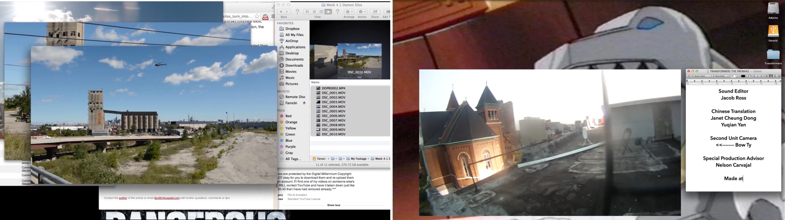

[CMST 2ZP3](README.md)

-------------------------------------------------------------------------------

<h1 style="color: darkred;">Desktop Cinema / SMS Storytelling - Session 1</h1>  

<strong>Groups of 2–3 students</strong>

<figure style="width: 100%; margin: auto;">
  
  <figcaption style="text-align: center; font-style: italic; margin-top: 0.5em;">
    <a href="https://www.alsolikelife.com/transformers-the-premake" target="_blank" rel="noopener noreferrer">Transformers: The Premake</a>, 2014, 25 minutes, digital video by alsolikelife
  </figcaption>
</figure>

## Objective  
Students will collaboratively brainstorm and conceptualize their desktop cinema narrative around themes of **privacy** and **surveillance**.

> *“Desktop cinema”* refers to narratives that are exclusively visualized through screens, emulating the experience of watching a film or documentary on a desktop or mobile device—where digital interactions and messaging serve as the primary medium for storytelling.

---

## Materials Required

- Laptop or iPad with internet access  
- Digital or physical notebook  
- **Storyboard template** (provided by instructor)  
- Online copyright-free media archives:
  - <a href="https://commons.wikimedia.org/wiki" target="_blank" rel="noopener noreferrer">Wikimedia Commons</a>  
  - <a href="https://www.pexels.com/" target="_blank" rel="noopener noreferrer">Pexels</a>  
  - <a href="https://freesound.org/" target="_blank" rel="noopener noreferrer">Freesound</a>  
- <a href="https://m365.cloud.microsoft/launch/Clipchamp/" target="_blank" rel="noopener noreferrer">Clipchamp</a> (video editing software — use McMaster credentials)

---

## Activities  
**Complete the following in order. Ask your professor or TA for help as needed.**

---

<h3 style="color: darkred;">[15 minutes] Brainstorm</h3>

With your group, open a document (Word or Google Docs) and answer the following:

- What story about privacy/surveillance do you want to tell?  
- Which digital platform(s) (SMS, email, social media) will you portray?  
- What emotions or tensions will drive your narrative?  
- Write down your main story ideas.  

---

<h3 style="color: darkred;">[30 minutes] Storyboard Creation</h3>

Use the **Storyboard Template** provided. Create a storyboard with at least **5–7 frames** including “screen interactions” (e.g., messages, alerts, notifications).  

Each frame must include:
- **What is shown** on screen (text, image, alert, etc.)  
- **Intended emotional or plot shift**  
- Rough sketches are fine (stick figures/wireframes)

Your story should fit within **1 minute**.

---

<h3 style="color: darkred;">[20 minutes] Materials List</h3>

Identify the media you need based on your storyboard.

- You must gather **images, GIFs, screenshots, sounds**  
- Use **royalty-free resources** only:
  - <a href="https://commons.wikimedia.org/wiki" target="_blank" rel="noopener noreferrer">Wikimedia Commons</a>  
  - <a href="https://www.pexels.com/" target="_blank" rel="noopener noreferrer">Pexels</a>  
  - <a href="https://freesound.org/" target="_blank" rel="noopener noreferrer">Freesound</a>  
- Credit all materials properly  
- You may also **create your own** using any editing tools

---

<h3 style="color: darkred;">[15 minutes] Group Submission: Project Planning Document</h3>

Submit a **PDF** file to A2L by the end of the session. It must include:

- Working Title  
- Brief Story Description (3–5 sentences)  
- Storyboard (scanned or photographed)  
- Materials List  
- Task Assignment (who does what)  
- Brainstorming notes  

📄 **Filename:** `Planning-Group-#.pdf`

---

<h3 style="color: darkred;">[45 minutes] Learn How to Use Clipchamp</h3>

Individually, log in to <a href="https://m365.cloud.microsoft/launch/Clipchamp/" target="_blank" rel="noopener noreferrer">Clipchamp</a> with your McMaster email.  
Start a “Video Project” and follow the tutorials:

<iframe width="560" height="315" src="https://www.youtube.com/embed/mIMeB8xZt2o?si=ZuNmOQ5S4SJYSUA5&amp;start=85" title="YouTube video player" frameborder="0" allow="accelerometer; autoplay; clipboard-write; encrypted-media; gyroscope; picture-in-picture; web-share" referrerpolicy="strict-origin-when-cross-origin" allowfullscreen></iframe>

<iframe width="560" height="315" src="https://www.youtube.com/embed/DyiU_Ew6E3w?si=WpCuBFhkn_A0Y58h&amp;start=19" title="YouTube video player" frameborder="0" allow="accelerometer; autoplay; clipboard-write; encrypted-media; gyroscope; picture-in-picture; web-share" referrerpolicy="strict-origin-when-cross-origin" allowfullscreen></iframe>

### Create a 30-second test video
Your test video must:
- Combine **2–3 video clips**  
- Include **animated text**  
- Include **picture-in-picture**

Then:
- Export and name your video: `Tutorial-Lastname-Name.mp4`  
- Take a screenshot of your Clipchamp timeline: `Tutorial-Lastname-Name.jpeg`

---

<h3 style="color: darkred;">Before the Next Session</h3>

- Finalize and bring your **multimedia materials** based on your storyboard  
- Ensure your assets are high-quality (clear visuals and sound)  
- ⚠️ Do not start editing your final video yet — assembly begins next session!

---

## 📤 Submission Summary

| Type                  | File Name                | Who Submits     |
|-----------------------|--------------------------|-----------------|
| Group Planning Doc    | `Planning-Group-#.pdf`   | One per group   |
| Individual Test Video | `Tutorial-Lastname.mp4`  | Each student    |
| Individual Screenshot | `Tutorial-Lastname.jpeg` | Each student    |

> ⚠️ **Follow the submission protocols carefully. Incorrect submissions may result in lost points.**

---
