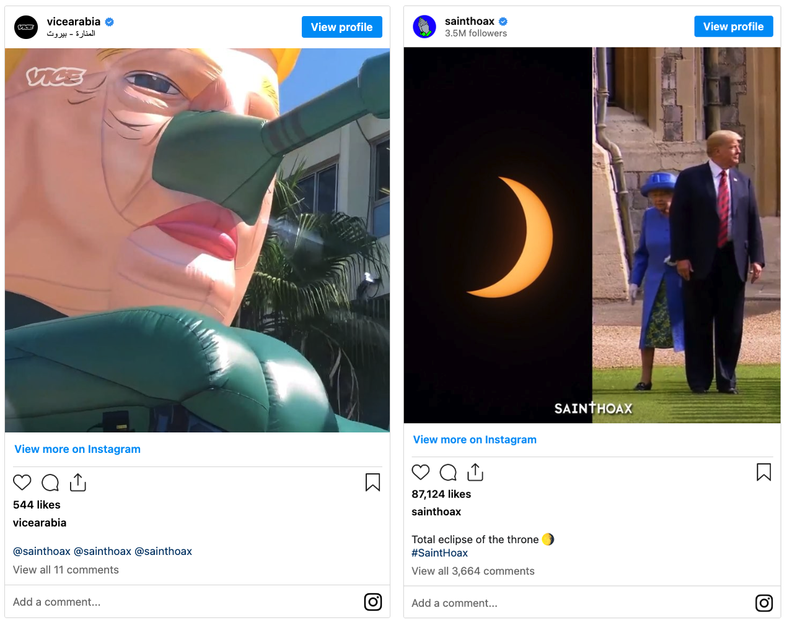

[CMST 2ZP3](README.md)

-------------------------------------------------------------------------------

<h1 style="color: darkred;">GIF-Meme Politics</h1>

<strong>In Pairs</strong>

<figure style="width: 100%; margin: auto;">
  
  <figcaption style="text-align: center; font-style: italic; margin-top: 0.5em;">
    Memes by Syrian artist Saint Hoax
  </figcaption>
</figure>

## Objective

Students will critically engage with contemporary political, cultural, or advertising messages by creating a short-form visual commentary in the form of a looping GIF-Meme. This project builds **visual literacy** and **media critique** skills through analysis, creative synthesis, and reflective evaluation.

> **Note:** “Political” in this context can include responses to advertisements, political campaigns, news articles, or any media conveying ideological messages.

---

## Materials Required

- Laptop or iPad with internet access  
- Access to a news article, campaign ad, or current media message (student-selected)  
- [Photopea](https://www.photopea.com/){:target="_blank"} -free software for image/GIF creation)  
- [GIF-Meme Politics Self Assessment Form](materials/1.GIF-MemePolitics-Self-Assessment.pdf){:target="_blank"}  

---

## Activities  
**Complete the following in order. Ask your professor or TA for help as needed.**

---

<h3 style="color: darkred;">[40 minutes] Written Analysis</h3>

With your partner, open a document (Word or Google Docs) and answer the following:

#### 1. Choose a Source (5–10 min)
- Select a media example to analyze (e.g., political campaign ad, corporate commercial, viral tweet, or news article).
- Ensure it conveys a clear ideological or cultural message.

#### 2. Identify the Message (10 min) — *Bullet-point style*
- What is this trying to make the viewer believe, feel, or do?
- Identify the underlying ideology, bias, or persuasive strategy.
- Consider what the media leaves out or assumes as “normal.”

#### 3. Critically Reflect (10 min) — *Bullet-point style*
- How does this media shape cultural or political discourse?
- What emotions or reactions does it seek to evoke?

#### 4. Write a 150-Word Response (15 min)
- Briefly describe your selected example.
- Identify and explain the key ideological elements.
- Articulate the impact or significance of the message.
- Cite all sources in **APA style**. Use: [APA Reference Guide](https://apastyle.apa.org/style-grammar-guidelines/references/examples){:target="_blank"}

➡️ Export your written response as a **PDF**   
📄 **Filename:** `Analysis-Group-#.pdf`   
> Include **both names + student numbers**

---

<h3 style="color: darkred;">[50 minutes] Create GIF with Photopea</h3>

#### 1. Define Your Concept (10 min)
- Based on your analysis, decide whether your GIF will **critique, amplify, or subvert** the original message.
- Write a short creative intention: What do you want the viewer to feel or think?
- Decide on elements (colour, text, images) to visualize these ideas.
- Sketch or plan your sequence (3–5 seconds ≈ 4–6 frames).

#### 2. Collect Visual Materials (5 min)
- Gather imagery, short clips, or text snippets.
- Use copyright-free sources or remix copyrighted materials under **fair use**.
- Options for copyright-free sources:
  - [https://www.pexels.com/](https://www.pexels.com/){:target="_blank"}
  - [Wikimedia](https://commons.wikimedia.org/wiki/Main_Page){:target="_blank"}

#### 3. Design the GIF (20–30 min)
- Use [Photopea](https://www.photopea.com/){:target="_blank"} to build your GIF.
- Check the following tutorials and create your GIF:

<iframe width="560" height="315" src="https://www.youtube.com/embed/-rmXGKqhr1c?si=iEeUb9b6OVYI-vTh" title="YouTube video player" frameborder="0" allow="accelerometer; autoplay; clipboard-write; encrypted-media; gyroscope; picture-in-picture; web-share" referrerpolicy="strict-origin-when-cross-origin" allowfullscreen></iframe>

<iframe width="560" height="315" src="https://www.youtube.com/embed/IYZLc3k45Lo?si=846xjVmtaQGVuTTk" title="YouTube video player" frameborder="0" allow="accelerometer; autoplay; clipboard-write; encrypted-media; gyroscope; picture-in-picture; web-share" referrerpolicy="strict-origin-when-cross-origin" allowfullscreen></iframe>

---

<h3 style="color: darkred;">[5 min] Finalize GIF</h3>

Test the loop for:  
- Seamless replay
- Visual clarity and contrast
- Symbolic commentary
  
➡️ Export your GIF as a `.gif` file  
📄 **Filename:** `Meme-Group-#.gif`
  
---

<h3 style="color: darkred;">[10 min] Group Self-Assessment</h3>

- Complete the [GIF-Meme Politics Self Assessment Form](materials/1.GIF-MemePolitics-Self-Assessment.pdf){:target="_blank"} **thoughtfully**.
- Reflect critically on your final project.
- 📄 **Filename:** `SelfAssessment-Group-#.pdf`

---

<h3 style="color: darkred;">📤 Submission</h3>

| Type       | File Name                     | Who Submits     |
|------------|-------------------------------|-----------------|
| Group      | `Analysis-Group-#.pdf`        | One per group   |
| Group      | `Meme-Group#.gif`             | One per group   |
| Group      | `SelfAssessment-Group-#.pdf`  | One per group   |

> ⚠️ **Follow the submission protocols carefully. Incorrect submissions may result in lost points.**

---
