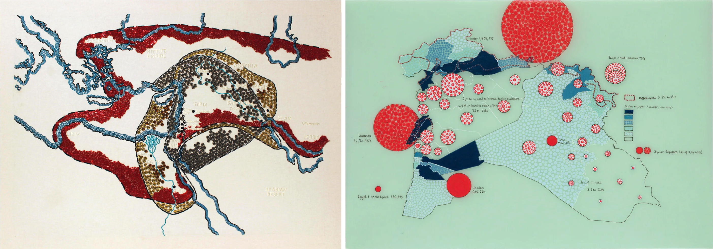

[CMST 2ZP3](README.md)

-------------------------------------------------------------------------------

<h1 style="color: darkred;">Mapping of Local Mobility Issues - Session 1</h1>  

<strong>Groups of 3–4 students</strong>

<figure style="width: 100%; margin: auto;">
  
  <figcaption style="text-align: center; font-style: italic; margin-top: 0.5em;">
    <a href="https://www.tiffanychung.net/projects-archive/the-syria-project-2015-ongoing" target="_blank" rel="noopener noreferrer">The Syria Project</a> by Tiffany Chung
  </figcaption>
</figure>

## Objective  
Students will explore a local mobility issue/experience in Hamilton, collect qualitative insights that capture how people may emotionally and sensorily experience mobility challenges (e.g., safety, anxiety, resilience, joy, discomfort), and begin interpreting how public data and emotional experiences intersect.

> “Mapping” in this project refers not only to charting the physical dimensions of an area but also to illustrating the emotional, sensorial, and subjective experiences people encounter within those spaces. Your final map will represent both tangible geography and intangible feelings.

---

## Materials Required

- Laptop or iPad with internet access  
- Digital or physical notebook  
- Access to public data sources (e.g., Hamilton city mobility reports, news articles, transportation studies)  
- <a href="https://storymap.knightlab.com/" target="_blank" rel="noopener noreferrer">StoryMapJS</a> (login using personal Google account)

---

## Activities  
**Complete the following in order. Ask your professor or TA for help as needed.**

---

<h3 style="color: darkred;">[15 minutes] Initial Ideas</h3>

Choose your **local mobility issue or experience** (e.g., bus stop safety, biking conditions, pedestrian walkways, accessibility barriers, traffic flow, school zones, public park pathways).

> Select something meaningful to your group — a space you use regularly, a place where you or your peers feel unsafe, or an area connected to community wellbeing.

With your group, open a share document (Word or Google Docs) and answer the following:

- Why is this issue important to explore in Hamilton?
- What kinds of emotional or sensorial responses might people experience in this space?
- How could these responses connect with or challenge what public data says about the area?

---

<h3 style="color: darkred;">[45 minutes] Research and Data Gathering</h3>

Add the following information on your share document (Word or Google Docs).  

### Review Public Data Sources  
Each group member selects and reviews **1 source** (3–4 total). Examples:  
- City mobility reports  
- Census data  
- News articles  
- Academic papers  
- Editorials or opinion articles

### Create an Annotated Bibliography  
- Format all citations in **APA style**  
  → Refer to: [APA Citation Guide](https://apastyle.apa.org/style-grammar-guidelines/references/examples){:target="_blank"}  
- Summarize each source in **3–5 sentences**. In bullet points, highlight key:  
  - Data, statistics, quotations  
  - Emotional or social insights  

### Collect Qualitative Insights  
Each student must contribute **2 direct observations** of emotional or sensorial reactions in a public space.  
Examples: feelings of fear, comfort, exclusion, relief.  
> ⚠️ You must collect these through **direct group observation only** — no interviews or external input allowed.

---

<h3 style="color: darkred;">Learn How to Use StoryMapJS (Individual Work)</h3>

Individually, access <a href="https://storymap.knightlab.com/" target="_blank" rel="noopener noreferrer">StoryMapJS</a> using a personal Google account.

### Follow These Tutorials:

<iframe width="560" height="315" src="https://www.youtube.com/embed/Uagc-s_yA9c?si=IOCPgz10Xv1TpqAK" title="YouTube video player" frameborder="0" allow="accelerometer; autoplay; clipboard-write; encrypted-media; gyroscope; picture-in-picture; web-share" referrerpolicy="strict-origin-when-cross-origin" allowfullscreen></iframe>  

<iframe width="560" height="315" src="https://www.youtube.com/embed/W9hyn4jCckg?si=kF9Vtz-fbrpPm37L" title="YouTube video player" frameborder="0" allow="accelerometer; autoplay; clipboard-write; encrypted-media; gyroscope; picture-in-picture; web-share" referrerpolicy="strict-origin-when-cross-origin" allowfullscreen></iframe>  

<iframe width="560" height="315" src="https://www.youtube.com/embed/QGlo1teEX0g?si=nlRqG3bgrvIug94j" title="YouTube video player" frameborder="0" allow="accelerometer; autoplay; clipboard-write; encrypted-media; gyroscope; picture-in-picture; web-share" referrerpolicy="strict-origin-when-cross-origin" allowfullscreen></iframe>  

### Create a Test Project
Your **test StoryMapJS** must include:
- Choose a map type under **Options** (top menu)  
- Create **two slides**, each must include:  
  - A **title**, **description**, and **media**  
  - One slide with an **image**  
  - One slide with a **video**  
- Customize the marker icon in **Marker Options** (bottom-right corner)

➡️ Save your project link and export it in a **PDF** document.  
📄 **Filename:** `TestProject-Lastname.pdf`  
📤 Submit on A2L before the Grace Period ends.  

---

<h3 style="color: darkred;">[20 minutes] Brainstorming</h3>

Add the following information on your share document (Word or Google Docs).  

### Visual Representation  
Discuss how the emotional and physical aspects of your mobility issue could be visualized through:
- **Icons** — to symbolize key spaces or emotions  
- **Images** — e.g., photos of streets, sidewalks, intersections  
- **Videos** — short clips to evoke atmosphere or movement  

> All media must be **found online and embeddable**, such as from YouTube, Wikimedia Commons, or news sources.

### Creative Planning  
Sketch or list your ideas in your notebook or digital doc:  
- Use keywords, color notes, textures, or embedded media links  
- Begin shaping your map’s **emotional tone** and **symbolism**

---

<h3 style="color: darkred;">Group Submission: Preliminary Research Document</h3>

Your document must include:  
- Local mobility issue + 3–4 sentence description  
- Annotated bibliography (APA format)  
- Qualitative insights (2 per student)  
- Brainstorming notes (visual strategy ideas: colors, textures, imagery)

➡️ Export your document as a **PDF**   
📄 **Filename:** `PreliminaryResearchDocument-Group-#.pdf`  
📤 Submit on A2L before the end of the session

---

<h3 style="color: darkred;">Before the Next Session</h3>

- Complete your **individual submission** (Test Project PDF)  
- Ensure your group’s brainstorming and qualitative insights are complete  
- Do not begin editing your final StoryMap yet — that will happen next session

---

<h3 style="color: darkred;">📤 Submission</h3>

| Type                      | File Name                                 | Who Submits     |
|---------------------------|-------------------------------------------|-----------------|
| Group Research Document   | `PreliminaryResearchDocument-Group-#.pdf` | One per group   |
| Individual Test Project   | `TestProject-Lastname.pdf`                | Each student    |

> ⚠️ **Follow the submission protocols carefully. Incorrect submissions may result in lost points.**

---
