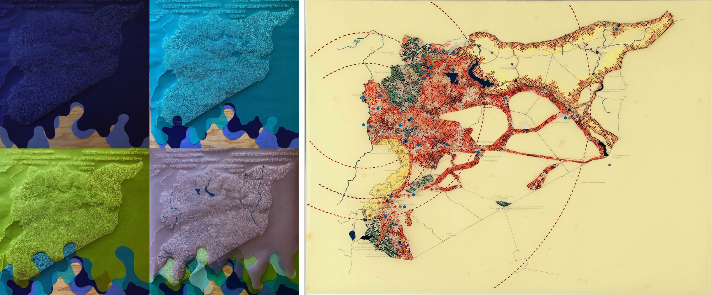

[CMST 2ZP3](README.md)

-------------------------------------------------------------------------------

<h1 style="color: darkred;">Mapping of Local Mobility Issues - Session 2</h1>  

<strong>Groups of 3–4 students</strong>

<figure style="width: 100%; margin: auto;">
  
  <figcaption style="text-align: center; font-style: italic; margin-top: 0.5em;">
    <a href="https://www.tiffanychung.net/projects-archive/the-syria-project-2015-ongoing" target="_blank" rel="noopener noreferrer">The Syria Project</a> by Tiffany Chung
  </figcaption>
</figure>

## Objective  
Students will translate the qualitative and public data insights gathered in Session 1 into a **Digital Sensorial Map** using StoryMapJS.  
They will also create a **Physical Map**, inspired by Tiffany Chung’s artistic practice to explore how materials, texture, and layering shape meaning in spatial storytelling.

> **Note:** *“Sensorial mapping”* means using creative elements like colours, textures, symbols, and imagery to evoke the emotional and sensory experiences associated with specific locations and mobility challenges—not just plotting streets or routes.

---

## Materials Required

- Finalized Research Document from Session 1  
- Laptop or iPad with internet access  
- Digital or physical notebook  
- <a href="https://storymap.knightlab.com/" target="_blank" rel="noopener noreferrer">StoryMapJS</a> (login using personal Google account)
- [Mapping Local Mobility Issues Self Assessment Form](materials/3.MappingLocalMobility-Self-Assessment.pdf){:target="_blank"}
- **For Physical Map Activity:** Large paper, cardboard, recycled maps, string, thread, markers, tape, glue sticks, tracing paper, acetate sheets, collage materials

---

## Activities  
**Complete the following in order. Ask your professor or TA for help as needed.**

---

<h3 style="color: darkred;">[20 minutes] Quick Review, Planning, and Content Definition</h3>

Improve and add the following information on your share document (Word or Google Docs).  

### Step 1: Review Your Research Document  
Open your finalized Research Document from Session 1 and review:
- Your selected mobility issue and description  
- Annotated bibliography  
- Qualitative insights  
- Brainstormed ideas for emotional/visual representation  

### Step 2: Make a Group Plan  
Split into two coordinated teams:
- **Content Team:** Finalize written descriptions, find media, select symbols/icons  
- **StoryMap Team:** Organize and build the StoryMapJS project  

### Step 3: Choose a Shared StoryMapJS Account  
Use an existing member’s account **or** create a shared Google account for your group. All students must contribute to a single shared StoryMap.
> ⚠️ You can't edit StoryMapJS slides at the same time. You will have to work in turns.

### Step 4: Define Final Content for Your Map  
Choose and prepare all elements that will visually communicate your findings.

#### Visual Content:
- Published images (e.g., from Wikimedia Commons or news/media sites)  
- Embeddable videos (e.g., YouTube or news)  

#### Symbols:
- Use simple icons to represent locations or emotions  
- Try: <a href="https://thenounproject.com/" target="_blank" rel="noopener noreferrer">The Noun Project</a>  

#### Text Content:
- Titles and **2–4 line descriptions** per slide  
- Focus on what the viewer should feel or understand:
  - What emotional tone does this place convey?
  - How does it reflect mobility challenges?

---

<h3 style="color: darkred;">[40 minutes] Build Your Digital Sensorial Map</h3>

- Log into <a href="https://storymap.knightlab.com/" target="_blank" rel="noopener noreferrer">StoryMapJS</a> and begin slide creation  
- Add your selected **locations, images, videos, and descriptions**

### Tips for Building:
- Keep slides clear and expressive — each should convey a distinct aspect of your issue  
- Use colors, icons, and visuals to support **emotional storytelling**  
- Don’t overcrowd: simplicity enhances clarity
- Review tutorials from [Mapping of Local Mobility Issues  - Session 1](Mapping-Mobility-01.md){:target="_blank"}.

### Final Check:
- Does the map show both **emotional** and **spatial** elements?  
- Are media and icons consistent with your research?  
- Does the slide order present a clear and thoughtful story?

---

<h3 style="color: darkred;">[50 minutes] Create Your Physical Map</h3>

After reading about Tiffany Chung’s *Vietnam Exodus Project*, students will produce a **Physical Map** that reflects both **data** and **experience**.  

### Step 1: Brainstorm
- In groups, discuss what aspects of your research could be represented physically (movement, obstacles, emotion, memory).  
- Consider layering, transparency, or collage to express overlapping experiences.

### Step 2: Create Your Physical Map
Use the provided materials to build a large collaborative map. You may:
- Combine drawn, printed, and collaged elements  
- Include thread, string, or other tactile materials to show paths or networks  
- Annotate with keywords, phrases, or visual symbols  

> Like Tiffany Chung, allow both factual and emotional storytelling to coexist in your design.
> You must give your physical maps to the instructor.  

---

<h3 style="color: darkred;">[15 minutes] Finalize Research Document</h3>

Update your existing Research Document (from Session 1) and include the following:

- Your selected **mobility issue + 3–4 sentence description**  
- ❗ **New:** Digital Sensorial Map **link**
- ❗ **New:** Physical Sensorial Map **photo**  
- Annotated bibliography (APA format, 3–4 sources)  
- Qualitative insights (2 per student)  
- Brainstorming notes  
- ❗ **New:** Brief explanation of your **visual decisions** for both, the digital and physical applications. 
  > Why did you choose these icons, colors, emojis, images, or video?

➡️ Export your document as a **PDF**   
📄 **Filename:** `ResearchDocument-Group-#.pdf`

---

<h3 style="color: darkred;">📝 Group Self-Assessment</h3>

- Complete the [Mapping Local Mobility Issues Self Assessment Form](materials/3.MappingLocalMobility-Self-Assessment.pdf){:target="_blank"}  
- Reflect on your collaboration and creative decisions
- 📄 **Filename:** `SelfAssessment-Group-#.pdf`

---

<h3 style="color: darkred;">📤 Final Group Submission</h3>

| Type                         | File Name                       | Who Submits     |
|------------------------------|---------------------------------|-----------------|
| Updated Research Document    | `ResearchDocument-Group-#.pdf`  | One per group   |
| StoryMapJS Project Link      | (in research document)          | One per group   |
| Self-Assessment Form         | `SelfAssessment-Group-#.pdf`    | One per group   |

> ⚠️ **Follow the submission protocols carefully. Incorrect submissions may result in lost points.**

---
