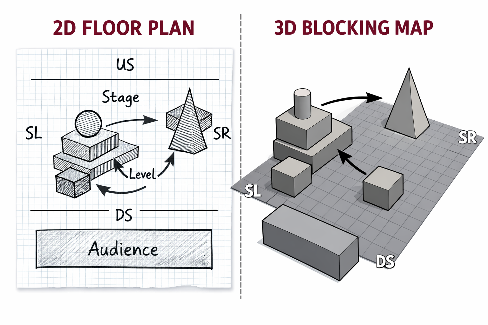
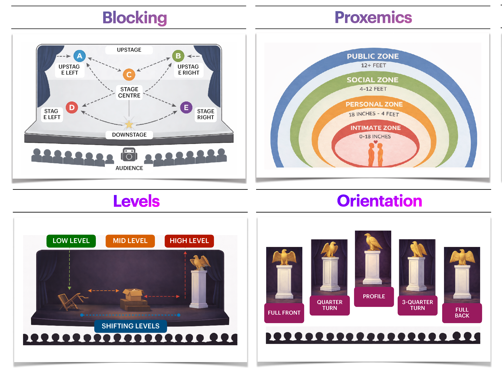

[ART 1T03](README.md)

-------------------------------------------------------------------------------

<h1 style="color: darkred;">W1 — Floor Plan + Blocking Map</h1>

<figure style="width: 80%; margin: auto;">
  
</figure>

## Objective

Introduce **Blender** as a tool for **spatial thinking** by designing a simple **scene** using only geometric shapes.  
This activity focuses on how space communicates meaning through **blocking, proxemics, levels, and orientation**.

You will move from **intention → 2D design → 3D space**, working with strong constraints to prioritize clarity over complexity.  

Tutorial time may be used to begin or complete this activity depending on your tutorial day. Some work is expected outside of class.

---

## Materials Required

- Computer (laptop or desktop)
- **Blender (free software)**  
  👉 Download: <a href="https://www.blender.org/download/" target="_blank" rel="noopener noreferrer">https://www.blender.org/download/</a>
- Computer mouse (for easy navigation in Blender)  
- Paper + pen (preferred) *or* digital drawing tool for floor plan

---

## Activities  
**Complete the following in order. Ask your professor or TA for help as needed.**

---

<h3 style="color: darkred;">[15 min] Artistic Intention — Start Here</h3>

Before drawing or opening Blender, write **3–4 sentences** describing the **backstory or intention of the space**.

Think of this as what the space wants to communicate **on its own**, before any performer, light, sound, or projection appears.

This project is intentionally restricted.  
You will work using <strong>only geometric shapes</strong>, with no materials, textures, lighting, or effects.  
Your challenge is to communicate meaning through <strong>placement, distance, orientation, and scale</strong> rather than detail or realism.

### Guiding Questions
- What kind of relationship or tension does this space set up through distance, separation, or containment?
- How does the space suggest power, vulnerability, or isolation using only simple forms?
- What does this space communicate before anyone enters or anything happens?

This text should **guide your design decisions** in the 2D floor plan and 3D scene.

➡️ **Save this text** for submission.

---

<h3 style="color: darkred;">[20 min] 2D Floor Plan (Design First)</h3>

Using your artistic intention as a guide, create a **2D floor plan** for your scene.

### Requirements
- Hand-drawn (preferred) or digital
- Placement of **only geometric objects**
- **Minimum 5 shapes, maximum 7 shapes total**  
  *(The floor / ground plane does not count toward this limit.)*
- Audience position only if there is a clear stage–audience separation
- Your scene should show intentional use of **at least two** of the following, clearly labelling when applicable:   
  - **Blocking** — where forms are placed
  - **Proxemics** — distance between forms
  - **Levels** — vertical relationships (encouraged)
  - **Orientation** — how forms face or withhold access

> ⚠️ This step must be completed **before** building in Blender.

➡️ **Save this floor pan** for submission.

---

<h3 style="color: darkred;">[10 min] Install Blender</h3>

1. Download Blender:  
   <a href="https://www.blender.org/download/" target="_blank" rel="noopener noreferrer">https://www.blender.org/download/</a>
2. Install the software on your computer.
3. Watch this video:  

<iframe width="560" height="315" src="https://www.youtube.com/embed/nZ2I-8h0wPQ?si=OPeO_VY_uDnMcw6x" title="YouTube video player" frameborder="0" allow="accelerometer; autoplay; clipboard-write; encrypted-media; gyroscope; picture-in-picture; web-share" referrerpolicy="strict-origin-when-cross-origin" allowfullscreen></iframe>

  

> Blender may feel unfamiliar at first — this activity focuses only on **basic navigation and object placement**.

---

<h3 style="color: darkred;">[60 min] 3D Scene in Blender (Geometric Only)</h3>

### Learn the basics

These tools will allow you to place, duplicate, and reposition forms to test blocking, distance, and orientation in space.  

<a href="https://jac307.github.io/MediaArtTutorials/Blender/1_QuickStart_Blender_Guide.html" target="_blank" rel="noopener noreferrer">
  👉 Blender – Quick Start Guide
</a>

---

### Build your scene in Blender based on your **2D floor plan**.

#### Technical Constraints (Strict)
- Use **only basic geometric shapes** (cube, sphere, cylinder, cone, plane, etc.).
- **Minimum 5 shapes, maximum 7 shapes total**  
  *(The floor / ground plane does not count toward this limit.)*
- ❌ No lighting changes  
- ❌ No materials or textures  
- ❌ No modifiers  
- ❌ No animation  
- Ignore the camera (do not move or adjust it).
- Work only on **Object Mode**  

#### Audience Representation
- Only required **if** your scene has a clear stage–audience separation.
- If included:
  - Represent the audience as **one collective geometric form**
  - A rectangular prism is recommended
- If no audience is present, this should be **conceptually justified** through your design.  

#### Tutorial: Basic Object Manipulation in Blender 

Check the following tutorial and **focus only on the sections listed below**.  
You can **skip any sections marked as “skip”** — they are not required for this activity.

> For this week, focus only on adding, moving, rotating, duplicating, and scaling basic geometric forms.  
> **Important**: Constrantly save your progress!

<ul>
  <li><strong>00:00 — Introduction</strong></li>
  <li><strong>00:41 — Uses of Object Mode</strong></li>
  <li style="color: gray;">01:04 — Getting Clearer Objects (skip)</li>
  <li><strong>02:21 — Deleting Objects</strong></li>
  <li><strong>02:48 — Adding New Objects</strong></li>
  <li><strong>03:10 — Duplicating Objects</strong></li>
  <li><strong>03:31 — Grab — Moving Objects</strong></li>
  <li><strong>03:49 — Rotating Objects</strong></li>
  <li style="color: gray;">04:03 — Getting Exact Measurements (skip)</li>
  <li><strong>05:12 — Scaling Objects Size</strong></li>
  <li><strong>05:24 — Using the T-Panel Tools</strong></li>
  <li style="color: gray;">07:12 — Locking to an Axis or Direction (skip)</li>
  <li style="color: gray;">09:05 — Important Tips and Tricks (skip)</li>
</ul>

<iframe width="560" height="315" src="https://www.youtube.com/embed/TFafNrD5q4U?si=-wnLjXuSASXLAtSt" title="YouTube video player" frameborder="0" allow="accelerometer; autoplay; clipboard-write; encrypted-media; gyroscope; picture-in-picture; web-share" referrerpolicy="strict-origin-when-cross-origin" allowfullscreen></iframe>

---

<h3 style="color: darkred;">Submission Documents</h3>

### Create a single document with the following sections:

1. **General Information**  
   > Full name, student number, and tutorial number.

2. **Artistic Intention**  
   > 3–4 sentences describing the backstory or intention of the space.

3. **2D Floor Plan**  
   > Include your labeled 2D floor plan (JPEG), clearly showing the application of at least two spatial concepts (Blocking, Proxemics, Levels, or Orientation).

4. **2–3 Screenshots of the 3D Scene**  
   > Choose views/angles that best communicate the spatial relationships of your scene from different perspectives.

➡️ **Export as PDF**  
📄 **Filename:** `Lastname-Firstname-W1-Tutorial.pdf`

### Save blender file:

➡️ **Save it as .blend**  
📄 **Filename:** `Lastname-Firstname-3Dscene.blend`

<iframe width="560" height="315" src="https://www.youtube.com/embed/C66aXQ9WntU?si=xYdVq7BvWDzfYRob" title="YouTube video player" frameborder="0" allow="accelerometer; autoplay; clipboard-write; encrypted-media; gyroscope; picture-in-picture; web-share" referrerpolicy="strict-origin-when-cross-origin" allowfullscreen></iframe>

  

---

<h3 style="color: darkred;">📤 Submission</h3>

| Component            | File Name                                |
|---------------------|-------------------------------------------|
| Project documents   | `Lastname-Firstname-W1-Tutorial.pdf`      |
| Blender File        | `Lastname-Firstname-3Dscene.blend`        |
  
> ⚠️ **Follow the submission protocols carefully. Incorrect submissions may result in lost points.**

---

### Assessment

This Week 1 activity is **graded lightly** based on:

- Completion and effort
- Clarity of **spatial intention**
- Basic technical application in Blender

This is an introductory exercise — **clarity and intention matter more than polish**.

---
