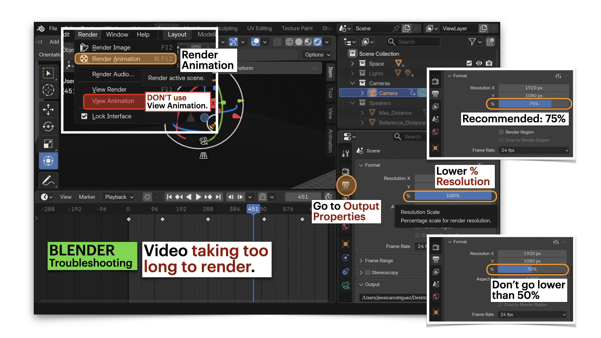

[ART 1T03](README.md)

-------------------------------------------------------------------------------

# W11 - Projection, Video Surfaces & Hybrid Media  

<figure style="width: 100%; margin: auto;">
  
</figure>

## Objective

This activity focuses on how **moving image, surface, light, and sound** work together to reshape atmosphere and meaning inside a staged environment.   

Your final result should demonstrate a **hybrid media scene** in which **video, sound, and lighting** operate together within one coherent visual world.

Tutorial time may be used to begin or complete this activity depending on your tutorial day. Some work is expected outside of class.

---

## Materials Required

- Computer (laptop or desktop) + Computer mouse (recommended)
- **Headphones**
- Blender (free software)
- **Video Editing Software**; Options:  
   - [**DaVinci Resolve 20 - Free Download**](https://www.blackmagicdesign.com/products/davinciresolve){:target="_blank" rel="noopener"} (highly recommended)  
   or    
   - [**Clipchamp - Access Through McMaster Email**](https://m365.cloud.microsoft/apps?from=PortalHome){:target="_blank" rel="noopener"}  
   ⚠️ No other editing software is permitted for this activity.
- Your existing **W7** files:  
    - **30-second sound composition (.wav)**  
    - **Blender scene (.blend)**  
- Personal video footage **or** royalty-free / free-use video footage from <a href="https://www.pexels.com/videos/" target="_blank" rel="noopener noreferrer">Pexels Video</a>
- Paper + pen (preferred) *or* digital drawing tool

---

## Activities  
**Complete the following in order. Ask your professor or TA for help as needed.**

---

<h3 style="color: darkred;">[10 min] Visual Intentions — Start Here</h3>  

Define the **visual approach** of your 30-second video in direct relation to your **existing sound composition** and **Blender scene**. Write **4–5 lines** that answer the following:

1. **How does your video build on your sound composition?**  
   Does it reinforce the sonic mood, create contrast, slow it down, intensify it, or redirect attention?

2. **What kind of footage will you use?**  
   Will it be observational, abstract, environmental, symbolic, gestural, architectural, atmospheric, or texture-based?

> Your video must be **thematically connected** to your existing sound work.  
> Think of the video as an extension of the scene’s emotional and conceptual direction, not as a random visual layer.

---

<h3 style="color: darkred;">[20 min] Gather & Curate Video Resources</h3>

Gather the materials you will use to build your 30-second video. You may use:

- **Your own original footage**, or  
- **Royalty-free / free-use footage from Pexels**  
  👉 <a href="https://www.pexels.com/videos/" target="_blank" rel="noopener noreferrer">https://www.pexels.com/videos/</a>

You should gather **5–10 video clips** to create a small working palette. You may not use all of them, but you should collect enough material to explore a clear visual direction.  

Look for footage that matches your intentions, such as:

- Environmental footage (water, sky, hallways, windows, urban movement, landscape)
- Abstract or textural footage (shadows, reflections, light flicker, smoke, grain, surfaces)
- Architectural or spatial footage
- Bodily or gestural details
- Objects, materials, or repeated motions

⚠️ **Do not use copyrighted film clips, music videos, or random footage from social media or YouTube.**  

Save all files in an organized folder and **record the credit information for each external clip used** (title, creator/uploader, source link, platform).

---

<h3 style="color: darkred;">[60-120m] Create a 30-Second Video in DaVinci Resolve or Clipchamp</h3> 

Using **DaVinci Resolve or Clipchamp only**, create a **30-second video** that will later be integrated into your Blender scene.  

To learn DaVinci Resolve (**highly recommended**), follow the first section **“Intro to Linear Video Editing”** in the tutorials below:  
<a href="https://jac307.github.io/MediaArtTutorials/Others/index.html?file=DaVinci.json" target="_blank" rel="noopener noreferrer">DaVinci Resolve Tutorials</a>

> Optional: you may also explore the other two tutorial sections — **“Intro to Video Collage”** and **“Intro to Keyframe Animation.”**    

Your video must:

- Be exactly **30 seconds long**
- Include your **original Week 6 sound composition** as the audio track
- Be visually connected to your existing sound composition
- Use **at least 3 different video clips or visual segments**
- Your edit should demonstrate a **clear relationship between the visual material and the sound composition** through rhythm, pacing, contrast, or atmosphere.  

When finished:

**Export your edited video as MP4**  
   📄 **Filename:** `Lastname-Firstname-W11-Video.mp4`.   

#### Export Settings Reminder

**Recommended export settings:**  
- Format: MP4  
- Codec: H.264  
- Resolution: 1920 x 1080  
- Frame rate: 24 fps  

---

### Video Submission Example

<figure style="width: 80%; margin: 0;">
  <video controls style="width: 100%; height: auto;">
    <source src="imgs/62.mp4" type="video/mp4">
  </video>
</figure>

---

<h3 style="color: darkred;">[30-50 min] Blender: Integrate the Video into Your Scene</h3>

Bring your edited video into your Blender environment.

First:

- Open your Blender scene.
- Keep your timeline at **720 frames (30 seconds at 24 fps)**.
- Keep the **sound file** from the scene. **Don't remove it!**.   
- Keep the camera in a **static general wide framing** showing the whole scene.  
  > ⚠️ For this week, the camera should remain static. No camera movement.

Then:  
 
- Follow the tutorial below to add your video.
  - Add a **Plane** that will act as the projection surface — keep same aspect ratio as your video.  
  - Apply your video to the plane as a **video texture**.
  - If need it, change (rotate or scale) video texture if it doesn't match your plane.  
  - Position and rotate the plane so it sits correctly on the wall in your scene.
  - Change the playing frames under Materials.  
- **Fix and adjust your lighting** so the video remains visible  
  > Your lights should support the projected video rather than wash it out completely.
  > The video will look darker in Blender: apply a **Brightness & Contrast modifier** (see below).  
  > Alternativelly, re-render your video increasing the overall brightness in DaVinci Resolve.    

Save your updated Blender file as:  
📄 `Lastname-Firstname-W11.blend`

➡️ Export **1 still image** that clearly documents your stage setup using a **wide shot**.  

➡️ **Export final video as MP4, codec H.264**  
📄 **Filename:** `Lastname-Firstname-W11-Scene.mp4`

> ⚠️ This must be a **final render**, not a viewport screen recording.

---

### Tutorials

❗ Review this week’s slides for practical tips on **applying video textures, adjusting emissive materials, organizing screen/projection surfaces, and balancing light so the video can be seen clearly**.

#### How to import videos into blender

  <iframe 
    src="https://www.youtube.com/embed/ssnJ8yewQ2A?si=CFi6kKxsAX63LeAU"
    title="YouTube video player"
    frameborder="0"
    allow="accelerometer; autoplay; clipboard-write; encrypted-media; gyroscope; picture-in-picture; web-share"
    allowfullscreen
    style="position: absolute; top: 0; left: 0; width: 100%; height: 100%;">
  </iframe>

#### Texture Animation | Import Any Video Into Blender With Animated Image Texture or Video Texture (Advance)

  <iframe 
    src="https://www.youtube.com/embed/E1COCnMUIhQ?si=tEcoEB3odO6x85jg"
    title="YouTube video player"
    frameborder="0"
    allow="accelerometer; autoplay; clipboard-write; encrypted-media; gyroscope; picture-in-picture; web-share"
    allowfullscreen
    style="position: absolute; top: 0; left: 0; width: 100%; height: 100%;">
  </iframe>

 

#### Blender: Export File with Audio

     

#### Blender: Troubleshooting - Video Taking TOO LONG to Render

     

---

### Image & Video Submission Example

    

<figure style="width: 80%; margin: 0;">
  <video controls style="width: 100%; height: auto;">
    <source src="imgs/63.mp4" type="video/mp4">
  </video>
</figure>

---

<h3 style="color: darkred;">Submission Documents</h3>

Create a single PDF that includes:

- **4–5 sentence visual intention description**  
  Briefly explain the visual approach of the video and how it relates to your sound composition and scene.  

- **List of video sources used**  
  Include for each external clip:
  - Title
  - Creator / uploader
  - Source link
  - Platform

- **One image of your Blender scene setup**  
  Include the **still image exported from Blender** (not a screen capture) that clearly shows your stage setup, including the lighting, objects, and video surface in a **wide shot**.

➡️ **Export as PDF**  
📄 **Filename:** `Lastname-Firstname-W11.pdf`

---

| Component                    | File Name                          |
|-----------------------------|------------------------------------|
| Project document (PDF)      | `Lastname-Firstname-W11.pdf`       |
| Edited video file           | `Lastname-Firstname-W11-Video.mp4` |
| Blender scene               | `Lastname-Firstname-W11.blend`     |
| Final rendered hybrid scene | `Lastname-Firstname-W11-Scene.mp4` |

> ⚠️ **Follow submission protocols carefully. Incorrect submissions may result in lost points.**

---

## Assessment

Your work will be assessed based on:

- **Visual Concept & Video Editing (PDF + Edited MP4)**  
  The visual description explains the video’s approach and its relationship to the sound composition and scene. The 30-second edit shows intentional selection and sequencing of footage using the permitted software.

- **Blender Integration & Final Render (BLEND + Final MP4)**  
  The video is integrated into the 3D scene as a visible projection surface, with lighting adjusted so the image can be clearly seen. The final render uses a **static wide shot**, lasts **30 seconds**, includes sound, and is properly exported (not a screen capture).

- **File Organization & Submission Accuracy**  
  All required files follow naming conventions and are submitted in the correct format.

---