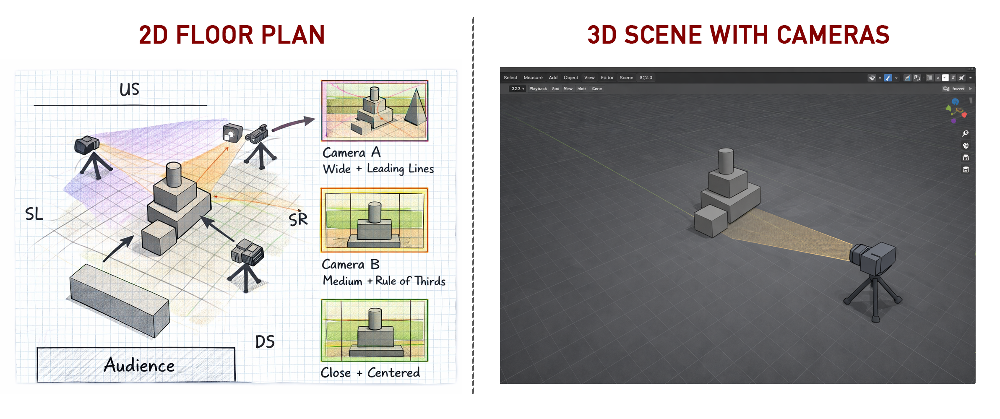
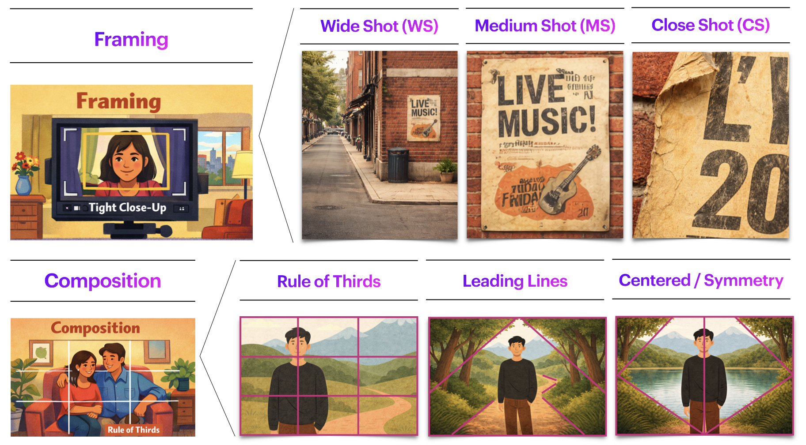
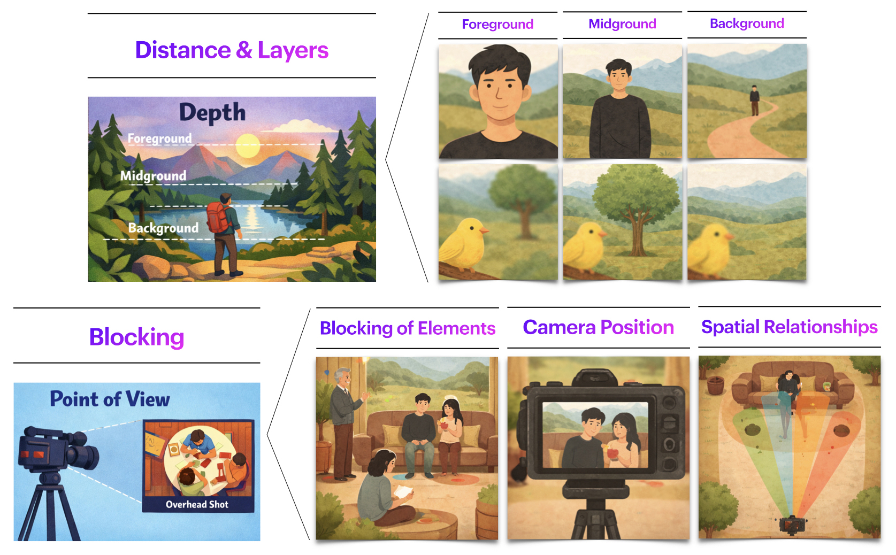
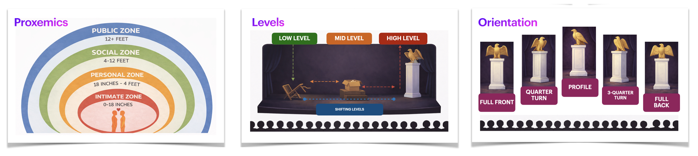

[ART 1T03](README.md)

-------------------------------------------------------------------------------

# W2 — Camera, Framing & Cinematic Space

<figure style="width: 80%; margin: auto;">
  
</figure>

## Objective

Build on your **Week 1 spatial scene** by introducing the **camera as a spatial body**.  
This activity focuses on how meaning is produced through **camera position, framing, composition, and blocking for camera**.

You will move from **space → camera intention → multiple points of view**, learning how cinematic space is **constructed**.

Tutorial time may be used to begin or complete this activity depending on your tutorial day. Some work is expected outside of class.

---

## Materials Required

- Computer (laptop or desktop)
- **Blender (free software)**  
  👉 Download: <a href="https://www.blender.org/download/" target="_blank" rel="noopener noreferrer">https://www.blender.org/download/</a>
- Computer mouse (recommended)
- Your **Week 1 Blender file (.blend)**
- Paper + pen (preferred) *or* digital drawing tool

---

## Activities  
**Complete the following in order. Ask your professor or TA for help as needed.**

---

<h3 style="color: darkred;">[15 min] Camera Intention — Start Here</h3>

Before drawing camera positions or opening Blender, write **3–4 sentences** describing the **intention of the camera** in relation to your space.

You may **reuse or revise** your Week 1 artistic intention, but now focus on what it means to experience the space **through the eyes of the camera**.

This week, the camera is an active spatial body that determines how the space is seen, framed, and experienced.

### Guiding Questions
- What does the camera *want* to reveal or withhold in this space?
- How close or distant should the viewer feel?
- Who or what is centered, peripheral, or excluded through the camera’s position?

➡️ **Save this text** for submission.

---

<h3 style="color: darkred;">[20 min] 2D Floor Map + Composition Map (Design First)</h3>

Using your **camera intention** as a guide, create a **2D camera planning map**. **See example above (below the main title)**  
> **Note**: Your drawing skill is not being graded. You are graded on how clearly your sketch communicates the requirements below.

### Requirements
- Hand-drawn (preferred) or digital
- Based on your **Week 1 floor plan** (you may update it)
- Include **THREE (3) cameras**, each with a different:
  - **Position / Point of View**
  - **Framing**. You should have one Wide Shot, one Medium Shot, and one Close-Up Shot.
  - **Composition strategy** (Use any: Rule of Thirds, Leading Lines, Centered/Symmetry)

### Your map should clearly show:
- Camera positions
- Direction the camera is facing (indicate with an arrow)
- Approximate framing area (what is meant to be captured)
- A small sketch or visual reference for the *intended look* of each camera
- ✅ **Note:** You are planning **three shots**, but you will use **one camera object** in Blender.  

> ⚠️ This step must be completed **before** working in Blender.

➡️ **Save this image** for submission (JPEG or PNG).

### Relevant vocabulary

  
  
  

---

<h3 style="color: darkred;">[60 min] 3D Scene + Camera in Blender</h3>

### Update or revise your space
- You may **adjust, refine, or rebuild** your Week 1 scene if needed.
- Continue using **only basic geometric shapes**.
- Keep the Week 1 constraints:
  - ❌ No materials or textures  
  - ❌ No lighting changes  
  - ❌ No modifiers  
  - ❌ No animation  

---

### Add ONE Camera (New for Week 2)

You will work with **one camera** in Blender and create **three different renders** by repositioning it.

### Workflow (do in order)
1. Place the camera for **Shot 1 (Wide)** → **Render Image 1**
2. Move the **same camera** for **Shot 2 (Medium)** → **Render Image 2**
3. Move the **same camera** for **Shot 3 (Close-Up)** → **Render Image 3**

> **Important:** Keep your scene the same across all three renders.  
> Only the **camera position** should change.

### Camera Constraints
- ❌ No changes in the type of camera  
- ❌ No animation
- ❌ Ignore lighting, materials, animation, and other more advance shapes for now
- ✅ Focus only on:
  - camera position (point of view)
  - framing (wide/medium/close)
  - composition strategy (thirds/lines/symmetry)
  - **optional**: focus and depth of field

#### Adding a Camera (Try this intro video first)

<iframe width="560" height="315" src="https://www.youtube.com/embed/0sDZ0zRVn1M?si=qjZzCSUiO8lvhEI5" title="YouTube video player" frameborder="0" allow="accelerometer; autoplay; clipboard-write; encrypted-media; gyroscope; picture-in-picture; web-share" referrerpolicy="strict-origin-when-cross-origin" allowfullscreen></iframe>

  

#### How To Render Image In Blender - Full Guide

<iframe width="560" height="315" src="https://www.youtube.com/embed/edEh6lchqE0?si=9PLtMjXB_GItiqWe" title="YouTube video player" frameborder="0" allow="accelerometer; autoplay; clipboard-write; encrypted-media; gyroscope; picture-in-picture; web-share" referrerpolicy="strict-origin-when-cross-origin" allowfullscreen></iframe>

#### How to Use the Camera in Blender (Full)

<ul>
  <li style="color: gray;">00:00 — Intro (skip)</li>
  <li><strong>00:46 — Adding a Camera</strong></li>
  <li><strong>01:14 — Using the Camera View</strong></li>
  <li><strong>01:43 — Changing the Active Camera</strong></li>
  <li style="color: gray;">02:34 — Speed Up Preview Times (skip)</li>
  <li><strong>03:15 — Moving the Camera</strong></li>
  <li><strong>04:08 — Trackball Rotation</strong></li>
  <li><strong>05:39 — Move Around</strong></li>
  <li><strong>07:11 — Fly Mode</strong></li>
  <li><strong>08:03 — Camera View</strong></li>
  <li style="color: gray;">09:17 — Resolution (skip)</li>
  <li><strong>09:56 — Composition Guides</strong></li>
  <li style="color: gray;">10:53 — Transparency (skip)</li>
  <li><strong>11:29 — Lens Settings</strong></li>
  <li style="color: gray;">12:13 — Orthographic Settings (skip)</li>
  <li style="color: gray;">12:39 — Panorama Settings (skip)</li>
  <li style="color: gray;">12:32 — Clip Start Clip End (skip)</li>
  <li><strong>14:20 — Depth of Field</strong></li>
  <li><strong>14:50 — Object Focus</strong></li>
  <li style="color: gray;">15:22 — Eyedropper (skip)</li>
  <li style="color: gray;">15:45 — FStop (skip)</li>
</ul>

<iframe width="560" height="315" src="https://www.youtube.com/embed/aY04h4ujrlY?si=ijTWxa0xFGUKBxix&amp;start=46" title="YouTube video player" frameborder="0" allow="accelerometer; autoplay; clipboard-write; encrypted-media; gyroscope; picture-in-picture; web-share" referrerpolicy="strict-origin-when-cross-origin" allowfullscreen></iframe>

  

---

<h3 style="color: darkred;">Submission Documents</h3>

### Create a single document with the following sections:

1. **General Information**  
   > Full name, student number, and tutorial number.

2. **Camera Intention**  
   > 3–4 sentences describing how the camera relates to and interprets the space.

3. **2D Camera + Composition Map**  
   > Include your labeled plan showing all three cameras and intended framing/composition.  
   > Note: Your 2D Floor Plan must take up at least half a page.

4. **Rendered Images (3 total)**  
   > One rendered image per camera.  
   > These must be **renders**, not screenshots.  
   > Note: Each of your screenshots must take up at least half a page.

➡️ **Export as PDF**  
📄 **Filename:** `Lastname-Firstname-W2-Tutorial.pdf`

### Save Blender File

➡️ **Save as .blend**  
📄 **Filename:** `Lastname-Firstname-W2-3Dscene.blend`

<iframe width="560" height="315" src="https://www.youtube.com/embed/C66aXQ9WntU?si=xYdVq7BvWDzfYRob" title="YouTube video player" frameborder="0" allow="accelerometer; autoplay; clipboard-write; encrypted-media; gyroscope; picture-in-picture; web-share" referrerpolicy="strict-origin-when-cross-origin" allowfullscreen></iframe>

  

---

<h3 style="color: darkred;">📤 Submission</h3>

| Component         | File Name                            |
|------------------|---------------------------------------|
| Project document | `Lastname-Firstname-W2-Tutorial.pdf`  |
| Blender file     | `Lastname-Firstname-W2-3Dscene.blend` |

> ⚠️ **Follow submission protocols carefully. Incorrect submissions may result in lost points.**

---

## Assessment

This Week 2 activity is **graded lightly** based on:

- Completion and effort
- Clarity of **camera intention**
- Thoughtful use of **point of view, framing, and composition**
- Basic technical application of cameras and rendering in Blender

This is an exploratory exercise — **clarity and spatial thinking matter more than polish**.

---
