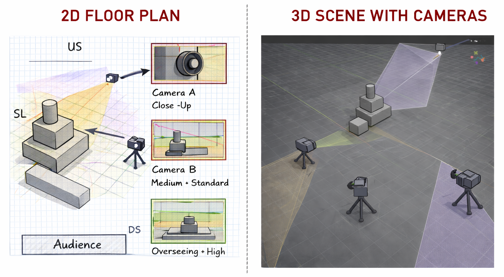

[ART 1T03](README.md)

-------------------------------------------------------------------------------

# W3 — POV as Embodied Witness (Multi-Camera Scene)

<figure style="width: 80%; margin: auto;">
  
</figure>

## Objective

Build on your Week 1–2 geometric scene by treating the camera as an **embodied witness**.  
This activity focuses on how **point of view (POV)** creates a relationship to space through:  
**Framing • Composition • Distance & Layers • Blocking for camera**.  

This week, you will work with **multiple cameras** to compare how different viewpoints produce different meanings.  

Tutorial time may be used to begin or complete this activity depending on your tutorial day. Some work is expected outside of class.

---

## Materials Required

- Computer (laptop or desktop)
- **Blender (free software)**  
  👉 Download: <a href="https://www.blender.org/download/" target="_blank" rel="noopener noreferrer">https://www.blender.org/download/</a>
- Computer mouse (recommended)
- Your **Week 2 Blender file (.blend)**
- Paper + pen (preferred) *or* digital drawing tool

---

## Activities  
**Complete the following in order. Ask your professor or TA for help as needed.**

---

<h3 style="color: darkred;">[20 min] 2D Camera Map + Composition Map — Start Here</h3>

Create a **2D camera planning map**. **See example above (below the main title)**.    
> **Note**: Your drawing skill is not being graded. You are graded on how clearly your sketch communicates the requirements below.

### Requirements
- Hand-drawn (preferred) or digital
- Based on your **Week 2 floor plan** (you may update it)
- Include **THREE (3) cameras**, each with a different:
  - **Camera A: Witness POV** (closer / aligned / relational)
  - **Camera B: Detachment POV** (apparent neutrality; observational / standard coverage)
  - **Camera C: Control/Surveillance POV** (distant / overseeing; often higher angle or more detached)

### Your map should clearly show:
- Indicate each camera’s rotation (direction), level/height, and closeness to the main shapes.
- Direction each camera faces (arrow)
- Intended framing (Wide / Medium)
- One composition strategy per camera (Thirds / Lines / Centered-Symmetry)
- A small sketch or visual reference for the *intended look* of each camera
- ✅ **Note:** This time you are using **three separate camera objects** in Blender.

> ⚠️ This step must be completed **before** working in Blender.

➡️ **Save this image** for submission (JPEG or PNG).

---

<h3 style="color: darkred;">[60 min] 3D Scene + Cameras in Blender</h3>

### Update or revise your space
- You may **adjust, refine, or rebuild** your Week 2 scene if needed.
- Continue using **only basic geometric shapes**.
- Keep the Module I constraints:
  - ❌ No materials or textures  
  - ❌ No lighting changes  
  - ❌ No modifiers  
  - ❌ No animation  

---

### Multiple Cameras + Render

### Required: Create Three cameras (A + B + C)
Add **three cameras** to the scene and set each one according to your camera map. Render all cameras separatelly.  

- **Camera A:** Witness POV  
- **Camera B:** Detachment POV
- **Camera C:** Control/Surveillance POV  

### Camera Constraints
- Use default lens settings for Cameras A and B
- ❌ No camera movement/animation  
- ✅ Focus on:
  - camera position (POV)
  - framing (wide/medium/close)
  - composition (thirds/lines/symmetry)
  - distance & layers (foreground/middleground/background)
  - blocking for camera (relationships between bodies/objects and the camera)

#### Render Multiple Cameras Simultaneously in Blender! (Slow pace version)

<iframe width="560" height="315" src="https://www.youtube.com/embed/mFSq0nUl-0Y?si=iqooZtr4LsbqkNIQ" title="YouTube video player" frameborder="0" allow="accelerometer; autoplay; clipboard-write; encrypted-media; gyroscope; picture-in-picture; web-share" referrerpolicy="strict-origin-when-cross-origin" allowfullscreen></iframe>

   

#### How to Render Multiple Cameras in Blender at Once (Faster pace version)

<iframe width="560" height="315" src="https://www.youtube.com/embed/GX5YnybYFSI?si=ziSfK9CTLa5Gb5U0" title="YouTube video player" frameborder="0" allow="accelerometer; autoplay; clipboard-write; encrypted-media; gyroscope; picture-in-picture; web-share" referrerpolicy="strict-origin-when-cross-origin" allowfullscreen></iframe>

  

---

<h3 style="color: darkred;">[15 min] Witnessing Intention — End Here</h3>

After you complete your 2D camera map and 3D application, write a short description of <strong>each camera approach</strong>.

This week, you are not writing one single “camera intention.”  
You are designing <strong>three different relationships</strong> to the same space using three POV approaches.

### Write 2–3 sentences for each camera:
- <strong>Camera A — Witness POV</strong> (close / aligned / relational)
- <strong>Camera B — Just Recording POV</strong> (apparent neutrality; observational / standard coverage)
- <strong>Camera C — Control / Surveillance POV</strong> (distant / overseeing; higher angle or detached)

### Guiding Prompts (use these to write each description)
- <strong>Where is the camera “standing”</strong> (height/level, distance, angle) and what does that imply?
- What does this POV <strong>give the viewer access to</strong> — and what does it <strong>withhold</strong>?
- What kind of relationship does this POV produce: <strong>care</strong> (witnessing), <strong>detachment</strong> (just recording), or <strong>pressure/control</strong> (surveillance)?

➡️ **Save this text** for submission.

---

<h3 style="color: darkred;">Submission Documents</h3>

### Create a single document with the following sections:

1. **General Information**  
   > Full name, student number, and tutorial number.

2. **Camera Intention**  
   > 3–4 sentences describing how POV is embodied and what relationship it creates.

3. **2D Camera + Composition Map**  
   > Include your labeled camera plan (3 cameras).

4. **Rendered Cameras**
   - **Camera A:** Witness POV
   - **Camera B:** Just Recording POV
   - **Camera C:** Control/Surveillance POV  
   > These must be **renders**, not screenshots.  
   > Note: Each of your screenshots must take up at least half a page.

➡️ **Export as PDF**  
📄 **Filename:** `Lastname-Firstname-W3-Tutorial.pdf`

### Save Blender File

➡️ **Save as .blend**  
📄 **Filename:** `Lastname-Firstname-W3-3Dscene.blend`

---

<h3 style="color: darkred;">📤 Submission</h3>

| Component         | File Name                            |
|------------------|---------------------------------------|
| Project document | `Lastname-Firstname-W3-Tutorial.pdf`  |
| Blender file     | `Lastname-Firstname-W3-3Dscene.blend` |

> ⚠️ **Follow submission protocols carefully. Incorrect submissions may result in lost points.**

---

## Assessment

This Week 3 activity is **graded lightly** based on:

- Completion and effort
- Clarity of **witnessing intention**
- Thoughtful use of vocabulary: POV, framing, composition, layers, blocking
- Technical application: multiple cameras + rendered images

This is an exploratory exercise — **clarity and spatial thinking matter more than polish**.

---
