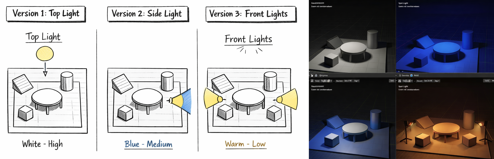
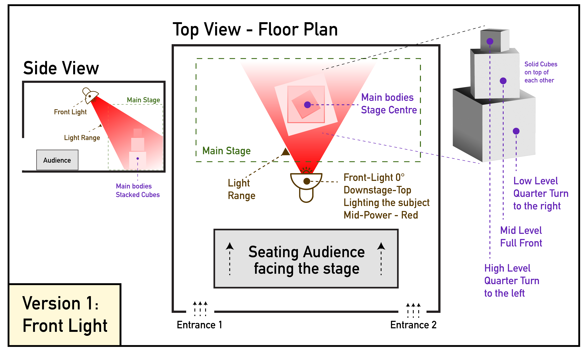
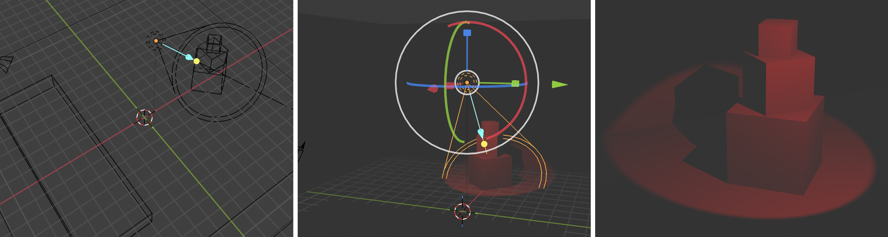
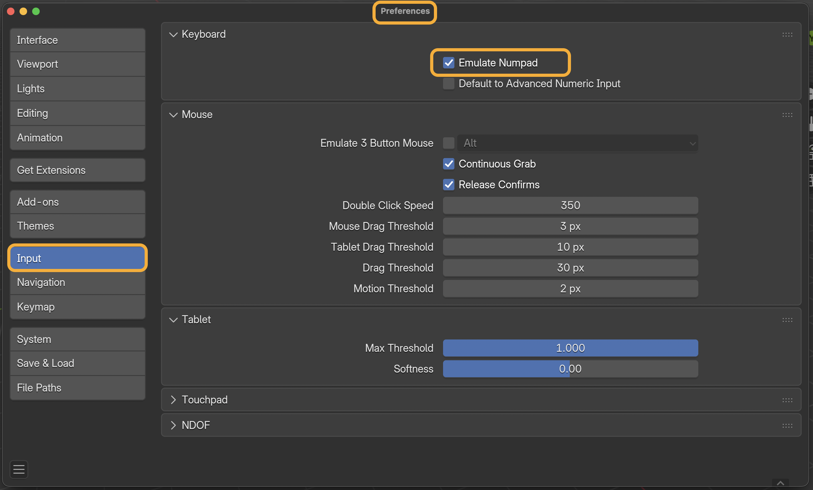

[ART 1T03](README.md)

-------------------------------------------------------------------------------

# W4 — Lighting as Spatial Transformation

<figure style="width: 100%; margin: auto;">
  
</figure>

## Objective

**Build a new 3D scene (black box setting – square) using light as a spatial and expressive tool.**  
This activity focuses on how **lighting position, direction, intensity, and colour** reshape space **without moving objects**.

You will design **three different lighting versions** of the same scene, learning to plan lighting conceptually and translate it into Blender using basic lights.

Tutorial time may be used to begin or complete this activity depending on your tutorial day. Some work is expected outside of class.

---

## Materials Required

- Computer (laptop or desktop)
- **Blender (free software)**  
  👉 Download: <a href="https://www.blender.org/download/" target="_blank" rel="noopener noreferrer">https://www.blender.org/download/</a>
- Computer mouse (recommended)
- Paper + pen (preferred) *or* digital drawing tool

---

## Lights Overview

For full reference, review the slides from this week.   

### Front Light
    
> Establishes a clear, legible baseline by maximizing visibility and minimizing shadows.

### Top / Zenithal Light
    
> Balance visibility and depth, producing a controlled, sculpted three-dimensional look.

### Mirrored Front Lights
    
> Reveals texture and form through contrast, introducing asymmetry and directional shadows.

### Side Lights
    
> Emphasizes vertical hierarchy, creating pressure and strong shadows beneath forms.

### Reflected Light
    
> Softens the scene by diffusing light, gently filling shadows while preserving volume.

---

## Activities  
**Complete the following in order. Ask your professor or TA for help as needed.**

---

<h3 style="color: darkred;">[25 min] 2D Lighting Maps — Start Here</h3>

Create **three (3) 2D lighting sketches**, each representing a **different lighting version** of the same scene taking into acount the **black box – square** as your venue/space.   
> Hand-drawn (preferred) or digital.    

#### Example  

You are not copying the example — you are using it as a reference for **how to communicate spatial and lighting decisions**.   

    

---

### Scene Setup  

You are required to use the vocabulary from [Week 1](https://jac307.github.io/MediaArtTutorials/IARTS1T03/WT-W1.html#requirements){:target="_blank"} and **from this week** when labeling your maps and writing your descriptions.   

- **Main stage / performance area**  
  > This can be placed anywhere in the space   

- Place **3–4 objects** (basic geometric forms only) on the stage
  > Objects must be **close together** *and/or* **stacked on top of each other**    

- **Audience position(s)**
  > Options: in front, on one side, surrounding the stage, on two sides, etc.    

- **Entrance(s)**  
  > Where audiences enter the space.    

- **Light(s)**  
  > Indicate the position, direction, range, and type of each light used in the scene.    

---

<h3 style="color: darkred;">[60 min] Lighting in Blender — Three Versions</h3>

### Required Organization

When working on your scene, you must organize it using **three collections**:

1. **Geometry / Shapes**  
2. **Cameras**  
3. **Lights**

    

#### Organization Rules
- Rename **all shapes** clearly (no default names)
- Place each object in the correct collection
- Rename **cameras and lights** logically and descriptively

> ⚠️ **Important:** Your Blender file will be checked for proper organization.

--- 

### Lighting in Blender — Three Versions

Follow this tutorial on [Lighting](https://jac307.github.io/MediaArtTutorials/Blender/10_Lighting_Camera.html){:target="_blank"}       
> Focus only on lighting     
> Check the shortcuts provided!    

❗ Review the slides from this week for practical tips on organizing scenes and working with lights in Blender.   

### Lighting Constraints
- ❌ Delete the default **Sun** light
- ✅ Use only:
  - **Spot Lights**
  - **Area Lights** (for reflected light)
- ❌ No materials or textures

### For each lighting version:
- Add and position lights according to your 2D map
- Adjust:
  - position & rotation
  - colour
  - intensity (power)
  - radius / size
  - influence and beam shape
- Rename lights clearly (e.g., `Side-Light-Right`, `Front-Light`)

> Each version should feel **distinct**, even though the space remains the same.   

### Rendering Requirements

- Render **2–3 images per lighting version**
- Each render must be from a **different camera angle**
- Images must be **renders**, not screenshots

➡️ **Save all rendered images** for submission.

#### 3D application of the Light Map example above (Version 1)  

        

---

### “0” not working to toggle Camera View?

Go to the main menu **Edit** → **Preferences**.  
Open the **Input** tab and enable **Emulate Numpad**.

> The Camera View is mapped to **Numpad 0** by default.  
> Many laptops don’t have a numpad (or separate number keys on the right).  
> Enabling **Emulate Numpad** allows you to use the **0 key** on your laptop keyboard instead.

    

---

<h3 style="color: darkred;">[20 min] Lighting Intentions — End Here</h3>

For **each lighting version**, write **4–6 sentences** describing:

- Technical choices:
  - light position and direction
  - colour and intensity
  - type of light used
- Spatial and expressive intention:
  - What changes in visibility, depth, or atmosphere?
  - How does this lighting reshape the space?

---

<h3 style="color: darkred;">Submission Documents</h3>

### Create a single PDF with **3 pages total**:

### **Page 1**
- General Information  
  > Full name, student number, tutorial number
- Lighting Version 1
  - 2D Lighting Map
  - Rendered images (2–3)
  - 4-6 sentence description

### **Page 2**
- Lighting Version 2
  - 2D Lighting Map
  - Rendered images (2–3)
  - 4-6 sentence description
    
### **Page 3**
- Lighting Version 3
  - 2D Lighting Map
  - Rendered images (2–3)
  - 4-6 sentence description

➡️ **Export as PDF**  
📄 **Filename:** `Lastname-Firstname-W4-Tutorial.pdf`

---

### Save Blender File

➡️ **Save as .blend**  
📄 **Filename:** `Lastname-Firstname-W4-Lighting.blend`

Your Blender file **must include**:
- Properly named objects
- Correct collection structure
- Only Spot and Area lights

---

<h3 style="color: darkred;">📤 Submission</h3>

| Component         | File Name                              |
|------------------|-----------------------------------------|
| Project document | `Lastname-Firstname-W4-Tutorial.pdf`    |
| Blender file     | `Lastname-Firstname-W4-Lighting.blend`  |

> ⚠️ **Follow submission protocols carefully. Incorrect submissions may result in lost points.**

---

## Assessment

This Week 4 activity is graded with **higher expectations** than previous weeks, as you are now combining **conceptual understanding** with **technical execution**.

Your work will be assessed based on:

- **Completion and effort**  
  All required components are present and submitted correctly.

- **Lighting vocabulary and conceptual clarity**  
  Accurate and intentional use of lighting terms (position, direction, intensity, colour, contrast, shadow, reflection) in both planning and written descriptions.

- **Lighting design logic**  
  Each lighting version demonstrates a clear and distinct approach, showing how light reshapes space, depth, and atmosphere without moving objects.

- **Blender organization and workflow**  
  Proper use of collections (Geometry / Cameras / Lights), clear object and light naming, and removal of default lighting.

- **Technical application in Blender**  
  Correct use of Spot and Area lights, thoughtful adjustments to position, rotation, colour, intensity, radius, and influence.

- **Rendered output**  
  Renders clearly communicate the lighting choices and are taken from multiple viewpoints.

This is still an exploratory exercise, but at this stage, **intentional lighting decisions and technical clarity matter more than experimentation alone**.

---
