[ART 1T03](README.md)

-------------------------------------------------------------------------------

# W6 — Lighting as Temporal Transformation

<figure style="width: 100%; margin: auto;">
  
</figure>

## Objective

You will build on your **W5 scene** by designing and animating **moving lights**, exploring how **lighting cues over time** reshape space, attention, and emotional trajectory.    

This activity focuses on how **changes in lighting position, intensity, colour, and dominance**, combined with **camera movement**, transform the experience of a space **without changing the objects, audience placement, or stage layout**.   

Tutorial time may be used to begin or complete this activity depending on your tutorial day. Some work is expected outside of class.

---

## Materials Required

- Computer (laptop or desktop)
- **Blender (free software)**  
  👉 Download: <a href="https://www.blender.org/download/" target="_blank" rel="noopener noreferrer">https://www.blender.org/download/</a>
- Computer mouse (recommended)
- Your **Week 5 Blender file (.blend)**
- Paper + pen (preferred) *or* digital drawing tool

---

## Activities  
**Complete the following in order. Ask your professor or TA for help as needed.**

---

<h3 style="color: darkred;">[15 min] Lighting Intentions — Start Here</h3>

Select **one of the two following approaches (A or B)** and write **a lighting intention**.  

#### **Lighting Intention 🅰️ — Single Emotion, Evolving Over Time**

Write **3–4 sentences** describing how a **single emotional state** evolves through **lighting changes**.

Your description must:
- focus on **change over time**, not a static look
- include **3–5 distinct cues or transitions**
- describe how lighting **intensity, colour, dominance, and spatial effect** shift

#### **Lighting Intention 🅱️ — Mixed Emotions Over Time**

Write **3–4 sentences** describing how **multiple emotions coexist or compete** through lighting changes.

Your description must:
- describe how different emotional forces **overlap or shift dominance**
- include **3–5 distinct cues or transitions**
- focus on **contrast, tension, or collapse** rather than smooth progression

---

<h3 style="color: darkred;">[20 min] 2D Lighting Map</h3>

Using **your Week 5 scene layout**, create a **lighting map**, representing **the selected prompt** (from the previous step):

- **Lighting Map A:** Single Emotion, Evolving Over Time
- or
- **Lighting Map B:** Mixed Emotions Over Time  

> ⚠️ You must **not** change object placement, stage position, audience placement, or entrances.  
> You are only designing **lighting changes over time**.  

Each lighting map must include:
- a **Top View**
- a **Side View**
- a **Front View**

Hand-drawn (preferred) or digital.

---

#### Example  
You are **not copying** the example — you are using it as a reference for **how to clearly communicate lighting decisions and cue logic**.

   

> ⚠️ Your drawing skill is not graded.  
> You are graded on **clarity of lighting logic, use of vocabulary, and ability to communicate cues clearly**.

---

### Lighting Map Requirements

You are required to use the vocabulary from  
- [W5 vocabulary](https://jac307.github.io/MediaArtTutorials/IARTS1T03/WT-W5.html#lights-overview){:target="_blank" rel="noopener noreferrer"}  
- [W6 vocabulary](https://jac307.github.io/MediaArtTutorials/IARTS1T03/WT-W6.html#core-vocabulary){:target="_blank" rel="noopener noreferrer"}  

Because you will be using **multiple lights** on each map, you must:
- indicate the **range or spread** of each light (cone, area, or wash)  
- use a **different colour** to represent **each light's range** (see examples above)  

For **each light** shown in the map, clearly indicate:

- **Type of light**  
  (front, side, top, mirrored front, gobo, reflected)
- **Position**  
  (where the light is placed in relation to the stage)
- **Colour**  
  (red, blue, light green, bright pink, etc, or use Hexadecimal -hex)

---  

<h3 style="color: darkred;">[10 min] Cue Instructions (Written for a Technician)</h3>

Write a short **cue list** written as if you were giving instructions to a lighting technician.  

- Include **3–5 cues maximum**
- Write cues **in order**
- Describe **changes**, not emotions
- Use vocabulary from class (fade, snap, increase/decrease intensity, introduce/remove, shift dominance, etc.)
- Include:
  - **Type of light** (front, side, top, mirrored front, gobo, reflected)
  - **Colour** (red, blue, light green, bright pink, etc, or use Hexadecimal-hex)
  - **Intensity** (low / mid / high)
  - **What the light affects** (objects, stage area, audience, background)

  

---

#### Example — Lighting Intention + Cue Sequence (Excerpt)  

You are **not copying** the example — you are using it as a reference for **how to clearly communicate lighting cues**.

    

<strong>Lighting Intention:</strong> 
A growing sense of tension emerges through a front light that slowly expands and contracts in range, creating a rhythmic, breathing-like motion. This buildup is followed by sharp contrast and sculpted shadows, produced by secondary lights that fade in and out. These cues establish increasing pressure and visual instability without moving the objects or space. The following cues represent the <strong>first three moments of a longer lighting sequence</strong>.  
  
<strong>Cue 1 — Establishing Presence</strong> 
Fade in a <strong>front 0° light</strong> slowly at <strong>low intensity</strong>, starting with a <strong>wide range</strong> covering more than half of the stage. Gradually shift colour from <strong>light violet</strong> (#E1DEFF) to a <strong>light, low-saturated pink</strong> (#FFCEE2). This cue exposes the centre stage while keeping the space soft and readable.
  
<strong>Cue 2 — Rhythmic Compression</strong> 
Gradually <strong>reduce the range</strong> of the front 0° light toward the main objects, then slightly widen it again. Increase colour saturation to a <strong>mid-saturated pink</strong> (#FFA1A8). This slow, gradual change compresses and releases the space, reinforcing a sense of controlled tension.
  
<strong>Cue 3 — Contrast and Sculpting</strong> 
Increase the range of the front 0° light while shifting colour to <strong>bright red</strong> (#FF1D00) at <strong>mid intensity</strong>. Fade in a <strong>secondary front light</strong> in <strong>bright green</strong> at mid intensity, with a slightly narrower range focused around the main objects. The interaction between the lights creates <strong>strong contrast</strong>, <strong>hard shadows</strong>, and a sculpted appearance that intensifies spatial pressure.

    

---

<h3 style="color: darkred;">[60 min] Lighting in Blender</h3>

### Required Organization

Each Blender file must be organized using **three collections**:

1. **Geometry / Shapes**  
2. **Cameras**  
3. **Lights**

#### Organization Rules
- Do **not** move, modify, or rename geometry from W5
- Place **all new lights** in the **Lights** collection
- Rename **lights clearly** (e.g., `Front_Light`, `Top_Light`)
- **Correct naming protocol:** do not leave spaces between words; use `_` instead

> ⚠️ **Important:** Each Blender file will be checked for proper organization.

---

### Lighting in Blender — Applying Your Cues

Using your **2D lighting maps and written cue list**, apply your planned lighting changes in Blender.

You must **follow your cues in order**, translating each one into animated lighting changes.

- Animate **the properties defined in your cues**, including:
  - colour
  - intensity (power / exposure)
  - radius / size
  - influence and beam shape (angle & blend)
- Each **lighting cue** should occur approximately every **60–120 frames**
- Total animation length must be **no longer than 25 seconds**
  - This corresponds to a maximum of **300 frames**
  - ⚠️ Do not exceed **25 seconds / 300 frames**
- Keep animations concise to avoid long render times on slower computers
- ❌ **Do not animate light position or rotation**
- **Materials:** You may follow this tutorial to adjust **light colour only**
  > ❌ Do not use additional materials or textures

---

## Tutorials

❗ Review this week’s slides for practical tips on **animating lights and working with cues in Blender**.  

#### BLENDER TUTORIAL : How to Animate LIGHTS (QUICK)

<iframe width="560" height="315" src="https://www.youtube.com/embed/9C41lnEfJWY?si=rbae-DhqCA1RY-CS" title="YouTube video player" frameborder="0" allow="accelerometer; autoplay; clipboard-write; encrypted-media; gyroscope; picture-in-picture; web-share" referrerpolicy="strict-origin-when-cross-origin" allowfullscreen></iframe>  

    

---

<h3 style="color: darkred;">[20 min] Animate the Camera + Render Video in Blender</h3>  

  

Animate the **camera** to introduce **intentional movement** that supports your lighting cues.

You must apply:
- **One continuous camera movement** across the sequence  
  **OR**
- **One camera movement per lighting cue**, aligned with your cue changes (as shown in the example above)

Camera movement should be **subtle and purposeful**, reinforcing shifts in attention, hierarchy, or spatial pressure rather than distracting from the lighting.

Follow this tutorial on  
[Camera Animation Basics](https://jac307.github.io/MediaArtTutorials/Blender/12_Camera_Animation_Basics.html){:target="_blank"}  

> Focus only on **basic camera movement** (position and/or rotation).  
> Do not add complex paths or effects.

---

### Rendering Requirements

- Render **one short video per lighting version**
- Each video must:
  - show the **full lighting cue sequence**
  - include the **camera movement**
  - remain within the **25-second / 300-frame limit**
- Videos must be **renders**, not viewport screen recordings

➡️ **Export as MP4, codec H.264**  
📄 **Filename:** `Lastname-Firstname-W6-Lighting.mp4`

---

<h3 style="color: darkred;">Submission Documents</h3>

### Create a single PDF:

#### Page 1 — Lighting Version A (Single Emotion, Evolving Over Time)
- **3–4 sentence lighting intention description**
- **2D Lighting Map**
  - Top view, side view, and front view  
  - Colour-coded lights with range indicated
- **Cue list**
  - 3–5 cues, written as instructions for a lighting technician

➡️ **Export as PDF**  
📄 **Filename:** `Lastname-Firstname-W6-Tutorial.pdf`

---

| Component              | File Name                                 |
|------------------------|-------------------------------------------|
| Project document (PDF) | `Lastname-Firstname-W6-Tutorial.pdf`      |
| Blender file           | `Lastname-Firstname-W6-Lighting.blend`    |
| Video                  | `Lastname-Firstname-W6-Lighting.mp4`      |

> ⚠️ **Follow submission protocols carefully. Incorrect submissions may result in lost points.**

---

## Assessment

This Week 6 activity is graded with **higher expectations** than previous weeks, as you are now expected to apply lighting concepts **over time** using both intentional design and technical execution.

Your work will be assessed based on:

- **Lighting vocabulary and clarity**  
  Accurate and intentional use of lighting and cue-based terminology in maps, written intentions, and cue descriptions.

- **Lighting design logic**  
  Each version demonstrates a clear and distinct temporal and spatial effect through lighting changes and cue progression.

- **Blender workflow and organization**  
  Proper use of collections, clear naming conventions, correct file duplication, and lighting-only animation changes.

- **Rendered output**  
  Rendered videos clearly communicate lighting movement, cue transitions, and spatial differences over time.

This remains an exploratory exercise, but at this stage, **intentional lighting decisions, clear communication, and technical clarity matter more than experimentation alone**.  

---

## Core Vocabulary

For full reference, review the slides from this week.    

### Timing

  <!-- LEFT COLUMN -->
  

    <h4>Fade in / Fade Out</h4>
    
<em>Light gradually appears or disappears over time.</em>

    

    <h4>Snap</h4>
    
<em>Light changes instantly with no transition</em>

    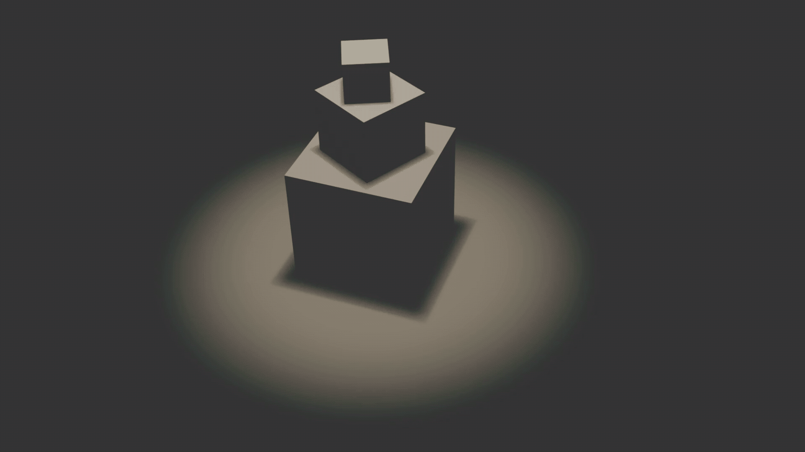

  

  <!-- RIGHT COLUMN -->
  

    <h4>Slow / Fast</h4>
    
<em>Describes the speed = how long the lighting change takes.</em>

    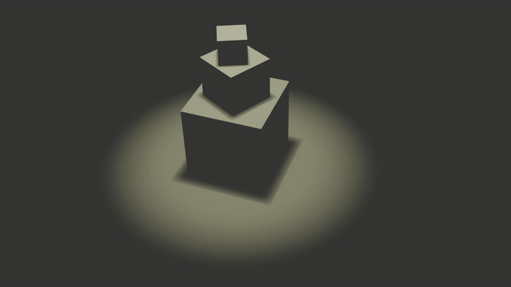

    <h4>Gradual / Sudden</h4>
    
<em>Describes how the change feels while it happens.</em>

  
  

    

### General Changes

  <!-- LEFT COLUMN -->
  

    <h4>Increase / Decrease intensity</h4>
    
<em>Light becomes brighter or dimmer.</em>

    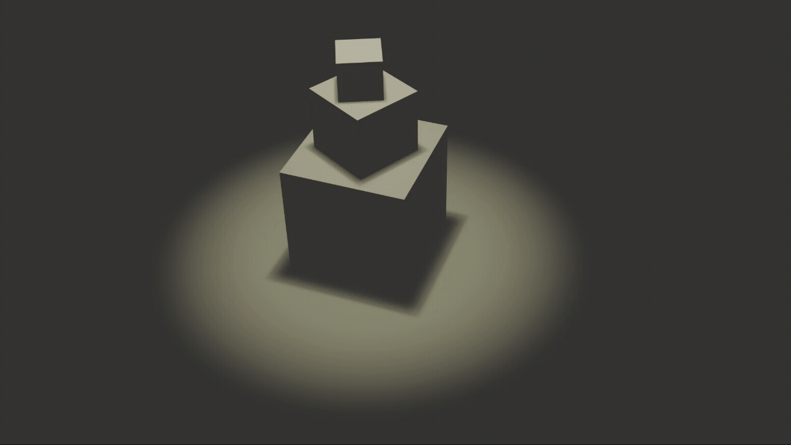

    <h4>Warm → Cool / Cool → Warm</h4>
     
<em>Light shifts in colour temperature.</em>

    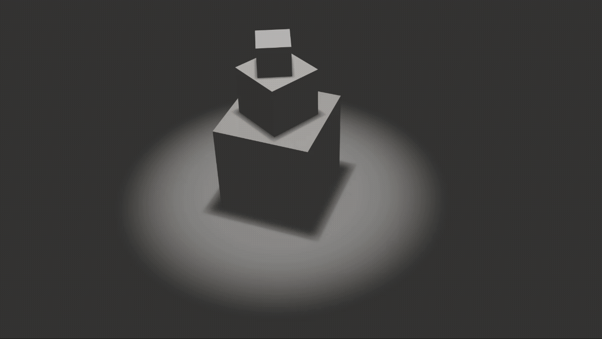

  

  <!-- RIGHT COLUMN -->
  

    <h4>Introduce / Remove</h4>
    
<em>A light is added to or taken out of the scene.</em>

    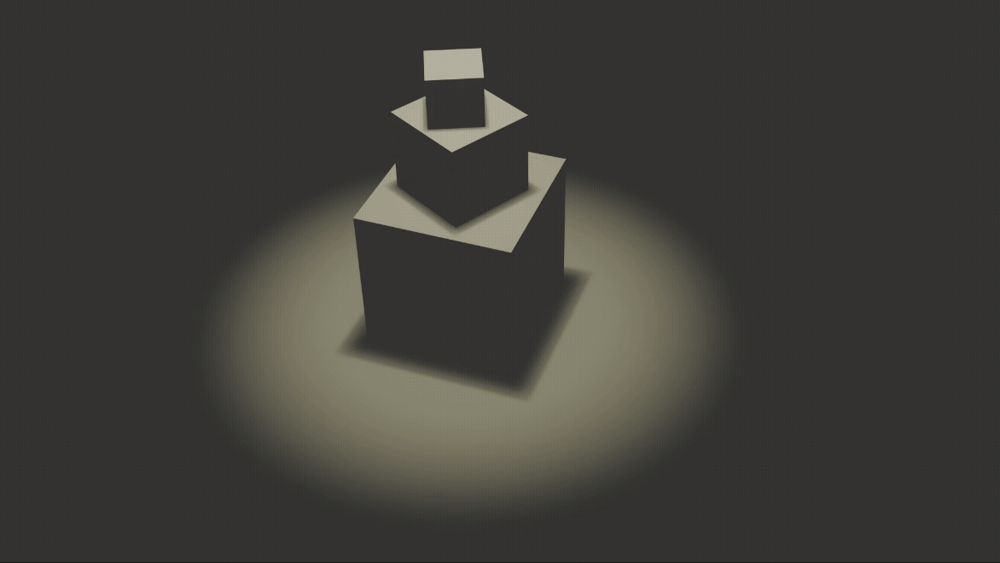

    <h4>Shift dominance</h4>
    
<em>One light becomes more visually important than others.</em>

    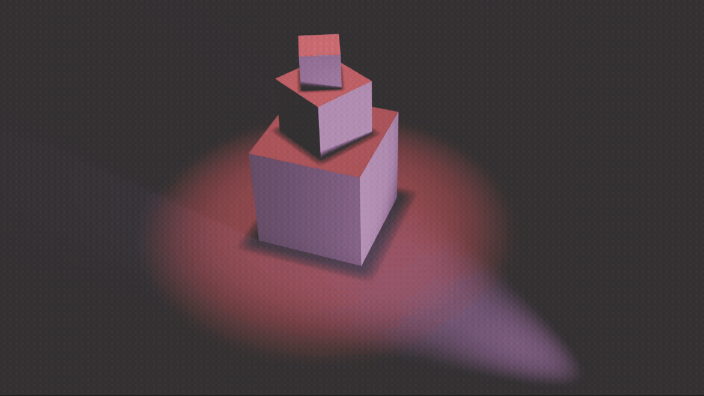

  

     

### Spatial Effect

  <!-- LEFT COLUMN -->
  

    <h4>Isolate</h4>
    
<em>Separates a subject from its surroundings.</em>

    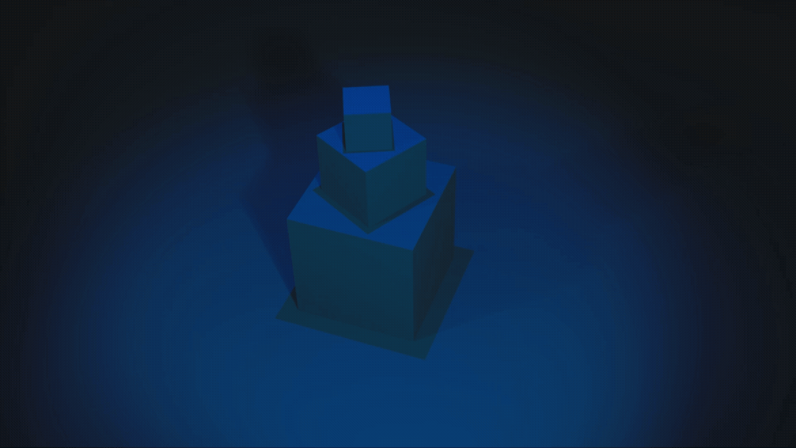

    <h4>Expose</h4>
    
<em>Makes details clearly visible.</em>

    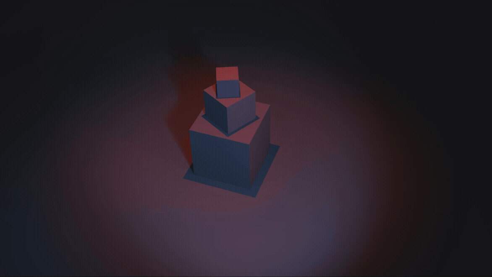

    <h4>Compress</h4>
    
<em>Flattens and reduces spatial separation.</em>

    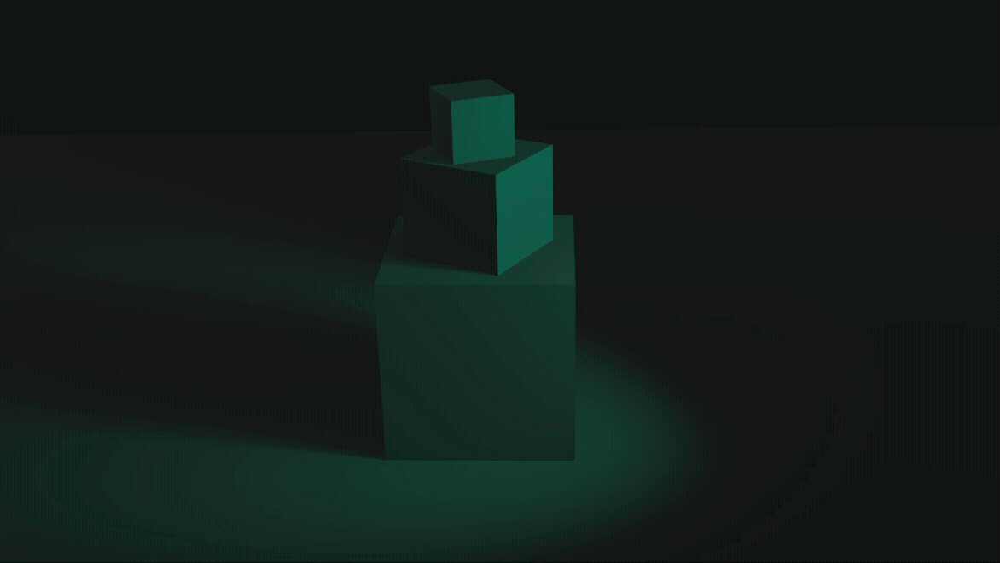

  

  <!-- RIGHT COLUMN -->
  

    <h4>Soften</h4>
    
<em>Reduces contrast and hard edges.</em>

    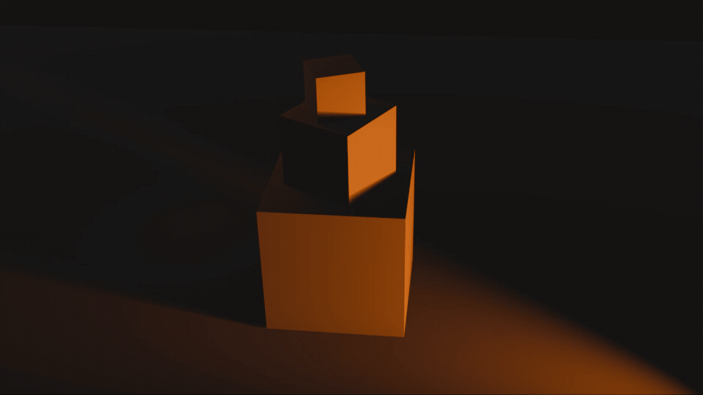

    <h4>Flatten</h4>
    
<em>Minimizes shadows and depth cues.</em>

    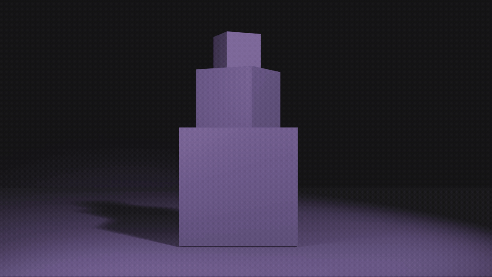

    <h4>Sculpt</h4>
    
<em>Emphasizes volume, form, and dimensionality.</em>

    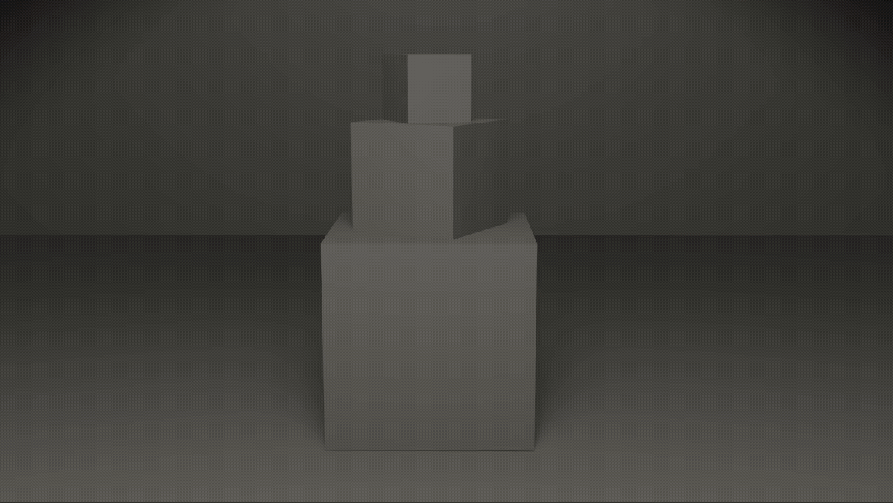

  

   

---
