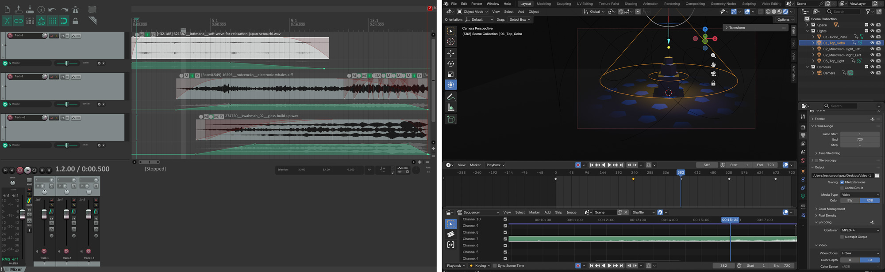
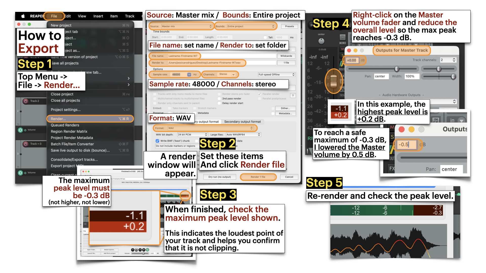
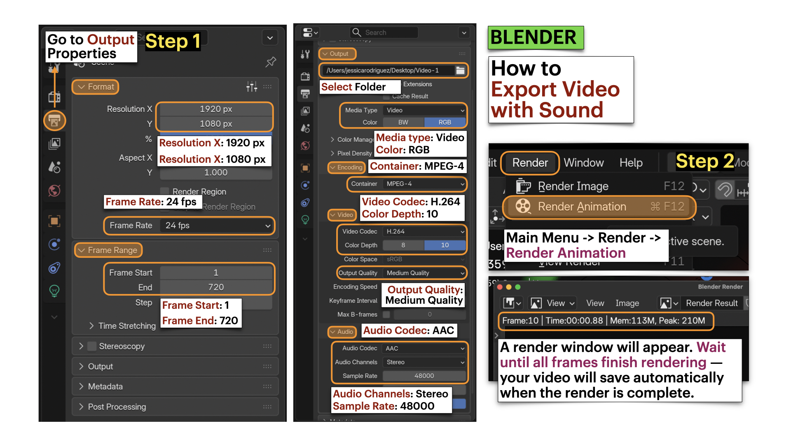

[ART 1T03](README.md)

-------------------------------------------------------------------------------

# W7 - Sound as Temporal Structure  

<figure style="width: 100%; margin: auto;">
  
</figure>

## Objective

You will **build on your W6 scene** by **creating a 30-second sound composition** and **integrating it into your Blender project**.  

This activity focuses on how **layered sound, rhythm, silence, and dynamic shifts** reshape attention and emotional trajectory within a fixed visual frame, without changing the stage layout or lighting design.  

Tutorial time may be used to begin or complete this activity depending on your tutorial day. Some work is expected outside of class.

---

## Materials Required

- Computer (laptop or desktop) + Computer mouse (recommended)
- Free acount on <a href="https://freesound.org/" target="_blank" rel="noopener noreferrer">Freesound</a>  
- Reaper (free software)  
  👉 Download: <a href="https://www.reaper.fm/download.php" target="_blank" rel="noopener noreferrer">https://www.reaper.fm/download.php</a>
- Blender (free software)
- Your **Week 6 Blender file (.blend)**
- Paper + pen (preferred) *or* digital drawing tool

---

## Activities  
**Complete the following in order. Ask your professor or TA for help as needed.**

---

<h3 style="color: darkred;">[10 min] Sonic Intentions — Start Here</h3>  

Define the emotional and sonic direction of your 30-second composition in direct relation to your **Week 6 lighting approach**. Write **4–5 lines** that answer the following:  

1. **How does your sound build on your Week 6 lighting transformation?**  
   Does it reinforce the lighting shifts, contrast them, intensify them, or slow them down?

2. **What is the emotional arc?**  
   What feeling defines the beginning, what shifts in the middle, and how does it end?

3. **What types of sounds will you use?**  
   Will they be environmental (wind, room tone, footsteps), instrumental (strings, percussion, drone), mechanical, vocal textures, or abstract digital tones?  

---

<h3 style="color: darkred;">[20 min] Gather & Curate Sound Samples</h3>

Using only **royalty-free / free-use sound sources** from <a href="https://freesound.org/" target="_blank" rel="noopener noreferrer">Freesound</a>, gather **10–15 sound samples** that align with your sonic intentions. You may not use all of them, but you should curate a small palette to work from.  

Look for a mix of:
- Instrumental textures (drone, strings, percussion, tonal layers)  
- Environmental sounds (room tone, wind, mechanical hum, footsteps, ambience)  
- Abstract or digital sounds (glitch, filtered noise, processed tones)  

⚠️ **No lyrics.** Vocal textures are allowed, but no spoken word or songs with lyrics.

Save all files in an organized folder and **record the credit information for each sound** (title, creator, source link, license). You will need this for proper attribution.  

     

---

<h3 style="color: darkred;">[60-120m] Compose in REAPER (Basic Sound Composition Focus)</h3> 

👉 Download: <a href="https://www.reaper.fm/download.php" target="_blank" rel="noopener noreferrer">REAPER</a>

Follow the REAPER tutorials below and build a **30-second sound composition**.  

- Be exactly **30 seconds long**
- Combine **at least 3 different sound samples**
- Use only **one or two tracks** with a simple, intentional structure that includes a clear **beginning, middle, and end**
- Adjust the **volume of individual sound samples** to maintain balance and consistency
- Use **crossfades** between sound samples to ensure smooth transitions
- Add a **fade-in at the start** and a **fade-out at the end**
- Remove any **clicks or pops** that downloaded samples may contain  
  > Clicks and pops are unwanted, sharp, transient audio artifacts that may sound like digital clicks or low-frequency thumps.
- Maintain **clean audio levels** (no clipping)  
  > Clipping is distortion that occurs when audio exceeds the system’s maximum level.

When finished:
1. **Export your final composition as a WAV file**  
   📄 **Filename:** `Lastname-Firstname-W7.wav`  
2. **Save your REAPER project file**  
   📄 **Filename:** `Lastname-Firstname-W7.rpp`

--- 

### Tutorials

❗ Review this week’s slides for practical tips on **a general overview of Blender, importing samples, adjusting volume and rendering**.    

#### This is REAPER 7 - Basic Audio Editing

<iframe width="560" height="315" src="https://www.youtube.com/embed/EGL54WGa85A?si=U5cARs2il5x41k5N" title="YouTube video player" frameborder="0" allow="accelerometer; autoplay; clipboard-write; encrypted-media; gyroscope; picture-in-picture; web-share" referrerpolicy="strict-origin-when-cross-origin" allowfullscreen></iframe>

  

#### Change volume for a part of a track in REAPER

<iframe width="560" height="315" src="https://www.youtube.com/embed/PKkacbUkZ-8?si=XxsyVwXqJn47ihQC" title="YouTube video player" frameborder="0" allow="accelerometer; autoplay; clipboard-write; encrypted-media; gyroscope; picture-in-picture; web-share" referrerpolicy="strict-origin-when-cross-origin" allowfullscreen></iframe> 

   

#### Removing Clicks & Pops in REAPER

<iframe width="560" height="315" src="https://www.youtube.com/embed/AW5G-60jH34?si=IF8-HbhJ4EolktVM" title="YouTube video player" frameborder="0" allow="accelerometer; autoplay; clipboard-write; encrypted-media; gyroscope; picture-in-picture; web-share" referrerpolicy="strict-origin-when-cross-origin" allowfullscreen></iframe>

   

#### Export in Reaper and avoid master clipping

     

---

<h3 style="color: darkred;">[30 min] Blender: Sound Integration</h3>

Follow the Blender tutorials below to **import your 30-second WAV file** into your **duplicated W6 scene**.  

Then:
- Adjust your timeline to **720 frames (30 seconds at 24 fps)**.
- Keep your **Week 6 lighting design and cue structure**, but **adjust the timing of the lighting animation** to align with your 30-second sound composition and final duration (30 seconds total).  
- **Remove any previous camera animation** from Week 6.
- Position the camera in a **wide frontal shot** and animate a simple, continuous forward movement or zoom (in or out) that lasts the full **30 seconds**.  

Save your updated Blender file as: `Lastname-Firstname-W7.blend`    

➡️ **Export Video as MP4, codec H.264**    
📄 **Filename:** `Lastname-Firstname-W7.mp4`  

> ⚠️ Videos must be **final renders**, not viewport screen recordings.
> The render will take longer since you are no

---

### Tutorials

❗ Review this week’s slides for practical tips on **adjusting timeline to be 30s, importing sound, adjusting lighting cues, and export video with audio in Blender**.    

#### How to Add Sound to your Blender Projects

<iframe width="560" height="315" src="https://www.youtube.com/embed/x0a4Mmybju8?si=Ra5wVrWYWkzkpGAb" title="YouTube video player" frameborder="0" allow="accelerometer; autoplay; clipboard-write; encrypted-media; gyroscope; picture-in-picture; web-share" referrerpolicy="strict-origin-when-cross-origin" allowfullscreen></iframe>

    

#### Blender: Export File with Audio

     

---

### Video Submission Example

<figure style="width: 60%; margin: 0;">
  <video controls style="width: 100%; height: auto;">
    <source src="imgs/49.mp4" type="video/mp4">
  </video>
</figure>

---

<h3 style="color: darkred;">Submission Documents</h3>

Create a single PDF that includes:

- **4–5 sentence sonic intention description**  
  Briefly describe the emotional arc (beginning → middle → end) and the types of sounds you selected.

- **List of sound samples used**  
  Include for each sample:
  - Title  
  - Creator  
  - Source link  
  - License information  

➡️ **Export as PDF**  
📄 **Filename:** `Lastname-Firstname-W7.pdf`

---

| Component              | File Name                        |
|------------------------|----------------------------------|
| Project document (PDF) | `Lastname-Firstname-W7.pdf`      |
| **Reaper** file        | `Lastname-Firstname-W7.rpp`      |
| Sound file             | `Lastname-Firstname-W7.wav`      |
| Video file             | `Lastname-Firstname-W7.mp4`      |

> ⚠️ **Follow submission protocols carefully. Incorrect submissions may result in lost points.**

---

## Assessment

Your work will be assessed based on:

- **Clarity of Sonic Intentions (PDF)**  
  The written description clearly defines the emotional arc (beginning → shift → ending), and the composition meaningfully extends your Week 6 *Lighting as Temporal Transformation* approach.

- **Sound Composition Structure (WAV + RPP)**  
  The 30-second composition demonstrates intentional layering of at least three sound sources, clear temporal development, effective fade-in and fade-out, and clean audio levels without distortion.

- **Integration & Framing in Final Render (MP4)**  
  Sound is properly synchronized with lighting timing across the 30-second duration.  
  The static wide shot demonstrates a deliberate framing strategy (rule of thirds, symmetry, or leading lines), and sound reshapes attention within a fixed frame.

- **Technical Execution & File Organization**  
  All required files (`.pdf`, `.rpp`, `.wav`, `.mp4`) follow correct naming conventions, maintain a 30-second duration, and are properly exported (not viewport recordings).

---

## Core Vocabulary

For full reference, review the slides from this week.    

### General / Sound

  <!-- LEFT COLUMN -->
  

    <h4>Music</h4>
    
<em>(melody, harmony, rhythm)</em>

    <audio controls style="width: 100%;">
      <source src="sounds/music.wav" type="audio/mpeg">
    </audio>

    <h4>Atmosphere / Ambience</h4>
    
<em>(room tone, environmental texture)</em>

    <audio controls style="width: 100%;">
      <source src="sounds/atmosphere.wav" type="audio/mpeg">
    </audio>

    <h4>Sound Effects</h4>
    
<em>(events, actions, environments)</em>

    <audio controls style="width: 100%;">
      <source src="sounds/sound-effects.wav" type="audio/mpeg">
    </audio>

    <h4>Voice</h4>
    
<em>(speech, breath, chant, whisper)</em>

    <audio controls style="width: 100%;">
      <source src="sounds/voice.wav" type="audio/mpeg">
    </audio>

    <h4>Noise</h4>
    
<em>(texture, distortion, feedback, static)</em>

    <audio controls style="width: 100%;">
      <source src="sounds/noise.wav" type="audio/mpeg">
    </audio>

  

  <!-- RIGHT COLUMN -->
  

    <h4>Western Classical</h4>
    
<em>harmony and structure</em>

    <audio controls style="width: 100%;">
      <source src="sounds/classical.mp3" type="audio/mpeg">
    </audio>

    <h4>Early 20th century</h4>
    
<em>atonality (breaking tonal expectations)</em>

    <audio controls style="width: 100%;">
      <source src="sounds/atonal.mp3" type="audio/mpeg">
    </audio>

    <h4>Mid-20th century</h4>
    
<em>musique concrète (recorded sound as composition)</em>

    <audio controls style="width: 100%;">
      <source src="sounds/concrete.mp3" type="audio/mpeg">
    </audio>

    <h4>Electronic music</h4>
    
<em>frequency-based sound construction</em>

    <audio controls style="width: 100%;">
      <source src="sounds/electronic.mp3" type="audio/mpeg">
    </audio>

    <h4>Contemporary music</h4>
    
<em>hybrid, noise, resistance</em>

    <audio controls style="width: 100%;">
      <source src="sounds/contemporary.mp3" type="audio/mpeg">
    </audio>

  
  

      

