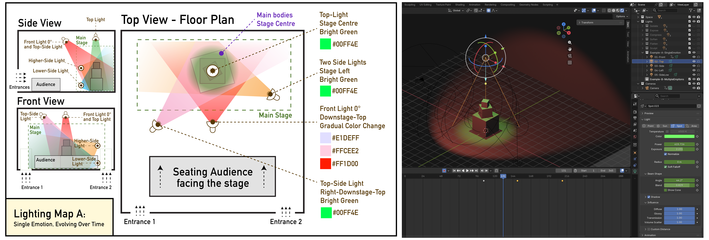

[ART 1T03](README.md)

-------------------------------------------------------------------------------

# W7 - Sound as Temporal Structure

<figure style="width: 100%; margin: auto;">
  
</figure>

## Objective

Description

---

## Materials Required

- Computer (laptop or desktop)
- **Blender (free software)**  
  👉 Download: <a href="https://www.blender.org/download/" target="_blank" rel="noopener noreferrer">https://www.blender.org/download/</a>
- Computer mouse (recommended)
- Your **Week 5 Blender file (.blend)**
- Paper + pen (preferred) *or* digital drawing tool

---

## Activities  
**Complete the following in order. Ask your professor or TA for help as needed.**

---

<h3 style="color: darkred;">[15 min] Lighting Intentions — Start Here</h3>

---

<h3 style="color: darkred;">[20 min] 2D Lighting Map</h3>

---  

<h3 style="color: darkred;">[10 min] Cue Instructions (Written for a Technician)</h3>

---

<h3 style="color: darkred;">[40 min] Lighting in Blender</h3>

---

<h3 style="color: darkred;">[20 min] Animate the Camera + Render Video and Image in Blender</h3>  

---

### Video Rendering Requirements

- Render **one short video per lighting version**
- Each video must:
  - show the **full lighting cue sequence**
  - include the **camera movement**
  - remain within the **25-second / 300-frame limit**
- Videos must be **renders**, not viewport screen recordings

➡️ **Export as MP4, codec H.264**  
📄 **Filename:** `Lastname-Firstname-W6-Lighting.mp4`  

#### How to Export Video in Blender: MP4 Video Format

<iframe width="560" height="315" src="https://www.youtube.com/embed/3eJmISziyIY?si=PSvPcJ_74rNpn7dA" title="YouTube video player" frameborder="0" allow="accelerometer; autoplay; clipboard-write; encrypted-media; gyroscope; picture-in-picture; web-share" referrerpolicy="strict-origin-when-cross-origin" allowfullscreen></iframe>

    

❗ Review this week’s slides for practical tips on **animating lights, camera, and render video files in Blender**.  

---

<h3 style="color: darkred;">Submission Documents</h3>

### Create a single PDF:
  
- **3–4 sentence lighting intention description**
- **2D Lighting Map**
  - Top view, side view, and front view  
  - Colour-coded lights with range indicated
- **Cue list**
  - 3–5 cues, written in order as **clear, technician-style instructions**, using class vocabulary  
  - **One rendered image per cue**, showing the exact frame where the cue occurs  

➡️ **Export as PDF**  
📄 **Filename:** `Lastname-Firstname-W6-Tutorial.pdf`

---

| Component              | File Name                                 |
|------------------------|-------------------------------------------|
| Project document (PDF) | `Lastname-Firstname-W6-Tutorial.pdf`      |
| Blender file           | `Lastname-Firstname-W6-Lighting.blend`    |
| Video file             | `Lastname-Firstname-W6-Lighting.mp4`      |

> ⚠️ **Follow submission protocols carefully. Incorrect submissions may result in lost points.**

---

## Assessment

Your work will be assessed based on:

---
