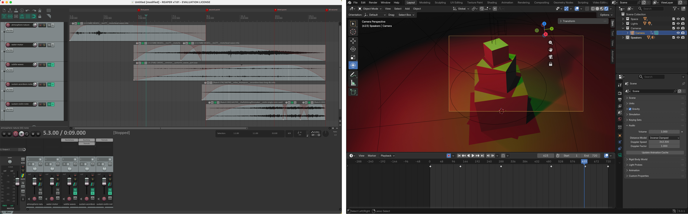

[ART 1T03](README.md)

-------------------------------------------------------------------------------

# W8 - Presence, Space & Spatialization  

<figure style="width: 100%; margin: auto;">
  
</figure>

## Objective

You will return to your W6 scene and **create a new spatial sound composition** that explores **stereo presence** and **listener position**.    

This activity focuses on **how sound location and audience perspective reshape perception** without relying on camera movement.  

Tutorial time may be used to begin or complete this activity depending on your tutorial day. Some work is expected outside of class.

---

## Materials Required

- Computer (laptop or desktop) + Computer mouse (recommended)
- - **Headphones** (highly recommended for accurate stereo perception and subtle spatial differences)
- Free acount on <a href="https://freesound.org/" target="_blank" rel="noopener noreferrer">Freesound</a>  
- Reaper (free software)  
  👉 Download: <a href="https://www.reaper.fm/download.php" target="_blank" rel="noopener noreferrer">https://www.reaper.fm/download.php</a>
- Blender (free software)
- Your **Week 6 Blender file (.blend)**
- Paper + pen (preferred) *or* digital drawing tool

---

## Activities  
**Complete the following in order. Ask your professor or TA for help as needed.**

---

<h3 style="color: darkred;">[15 min] Sonic Intentions — Start Here</h3>  

Use [W8 vocabulary](https://jac307.github.io/MediaArtTutorials/IARTS1T03/WT-W8.html#core-technical-vocabulary-for-sound){:target="_blank" rel="noopener noreferrer"}  

Return to your **Week 6 lighting scene** and define a new sonic approach that explores **stereo movement, depth, and listener perspective**.

Write **4–5 sentences** that respond to the following:

1. **How will sound extend your Week 6 lighting transformation?**  
   Will lighting shifts correspond to changes in panning, intensity, texture, or spatial emphasis?  
   What is the overall feeling you want to create?

2. **How will you use the stereo field to shape space?**  
   Will sounds move gradually from left to right?  
   Will certain elements remain centered while others shift?  
   Will volume and reverb create a sense of proximity or distance?

---

<h3 style="color: darkred;">[20 min] Gather & Curate Sound Samples</h3>

You may reuse **unused sound samples from Week 7** or gather new royalty-free sounds from <a href="https://freesound.org/" target="_blank" rel="noopener noreferrer">Freesound</a>.  

If you download new sounds, you must record the credit information (title, creator, source link, license).  

Curate a focused selection of sounds that support **stereo spatialization**, such as:
- Textures that can move between speakers  
- Sounds that can exist exclusively in one speaker  
- Layers that can vary in volume to create depth
- ⚠️ No lyrics.  

---

<h3 style="color: darkred;">[60-80m] Compose in REAPER (Stereo Spatialization Focus)</h3>  

Follow the REAPER tutorials below and build a **30-second stereo sound composition** that explores spatial presence.

Your composition must:
- Be exactly **30 seconds long**
- Combine **at least 6 different sound samples**
- Include a clear **beginning, middle, and end**
- Use a **fade-in at the start** and a **fade-out at the end**
- Maintain clean levels (no clipping; final peak at -0.3 dB)

In addition, you must:
- Use **panning** to shift sounds across the stereo field (Left ↔ Right),  
  **or** position certain sounds entirely in one speaker.
- Use **volume/gain adjustments** to create depth (foreground vs background).
- Apply **at least one audio effect** (e.g., reverb, EQ, delay) intentionally.
- Normalize or balance levels so no track unintentionally dominates the mix.
- Ensure spatial movement feels deliberate, not random.

When finished:
1. **Export your final composition as a WAV file**  
   📄 **Filename:** `Lastname-Firstname-W8.wav`  
2. **Save your REAPER project file**  
   📄 **Filename:** `Lastname-Firstname-W8.rpp`

---

### Tutorials  

❗ Review this week’s slides for practical tips on **working with multiple tracks, zoom in/out in the arrange view, track overview options, add sound effects, and automatate/animate volume, panning and sound effects**.    

Check [W7 REAPER tutorilas](https://jac307.github.io/MediaArtTutorials/IARTS1T03/WT-W7.html#tutorials){:target="_blank" rel="noopener noreferrer"}  

#### Why and How to use Reverb in REAPER

<iframe width="560" height="315" src="https://www.youtube.com/embed/bVguIQTqClo?si=U5rcUHgbwt7HRD0g" title="YouTube video player" frameborder="0" allow="accelerometer; autoplay; clipboard-write; encrypted-media; gyroscope; picture-in-picture; web-share" referrerpolicy="strict-origin-when-cross-origin" allowfullscreen></iframe>

   

#### The Automation or Envelope Knob in REAPER: Animate Volume and Panning

<iframe width="560" height="315" src="https://www.youtube.com/embed/JN4FV_OBHpU?si=w9GUpaRiGbg3a3kW" title="YouTube video player" frameborder="0" allow="accelerometer; autoplay; clipboard-write; encrypted-media; gyroscope; picture-in-picture; web-share" referrerpolicy="strict-origin-when-cross-origin" allowfullscreen></iframe>  

  

#### Dynamic Special FX in REAPER - Part 1

<iframe width="560" height="315" src="https://www.youtube.com/embed/Ja8ieZTJGNg?si=GEZkBw29R5dUxRqy" title="YouTube video player" frameborder="0" allow="accelerometer; autoplay; clipboard-write; encrypted-media; gyroscope; picture-in-picture; web-share" referrerpolicy="strict-origin-when-cross-origin" allowfullscreen></iframe>  

**Render Settings:**  
- Source: Master mmix
- Bounds: Entire proejct
- File name: [Set name]
- Reder to: [Select Folder]
- Sample rate: 48000
- Channels: stereo
- Format: WAV  

> **Dry Run** = Analyzes the project locally to check peak levels without creating a file.  
> **Render** = Exports the full audio file and saves it to your selected folder.      

<figure style="width: 60%; margin: 0;">
  <video controls style="width: 100%; height: auto;">
    <source src="imgs/52.mp4" type="video/mp4">
  </video>
</figure>     

     

---

<h3 style="color: darkred;">[30-40 min] Blender: Spatial Sound Integration</h3> 

First:  
- Open your **duplicated W6 scene**.
- Adjust your timeline to **720 frames (30 seconds at 24 fps)**.
- **Remove any previous camera animation** from Week 6.

Then: 
- Follow the Blender tutorials below to add a **Speaker object**, position it at the **center of the stage**, and **import your sound file** into the scene.
  > **Note:** The Speaker object converts your stereo file into a single spatial source. You will no longer hear left/right panning as designed in REAPER.  
  > For this week, keep it this way. Instead of stereo separation, you will explore spatial difference through **camera movement** in Blender — allowing listener position to shape volume, proximity, and perceived depth.  
- **Adjust the timing of the lighting animation** to align with your 30-second sound composition.  
- Animate the camera so it **moves closer to and farther from the centre where the speaker object is located**, allowing changes in perceived volume and spatial nuance.
  > The camera movement should be smooth and intentional (no random motion).
  > Your goal is to demonstrate how **camera distance and movement** affect the perception of stereo panning, depth, and spatial presence.
- Follow the tutorials below to export **video with sound**.

Save your updated Blender file as: `Lastname-Firstname-W8.blend`    

➡️ **Export Video as MP4, codec H.264**    
📄 **Filename:** `Lastname-Firstname-W8.mp4`  

> ⚠️ Videos must be **final renders**, not viewport screen recordings.

---

### Tutorials

❗ Review this week’s slides for practical tips on **info**.    

#### How to Use Speakers | Basic

<iframe width="560" height="315" src="https://www.youtube.com/embed/32y8N5njt9U?si=CDJUxydlhdia--Ab" title="YouTube video player" frameborder="0" allow="accelerometer; autoplay; clipboard-write; encrypted-media; gyroscope; picture-in-picture; web-share" referrerpolicy="strict-origin-when-cross-origin" allowfullscreen></iframe>  

#### Using the Speaker for 3D Sound | Advance

> For this week, focus only on adding speaker object, mute and volume, distance, and cone.  

<ul>
  <li><strong>0:00 — Intro</strong></li>
  <li><strong>0:15 — Speaker Basics</strong></li>
  <li><strong>2:03 — Mute, Volume and Pitch</strong></li>
  <li><strong>4:27 — The Distance Options</strong></li>
  <li><strong>8:26 — The Cone Options</strong></li>
  <li style="color: gray;">10:26 — Scene Properties and Doppler Effect (skip)</li>
  <li style="color: gray;">12:52 — Determining Audio Length and Start Time (skip)</li>
  <li><strong>14:30 — Exporting The Audio</strong></li>
</ul>  

<iframe width="560" height="315" src="https://www.youtube.com/embed/J7lk0CGMa5c?si=9qa6z1qHQz_HLxI-" title="YouTube video player" frameborder="0" allow="accelerometer; autoplay; clipboard-write; encrypted-media; gyroscope; picture-in-picture; web-share" referrerpolicy="strict-origin-when-cross-origin" allowfullscreen></iframe>

   

#### Blender: Export File with Audio

     

---

### Video Submission Example

<figure style="width: 60%; margin: 0;">
  <video controls style="width: 100%; height: auto;">
    <source src="imgs/51.mp4" type="video/mp4">
  </video>
</figure>

---

<h3 style="color: darkred;">Submission Documents</h3>

Create a single PDF that includes:

- **4–5 sentence sonic intention description**  
  Briefly describe the emotional arc (beginning → middle → end) and the types of sounds you selected.

- **List of sound samples used**  
  Include for each sample:
  - Title  
  - Creator  
  - Source link  
  - License information  

➡️ **Export as PDF**  
📄 **Filename:** `Lastname-Firstname-W8.pdf`

---

| Component              | File Name                         |
|------------------------|-----------------------------------|
| Project document (PDF) | `Lastname-Firstname-W8.pdf`       |
| **Reaper** file        | `Lastname-Firstname-W8.rpp`       |
| Sound file             | `Lastname-Firstname-W8.wav`       |
| Video file             | `Lastname-Firstname-W8.mp4`       |

> ⚠️ **Follow submission protocols carefully. Incorrect submissions may result in lost points.**

---

## Assessment

Your work will be assessed based on:

- **Clarity of Spatial Sonic Intentions (PDF)**  
  The written description clearly explains how stereo movement (panning), depth (volume/reverb), and camera distance shape listener experience and extend your Week 6 lighting transformation.

- **Stereo Spatialization & Sound Design (WAV + RPP)**  
  The 30-second stereo composition demonstrates intentional use of panning (Left ↔ Right), controlled volume to create depth (foreground/background), at least six layered sound sources, effective fades, and clean audio levels (final peak at -0.3 dB, no distortion). Spatial movement feels deliberate rather than random.

- **Integration in Blender & Camera Embodiment (MP4)**  
  The sound file is correctly attached to a centered Speaker object. Camera movement (closer ↔ farther) intentionally shapes perceived volume, proximity, and spatial presence, while lighting cues remain aligned with the 30-second structure. Framing is deliberate and consistent.  

- **Technical Execution & File Organization**  
  All required files (`.pdf`, `.rpp`, `.wav`, `.mp4`) follow correct naming conventions, maintain a 30-second duration, and are properly rendered (not viewport recordings).

---

<h3 style="color: darkred;">Core Technical Vocabulary for Sound</h3>

  <!-- LEFT COLUMN -->
  

    <h4>Panning</h4>
    
<em>Placing sound within the stereo field (left, centre, right)</em>

    <audio controls style="width: 100%;">
      <source src="sounds/panning.mp3" type="audio/mpeg">
    </audio>

    <h4>Direction</h4>
    
<em>Perceived location of the sound</em>

    <h4>Proximity</h4>
    
<em>How near or far a sound feels.</em>

    <h4>Reverb (Dry / Wet)</h4>
    
<em>Reflected sound that creates a sense of room size and distance</em>

    <audio controls style="width: 100%;">
      <source src="sounds/reverb.wav" type="audio/wav">
    </audio>

    <h4>Immersion</h4>
    
<em>Sound surrounds the listener</em>

    <h4>Depth</h4>
    
<em>Perceived spatial layering of sound</em>

  

  <!-- RIGHT COLUMN -->
  

    <h4>Dynamics</h4>
    
<em>Changes in loudness over time</em>

    <audio controls style="width: 100%;">
      <source src="sounds/dynamics.mp3" type="audio/mpeg">
    </audio>

    <h4>Attack</h4>
    
<em>How quickly a sound begins (e.g., sharp, slow)</em>

    <audio controls style="width: 100%;">
      <source src="sounds/attack.mp3" type="audio/mpeg">
    </audio>

    <h4>Sustain</h4>
    
<em>How long a sound holds</em>

    <audio controls style="width: 100%;">
      <source src="sounds/sustain.mp3" type="audio/mpeg">
    </audio>

    <h4>Texture</h4>
    
<em>How dense or sparse the sonic field feels (e.g., minimal, layered, overlapping, isolated)</em>

    <audio controls style="width: 100%;">
      <source src="sounds/texture.mp3" type="audio/mpeg">
    </audio>

  
  

    
