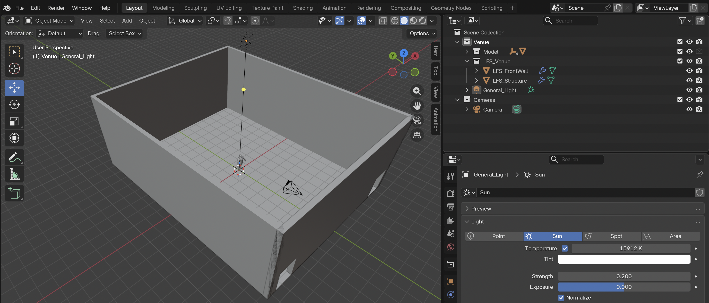
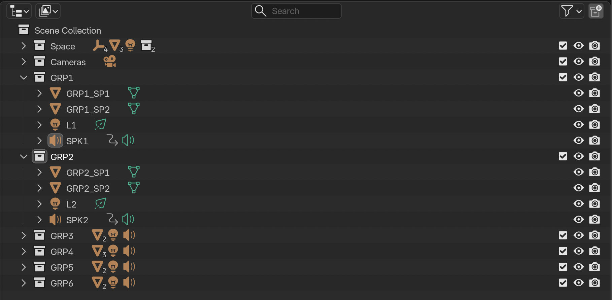

[ART 1T03](README.md)

-------------------------------------------------------------------------------

# W9 - Multi-Channel Installation Design (Light + Sound + Space)

<figure style="width: 100%; margin: auto;">
  
</figure>

## Objective

This week you will design a **multi-channel light and sound installation** for the Lyons Family Centre.      

Tutorial time may be used to begin or complete this activity depending on your tutorial day. Some work is expected outside of class.

---

## Materials Required

- Computer (laptop or desktop) + Computer mouse (recommended)
- Headphones
- Blender (free software)
- Reaper (free software)  
- 📄 [**LFS Empty-With Floor Plywood**](imgs/LFS-Floorplan.pdf){:target="_blank"}
- Paper + pen (preferred) *or* digital drawing tool

---

## Activities  
**Complete the following in order. Ask your professor or TA for help as needed.**

---

<h3 style="color: darkred;">[15 min] Installation Concept | Spatial Intentions — Start Here</h3>

Write **1-pharragraph (250-300 words / approximately half a page)** defining your installation concept.  

Your paragraph must clearly address:  

1. What kind of atmosphere are you constructing?
2. How will audiences move through the space?
3. How do sound, light, and geometric objects interact spatially?
4. How can you **define two or three distinct zones** within the installation where sound and light create different moods, intensities, or levels of intimacy?  

Be specific.    
Describe spatial relationships, not narrative meaning.    
Focus on how the environment functions as an embodied experience.  

---

<h3 style="color: darkred;">[30 min] Installation Floor Map</h3>  

You are designing an **immersive environment** in which audiences **physically navigate the space** through two to three clearly defined installation zones.  

You must produce:
- A **top-view floor map** using this 📄[**LFS Empty – With Floor Plywood**](imgs/LFS-Floorplan.pdf){:target="_blank"} template  
- A **lighting cue list for each light** (2–3 loop cues per light)
- A **perspective drawing of each object group** (1–3 groups per zone required)

Your floor map must consider:

- Electrical outlet locations (if needed)    
- Speaker placement in relation to power access   
- A clear audience circulation path    
- 2-3 defined zones  

Each zone must include:  
- **1-2 speakers** (labeled `SPK1`, `SPK2`, `SPK3`, etc.)
- **1-3 groups of objects**, each can have **2–3 geometric objects** (labeled `GRP1`, `GRP2`, `GRP3`, etc.)
- **1–2 corresponding lights** (labeled `L1`, `L2`, `L3`, etc.)   

Each light must include:  
- **2–3 looped cue states** that function as a repeating installation cycle.
- Include color, intensity, and transition per cue.     

---

#### Example  

You are **not copying** the example — you are using it as a reference for **how to clearly communicate lighting decisions and cue logic**.

   

> ⚠️ Your drawing skill is not graded.  
> You are graded on **clarity of spatial logic and use of technical vocabulary**.

---

<h3 style="color: darkred;">[40-60 min] REAPER — Multi-Channel Composition</h3>

You must create **separate sound compositions**, one per speaker.

#### Requirements

- Duration: **10-20 seconds**
- **No panning**
- Each track must function independently while contributing to a shared spatial atmosphere
- Continue using sound samples from **FREESOUND**
- You are expected to apply techniques learned in **[W7](WT-W7.md){:target="_blank"}** and **[W8](WT-W8.md){:target="_blank"}**
- Avoid duplicating the same sound across all speakers. Think in spatial zones
- Optional: You may follow the new tutorial below if you would like to record your own sounds

### Export

Export each speaker composition as a separate **WAV file**:  
- `Lastname-Firstname-W9-SPK-1.wav`
- `Lastname-Firstname-W9-SPK-2.wav`
- `Lastname-Firstname-W9-SPK-3.wav`
- `Lastname-Firstname-W9-SPK-4.wav`   

---

#### Tutorial

> You may use your laptop’s built-in microphone to record sound.  
> For higher audio quality, you are encouraged to book a USB microphone.  
> The **Snowball microphone** is available for free through the Media Equipment Rentals at the Lyons New Media Centre (Mills Library).  
> Book here: [Lyons New Media Centre: Media Rooms and Equipment](https://libcal.mcmaster.ca/equipment?lid=3267){:target="_blank"}  

  <iframe 
    src="https://www.youtube.com/embed/ijOPF7dwd7Y"
    title="YouTube video player"
    frameborder="0"
    allow="accelerometer; autoplay; clipboard-write; encrypted-media; gyroscope; picture-in-picture; web-share"
    allowfullscreen
    style="position: absolute; top: 0; left: 0; width: 100%; height: 100%;">
  </iframe>

---

<h3 style="color: darkred;">[30m] Blender — Spatial Application & Audience POV </h3>  

You will begin with this [**Blender file**](imgs/Lastname-Firstname-W9.blend), which contains a collection named **“Venue”** with the following:

1. A **simplified 3D model** representing the dimensions of the **LFS Blackbox**, with a separate front wall that can be hidden to allow easier arrangement of your objects.
2. A **human scale model**. You must use this figure to accurately apply your floor design and evaluate proportions, distances, and audience circulation.  
3. A **general ambient light** to softly illuminate the space so your renders are properly lit. You can only change the color of this light but don't modify its intensity.   

   

#### Requirements

- Position **geometric objects**, **Speaker objects**, and **lights exactly as designed in your floor map**.
- Import and assign each **WAV file** to its corresponding Speaker object.
- Animate your lights following your defined **cue logic and written instructions**.
- If needed, loop each light animation for **2–3 cycles**, resulting in approximately **30 seconds** of continuous installation playback.   

➡️ Save as:  
`Lastname-Firstname-W9.blend` 

---

### Organization

When working on your scene, you must organize it using **three types of collections**:

1. **Venue** (already included in the file)  
2. **Cameras** (already included in the file)  
3. **New Collections** named `GRP1`, `GRP2`, `GRP3`, etc.

Inside each `GRP` collection, you must include:

- All geometries (meshes) belonging to that group.  
  Naming format: `GRP1_OBJ1`, `GRP1_OBJ2`, `GRP1_OBJ3`, etc.

- All lights belonging to that group.  
  Naming format: `L1`, `L2`, `L3`, etc.

- All speakers belonging to that group.  
  Naming format: `SPK1`, `SPK2`, `SPK3`, etc.

- **Correct naming protocol:**  
  Do not use spaces in object names. Always use underscores `_` between words.

      

> ⚠️ **Important:** Your Blender file will be checked for proper organization.   
  
---

### Installation Photos

Export **3–4 still images** from Blender that clearly document your installation.

Images must include:

- A **full spatial overview** (top or angled view)  
- One **perspective view (POV)** for each zone  

The **human scale model must be visible in the scene** to communicate proportion, perspective, and spatial dimensions.      
Images should be clearly framed, well lit, and readable.   

---

### Audience POV Video

Create a **20 to 30-second video from the point of view of an audience member navigating the installation**.  

The video should simulate how someone physically walks through the space.  
This is not a cinematic study — it is an embodied navigation.  

The movement must:

- Follow your designed **audience circulation path**  
- Move clearly between **speaker zones**  
- Reveal shifts in **light intensity, colour, and spatial sound relationships**  
- Maintain **smooth and intentional transitions** (no abrupt cuts or erratic motion)  

⚠️ The **human scale model must be hidden before rendering the final video**.    

➡️ Export:  
`Lastname-Firstname-W9.mp4`  

Format:  
MP4 (H.264), 1920x1080, 24fps  

---

<h3 style="color: darkred;">Submission Documents</h3>  

Create a single PDF including the following:

#### 1. Installation Concept (250–300 words)

- **Title of the Installation**
- **Name of the Artist** (your full name)
- One paragraph clearly defining:
  - Your spatial intentions
  - Audience movement
  - Zone differentiation
  - How sound and light function across the installation

#### 2. Floor Plan + Lighting Cue List (Full Page)

- The floor plan must occupy **one full page**.
- Must include:
  - Labeled speaker locations (SPK1–SPK4)
  - Labeled light placements (L1–L6)
  - Object placements
  - Audience circulation path
  - Clearly defined zones
- Include a **lighting cue list for each light** (2–3 looped cues per light).
- The floor plan and cue lists must be clean, readable, and clearly labeled.

#### 3. Installation Photos

- Include **3–4 rendered images** from Blender.
- Each image must occupy **at least 1/3 of a page**.
- Each image must include a **one-sentence description** explaining what it showcases (e.g., zone focus, audience perspective, spatial overview).
- The human scale model must be visible in these images to demonstrate proportion and perspective.

#### 4. Sound Sample Credits

For each sound sample used, include:

- Title
- Creator
- Source link
- License information  

➡️ Export as PDF  
`Lastname-Firstname-W9.pdf`  

---

| Component              | File Name                         |
|------------------------|-----------------------------------|
| Project document (PDF) | `Lastname-Firstname-W9.pdf`       |
| Blender File           | `Lastname-Firstname-W9.blend`     |
| Video file             | `Lastname-Firstname-W9.mp4`       |

> ⚠️ **Follow submission protocols carefully. Incorrect submissions may result in lost points.**

---

## Assessment

### Spatial Installation Design
Clear organization of two to three distinct zones, with intentional placement of speakers, geometric objects, lights, and audience circulation within the Blackbox layout.

### Multi-Channel Sound Logic
Separate sound compositions per speaker function independently while contributing to a cohesive spatial atmosphere. Clear zone differentiation.

### Light Loop Design
Each light includes 2–3 clearly defined looped cue states (colour, intensity, transition) aligned with the 30-second installation cycle.

### 3D Spatial Implementation
The OBJ model is used correctly. The human scale model demonstrates proportion in photos and is hidden in the POV render. The 3D layout matches the floor plan.

### Audience Experience
The POV video follows the defined circulation path with smooth, intentional movement and perceptible shifts in spatial sound and lighting.

### Documentation & Technical Accuracy
Full-page floor plan with cue lists, labeled elements, required photos with descriptions, proper file naming, and complete sound sample credits.  

---
