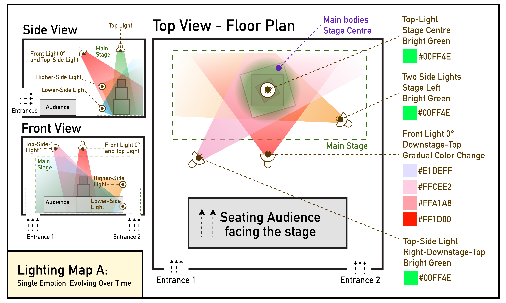

[ART 1T03](README.md)

-------------------------------------------------------------------------------

# W9 - Multi-Channel Installation Design (Light + Sound + Space)

## Objective

This week you will design a **multi-channel light and sound installation** for the Blackbox space.  

Tutorial time may be used to begin or complete this activity depending on your tutorial day. Some work is expected outside of class.

---

## Materials Required

- Computer (laptop or desktop) + Computer mouse (recommended)
- Headphones
- Blender (free software)
- Reaper (free software)  
- Paper + pen (preferred) *or* digital drawing tool

---

## Activities  
**Complete the following in order. Ask your professor or TA for help as needed.**

---

<h3 style="color: darkred;">[15 min] Installation Concept | Spatial Intentions — Start Here</h3>

Write **7–10 sentences** defining your installation concept.

Address:

1. What kind of atmosphere are you constructing?
2. How do audiences move through the space?
3. Where are moments of intimacy, intensity, or distance?
4. How do sound, light, and objects interact spatially?
5. What changes as audiences walk between speaker zones?

---

<h3 style="color: darkred;">[30 min] Installation Floor Map</h3>  

You are designing an **immersive environment** where audiences **navigate the space**.

You must only do the top view. This time, you must think about the electrical outlets too that will feel the speakers. You will use LFS's floor desing? map? just the architectural drawing. 

They should define the animation of the lights, but think of them as in a loop/installation, running in a loop like the audio. The animation / cues of this loop should be design, 2-3 cues per light. each speaker should include their own object (1 or 2), plus their corresponding light (1-2)

Your installation must include:

- **3–4 speakers**
- **4–6 lights**
- **3–6 geometric objects**
- A clearly defined **audience navigation path**

Objects must be **geometric forms only** (cube, sphere, cone, cylinder, plane, etc.).  

Hand-drawn (preferred) or digital.

---

#### Example  
You are **not copying** the example — you are using it as a reference for **how to clearly communicate lighting decisions and cue logic**.

   

> ⚠️ Your drawing skill is not graded.  
> You are graded on **clarity of lighting logic, use of vocabulary, and ability to communicate cues clearly**.

---

<h3 style="color: darkred;">[40-60 min] REAPER — Multi-Channel Mono Composition</h3>

You must create **3–4 separate sound compositions**, one per speaker.

#### Requirements

- Time: 30s
- No Panning
- Each track must function independently but contribute to a shared atmosphere
- Tracks may:
  - Overlap
  - Activate sequentially
  - Create spatial contrast
  - Create directional tension
 - Follow the tutorial to exporrt separate tracks instead of a single stereo sound

Avoid duplicating the same sound across all speakers. Think in zones.  

When finished:
1. **Save your REAPER project file**  
   📄 **Filename:** `Lastname-Firstname-W9.rpp`  
2. **Export your final compositions as a WAV file**  
   📄 **Filenames:**
   - `Lastname-Firstname-W9-SPK1.wav`
   - `Lastname-Firstname-W9-SPK2.wav`
   - `Lastname-Firstname-W9-SPK3.wav`
   - `Lastname-Firstname-W9-SPK4.wav`

---

<h3 style="color: darkred;">[30m] Blender — Camera animation </h3>  

Once your sound and lighting cues are fully synchronized, animate the camera.

The camera is an **omniscient observer** moving through the space. Design a clear progression that responds to:

- Spatial sound shifts (left/right dominance, intensity, depth)
- Lighting cue transitions
- Emotional build across the 30-second structure

Your movement must feel intentional. Avoid random motion. Consider:

- When does the camera move?
- When does it pause?
- Does it push in, orbit, rise, or track laterally?
- What triggers each shift in position?

Keep the total duration at **30 seconds**.

Save your updated Blender file as:  
`Lastname-Firstname-W9.blend`

➡️ **Export Video as MP4, codec H.264**   
📄 **Filename:** `Lastname-Firstname-W9.mp4`

> ⚠️ Videos must be **final renders**, not viewport screen recordings.  

---

<h3 style="color: darkred;">[30 min] Add Camera and Sonic Cues </h3>

Return to your **updated Lighting Cue List** and expand it to include: 
- **Sonic Cue** (speaker dominance, panning, volume shift, new layer entry, fade, silence)
- **Camera Cue** (movement type, direction, duration, pause, speed)

Your cue list must now function as a complete technical document describing the synchronization of **Light + Sound + Camera** across the full 30-second timeline.  

Update representative images so they reflect the final cinematic version of your scene.  

---

<h3 style="color: darkred;">Submission Documents</h3>

Create a single PDF that includes:

- **4–5 sentence sonic + cinematic intention description**  
  Briefly explain how your camera progression responds to spatial sound and lighting cues across the 30-second timeline.

- **List of sound samples used**  
  Include for each sample:
  - Title  
  - Creator  
  - Source link  
  - License information  

- **Updated Cue List (Light + Sound + Camera)**  
  Include your full cue document with:
  - Lighting cues (with representative images)
  - Sonic cues
  - Camera cues  
  Each cue should include start/end times and clear change descriptions.

➡️ **Export as PDF**  
📄 **Filename:** `Lastname-Firstname-W9.pdf`

---

| Component              | File Name                         |
|------------------------|-----------------------------------|
| Project document (PDF) | `Lastname-Firstname-W9.pdf`       |
| Video file             | `Lastname-Firstname-W9.mp4`       |

> ⚠️ **Follow submission protocols carefully. Incorrect submissions may result in lost points.**

---

## Assessment

Your work will be assessed based on:

- **Clarity of Cinematic Intentions (PDF)**  
  The written description clearly explains how the omniscient camera progression responds to spatial sound and lighting cues across the 30-second structure.

- **Integration of Light, Sound, and Camera (Video)**  
  Lighting cues (5–7 maximum), stereo sound shifts, and camera movement are intentionally synchronized. The camera movement is motivated by sonic and lighting transitions rather than arbitrary motion.

- **Camera Progression & Spatial Awareness (Video)**  
  The camera demonstrates a clear and coherent progression through the space, with purposeful changes in distance, framing, height, or direction that transform perception.

- **Cue Documentation Accuracy (PDF)**  
  The updated cue list clearly documents lighting, sonic, and camera cues with accurate timing, descriptions, and representative images that correspond to the final rendered video.

- **Technical Execution & Submission Compliance**  
  The final video maintains a 30-second duration, follows export specifications (MP4, H.264), and matches the documented cue structure. Files follow the required naming protocol.

---
