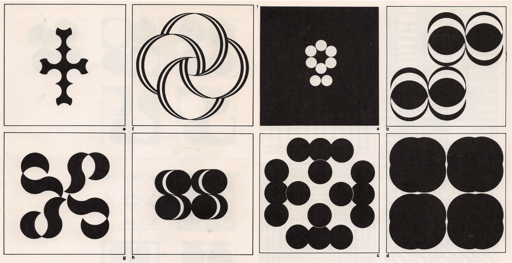
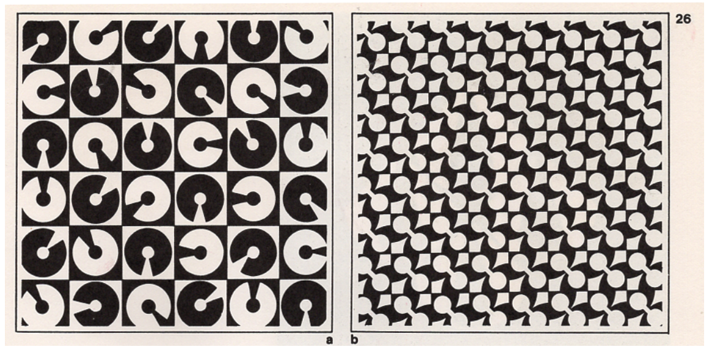

# Composition Techniques I – Part 1

<figure style="width: 80vw; margin: auto;">
  
  <figcaption style="text-align: center; font-style: italic; margin-top: 0.5em;">
    Your caption goes here.
  </figcaption>
</figure>

## Objective
Create **four digital compositions**, each visualizing one of the following **Interrelationships of Form**:  
1. Detached  
2. Touching  
3. Overlapped  
4. Interpenetration

In each composition, incorporate **Wucius Wong’s Principles of Two-Dimensional Design**—**Form, Repetition, Structure, Similarity, and Gradation**—to explore and highlight the visual characteristics of each interrelationship.  

Each composition must demonstrate a **thoughtful and cohesive integration** of form relationships and design principles.

---

## Design Restrictions
- Use **geometric shapes only**  
- Designs must be in **black and white**  
- Software: **Adobe Illustrator** (vector-based)

---

## Activities
**Complete the following activities in order. Ask your professor for help as needed.**

### [15–20 min] Sketching
You may sketch using a **digital or physical notebook**.  
According to Wikipedia, a sketch is “a rapidly executed freehand drawing that is not usually intended as a finished work.”

#### Super-Units
- Create **four sketches** using simple geometric shapes in black and white, each representing one of the Interrelationships of Form listed above.
- Focus on **visual experimentation** and form exploration.
- Examples:

#### Grids

- Create a **1:1 (square)** grid for each composition. Choose from the following grids:

- In each grid, emphasize one of the following Wong principles:
  1. Repetition
  2. Structure
  3. Similarity
  4. Gradation
- Grids may be **Inactive, Active, Visible**, or **Repetition-based**.

- Take your time—**this step is foundational** to a strong composition.

📥 **First Submission:** Upload a scan or photo of your **sketches** (Super-Units + Grids) to **Avenue to Learn**.

---

### 💻 [1h–1h30m] Working in Adobe Illustrator

#### Document Setup (Required)
> ⚠️ **You must follow the file setup instructions exactly to avoid losing points.**

Create **one separate file per composition**.

**Settings:**
- **Units:** Pixels  
- **Size:** 1000 × 1000 px (1:1 aspect ratio)  
- **Color Mode:** RGB  
- **Raster Effects:** High (300 PPI)  
- **Naming Protocol:** `lastname-firstname-composition-#.ai`

#### Create Your Grids
- Use your sketched grids as a reference.
- Place grid elements in the **"Grid" or "Guides" layer**.

#### Create Your Super-Units
- Use your sketches as guides.
- Follow the tutorial on visualizing **Interrelationships of Form** in Illustrator.
- Place the main shapes in the **"Composition" layer**.

#### Build Your Compositions
- Combine your Super-Units with the appropriate grid structure.
- Each design must clearly integrate both a **relationship of form** and a **principle of design**.

---

## Export and Save Files

### Final Submission Files:
1. A **single PDF file** that includes your **sketches** (Super-Units and Grids)  
   - **Naming:** `lastname-firstname-sketches.pdf`

2. **Four separate PDF files**, one for each **digital composition**  
   - **Naming:** `lastname-firstname-composition-1.pdf`, etc.

> 📌 **Failure to follow document setup or naming instructions may result in a grade deduction.**
