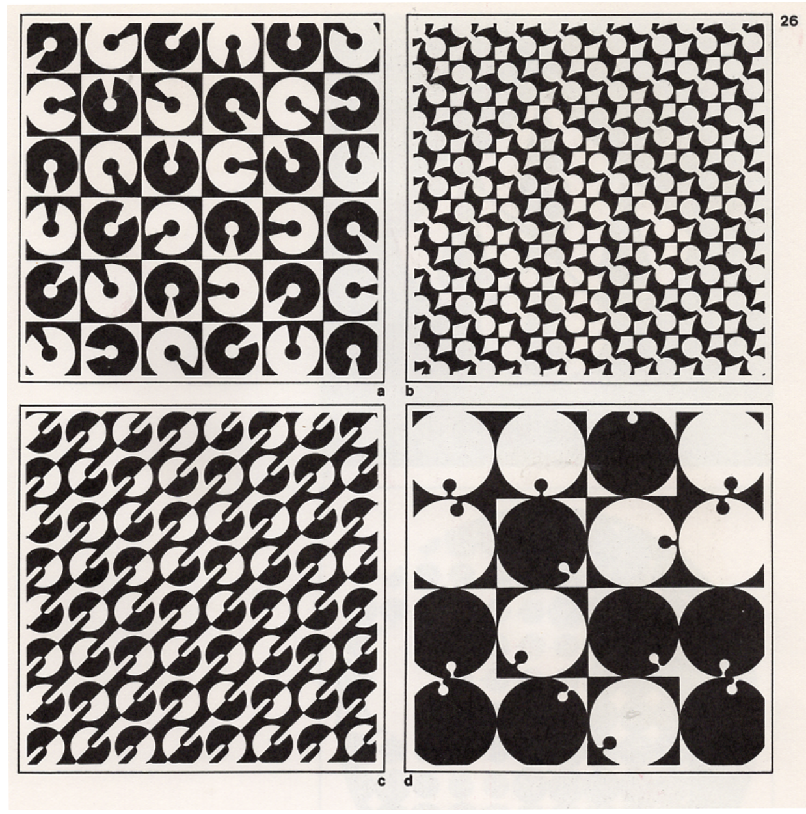
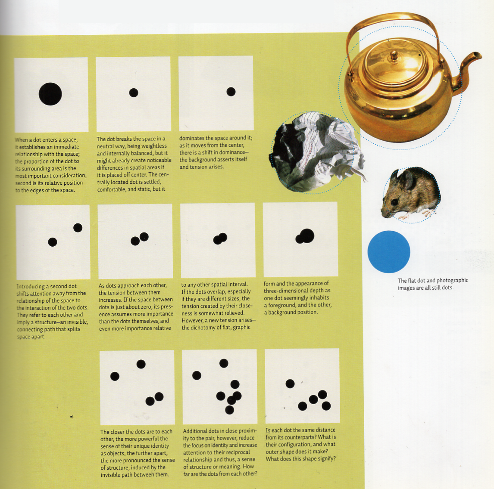
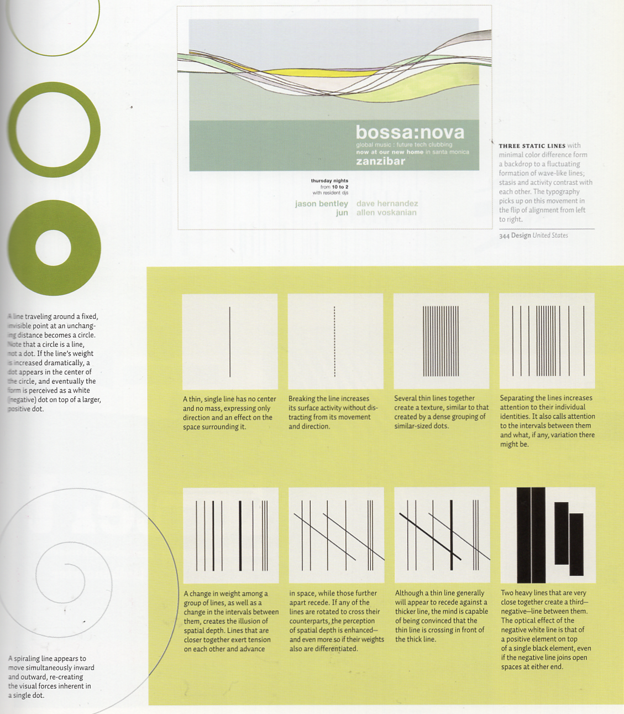
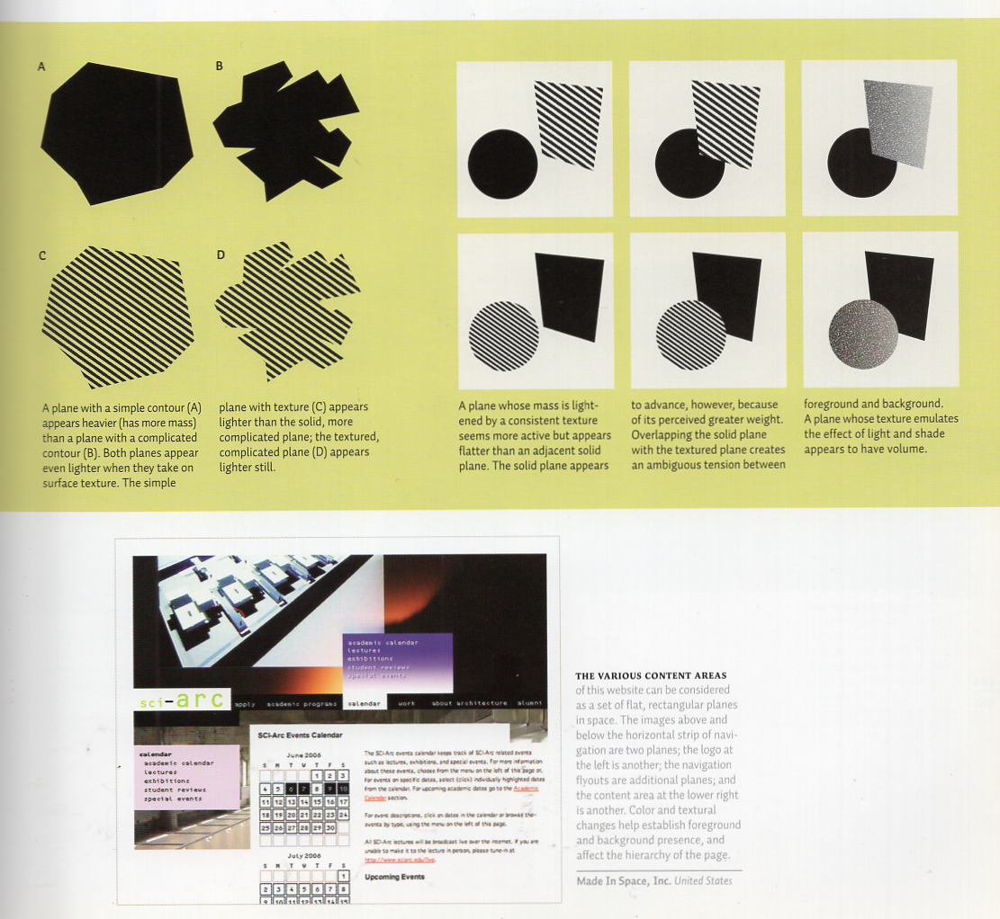

[MEDIAART 2DF3](README.md)

# Composition Techniques I – Part 1

**Goal:** Design and create **three black-and-white vector compositions** by building, repeating, and systematically altering a super-unit.

Each composition must combine:

- **One assigned Interrelationship of Form**
- **One assigned principle from Wucius Wong**
- **One spatial focus adapted from Timothy Samara’s “Form and Space”**
- **One repetition grid and one grid structure**
- **One super-unit repeated and altered across the complete composition**

## Activity overview

- **Outputs:** Three planning sketches and three digital compositions
- **Interrelationships:** Touching, Overlapped, and Interpenetration
- **Wong principles:** Repetition, Structure, Similarity, and Gradation
- **Samara focuses:** Dot, Line, and Plane & Mass
- **Grid structures:** Inactive, Active, Visible, and Repetition-based
- **Shapes:** Geometric shapes only
- **Colour:** Black and white only
- **Software:** Adobe Illustrator

## Activity stages

Complete the following stages in order.

<!-- SECTION 1 -->

  

    1. Review the concepts
    
      Review the interrelationships of form, super-units, grids, and spatial strategies before planning.
    
  

## Principles of Two-Dimensional Design

### Interrelationships of Form

Each composition begins with a super-unit that clearly demonstrates one assigned relationship:

- **Detached:** The forms remain separate.
- **Touching:** The forms meet at an edge or point without overlapping.
- **Overlapped:** One form appears in front of another.
- **Interpenetration:** Overlapping forms remain visible through each other, producing shared internal areas.

### Super-unit versus composition

A **super-unit** is a small structure created by combining two or more shapes through an Interrelationship of Form.

The final composition must develop that starting structure into a larger visual system:

1. Create one clearly resolved super-unit.
2. Repeat the super-unit at least eight times.
3. Alter the repeated instances in a controlled way.
4. Organize the instances through the assigned grid and principle.

The relationship inside the original super-unit must remain identifiable after the instances are altered.

### Other Principles

  <!-- Repetition -->
  <figure class="gestalt-principle-card">
    

    <figcaption>
      <h3>Repetition</h3>
      

        Repetition occurs when the same visual element is used more than once. Repeated shapes, lines, or forms create consistency, rhythm, and structure across the composition.
      

    </figcaption>
  </figure>

  <!-- Structure -->
  <figure class="gestalt-principle-card">
    

    <figcaption>
      <h3>Structure</h3>
      

        Structure is the underlying system that organizes forms within a composition. It controls their placement, alignment, spacing, and relationships through a grid or other consistent framework.
      

    </figcaption>
  </figure>

  <!-- Similarity -->
  <figure class="gestalt-principle-card">
    

    <figcaption>
      <h3>Similarity</h3>
      

        Similarity occurs when forms share common characteristics, such as shape, size, direction, or texture. These shared features make the elements appear related, even when they are not identical.
      

    </figcaption>
  </figure>

  <!-- Gradation -->
  <figure class="gestalt-principle-card">
    

    <figcaption>
      <h3>Gradation</h3>
      

        Gradation occurs when visual elements change gradually. These changes may involve size, direction, position, shape, or spacing, creating progression, movement, and visual transition.
      

    </figcaption>
  </figure>

> **Source:** Wong, W. (1972). “Principles of Two Deimensional Design”. Van Nostrand Reinhold Company.

## Form and Space

The activity also applies three categories of form from Timothy Samara’s chapter **“Seeing Form and Space.”**

  <!-- Dot -->
  <figure class="gestalt-principle-card">
    

    <figcaption>
      <h3>Dot</h3>
      

        A dot creates a concentrated point of attention within a space. Its size, position, and proximity to other forms affect its visual dominance, grouping, tension, and relationship to the surrounding format.
      

    </figcaption>
  </figure>

  <!-- Line -->
  <figure class="gestalt-principle-card">
    

    <figcaption>
      <h3>Line</h3>
      

        A line creates connection, direction, and movement. It can link points, divide or contain space, and establish rhythm through changes in length, weight, direction, spacing, and repetition.
      

    </figcaption>
  </figure>

  <!-- Plane and Mass -->
  <figure class="gestalt-principle-card">
    

    <figcaption>
      <h3>Plane & Mass</h3>
      

        A plane is a larger form defined by its outer contour. Its scale, shape, texture, value, and relationship to the surrounding space determine whether it appears flat, becomes a dominant visual mass, or creates the impression of depth and volume.
      

    </figcaption>
  </figure>

> **Source:** Samara, T. (2007). “Seeing Form and Space: Categories of Form.” In *Design Elements: A Graphic Style Manual* (pp. 45–53). Rockport Publishers.

<!-- SECTION 2 -->

  

    2. Plan and sketch the three compositions
    
      Design each super-unit, select a different repetition grid and grid structure, and plan how the unit will be repeated and altered.
    
  

Create **one planning page for each composition**.

## Select the repetition grids and grid structures

Choose **one different repetition grid and grid structure for each composition**. Do not repeat the selections.

### Repetition Grid

### Grid Structures

Select the grid and structure that best supports:

- The assigned Interrelationship of Form
- The assigned Wong principle
- The assigned Samara form category
- The organization of the repeated and altered super-units

---

## Composition 1

| Interrelationship of Form | Wong principle | Samara form category |
|---|---|---|
| **Touching** | **Repetition** | **Dot** |

Create a super-unit from point-like geometric forms that touch at an edge or point. A point does not need to be a circle; other geometric shapes can also function as points when used as small, concentrated visual elements.

On the planning page:

1. Draw the super-unit applying the **Touching** relationship of form.
2. Label how the forms apply Samara’s concept of **Dot**.
3. Sketch at least eight repeated instances organized into the selected **repetition grid**.
4. Maintain Repetition while introducing **one controlled variation or alteration**, such as scale, contour, proportion, placement, overlap, cropping, or positive–negative reversal.
5. Show the boundaries and negative space by applying the selected **grid structure**. 

---

## Composition 2

| Interrelationship of Form | Wong principle | Samara form category |
|---|---|---|
| **Overlapped** | **Similarity** | **Plane and Mass** |

Create a super-unit from planar geometric forms that overlap and establish visible spatial relationships. Consider the visual mass of the planes, and use variations in scale, proportion, contour, or overlap to create different visual weights.

On the planning page:

1. Draw the super-unit applying the **Overlaping** relationship of form.
2. Label how the forms apply Samara’s concept of **Plane and Mass**.
3. Sketch at least eight repeated instances organized into the selected **repetition grid** (different from Composition 1).
4. Maintain Similarity while introducing **one-two controlled variations or alterations**, such as scale, contour, proportion, placement, overlap, cropping, or positive–negative reversal.
5. Show the boundaries and negative space by applying the selected **grid structure** (different from Composition 1). 

---

## Composition 3

| Interrelationship of Form | Wong principle | Samara form category |
|---|---|---|
| **Interpenetration** | **Gradation** | **Line** |

Create an interpenetrating super-unit that emphasizes linear direction and connection. A line does not need to be straight, vertical, or horizontal; you may vary its direction, break or interrupt it, and change its thickness to create movement and visual variation.  

On the planning page:

1. Draw the super-unit applying the **Interpenetration** relationship of form.
2. Label how the forms apply Samara’s concept of **Line**.
3. Sketch at least eight repeated instances organized into the selected **repetition grid** (different from Composition 1 and 2).
4. Introduce **two-three controlled variations or alterations**, such as scale, contour, proportion, placement, overlap, cropping, concentration, or positive–negative reversal.
5. Show the boundaries and negative space by applying the selected **grid structure** (different from Composition 1 and 2). 

---

## General sketch requirements

Each planning page must show:

- The original super-unit
- The assigned Interrelationship of Form
- The assigned Wong principle
- The assigned Samara form category
- One unique grid arragement
- One unique grid structure
- At least eight repeated instances
- Controlled alterations
- Notes or arrows explaining the planned changes

Combine the three planning pages into one PDF:

- **Filename:** `Lastname-Firstname-CompTech1-Part1-Sketches.pdf`

Ask the instructor for feedback before creating the final digital compositions.

<!-- SECTION 3 -->

  

    3. Set up and build the three compositions
    
      Create the Illustrator files, build each grid and super-unit, then repeat and alter the units across the complete format.
    
  

Create one separate Adobe Illustrator file for each composition.

## Set up the Illustrator files

Use the following settings:

- **Units:** Pixels
- **Size:** 1000 × 1000 px
- **Aspect ratio:** 1:1
- **Bleed:** 10 px on all sides
- **Colour mode:** RGB
- **Raster effects:** High, 300 PPI

Create and name these layers:

1. **Guides** — grid, margins, and construction lines
2. **Composition** — super-units and final vector forms
3. **Background** — black or white background field

Use these working filenames:

- `Lastname-Firstname-CompTech1-Part1-1.ai`
- `Lastname-Firstname-CompTech1-Part1-2.ai`
- `Lastname-Firstname-CompTech1-Part1-3.ai`

### Illustrator document setup

> **Required tutorial:** Follow this tutorial step by step. It includes the required document settings, **margin guides**, bleed, colour mode, raster-effects resolution, and layer setup. Skipping steps or using different settings may result in lost marks.

<iframe src="https://www.iorad.com/player/2588082/Adobe-Illustrator--Document-Setup-?src=iframe&oembed=1" width="100%" height="500px" style="width: 100%; height: 500px; border-bottom: 1px solid #ccc;" referrerpolicy="strict-origin-when-cross-origin" frameborder="0" webkitallowfullscreen="webkitallowfullscreen" mozallowfullscreen="mozallowfullscreen" allowfullscreen="allowfullscreen" allow="camera; microphone; clipboard-write;" sandbox="allow-scripts allow-forms allow-same-origin allow-presentation allow-downloads allow-modals allow-popups allow-popups-to-escape-sandbox allow-top-navigation allow-top-navigation-by-user-activation"></iframe>

### Basic Illustrator tools

<iframe src="https://www.iorad.com/player/2496027/Basic-tools-and-behaviours-in-Adobe-Illustrator?src=iframe&oembed=1" width="100%" height="500px" style="width: 100%; height: 500px; border-bottom: 1px solid #ccc;" referrerpolicy="strict-origin-when-cross-origin" frameborder="0" webkitallowfullscreen="webkitallowfullscreen" mozallowfullscreen="mozallowfullscreen" allowfullscreen="allowfullscreen" allow="camera; microphone; clipboard-write;" sandbox="allow-scripts allow-forms allow-same-origin allow-presentation allow-downloads allow-modals allow-popups allow-popups-to-escape-sandbox allow-top-navigation allow-top-navigation-by-user-activation"></iframe>

## Create the grids

Recreate the selected grid for each composition in the **Guides** layer.

Use a different grid structure for each file. The grid should organize the placement, alignment, spacing, and movement of the repeated super-units.

A grid may remain visible only when its visible structure is an intentional part of the final composition.

> Although grids begin as drawn lines, **all grids**—unless they are intentionally visible—**must be converted into guides**. This ensures that the grid remains available in Illustrator but does not appear when the document is printed or viewed outside Illustrator.

<iframe src="https://www.iorad.com/player/2496032/Creating-grids-in-Adobe-Illustrator?src=iframe&oembed=1" width="100%" height="500px" style="width: 100%; height: 500px; border-bottom: 1px solid #ccc;" referrerpolicy="strict-origin-when-cross-origin" frameborder="0" webkitallowfullscreen="webkitallowfullscreen" mozallowfullscreen="mozallowfullscreen" allowfullscreen="allowfullscreen" allow="camera; microphone; clipboard-write;" sandbox="allow-scripts allow-forms allow-same-origin allow-presentation allow-downloads allow-modals allow-popups allow-popups-to-escape-sandbox allow-top-navigation allow-top-navigation-by-user-activation"></iframe>

## Create the original super-units

Use geometric shapes to create the assigned Interrelationship of Form and Samara form category:

- **Composition 1:** Touching + Dot
- **Composition 2:** Overlapped + Plane and Mass
- **Composition 3:** Interpenetration + Line

Place the original super-unit in the **Composition** layer.

Before repeating it, confirm that:

- The assigned Interrelationship of Form is clearly visible.
- The assigned Samara category shapes the construction of the super-unit itself.
- The super-unit is visually resolved and can support controlled variation.

<iframe src="https://www.iorad.com/player/2496022/Interrelationships-of-Form-in-Adobe-Illustrator-1?src=iframe&oembed=1" width="100%" height="500px" style="width: 100%; height: 500px; border-bottom: 1px solid #ccc;" referrerpolicy="strict-origin-when-cross-origin" frameborder="0" webkitallowfullscreen="webkitallowfullscreen" mozallowfullscreen="mozallowfullscreen" allowfullscreen="allowfullscreen" allow="camera; microphone; clipboard-write;" sandbox="allow-scripts allow-forms allow-same-origin allow-presentation allow-downloads allow-modals allow-popups allow-popups-to-escape-sandbox allow-top-navigation allow-top-navigation-by-user-activation"></iframe>

## Develop the complete compositions

For each file:

1. Repeat the super-unit at least eight times.
2. Alter the repeated instances through controlled variables.
   - **Composition 1:** one controlled variable
   - **Composition 2:** one-two controlled variables
   - **Composition 3:** two-three controlled variables
3. Use the selected repetition grid to organize your composition.
4. Use the assigned Wong principle across the complete composition:
   - **Composition 1:** Repetition
   - **Composition 2:** Similarity
   - **Composition 3:** Gradation
7. Maintain the defining qualities of Dot, Plane and Mass, or Line as the super-unit is repeated and altered.
8. Consider the relationship between the composition and the square format, including edges, cropping, margins, placement, and negative space.
9. Refine the visual balance with your eyes rather than relying only on mathematical alignment.

> The repeated instances must operate as a complete composition. A single super-unit, a row of identical copies, or copies placed without a clear visual system will not meet the activity requirements.

<!-- SECTION 4 -->

  

    4. Review & Export Part 1
    
      Check the compositions, layers, guides, margins, and editable PDF settings before exporting and submitting Part 1.
    
  

## Before submitting

> Your PDF files will be opened in Adobe Illustrator to review the document setup, layers, guides, margins, and construction of the compositions.

### Check the Illustrator document structure

For each composition, confirm that the file contains the required layers:

1. **Guides**
   - Contains the selected grid structure
   - Contains the margin guides created during the document setup
   - Contains only guides and construction elements

2. **Composition**
   - Contains the original super-unit
   - Contains all repeated and altered instances
   - Contains the final black-and-white vector composition

3. **Background**
   - Contains only the black or white background field

> Do not leave artwork on the wrong layer or create unnecessary unnamed layers. **You may create sub-collections (or groups inside layers)** for better organization. 

### Check the guides and margins

Before saving the PDF:

- Convert the grid structure into Illustrator guides.
- Keep the grid and margin guides inside the **Guides** layer.
- Confirm that **View → Guides → Show Guides** is active.
- Keep the **Guides** layer visible when saving the file.
- Confirm that the original margin guides from the document setup remain present.
- Confirm that the grid and margins align correctly with the artboard.
- Do not expand, delete, rasterize, or merge the guides with the composition.

> Guides should be visible when the PDF is opened in Illustrator, but they will not appear as part of the printed or exported artwork.

### Save the editable PDF

Use **File → Save As → Adobe PDF**.

In the Adobe PDF settings, select:

- **Preserve Illustrator Editing Capabilities**

> This setting is required so that the layers, guides, editable vector objects, artboard, and document structure remain available when the PDF is reopened in Illustrator.

### Final file check

Open each submitted PDF twice:

<fieldset class="equipment-checklist">
  <legend>Final PDF checklist</legend>

  <label class="checklist-item">
    <input type="checkbox">
    
      <strong>Check the PDF in a PDF viewer.</strong>
      Confirm that the final composition displays correctly and that no guides or construction elements appear in the exported artwork.
    
  </label>

  <label class="checklist-item">
    <input type="checkbox">
    
      <strong>Check the PDF in Adobe Illustrator.</strong>
      Confirm that the file opens correctly and remains editable.
    
  </label>

  <label class="checklist-item">
    <input type="checkbox">
    
      <strong>Check the layers.</strong>
      Confirm that the required layers remain separate, correctly named, and contain the correct material.
    
  </label>

  <label class="checklist-item">
    <input type="checkbox">
    
      <strong>Check the grid.</strong>
      Confirm that the grid has been converted into guides unless it is intentionally part of the visible composition.
    
  </label>

  <label class="checklist-item">
    <input type="checkbox">
    
      <strong>Check the guides and margins.</strong>
      Confirm that the grid guides and original margin guides remain available and visible in Illustrator.
    
  </label>

  <label class="checklist-item">
    <input type="checkbox">
    
      <strong>Check editability.</strong>
      Confirm that all required vector objects remain editable and have not been flattened or rasterized.
    
  </label>

  <label class="checklist-item">
    <input type="checkbox">
    
      <strong>Check the document settings.</strong>
      Confirm that the artboard size and bleed remain correct.
    
  </label>

  <label class="checklist-item">
    <input type="checkbox">
    
      <strong>Check the filename.</strong>
      Confirm that the filename follows the required naming structure exactly.
    
  </label>

</fieldset>

---

## Submission files

| Item | Required filename |
|---|---|
| Sketches PDF | `Lastname-Firstname-CompTech1-Part1-Sketches.pdf` |
| Composition 1 PDF | `Lastname-Firstname-CompTech1-Part1-1.pdf` |
| Composition 2 PDF | `Lastname-Firstname-CompTech1-Part1-2.pdf` |
| Composition 3 PDF | `Lastname-Firstname-CompTech1-Part1-3.pdf` |

Incorrect filenames and file extensions, missing layers, deleted margins, grids that have not been converted into guides, flattened or non-editable PDFs, incomplete repetition, or compositions based on only one isolated super-unit will affect the grade.

---

Credits: Jessica A. Rodríguez
