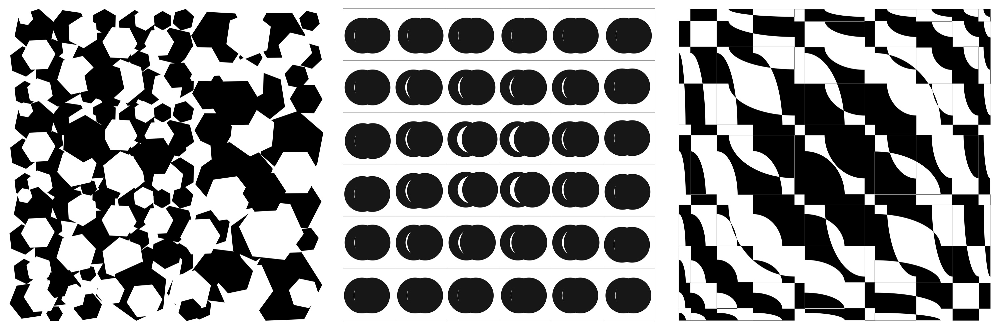
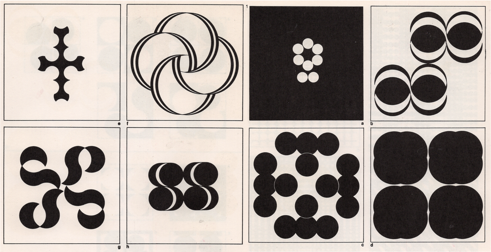
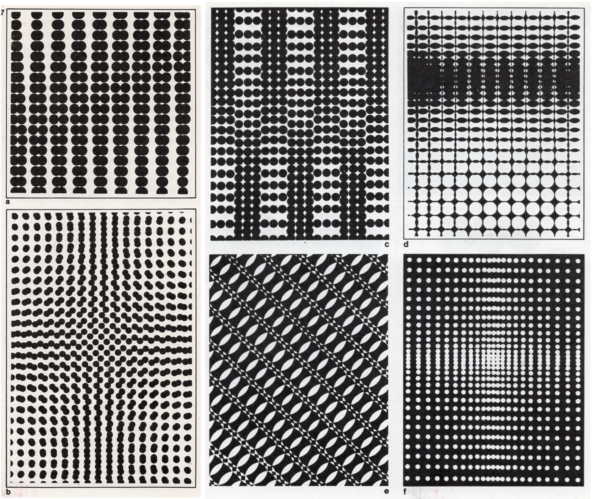
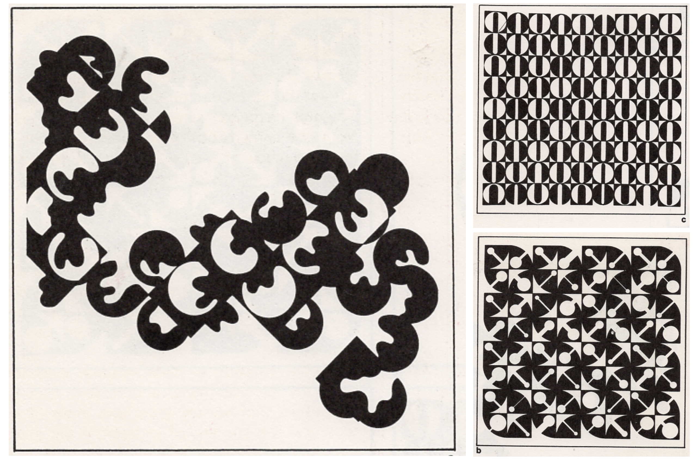
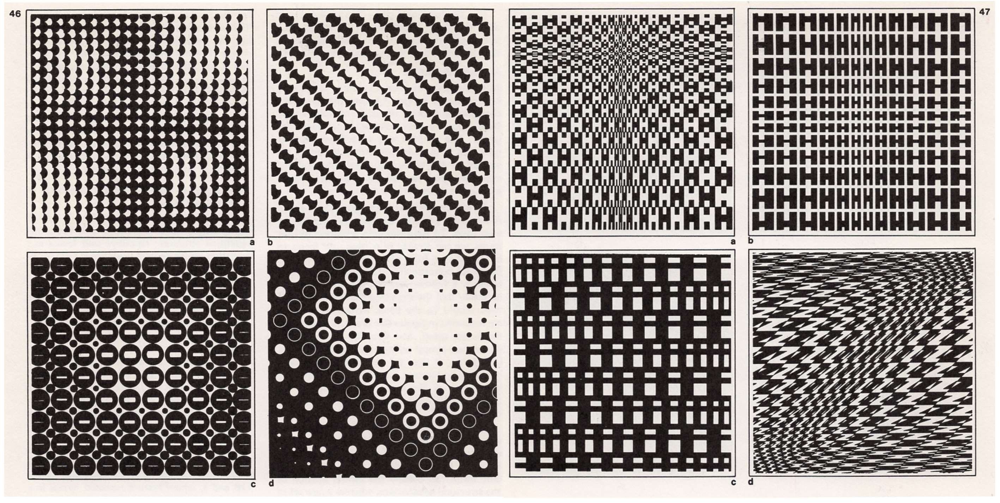
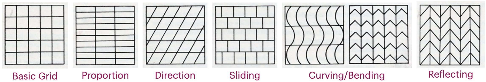
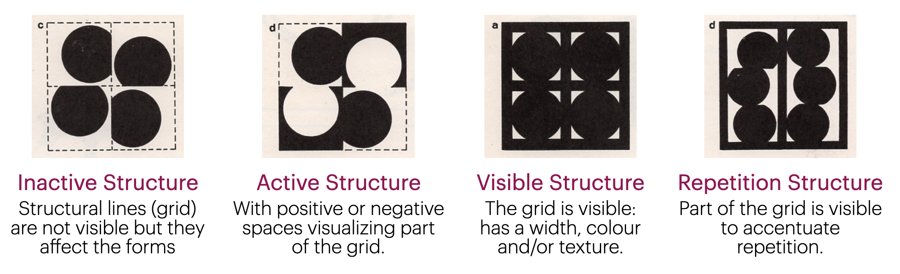
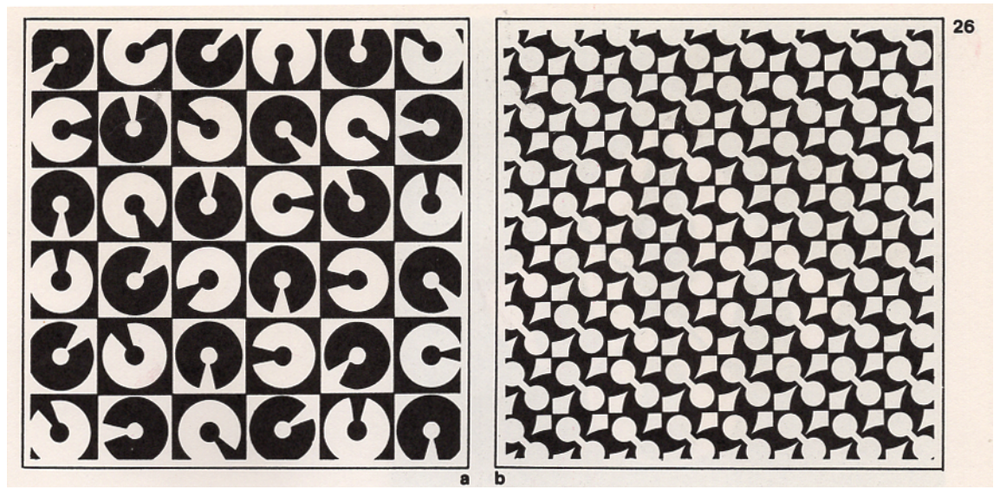

[MEDIAART 2DF3](README.md)

# Composition Techniques I – Part 1

**Goal:** Design and create **three black-and-white vector compositions** by building, repeating, and systematically altering a super-unit.

Each composition must combine:

- **One assigned Interrelationship of Form**
- **One assigned principle from Wucius Wong**
- **One spatial focus adapted from Timothy Samara’s “Form and Space”**
- **One grid structure**
- **One super-unit repeated and altered across the complete composition**

## Activity overview

- **Outputs:** Three planning sketches and three digital compositions
- **Interrelationships:** Detached, Touching, Overlapped, and Interpenetration
- **Wong principles:** Repetition, Structure, Similarity, and Gradation
- **Samara focuses:** Interval and tension, Figure/Ground, Depth and hierarchy, and Movement and direction
- **Grid structures:** Inactive, Active, Visible, and Repetition-based
- **Shapes:** Geometric shapes only
- **Colour:** Black and white only
- **Software:** Adobe Illustrator

## Activity stages

Complete the following stages in order.

<!-- SECTION 1 -->

  

    1. Review the concepts
    
      Review the interrelationships of form, super-units, grids, and spatial strategies before planning.
    
  

## Interrelationships of Form

Each composition begins with a super-unit that clearly demonstrates one assigned relationship:

- **Detached:** The forms remain separate.
- **Touching:** The forms meet at an edge or point without overlapping.
- **Overlapped:** One form appears in front of another.
- **Interpenetration:** Overlapping forms remain visible through each other, producing shared internal areas.

## Super-unit versus composition

A **super-unit** is a small structure created by combining two or more shapes through an Interrelationship of Form.

The final composition must develop that starting structure into a larger visual system:

1. Create one clearly resolved super-unit.
2. Repeat the super-unit at least eight times.
3. Alter the repeated instances in a controlled way.
4. Organize the instances through the assigned grid and principle.
5. Use the complete square format, including its edges and negative spaces.

The relationship inside the original super-unit must remain identifiable after the instances are altered.

## Principles of Two-Dimensional Design

  <!-- Repetition -->
  <figure class="gestalt-principle-card">
    

    <figcaption>
      <h3>Repetition</h3>
      

        Repetition occurs when the same visual element is used more than once. Repeated shapes, lines, or forms create consistency, rhythm, and structure across the composition.
      

    </figcaption>
  </figure>

  <!-- Structure -->
  <figure class="gestalt-principle-card">
    

    <figcaption>
      <h3>Structure</h3>
      

        Structure is the underlying system that organizes forms within a composition. It controls their placement, alignment, spacing, and relationships through a grid or other consistent framework.
      

    </figcaption>
  </figure>

  <!-- Similarity -->
  <figure class="gestalt-principle-card">
    

    <figcaption>
      <h3>Similarity</h3>
      

        Similarity occurs when forms share common characteristics, such as shape, size, direction, or texture. These shared features make the elements appear related, even when they are not identical.
      

    </figcaption>
  </figure>

  <!-- Gradation -->
  <figure class="gestalt-principle-card">
    

    <figcaption>
      <h3>Gradation</h3>
      

        Gradation occurs when visual elements change gradually. These changes may involve size, direction, position, shape, or spacing, creating progression, movement, and visual transition.
      

    </figcaption>
  </figure>

> **Source:** Wong, W. (1972). “Principles of Two Deimensional Design”. Van Nostrand Reinhold Company.

## Form and space

The activity also applies concepts adapted from Timothy Samara’s chapter “Form and Space”:

- **Interval and tension:** Distance affects whether forms appear connected, separated, stable, or active.
- **Figure/Ground:** Positive forms and negative spaces must be designed together.
- **Depth and hierarchy:** Overlap, scale, placement, and value affect which forms advance or recede.
- **Movement and direction:** Repeated changes in scale, position, spacing, and orientation can guide the viewer’s eye.

> **Source:** Samara, T. (2007). “Form and Space.” In *Design Elements: A Graphic Style Manual*. Rockport Publishers.

<!-- SECTION 2 -->

  

    2. Apply the four required combinations
    
      Use the assigned relationship, Wong principle, and spatial focus for each composition.
    
  

Create all three compositions:

| Composition | Interrelationship of Form | Wong principle | Samara spatial focus | Required visual direction |
|---|---|---|---|---|
| **1** | **Touching** | **Repetition** | **Figure/Ground** | Repeat the touching super-unit at least eight times. Use repeated shared edges, placement, and negative space to make both the positive forms and surrounding spaces active. |
| **2** | **Overlapped** | **Similarity** | **Depth and hierarchy** | Repeat the overlapped super-unit at least eight times. Maintain visual similarity while altering scale, placement, orientation, or overlap to establish foreground, middle ground, and background. |
| **3** | **Interpenetration** | **Gradation** | **Movement and direction** | Repeat the interpenetrating super-unit at least eight times. Use gradual changes in scale, proportion, orientation, spacing, or position to guide the eye through the composition. |

## Grid requirement

Choose **one different grid** for each composition from the examples below.

> Select a grid that supports the assigned principle and organizes the repeated and altered super-units.

Assign one different grid structure to each composition:

Say something about selecting the ones thatn syupports the best. 

## Variation requirement

Within each composition, alter the repeated super-unit through at least **three** of the following variables:

- Scale
- Rotation
- Orientation
- Position
- Spacing
- Proportion
- Cropping at the format edge
- Positive–negative reversal

The alterations must create an intentional visual system. Do not scatter copies randomly.

<!-- SECTION 3 -->

  

    3. Plan and sketch the four compositions
    
      Design each super-unit, then show how it will be repeated and altered across the full format.
    
  

Create one planning page for each composition.

Each page must include:

1. The composition number and assigned combination.
2. A clear drawing of the original super-unit.
3. The selected grid structure.
4. A sketch of the **complete composition**, not only the super-unit.
5. At least eight planned instances of the super-unit.
6. Arrows or notes identifying how the instances will change.
7. Notes identifying the intended figure/ground, depth, tension, hierarchy, or movement.
8. The boundaries of the square format.

<fieldset class="equipment-checklist">
  <legend>Sketching checklist</legend>

  <label class="checklist-item">
    <input type="checkbox">
    
      <strong>The Interrelationship of Form is clear.</strong>
      The original super-unit visibly demonstrates Detached, Touching, Overlapped, or Interpenetration.
    
  </label>

  <label class="checklist-item">
    <input type="checkbox">
    
      <strong>The full composition is planned.</strong>
      The sketch shows at least eight instances rather than presenting one isolated super-unit.
    
  </label>

  <label class="checklist-item">
    <input type="checkbox">
    
      <strong>The alterations are identified.</strong>
      Notes show planned changes in scale, orientation, spacing, position, proportion, cropping, or positive–negative relationships.
    
  </label>

  <label class="checklist-item">
    <input type="checkbox">
    
      <strong>The grid supports the design.</strong>
      The selected structure organizes the repeated and altered instances.
    
  </label>

  <label class="checklist-item">
    <input type="checkbox">
    
      <strong>The format boundary is active.</strong>
      The plan considers edges, margins, cropping, and surrounding negative space.
    
  </label>
</fieldset>

Combine the four planning pages into one PDF:

- **Filename:** `Lastname-Firstname-CompTech1-Part1-Sketches.pdf`

Ask the instructor for feedback before creating the final digital compositions.

<!-- SECTION 4 -->

  

    4. Set up the Illustrator files
    
      Create four separate documents with the required dimensions, layers, and filenames.
    
  

Create one separate Adobe Illustrator file for each composition.

## Document settings

- **Units:** Pixels
- **Size:** 1000 × 1000 px
- **Aspect ratio:** 1:1
- **Bleed:** 10 px on all sides
- **Colour mode:** RGB
- **Raster effects:** High, 300 PPI

## Required layers

Create and name the following layers:

1. **Guides** — grid, margins, and construction lines
2. **Composition** — super-unit instances and final vector forms
3. **Background** — black or white background field

## Working filenames

- `Lastname-Firstname-CompTech1-Part1-1.ai`
- `Lastname-Firstname-CompTech1-Part1-2.ai`
- `Lastname-Firstname-CompTech1-Part1-3.ai`
- `Lastname-Firstname-CompTech1-Part1-4.ai`

<iframe src="https://www.iorad.com/player/2588082/Adobe-Illustrator--Document-Setup-?src=iframe&oembed=1" width="100%" height="500px" style="width: 100%; height: 500px; border-bottom: 1px solid #ccc;" referrerpolicy="strict-origin-when-cross-origin" frameborder="0" webkitallowfullscreen="webkitallowfullscreen" mozallowfullscreen="mozallowfullscreen" allowfullscreen="allowfullscreen" allow="camera; microphone; clipboard-write;" sandbox="allow-scripts allow-forms allow-same-origin allow-presentation allow-downloads allow-modals allow-popups allow-popups-to-escape-sandbox allow-top-navigation allow-top-navigation-by-user-activation"></iframe>

## Basic Illustrator tools

<iframe src="https://www.iorad.com/player/2496027/Basic-tools-and-behaviours-in-Adobe-Illustrator?src=iframe&oembed=1" width="100%" height="500px" style="width: 100%; height: 500px; border-bottom: 1px solid #ccc;" referrerpolicy="strict-origin-when-cross-origin" frameborder="0" webkitallowfullscreen="webkitallowfullscreen" mozallowfullscreen="mozallowfullscreen" allowfullscreen="allowfullscreen" allow="camera; microphone; clipboard-write;" sandbox="allow-scripts allow-forms allow-same-origin allow-presentation allow-downloads allow-modals allow-popups allow-popups-to-escape-sandbox allow-top-navigation allow-top-navigation-by-user-activation"></iframe>

<!-- SECTION 5 -->

  

    5. Build, repeat, and alter the super-units
    
      Construct each super-unit, repeat it at least eight times, and develop the instances into a complete composition.
    
  

## Create the grids

Recreate the selected grid for each composition in the **Guides** layer.

The grid should control the placement, alignment, intervals, and movement of the repeated instances. It may remain visible only when a **Visible grid** is assigned.

<iframe src="https://www.iorad.com/player/2496032/Creating-grids-in-Adobe-Illustrator?src=iframe&oembed=1" width="100%" height="500px" style="width: 100%; height: 500px; border-bottom: 1px solid #ccc;" referrerpolicy="strict-origin-when-cross-origin" frameborder="0" webkitallowfullscreen="webkitallowfullscreen" mozallowfullscreen="mozallowfullscreen" allowfullscreen="allowfullscreen" allow="camera; microphone; clipboard-write;" sandbox="allow-scripts allow-forms allow-same-origin allow-presentation allow-downloads allow-modals allow-popups allow-popups-to-escape-sandbox allow-top-navigation allow-top-navigation-by-user-activation"></iframe>

## Create the original super-unit

Use geometric shapes to construct the assigned Interrelationship of Form.

Place the original super-unit in the **Composition** layer. Confirm that the relationship remains clear before repeating it.

<iframe src="https://www.iorad.com/player/2496022/Interrelationships-of-Form-in-Adobe-Illustrator-1?src=iframe&oembed=1" width="100%" height="500px" style="width: 100%; height: 500px; border-bottom: 1px solid #ccc;" referrerpolicy="strict-origin-when-cross-origin" frameborder="0" webkitallowfullscreen="webkitallowfullscreen" mozallowfullscreen="mozallowfullscreen" allowfullscreen="allowfullscreen" allow="camera; microphone; clipboard-write;" sandbox="allow-scripts allow-forms allow-same-origin allow-presentation allow-downloads allow-modals allow-popups allow-popups-to-escape-sandbox allow-top-navigation allow-top-navigation-by-user-activation"></iframe>

## Develop the full composition

For each file:

1. Repeat the super-unit at least eight times.
2. Alter the instances through at least three controlled variables.
3. Use the selected grid to organize the changes.
4. Maintain the assigned Interrelationship of Form within the altered instances.
5. Use the assigned Wong principle to organize the larger system.
6. Apply the assigned Samara spatial focus.
7. Consider the relationship between the composition and the square format.
8. Refine visual balance with your eyes rather than relying only on mathematical alignment.

> The repeated instances must interact as a composition. A single completed super-unit, a row of identical copies, or copies placed without a clear spatial system will not meet the activity requirements.

<!-- SECTION 6 -->

  

    6. Review the four compositions
    
      Confirm that every composition develops a repeated super-unit into an intentional visual system.
    
  

<fieldset class="equipment-checklist">
  <legend>Final review checklist</legend>

  <label class="checklist-item">
    <input type="checkbox">
    
      <strong>Each composition contains at least eight instances.</strong>
      No final design consists of one isolated super-unit.
    
  </label>

  <label class="checklist-item">
    <input type="checkbox">
    
      <strong>The super-unit is systematically altered.</strong>
      At least three variables change in a controlled and visible way.
    
  </label>

  <label class="checklist-item">
    <input type="checkbox">
    
      <strong>The assigned relationship remains readable.</strong>
      Detached, Touching, Overlapped, or Interpenetration is visible within the repeated system.
    
  </label>

  <label class="checklist-item">
    <input type="checkbox">
    
      <strong>The Wong principle organizes the composition.</strong>
      Repetition, Structure, Similarity, or Gradation affects the complete arrangement rather than one isolated element.
    
  </label>

  <label class="checklist-item">
    <input type="checkbox">
    
      <strong>The spatial focus is visible.</strong>
      Interval, figure/ground, depth, hierarchy, movement, or direction shapes the viewer’s experience.
    
  </label>

  <label class="checklist-item">
    <input type="checkbox">
    
      <strong>Each grid is used once.</strong>
      The four compositions use Inactive, Active, Visible, and Repetition-based structures without duplication.
    
  </label>

  <label class="checklist-item">
    <input type="checkbox">
    
      <strong>The format is fully considered.</strong>
      Edges, cropping, margins, and negative space contribute to the composition.
    
  </label>

  <label class="checklist-item">
    <input type="checkbox">
    
      <strong>The technical restrictions are followed.</strong>
      All work uses geometric vector forms in black and white, with correct dimensions, layers, and filenames.
    
  </label>
</fieldset>

<!-- SECTION 7 -->

  

    7. Export and submit Part 1
    
      Export the planning document and four final compositions using the required filenames.
    
  

## Required files

| Item | Required filename |
|---|---|
| Sketches PDF | `Lastname-Firstname-CompTech1-Part1-Sketches.pdf` |
| Composition 1 PDF | `Lastname-Firstname-CompTech1-Part1-1.pdf` |
| Composition 2 PDF | `Lastname-Firstname-CompTech1-Part1-2.pdf` |
| Composition 3 PDF | `Lastname-Firstname-CompTech1-Part1-3.pdf` |
| Composition 4 PDF | `Lastname-Firstname-CompTech1-Part1-4.pdf` |

Before submitting:

- Open every PDF and confirm that it displays correctly.
- Confirm that the artwork reaches the intended edges or margins.
- Confirm that no guides appear unless the Visible grid is part of the final design.
- Confirm that the filenames match the required structure exactly.

Incorrect filenames, missing files, incomplete repetition, or a final composition based on only one isolated super-unit may affect the grade.

---

Credits: Jessica A. Rodríguez
