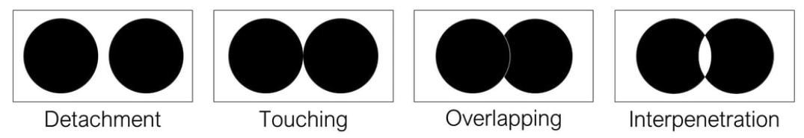

[MEDIA 2DF3](README.md)

-------------------------------------------------------------------------------

<h1 style="color: darkred;">Composition Techniques I – Part 1</h1>

<figure style="width: 40vw; margin: auto;">
  
  <figcaption style="text-align: center; font-style: italic; margin-top: 0.5em;">
    Examples by previous students.
  </figcaption>
</figure>

## Objective
Create **four digital compositions**, each visualizing one of the following **Interrelationships of Form**:  
1. Detached  
2. Touching  
3. Overlapped  
4. Interpenetration

In each composition should incorporate **Wucius Wong’s Principles of Two-Dimensional Design**—**Form, Repetition, Structure, Similarity, and Gradation**—to explore and highlight the visual characteristics of each interrelationship.  

Each composition must demonstrate a **thoughtful and cohesive integration** of form relationships and design principles.

## Design Restrictions
- Use **geometric shapes only**  
- Designs must be in **black and white**  
- Software: **Adobe Illustrator** (vector-based)

## Activities
**Complete the following activities in order. Ask your professor for help as needed.**

---

<h3 style="color: darkred;">[15–20 min] Sketching</h3>

You may sketch using a **digital or physical notebook**.  
According to Wikipedia, a sketch is “a rapidly executed freehand drawing that is not usually intended as a finished work.”

#### Super-Units
- Create **four sketches** using simple geometric shapes in black and white, each representing one of the Interrelationships of Form listed above.
- Focus on **visual experimentation** and form exploration.
- Examples:

#### Grids

- Create a **1:1 (square)** grid for each composition. Choose from the following grids:

- In each grid, emphasize one of the following Wong principles:
  1. Repetition
  2. Structure
  3. Similarity
  4. Gradation
- Grids may be **Inactive, Active, Visible**, or **Repetition-based**.

- Take your time—**this step is foundational** to a strong composition.

---

<h3 style="color: darkred;">[1h–1h30m] Working in Adobe Illustrator</h3>

#### Document Setup (Required)  
> ⚠️ **You must follow the tutorial and file setup instructions exactly to avoid losing points.**  
> Skipping or incorrectly completing this step will affect your grade.

Before you begin, **watch the provided tutorial** on Illustrator document setup. Follow it step-by-step to create **one separate file per composition**.

<iframe src="https://www.iorad.com/player/2496000/Setup-Adobe-Illustrator-File?src=iframe&oembed=1" width="100%" height="500px" style="width: 100%; height: 500px; border-bottom: 1px solid #ccc;" referrerpolicy="strict-origin-when-cross-origin" frameborder="0" webkitallowfullscreen="webkitallowfullscreen" mozallowfullscreen="mozallowfullscreen" allowfullscreen="allowfullscreen" allow="camera; microphone; clipboard-write;" sandbox="allow-scripts allow-forms allow-same-origin allow-presentation allow-downloads allow-modals allow-popups allow-popups-to-escape-sandbox allow-top-navigation allow-top-navigation-by-user-activation"></iframe>
 
**Your Illustrator document must include the following settings:**
- **Units:** Pixels  
- **Size:** 1000 × 1000 px (1:1 aspect ratio)
- **Bleed:** 10 px (on all sides)   
- **Color Mode:** RGB  
- **Raster Effects:** High (300 PPI)  
- **Naming Protocol:** `Lastname-Firstname-CompTech1-#.ai`

These settings ensure your file is compatible with export and review processes. Files that do not follow the setup guidelines may be marked down.

---

#### Basic tools and behaviours in Adobe Illustrator

<iframe src="https://www.iorad.com/player/2496027/Basic-tools-and-behaviours-in-Adobe-Illustrator?src=iframe&oembed=1" width="100%" height="500px" style="width: 100%; height: 500px; border-bottom: 1px solid #ccc;" referrerpolicy="strict-origin-when-cross-origin" frameborder="0" webkitallowfullscreen="webkitallowfullscreen" mozallowfullscreen="mozallowfullscreen" allowfullscreen="allowfullscreen" allow="camera; microphone; clipboard-write;" sandbox="allow-scripts allow-forms allow-same-origin allow-presentation allow-downloads allow-modals allow-popups allow-popups-to-escape-sandbox allow-top-navigation allow-top-navigation-by-user-activation"></iframe>

---

#### Create Your Grids
- Use your **sketched grids** as a reference when recreating them in Adobe Illustrator.
- Place all grid elements in the **"Grid"** or **"Guides"** layer to keep your file organized and editable.
- ⚠️ Grids must be properly structured to support your final composition. **Watch this tutorial** to learn how to properly set up your grids in Illustrator:  

<iframe src="https://www.iorad.com/player/2496032/Creating-grids-in-Adobe-Illustrator?src=iframe&oembed=1" width="100%" height="500px" style="width: 100%; height: 500px; border-bottom: 1px solid #ccc;" referrerpolicy="strict-origin-when-cross-origin" frameborder="0" webkitallowfullscreen="webkitallowfullscreen" mozallowfullscreen="mozallowfullscreen" allowfullscreen="allowfullscreen" allow="camera; microphone; clipboard-write;" sandbox="allow-scripts allow-forms allow-same-origin allow-presentation allow-downloads allow-modals allow-popups allow-popups-to-escape-sandbox allow-top-navigation allow-top-navigation-by-user-activation"></iframe>

> Make sure to match the grid style (Inactive, Active, Visible, or Repetition-based) that you selected during your sketching phase.

---

#### Create Your Super-Units

- Use your sketches as guides.
- Follow the tutorial on visualizing **Interrelationships of Form** in Illustrator.
- Place the main shapes in the **"Composition" layer**.

<iframe src="https://www.iorad.com/player/2496022/Interrelationships-of-Form-in-Adobe-Illustrator-1?src=iframe&oembed=1" width="100%" height="500px" style="width: 100%; height: 500px; border-bottom: 1px solid #ccc;" referrerpolicy="strict-origin-when-cross-origin" frameborder="0" webkitallowfullscreen="webkitallowfullscreen" mozallowfullscreen="mozallowfullscreen" allowfullscreen="allowfullscreen" allow="camera; microphone; clipboard-write;" sandbox="allow-scripts allow-forms allow-same-origin allow-presentation allow-downloads allow-modals allow-popups allow-popups-to-escape-sandbox allow-top-navigation allow-top-navigation-by-user-activation"></iframe>

---

#### Build Your Compositions

- Combine your Super-Units with the appropriate grid structure.
- Each design must clearly integrate both a **relationship of form** and a **principle of design**.

---

<h3 style="color: darkred;">📥 Final Submission</h3>

1. A **single PDF file** that includes your **sketches** (Super-Units and Grids)  
   - **Naming:** `Lastname-Firstname-CompTech1-Sketches.pdf`

2. **Four separate PDF files**, one for each **digital composition**  
   - **Naming:** `Lastname-Firstname-CompTech1-1.pdf`
   - **Naming:** `Lastname-Firstname-CompTech1-2.pdf`
   - **Naming:** `Lastname-Firstname-CompTech1-3.pdf`
   - **Naming:** `Lastname-Firstname-CompTech1-4.pdf`

> 📌 **Failure to follow document setup or naming instructions may result in a grade deduction.**

---
