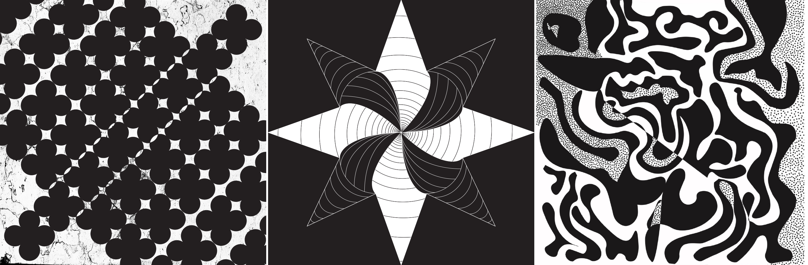
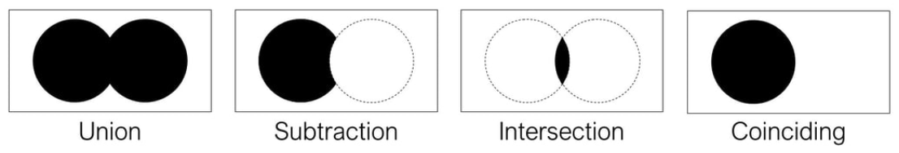
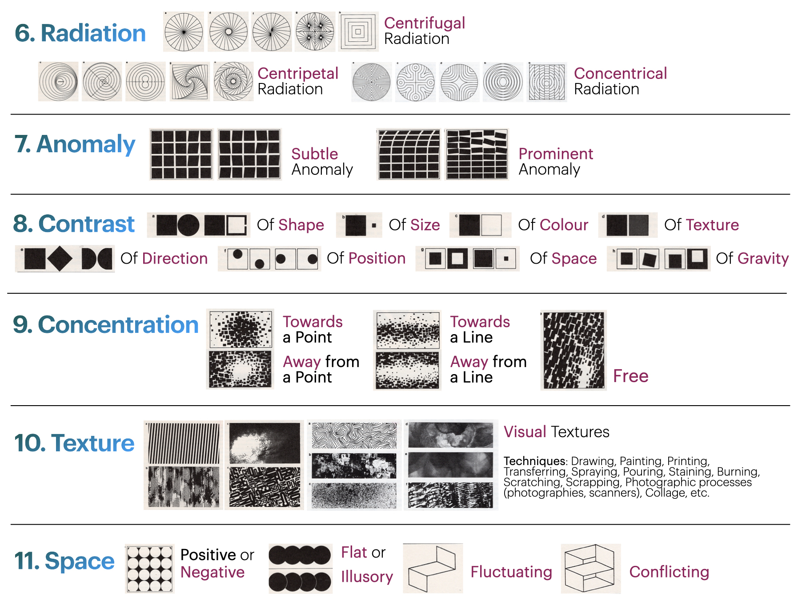

[MEDIA 2DF3](README.md)

-------------------------------------------------------------------------------

<h1 style="color: darkred;">Composition Techniques I – Part 2</h1>

<figure style="width: 80vw; margin: auto;">
  
  <figcaption style="text-align: center; font-style: italic; margin-top: 0.5em;">
    Examples by previous students.
  </figcaption>
</figure>

## Objective
Create **four digital compositions** that explore the **Interrelationships of Form**:  
1. Union
2. Subtraction
3. Intersection

In each composition should incorporate **Wucius Wong’s Principles of Two-Dimensional Design**—**Radiation, Anomaly, Contrast, Concentration, Texture, and Space**—to explore and highlight the visual characteristics of each interrelationship.  

Each composition must demonstrate a **thoughtful and cohesive integration** of form relationships and design principles.

## Design Restrictions
- Use **geometric, organic, or accidental shapes**
- Designs must be in **black and white**

**Software**:  
- **Adobe Illustrator** (vector-based composition)  
- **Adobe Photoshop** (texture/image-based processing only)

## Activities  
**Complete the following activities in order. Ask your professor for help if needed.**

---

<h3 style="color: darkred;">[15–20 min] Sketching</h3>

Sketch using either a **digital or physical notebook**.  
A sketch is “a rapidly executed freehand drawing that is not usually intended as a finished work.”

---

### ✏️ Composition No. 1 – Union + Anomaly  
- Sketch a **Super-Unit** based on the **Union** interrelationship of form.  
- Use a **simple grid**.  
- Repeat your Super-Unit to create a composition that emphasizes **Anomaly**.  

---

### ✏️ Composition No. 2 – Subtraction + Concentration & Texture  
- Sketch a **Super-Unit** using the **Subtraction** interrelationship of form.  
- Choose one of the provided **grid structures**.  
- Create a composition that emphasizes **Concentration** and **Texture**.  
- Describe the type of texture you will use: **photography, pattern, letterforms, etc.**  
  - Texture must be in **black and white** and will be applied **inside the Super-Unit**.

---

### ✏️ Composition No. 3 – Intersection + Contrast & Texture  
- Sketch **two Super-Units** using the **Intersection** interrelationship of form.  
- Create a **free-grid composition** using the Super-Units.  
- Emphasize both **Contrast** and **Texture** in your design

---

<h3 style="color: darkred;">[1h–1h30m] Executing in Adobe Illustrator & Photoshop</h3>

### 🧾 Document Setup (Required)

> ⚠️ **You must follow the setup tutorial exactly to avoid losing points.**

Set up **four separate documents** in Adobe Illustrator.  
**Do not use Illustrator’s default grids.**

<iframe src="https://www.iorad.com/player/2496000/Setup-Adobe-Illustrator-File?src=iframe&oembed=1" width="100%" height="500px" style="border-bottom: 1px solid #ccc;" frameborder="0" allowfullscreen></iframe>

**Document Settings**:
- **Units:** Pixels  
- **Size:** 1000 × 1000 px (1:1 aspect ratio)  
- **Bleed:** 0 px  
- **Color Mode:** RGB  
- **Raster Effects:** High (300 PPI)  
- **Naming Protocol:** `Lastname-Firstname-CompTech2-#.ai`

---

### 🛠️ Build Your Compositions

#### Basic Tools in Adobe Illustrator  
<iframe src="https://www.iorad.com/player/2496027/Basic-tools-and-behaviours-in-Adobe-Illustrator?src=iframe&oembed=1" width="100%" height="500px" style="border-bottom: 1px solid #ccc;" frameborder="0" allowfullscreen></iframe>

#### Create Your Grids *(Compositions 1 & 2 only)*  
<iframe src="https://www.iorad.com/player/2496032/Creating-more-complex-grids-in-Adobe-Illustrator?src=iframe&oembed=1" width="100%" height="500px" style="border-bottom: 1px solid #ccc;" frameborder="0" allowfullscreen></iframe>  
- Recreate your sketched grids inside the **"Grid Layer"**.

#### Create Your Super-Units *(Compositions 1, 2 & 3)*  
<iframe src="https://www.iorad.com/player/2496022/Interrelationships-of-Form-in-Adobe-Illustrator-1?src=iframe&oembed=1" width="100%" height="500px" style="border-bottom: 1px solid #ccc;" frameborder="0" allowfullscreen></iframe>  
- Use your sketches as guides.  
- Ensure main forms are placed in the **"Composition Layer"**.

#### Download & Prepare Textures *(Compositions 2 & 3)*  
Textures must be in **black and white**, minimum **800px** on their shortest side.

<iframe src="https://www.iorad.com/player/2496045/Working-on-Image-Textures-in-Adobe-Photoshop?src=iframe&oembed=1" width="100%" height="500px" style="border-bottom: 1px solid #ccc;" frameborder="0" allowfullscreen></iframe>

<iframe src="https://www.iorad.com/player/2496051/Importing-and-Masking-an-Image-in-Adobe-Illustrator?src=iframe&oembed=1" width="100%" height="500px" style="border-bottom: 1px solid #ccc;" frameborder="0" allowfullscreen></iframe>

#### Build Your Final Compositions  
- Follow your sketches closely.  
- Integrate the appropriate Interrelationship of Form and Design Principles into each layout.  
- *(For Composition 4 only)* – Use the **Curvature Tool** and **Pen Tool** in Illustrator.

<iframe src="https://www.iorad.com/player/2496062/Curvature-and-Pen-Tool-in-Adobe-Illustrator?src=iframe&oembed=1" width="100%" height="500px" style="border-bottom: 1px solid #ccc;" frameborder="0" allowfullscreen></iframe>

---

<h3 style="color: darkred;">📥 Final Submission</h3>

1. A **single PDF file** containing your **sketches** for all four compositions  
   - **Naming:** `Lastname-Firstname-Sketches.pdf`

2. **Four separate PDF files**, one for each **final composition**  
   - **Naming:**  
     - `Lastname-Firstname-CompTech2-1.pdf`  
     - `Lastname-Firstname-CompTech2-2.pdf`  
     - `Lastname-Firstname-CompTech2-3.pdf`  
     - `Lastname-Firstname-CompTech2-4.pdf`

> 📌 **Failure to follow document setup or naming instructions may result in a grade deduction.**

