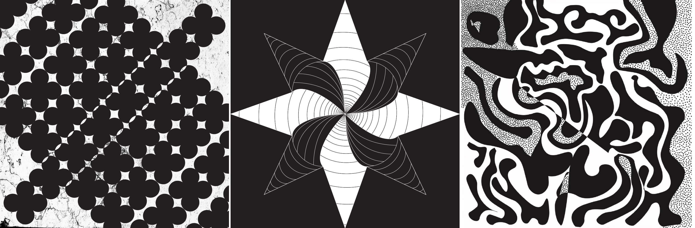
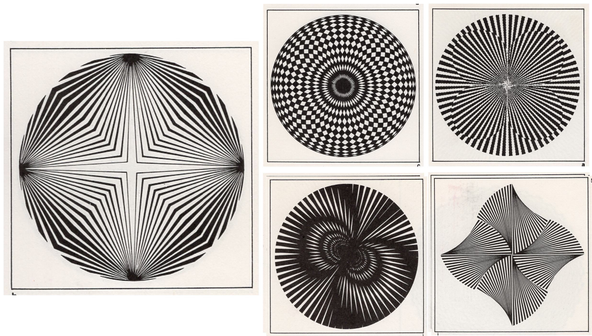
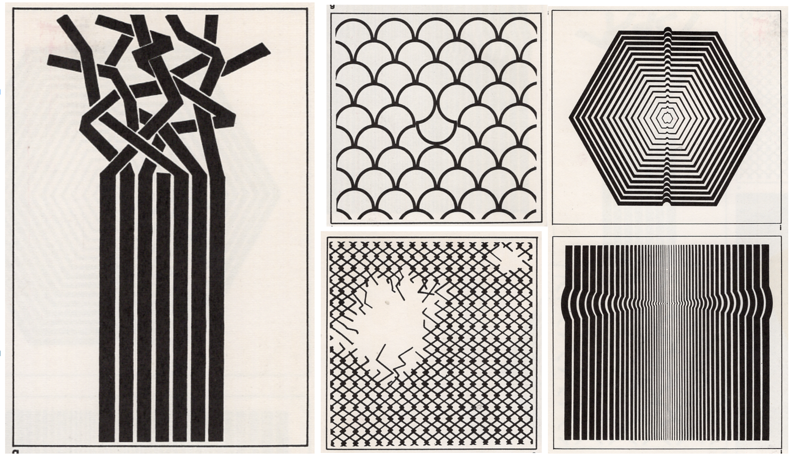
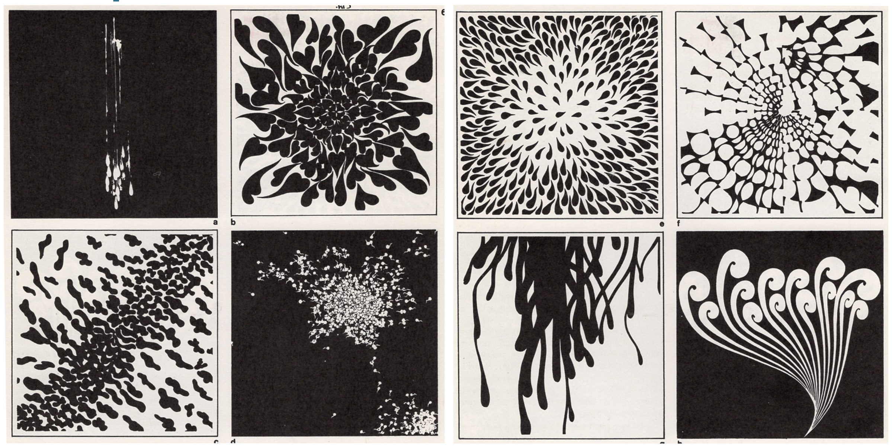
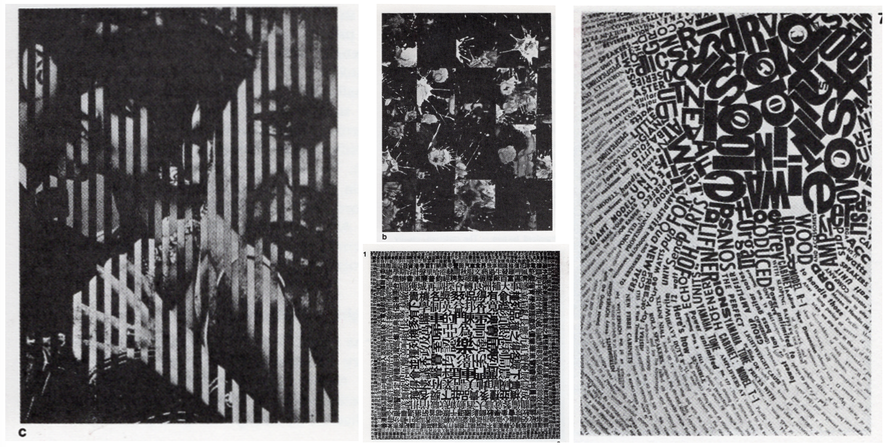
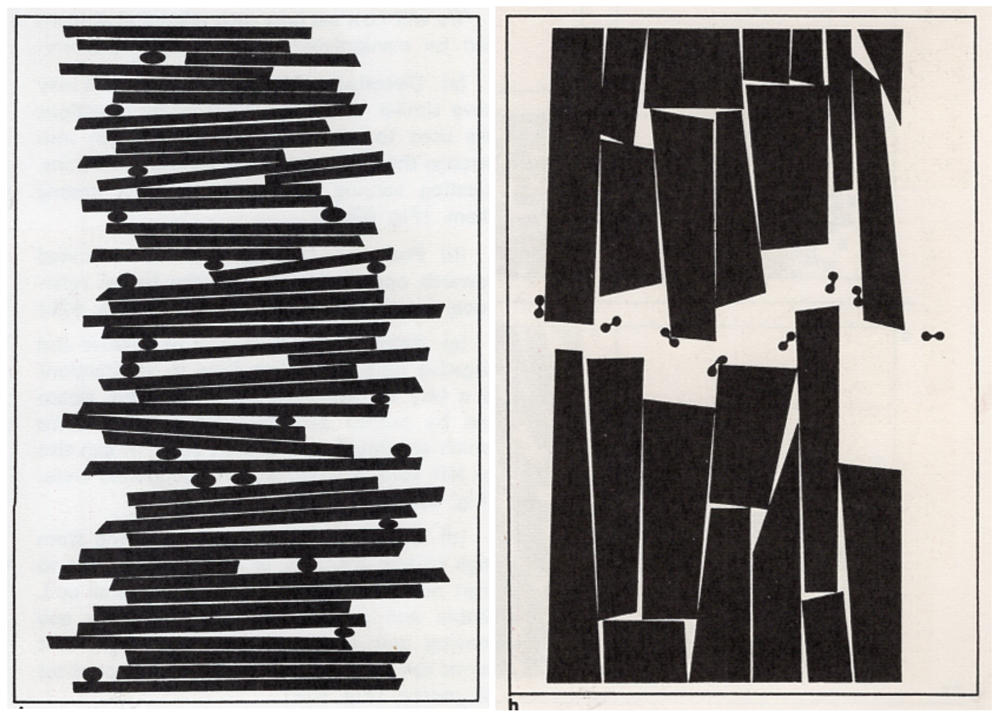
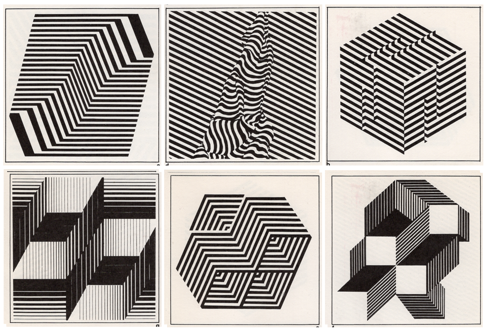
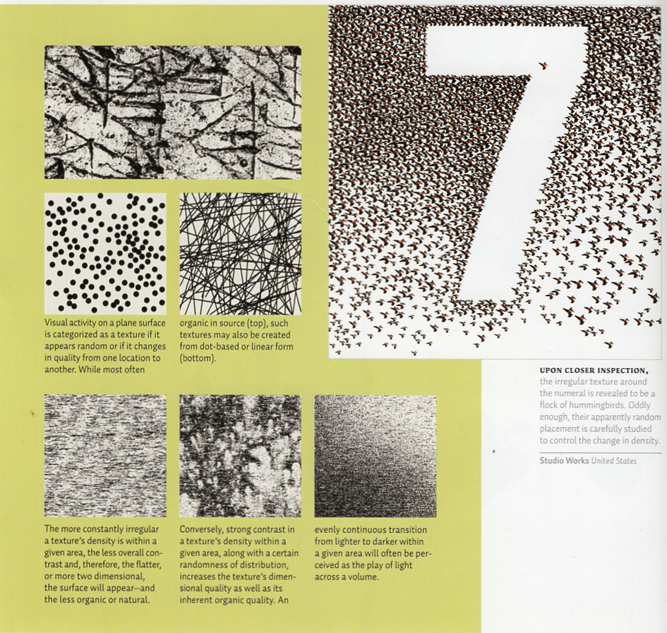
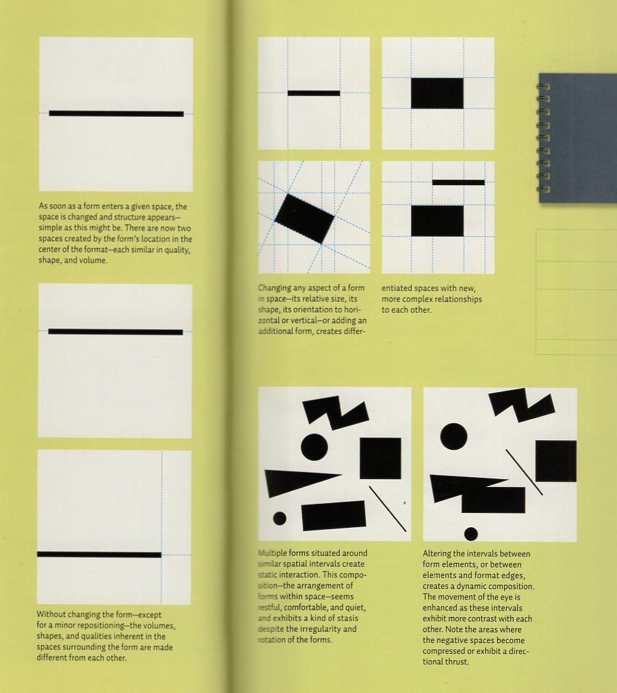
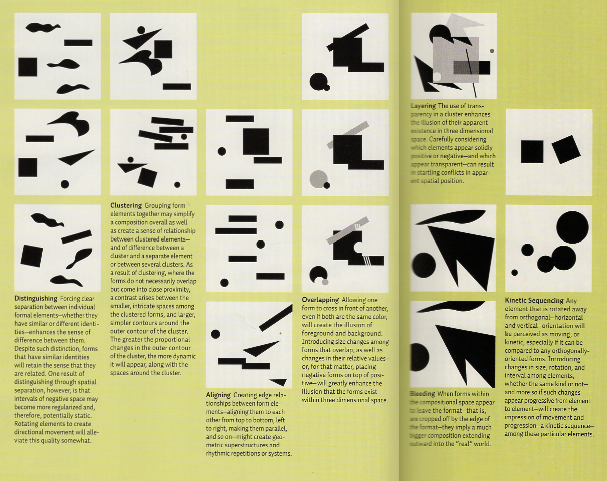

[MEDIAART 2DF3](README.md)

# Composition Techniques I – Part 2

**Goal:** Design and create **three black-and-white digital compositions** by building, repeating, and systematically altering a super-unit through more complex relationships of form, surface, contrast, and space.

Each composition must combine:

- **One assigned Interrelationship of Form**
- **One assigned combination of principles from Wucius Wong**
- **One assigned approach from Timothy Samara’s “Form and Space”**
- **One repetition grid**
- **One super-unit repeated and altered across the complete composition**

## Activity overview

- **Outputs:** Three planning sketches and three digital compositions
- **Interrelationships:** Union, Subtraction, and Intersection
- **Wong principles:** Radiation, Anomaly, Concentration, Texture, Contrast, and Space
- **Samara focuses:** Surface Activity, Breaking Space, and Arranging Form
- **Original media:** One physical texture created with a proper scanner
- **Shapes:** Geometric, organic, and accidental shapes
- **Colour:** Black and white only
- **Software:** Adobe Illustrator and Adobe Photoshop

## Activity stages

Complete the following stages in order.

<!-- SECTION 1 -->

  

    1. Review the concepts
    
      Review the assigned relationships of form, design principles, surface strategies, and spatial approaches before planning.
    
  

## Principles of Two-Dimensional Design

### Interrelationships of Form

Each composition begins with a super-unit that clearly demonstrates one assigned relationship:

- **Union:** Two or more forms merge and become one larger form. The internal boundaries between the original forms disappear.
- **Subtraction:** One form removes a visible area from another, creating a new contour and an active negative space.
- **Intersection:** Only the area shared by the overlapping forms remains visible.

### Super-unit versus composition

A **super-unit** is a small structure created by combining two or more shapes through an Interrelationship of Form.

The final composition must develop that starting structure into a larger visual system:

1. Create one clearly resolved super-unit.
2. Repeat the super-unit at least eight times.
3. Alter the repeated instances in a controlled way.
4. Organize the instances through the assigned repetition grid, grid structures, and principles.
5. Use the complete square format, including its edges, margins, and negative spaces.

The assigned relationship inside the original super-unit must remain identifiable after the instances are repeated and altered.

### Other Principles

  
  <!-- Radiation -->
  <figure class="gestalt-principle-card">
     

    <figcaption>
      <h3>Radiation</h3>
      

        Radiation organizes repeated forms around a common centre. Changes in direction, scale, spacing, or rotation can create movement, emphasis, and a strong focal point.
      

    </figcaption>
  </figure>

  <!-- Anomaly -->
  <figure class="gestalt-principle-card">
    

    <figcaption>
      <h3>Anomaly</h3>
      

        An anomaly is an intentional irregularity within an otherwise consistent system. A change in shape, size, position, direction, value, or texture can interrupt the pattern and create emphasis.
      

    </figcaption>
  </figure>

  <!-- Concentration -->
  <figure class="gestalt-principle-card">
    

    <figcaption>
      <h3>Concentration</h3>
      

        Concentration organizes forms through changes in density and distribution. Elements may gather around a point, line, area, or direction, creating dense and sparse regions within the composition.
      

    </figcaption>
  </figure>

  <!-- Texture -->
  <figure class="gestalt-principle-card">
    

    <figcaption>
      <h3>Texture</h3>
      

        Texture describes the visual or physical qualities of a surface. Changes in marks, grain, density, pattern, material, and value can make a form appear smooth, rough, soft, irregular, flat, or dimensional.
      

    </figcaption>
  </figure>

  <!-- Contrast -->
  <figure class="gestalt-principle-card">
    

    <figcaption>
      <h3>Contrast</h3>
      

        Contrast creates a clear difference between visual elements. It may be developed through size, shape, value, direction, position, density, texture, or positive and negative space.
      

    </figcaption>
  </figure>

  <!-- Space -->
  <figure class="gestalt-principle-card">
    

    <figcaption>
      <h3>Space</h3>
      

        Space is created through the relationships between forms and the surrounding field. Scale, position, overlap, cropping, direction, and positive–negative relationships can produce flat, illusory, or fluctuating spatial effects.
      

    </figcaption>
  </figure>

> **Source:** Wong, W. (1972). *Principles of Two-Dimensional Design*. Van Nostrand Reinhold Company.

## Form and Space

The activity also applies three approaches from Timothy Samara’s chapter **“Seeing Form and Space.”**

  <!-- Surface Activity -->
  <figure class="gestalt-principle-card">
    

    <figcaption>
      <h3>Surface Activity</h3>
      

        Surface activity changes how a plane is perceived through marks, patterns, texture, density, scale, direction, and material variation. These qualities can affect visual weight, movement, depth, and the relationship between a form and its surrounding space.
      

    </figcaption>
  </figure>

  <!-- Breaking Space -->
  <figure class="gestalt-principle-card">
    

    <figcaption>
      <h3>Breaking Space</h3>
      

        Breaking space treats the format as an active boundary. Forms may touch, divide, cross, interrupt, or move beyond its edges, changing how the viewer perceives tension, movement, continuity, and the limits of the composition.
      

    </figcaption>
  </figure>

  <!-- Arranging Form -->
  <figure class="gestalt-principle-card">
    

    <figcaption>
      <h3>Arranging Form</h3>
      

        Arranging form establishes relationships between multiple elements. Alignment, grouping, clustering, separation, overlap, scale, and placement can create hierarchy, rhythm, direction, emphasis, and visual order.
      

    </figcaption>
  </figure>

> **Source:** Samara, T. (2007). “Seeing Form and Space.” In *Design Elements: A Graphic Style Manual* (pp. 58–65). Rockport Publishers.

<!-- SECTION 2 -->

  

    2. Plan and sketch the three compositions
    
      Design each super-unit, select a different repetition grid and grid structure, and plan how the unit will be repeated and altered.
    
  

Create **one planning page for each composition**.

## Select the repetition grids

Choose **one different repetition grid for each composition**. Do not repeat the same grid.

Select the grid that best supports:

- The assigned Interrelationship of Form
- The assigned Wong principles
- The assigned Samara approach
- The organization of the repeated and altered super-units

---

## Composition 1

| Interrelationship of Form | Wong principles | Samara approach |
|---|---|---|
| **Union** | **Anomaly + Concentration** | **Arranging Form** |

Create a super-unit by merging **organic shapes** through **Union**. The combined forms must read as one larger form without visible internal boundaries.

Repeat the super-unit to create areas of increasing and decreasing concentration. Introduce one clear anomaly that interrupts the larger visual system and becomes an intentional point of emphasis.

On the planning page:

1. Draw the super-unit applying the **Union** relationship of form.
2. Label how the forms apply Samara’s concept of **Arranging Form**.
3. Sketch at least eight repeated instances organized through the selected **repetition grid**.
4. Show how changes in spacing, grouping, or density create **Concentration**.
5. Identify one intentional **Anomaly** created through shape, size, position, direction, value, or positive–negative reversal.

---

## Composition 2

| Interrelationship of Form | Wong principles | Samara approach |
|---|---|---|
| **Subtraction** | **Texture + Contrast** | **Surface Activity** |

Create a super-unit by using one form to subtract an area from another using **accidental shapes**. The subtraction must create a clearly visible contour and negative space.

Use at least **one original physical texture** created with a proper scanner. Apply the scanned material to produce surface activity and create a clear contrast between textured and untextured areas, dense and sparse marks, smooth and rough surfaces, or black and white values.

On the planning page:

1. Draw the super-unit applying the **Subtraction** relationship of form.
2. Label how the super-unit applies Samara’s concept of **Surface Activity**.
3. Identify the physical material you will scan.
4. Show where the scanned texture will appear within the super-unit.
5. Sketch at least eight repeated instances organized through the selected **repetition grid**.
6. Identify how **Texture** and **Contrast** will remain visible across the complete composition.
7. Introduce one or two controlled variations, such as scale, contour, placement, subtraction, texture density, cropping, or positive–negative reversal.

---

## Composition 3

| Interrelationship of Form | Wong principle | Samara approach |
|---|---|---|
| **Intersection** | **Space** | **Breaking Space** |

Create a super-unit from the shared area produced when two or more geometric, organic, or accidental forms intersect. Only the intersecting area should remain visible.

Use the repeated super-unit to develop one spatial approach:

- **Flat Space**
- **Illusory Space**
- **Fluctuating and Conflicting Space**

Apply Samara’s concept of **Breaking Space** by allowing selected forms to touch, divide, cross, interrupt, or move beyond the grid, margins, or artboard edges.

On the planning page:

1. Draw the super-unit applying the **Intersection** relationship of form.
2. Label the selected type of **Space**.
3. Identify how the composition applies Samara’s concept of **Breaking Space**.
4. Sketch at least eight repeated instances organized through the selected **repetition grid**.
5. Introduce two or three controlled variations, such as scale, orientation, position, interval, direction, cropping, overlap, or positive–negative reversal.
6. Show how selected forms interact with or move beyond the grid, margins, or artboard edges.
7. Apply a repetition grid and grid structure that are different from Compositions 1 and 2.

---

## General sketch requirements

Each planning page must show:

- The original super-unit
- The assigned Interrelationship of Form
- The assigned Wong principle or principles
- The assigned Samara approach
- One unique repetition grid
- One unique grid structure
- At least eight repeated instances
- Controlled alterations
- The complete square format
- Notes or arrows explaining the planned changes

> The sketch must show the complete composition, not only the original super-unit. A single super-unit or a row of identical copies does not meet the planning requirements.

Combine the three planning pages into one PDF:

- **Filename:** `Lastname-Firstname-CompTech1-Part2-Sketches.pdf`

Ask the instructor for feedback before creating the final digital compositions.

<!-- SECTION 3 -->

  

    3. Set up and build the three compositions
    
      Create the Illustrator files, scan and process the original texture, build each super-unit, and develop the complete compositions.
    
  

Create one separate Adobe Illustrator file for each composition.

## Set up the Illustrator files

Use the following settings:

- **Units:** Pixels
- **Size:** 1000 × 1000 px
- **Aspect ratio:** 1:1
- **Bleed:** 10 px on all sides
- **Colour mode:** RGB
- **Raster effects:** High, 300 PPI

Create and name these layers:

1. **Guides** — grid, margins, and construction lines
2. **Composition** — super-units and final vector forms
3. **Background** — black or white background field

Composition 2 must also include:

4. **Texture** — the embedded and processed original scan

Use these working filenames:

- `Lastname-Firstname-CompTech1-Part2-1.ai`
- `Lastname-Firstname-CompTech1-Part2-2.ai`
- `Lastname-Firstname-CompTech1-Part2-3.ai`

### Illustrator document setup

> **Required tutorial:** Follow this tutorial step by step. It includes the required document settings, **margin guides**, bleed, colour mode, raster-effects resolution, and layer setup. Skipping steps or using different settings may result in lost marks.

<iframe src="https://www.iorad.com/player/2588082/Adobe-Illustrator-1--Document-Setup-?src=iframe&oembed=1" width="100%" height="500px" style="width: 100%; height: 500px; border-bottom: 1px solid #ccc;" referrerpolicy="strict-origin-when-cross-origin" frameborder="0" webkitallowfullscreen="webkitallowfullscreen" mozallowfullscreen="mozallowfullscreen" allowfullscreen="allowfullscreen" allow="camera; microphone; clipboard-write;" sandbox="allow-scripts allow-forms allow-same-origin allow-presentation allow-downloads allow-modals allow-popups allow-popups-to-escape-sandbox allow-top-navigation allow-top-navigation-by-user-activation"></iframe>

### Additional Illustrator tools

<iframe src="https://www.iorad.com/player/2498938/More-tools-and-behaviours-in-Adobe-Illustrator?src=iframe&oembed=1" width="100%" height="500px" style="width: 100%; height: 500px; border-bottom: 1px solid #ccc;" referrerpolicy="strict-origin-when-cross-origin" frameborder="0" webkitallowfullscreen="webkitallowfullscreen" mozallowfullscreen="mozallowfullscreen" allowfullscreen="allowfullscreen" allow="camera; microphone; clipboard-write;" sandbox="allow-scripts allow-forms allow-same-origin allow-presentation allow-downloads allow-modals allow-popups allow-popups-to-escape-sandbox allow-top-navigation allow-top-navigation-by-user-activation"></iframe>

## Create the grids

Recreate the selected grid for each composition in the **Guides** layer.

Use a different grid structure for each file. The grid should organize the placement, alignment, spacing, concentration, and movement of the repeated super-units.

A grid may remain visible only when its visible structure is an intentional part of the final composition.

> Although grids begin as drawn lines, **all grids**—unless they are intentionally visible—**must be converted into guides**. This ensures that the grid remains available in Illustrator but does not appear when the document is printed or viewed outside Illustrator.

<iframe src="https://www.iorad.com/player/2498981/Creating-more-complex-grids-in-Adobe-Illustrator?src=iframe&oembed=1" width="100%" height="500px" style="width: 100%; height: 500px; border-bottom: 1px solid #ccc;" referrerpolicy="strict-origin-when-cross-origin" frameborder="0" webkitallowfullscreen="webkitallowfullscreen" mozallowfullscreen="mozallowfullscreen" allowfullscreen="allowfullscreen" allow="camera; microphone; clipboard-write;" sandbox="allow-scripts allow-forms allow-same-origin allow-presentation allow-downloads allow-modals allow-popups allow-popups-to-escape-sandbox allow-top-navigation allow-top-navigation-by-user-activation"></iframe>

## Create the original super-units

Use geometric, organic, or accidental shapes to create:

- **Composition 1:** Union + Arranging Form
- **Composition 2:** Subtraction + Surface Activity
- **Composition 3:** Intersection + Breaking Space

Place the original super-unit in the **Composition** layer.

Before repeating it, confirm that:

- The assigned Interrelationship of Form is clearly visible.
- The assigned Samara approach shapes the construction or spatial use of the super-unit.
- The super-unit is visually resolved and can support controlled variation.

<iframe src="https://www.iorad.com/player/2498921/Interrelationships-of-Form-in-Adobe-Illustrator-2?src=iframe&oembed=1" width="100%" height="500px" style="width: 100%; height: 500px; border-bottom: 1px solid #ccc;" referrerpolicy="strict-origin-when-cross-origin" frameborder="0" webkitallowfullscreen="webkitallowfullscreen" mozallowfullscreen="mozallowfullscreen" allowfullscreen="allowfullscreen" allow="camera; microphone; clipboard-write;" sandbox="allow-scripts allow-forms allow-same-origin allow-presentation allow-downloads allow-modals allow-popups allow-popups-to-escape-sandbox allow-top-navigation allow-top-navigation-by-user-activation"></iframe>

## Create the original scanned texture

The texture used in Composition 2 must be created by you with a **flatbed or document scanner**.

The following sources are not permitted:

- Downloaded textures
- Stock images
- Screenshots
- Cellphone photographs
- DSLR or other camera photographs
- Textures created entirely with software
- Scans created by another person

Possible materials include:

- Paper
- Cardboard
- Fabric
- Thread or string
- Leaves or dry plant material
- Packaging
- Printed marks or fragments created by you
- Crumpled, folded, cut, layered, or torn materials
- Other safe objects with visible surface detail

Do not place wet, dirty, sharp, abrasive, sticky, or damaging materials on the scanner.

Use:

- **Resolution:** Minimum 300 PPI
- **Recommended resolution:** 600 PPI for small or highly detailed materials
- **Colour mode:** Colour or grayscale
- **File format:** TIFF or PNG
- **Cropping:** Do not crop the original source scan
- **Editing:** Do not edit the original source scan

Save the original file immediately after scanning:

- `Lastname-Firstname-CompTech1-Part2-Texture.tif`

Use `.png` only when the scanner does not provide TIFF.

<!-- Add scanner reference image here when available. -->

## Process a copy of the scanned texture

Do not edit the original source scan.

Open a duplicate in Adobe Photoshop. You may:

- Crop or rotate the working copy
- Convert it to grayscale or black and white
- Adjust Levels or Curves
- Increase or reduce contrast
- Use Threshold
- Clean minor scanner dust
- Repeat or combine sections from your own scan

The processed texture must remain recognizably derived from the submitted original scan.

<iframe src="https://www.iorad.com/player/2499003/Working-on-Image-Textures-in-Adobe-Photoshop?src=iframe&oembed=1" width="100%" height="500px" style="width: 100%; height: 500px; border-bottom: 1px solid #ccc;" referrerpolicy="strict-origin-when-cross-origin" frameborder="0" webkitallowfullscreen="webkitallowfullscreen" mozallowfullscreen="mozallowfullscreen" allowfullscreen="allowfullscreen" allow="camera; microphone; clipboard-write;" sandbox="allow-scripts allow-forms allow-same-origin allow-presentation allow-downloads allow-modals allow-popups allow-popups-to-escape-sandbox allow-top-navigation allow-top-navigation-by-user-activation"></iframe>

## Import and embed the texture

Import the processed texture into Composition 2.

- Place it inside the **Texture** layer.
- Apply it within the super-units or their negative spaces.
- Use it to create Surface Activity, Texture, and Contrast.
- Embed the image before saving and exporting the file.

<iframe src="https://www.iorad.com/player/2499031/Importing-and-Masking-an-Image-in-Adobe-Illustrator?src=iframe&oembed=1" width="100%" height="500px" style="width: 100%; height: 500px; border-bottom: 1px solid #ccc;" referrerpolicy="strict-origin-when-cross-origin" frameborder="0" webkitallowfullscreen="webkitallowfullscreen" mozallowfullscreen="mozallowfullscreen" allowfullscreen="allowfullscreen" allow="camera; microphone; clipboard-write;" sandbox="allow-scripts allow-forms allow-same-origin allow-presentation allow-downloads allow-modals allow-popups allow-popups-to-escape-sandbox allow-top-navigation allow-top-navigation-by-user-activation"></iframe>

## Develop the complete compositions

For each file:

1. Repeat the super-unit at least eight times.
2. Maintain the assigned Interrelationship of Form throughout the repeated system.
3. Use the selected repetition grid to organize the complete composition.
4. Use the assigned Wong principles:
   - **Composition 1:** Anomaly and Concentration
   - **Composition 2:** Texture and Contrast
   - **Composition 3:** Space
5. Apply the assigned Samara approach:
   - **Composition 1:** Arranging Form
   - **Composition 2:** Surface Activity
   - **Composition 3:** Breaking Space
6. Introduce the controlled alterations planned in the sketches.
7. Maintain the defining structure of the original super-unit as the instances change.
8. Consider the relationship between the composition and the square format, including its grid, margins, edges, cropping, placement, and negative space.
9. Refine visual balance with your eyes rather than relying only on mathematical alignment.

> The repeated instances must operate as a complete composition. A single super-unit, a row of identical copies, or copies placed without a clear visual system will not meet the activity requirements.

<!-- SECTION 4 -->

  

    4. Review and Export Part 2
    
      Check the compositions, original scan, layers, guides, margins, and editable PDF settings before submitting Part 2.
    
  

## Before submitting

Your PDF files will be opened in Adobe Illustrator to review the document setup, layers, guides, margins, embedded texture, and construction of the compositions.

### Check the Illustrator document structure

For each composition, confirm that the file contains:

1. **Guides**
   - Contains the selected grid structure
   - Contains the margin guides created during the document setup
   - Contains only guides and construction elements

2. **Composition**
   - Contains the original super-unit
   - Contains all repeated and altered instances
   - Contains the final black-and-white vector forms

3. **Background**
   - Contains only the black or white background field

Composition 2 must also contain:

4. **Texture**
   - Contains the processed original scan
   - Contains no downloaded or unrelated images
   - Keeps the texture separate from the vector composition
   - Contains an embedded image rather than a missing linked file

Do not leave artwork on the wrong layer or create unnecessary unnamed layers.

### Check the guides and margins

Before saving each PDF:

- Convert the grid structure into Illustrator guides unless it is intentionally visible.
- Keep the grid and margin guides inside the **Guides** layer.
- Confirm that **View → Guides → Show Guides** is active.
- Keep the **Guides** layer visible when saving the file.
- Confirm that the original margin guides remain present.
- Confirm that the grid and margins align correctly with the artboard.
- Do not expand, delete, rasterize, or merge the guides with the composition.

Guides should be visible when the PDF is opened in Illustrator, but they will not appear as part of the printed or externally viewed artwork.

### Check the document settings

Confirm that each file uses:

- **Artboard:** 1000 × 1000 px
- **Aspect ratio:** 1:1
- **Bleed:** 10 px on all sides
- **Colour mode:** RGB
- **Raster effects:** High, 300 PPI
- **Colour restriction:** Black and white only

Also confirm that:

- All vector forms remain editable.
- The texture in Composition 2 is embedded.
- Compositions 1 and 3 contain no unintended raster images or linked files.
- There are no stray points, hidden copies, or unnecessary objects outside the artboard.
- The composition interacts intentionally with the edges, margins, and negative space.
- Each super-unit is repeated at least eight times.
- The assigned Wong principles and Samara approach remain visible across the complete composition.

### Check the original scan

Confirm that:

- The original scan is unedited and uncropped.
- The filename follows the required structure.
- The scan was created with a proper scanner.
- The processed texture remains recognizably connected to the original scan.
- The original scan is included as a separate submission file.

### Save the editable PDF

Use **File → Save As → Adobe PDF**.

In the Adobe PDF settings, select:

- **Preserve Illustrator Editing Capabilities**

This setting is required so that the layers, guides, editable vector objects, embedded texture, artboard, and document structure remain available when the PDF is reopened in Illustrator.

### Final file check

Open each submitted PDF twice:

1. Open it in a PDF viewer and confirm that the final composition displays correctly.
2. Open it in Adobe Illustrator and confirm that:
   - The required layers remain separate and correctly named.
   - Each layer contains the correct material.
   - The grids have been converted into guides unless intentionally visible.
   - The grid and margin guides remain available.
   - The vector objects remain editable.
   - The Composition 2 texture is embedded.
   - The artboard and bleed settings remain correct.
   - The filename follows the required structure exactly.

---

## Submission files

| Item | Required filename |
|---|---|
| Sketches PDF | `Lastname-Firstname-CompTech1-Part2-Sketches.pdf` |
| Composition 1 PDF | `Lastname-Firstname-CompTech1-Part2-1.pdf` |
| Composition 2 PDF | `Lastname-Firstname-CompTech1-Part2-2.pdf` |
| Composition 3 PDF | `Lastname-Firstname-CompTech1-Part2-3.pdf` |
| Original unedited scan | `Lastname-Firstname-CompTech1-Part2-Texture.tif` |

Use `.png` for the original scan only when TIFF is unavailable from the scanner.

Incorrect filenames or file extensions, missing layers, deleted margins, grids that have not been converted into guides, missing or linked textures, altered original scans, flattened or non-editable PDFs, incomplete repetition, or compositions based on only one isolated super-unit will affect the grade.

---

Credits: Jessica A. Rodríguez
