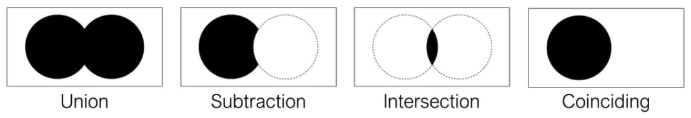
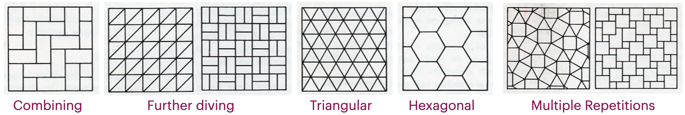
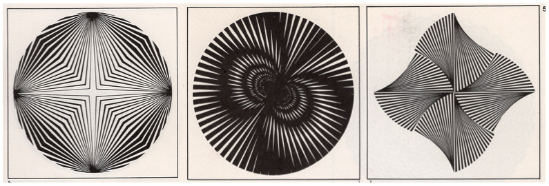
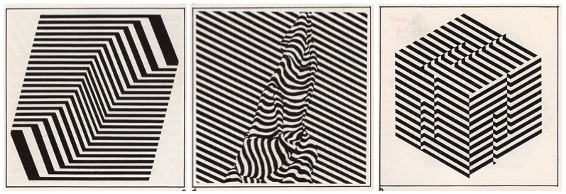
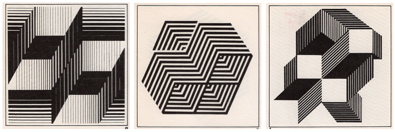

[MEDIAART 2DF3](README.md)

# Composition Techniques I – Part 2

**Goal:** Design and create **four black-and-white compositions** by repeating and altering super-units through more complex form relationships, scanned textures, contrast, concentration, anomaly, and spatial line systems.

Each composition must combine:

- **One assigned Interrelationship of Form or principle of Space**
- **One assigned principle from Wucius Wong**
- **One spatial focus adapted from Timothy Samara’s “Form and Space”**
- **One super-unit or line-based unit repeated and altered across the complete composition**
- **Original scanned textures for Compositions 2 and 3**

> **A super-unit is the starting module, not the final composition.**  
> Compositions 1–3 must each contain **at least eight repeated instances** of their assigned super-unit. Composition 4 must use a line-based unit repeated across the format. The instances must be altered systematically rather than copied without change.

## Activity overview

- **Outputs:** Four planning sketches and four digital compositions
- **Interrelationships:** Union, Subtraction, and Intersection
- **Space:** Flat, Illusory, or Fluctuating and Conflicting Space
- **Wong principles:** Anomaly, Concentration, Texture, Contrast, and Space
- **Samara focuses:** Hierarchy, Figure/Ground, Depth and ambiguity, and Movement and rhythm
- **Shapes:** Geometric, organic, or accidental shapes
- **Colour:** Black and white only
- **Software:** Adobe Illustrator and Adobe Photoshop
- **Original media:** Two different physical textures scanned with a proper scanner
- **Submission:** One sketch PDF, four composition PDFs, and two original unedited scan files

## Activity stages

Complete the following stages in order.

<!-- SECTION 1 -->

  

    1. Review the concepts
    
      Review the new form relationships, Wong principles, spatial strategies, and original-image requirement.
    
  

## Interrelationships of Form

- **Union:** Two or more forms combine and become one larger form.
- **Subtraction:** A visible area is removed from one form by another.
- **Intersection:** Only the shared area between overlapping forms remains.

## Repeated and altered super-units

For Compositions 1–3:

1. Create one super-unit based on the assigned Interrelationship of Form.
2. Repeat the super-unit at least eight times.
3. Alter the repeated instances through controlled changes.
4. Organize the instances into a complete visual system.

The final composition cannot consist of one large super-unit. The relationship must operate across a repeated field, sequence, cluster, or spatial structure.

## Space through repeated lines

Composition 4 replaces the shape-based super-unit with a **line-based unit**.

A line-based unit may be:

- One line
- A pair of lines
- A small group of related lines
- A repeated angular or curved structure

Repeat and alter this unit through changes in length, weight, direction, spacing, curvature, interruption, or overlap.

## Form and space

The activity applies four spatial focuses adapted from Timothy Samara:

- **Hierarchy:** One element or variation is perceived first.
- **Figure/Ground:** Positive forms and negative spaces create an active relationship.
- **Depth and ambiguity:** Overlap, texture, scale, and value can advance, recede, or complicate spatial reading.
- **Movement and rhythm:** Repeated intervals, directions, and changes guide the viewer’s eye.

> **Source:** Samara, T. (2007). “Form and Space.” In *Design Elements: A Graphic Style Manual*. Rockport Publishers.

<!-- SECTION 2 -->

  

    2. Apply the four required combinations
    
      Follow the assigned relationship, principle, source material, and spatial direction for each composition.
    
  

| Composition | Required combination | Samara spatial focus | Required visual direction |
|---|---|---|---|
| **1** | **Union + Anomaly** | **Hierarchy** | Repeat the Union super-unit at least eight times within a grid. Establish a consistent system, then alter one instance or group so the anomaly is the first element noticed. |
| **2** | **Subtraction + Concentration + Scanned Texture** | **Figure/Ground** | Repeat the Subtraction super-unit at least eight times within a grid. Increase and decrease density to create concentration. Apply one original scanned texture inside the super-units while preserving clear positive and negative space. |
| **3** | **Intersection + Contrast + Scanned Texture** | **Depth and ambiguity** | Repeat the Intersection super-unit at least eight times in a free structure. Use a second original scanned texture and contrasts in scale, value, direction, density, or texture to create spatial depth or ambiguity. |
| **4** | **Space through repeated lines** | **Movement and rhythm** | Repeat one line-based unit across the format. Alter line weight, length, direction, interval, curvature, interruption, or overlap to create Flat, Illusory, or Fluctuating and Conflicting Space. |

## Grid requirement

- **Composition 1:** Use one grid structure.
- **Composition 2:** Use a different grid structure.
- **Composition 3:** Use a free structure rather than a visible regular grid.
- **Composition 4:** Build the spatial system through repeated lines and intervals.

Choose the grids for Compositions 1 and 2 from the structures reviewed in class.

## Variation requirement

Compositions 1–3 must alter the repeated super-unit through at least **three** of the following:

- Scale
- Rotation
- Orientation
- Position
- Spacing
- Proportion
- Density
- Cropping
- Positive–negative reversal
- Texture placement

Composition 4 must alter at least **four** properties of its repeated line-based unit.

<!-- SECTION 3 -->

  

    3. Plan and sketch the four compositions
    
      Plan the original units, repeated systems, scanned textures, and spatial effects before working digitally.
    
  

Create one planning page for each composition.

## Compositions 1–3

Each planning page must include:

1. The assigned combination.
2. The original super-unit.
3. At least eight planned instances.
4. The grid or free spatial structure.
5. Notes identifying at least three systematic alterations.
6. Notes explaining the hierarchy, figure/ground, depth, or ambiguity.
7. The complete square format and its boundaries.

For Compositions 2 and 3, identify the physical material you will scan and show where the texture will appear.

## Composition 4

Plan one composition using only repeated lines.

Select one type of space:

- **Flat Space**

- **Illusory Space**

- **Fluctuating and Conflicting Space**

Show:

- The original line-based unit
- How it will repeat
- At least four planned alterations
- The direction and rhythm of the complete system
- How the lines create the selected spatial effect

<fieldset class="equipment-checklist">
  <legend>Planning checklist</legend>

  <label class="checklist-item">
    <input type="checkbox">
    
      <strong>The complete composition is shown.</strong>
      The page includes a repeated system rather than only one super-unit.
    
  </label>

  <label class="checklist-item">
    <input type="checkbox">
    
      <strong>The alterations are labelled.</strong>
      Scale, spacing, position, density, direction, texture, or other planned changes are identified.
    
  </label>

  <label class="checklist-item">
    <input type="checkbox">
    
      <strong>The scanned materials are planned.</strong>
      Compositions 2 and 3 identify two different physical textures and explain how each will be used.
    
  </label>

  <label class="checklist-item">
    <input type="checkbox">
    
      <strong>The spatial strategy is clear.</strong>
      Hierarchy, figure/ground, depth, ambiguity, movement, or rhythm is visible in the plan.
    
  </label>
</fieldset>

Combine the four pages into one PDF:

- **Filename:** `Lastname-Firstname-CompTech1-Part2-Sketches.pdf`

Ask the instructor for feedback before creating the final digital compositions.

<!-- SECTION 4 -->

  

    4. Create two original scanned textures
    
      Use a proper scanner to create one original texture for Composition 2 and a different texture for Composition 3.
    
  

## Original-image requirement

The textures used in Compositions 2 and 3 must be created by you with a **flatbed or document scanner**.

The following sources are not permitted:

- Downloaded textures
- Stock images
- Screenshots
- Cellphone photographs
- DSLR or other camera photographs
- Textures created entirely with software
- Scans created by another person

Create:

- **Texture 1:** One original scan for Composition 2
- **Texture 2:** One different original scan for Composition 3

## Select physical materials

Possible materials include:

- Paper
- Cardboard
- Fabric
- Thread or string
- Leaves or dry plant material
- Packaging
- Printed marks or fragments created by you
- Crumpled, folded, cut, layered, or torn materials
- Other safe objects with visible surface detail

Do not place wet, dirty, sharp, abrasive, sticky, or damaging materials on the scanner.

## Scanner settings

Use:

- **Resolution:** Minimum 300 PPI
- **Recommended resolution:** 600 PPI for small or highly detailed materials
- **Colour mode:** Colour or grayscale
- **File format:** TIFF or PNG
- **Cropping:** Do not crop the original source scan
- **Editing:** Do not edit the original source scan

Save the original files immediately after scanning.

## Required original filenames

- `Lastname-Firstname-CompTech1-Part2-Texture-1.tif`
- `Lastname-Firstname-CompTech1-Part2-Texture-2.tif`

Use `.png` only when the scanner does not provide TIFF.

## Reference

<!-- Add the scanner-texture reference image here when available.

-->

<!-- SECTION 5 -->

  

    5. Set up the Illustrator and Photoshop files
    
      Create four Illustrator documents and preserve the original texture scans before processing copies.
    
  

## Illustrator document settings

Create one separate Illustrator file for each composition.

- **Units:** Pixels
- **Size:** 1000 × 1000 px
- **Aspect ratio:** 1:1
- **Bleed:** 10 px on all sides
- **Colour mode:** RGB
- **Raster effects:** High, 300 PPI

## Required Illustrator layers

1. **Guides** — grids, margins, and construction lines
2. **Composition** — repeated super-units or line-based units
3. **Texture** — embedded processed scan for Compositions 2 and 3
4. **Background** — black or white background field

## Working filenames

- `Lastname-Firstname-CompTech1-Part2-1.ai`
- `Lastname-Firstname-CompTech1-Part2-2.ai`
- `Lastname-Firstname-CompTech1-Part2-3.ai`
- `Lastname-Firstname-CompTech1-Part2-4.ai`

<iframe src="https://www.iorad.com/player/2588082/Adobe-Illustrator-1--Document-Setup-?src=iframe&oembed=1" width="100%" height="500px" style="width: 100%; height: 500px; border-bottom: 1px solid #ccc;" referrerpolicy="strict-origin-when-cross-origin" frameborder="0" webkitallowfullscreen="webkitallowfullscreen" mozallowfullscreen="mozallowfullscreen" allowfullscreen="allowfullscreen" allow="camera; microphone; clipboard-write;" sandbox="allow-scripts allow-forms allow-same-origin allow-presentation allow-downloads allow-modals allow-popups allow-popups-to-escape-sandbox allow-top-navigation allow-top-navigation-by-user-activation"></iframe>

## Preserve the original scans

Do not edit the original texture files.

Open a duplicate of each scan in Adobe Photoshop and save the working copy separately before processing it.

<!-- SECTION 6 -->

  

    6. Build the repeated systems and process the textures
    
      Repeat and alter every unit, process the scanned textures, and construct each complete composition.
    
  

## Illustrator tools and behaviours

<iframe src="https://www.iorad.com/player/2498938/More-tools-and-behaviours-in-Adobe-Illustrator?src=iframe&oembed=1" width="100%" height="500px" style="width: 100%; height: 500px; border-bottom: 1px solid #ccc;" referrerpolicy="strict-origin-when-cross-origin" frameborder="0" webkitallowfullscreen="webkitallowfullscreen" mozallowfullscreen="mozallowfullscreen" allowfullscreen="allowfullscreen" allow="camera; microphone; clipboard-write;" sandbox="allow-scripts allow-forms allow-same-origin allow-presentation allow-downloads allow-modals allow-popups allow-popups-to-escape-sandbox allow-top-navigation allow-top-navigation-by-user-activation"></iframe>

## Create the grids for Compositions 1 and 2

Place the grids in the **Guides** layer.

<iframe src="https://www.iorad.com/player/2498981/Creating-more-complex-grids-in-Adobe-Illustrator?src=iframe&oembed=1" width="100%" height="500px" style="width: 100%; height: 500px; border-bottom: 1px solid #ccc;" referrerpolicy="strict-origin-when-cross-origin" frameborder="0" webkitallowfullscreen="webkitallowfullscreen" mozallowfullscreen="mozallowfullscreen" allowfullscreen="allowfullscreen" allow="camera; microphone; clipboard-write;" sandbox="allow-scripts allow-forms allow-same-origin allow-presentation allow-downloads allow-modals allow-popups allow-popups-to-escape-sandbox allow-top-navigation allow-top-navigation-by-user-activation"></iframe>

## Create and repeat the super-units

Construct the original Union, Subtraction, and Intersection super-units in Illustrator.

Repeat each super-unit at least eight times. Alter the instances according to the assigned principle and spatial focus.

<iframe src="https://www.iorad.com/player/2498921/Interrelationships-of-Form-in-Adobe-Illustrator-2?src=iframe&oembed=1" width="100%" height="500px" style="width: 100%; height: 500px; border-bottom: 1px solid #ccc;" referrerpolicy="strict-origin-when-cross-origin" frameborder="0" webkitallowfullscreen="webkitallowfullscreen" mozallowfullscreen="mozallowfullscreen" allowfullscreen="allowfullscreen" allow="camera; microphone; clipboard-write;" sandbox="allow-scripts allow-forms allow-same-origin allow-presentation allow-downloads allow-modals allow-popups allow-popups-to-escape-sandbox allow-top-navigation allow-top-navigation-by-user-activation"></iframe>

## Process copies of the scanned textures

In Adobe Photoshop, you may:

- Crop or rotate the working copy
- Convert it to grayscale or black and white
- Adjust Levels or Curves
- Increase or reduce contrast
- Use Threshold
- Clean minor scanner dust
- Combine or repeat sections from your own scan

The processed texture must remain recognizably derived from the submitted original scan.

<iframe src="https://www.iorad.com/player/2499003/Working-on-Image-Textures-in-Adobe-Photoshop?src=iframe&oembed=1" width="100%" height="500px" style="width: 100%; height: 500px; border-bottom: 1px solid #ccc;" referrerpolicy="strict-origin-when-cross-origin" frameborder="0" webkitallowfullscreen="webkitallowfullscreen" mozallowfullscreen="mozallowfullscreen" allowfullscreen="allowfullscreen" allow="camera; microphone; clipboard-write;" sandbox="allow-scripts allow-forms allow-same-origin allow-presentation allow-downloads allow-modals allow-popups allow-popups-to-escape-sandbox allow-top-navigation allow-top-navigation-by-user-activation"></iframe>

## Import and mask the textures

Import each processed scan into the corresponding Illustrator file.

- Texture 1 must be used in Composition 2.
- Texture 2 must be used in Composition 3.
- Apply the texture within the repeated super-units or their negative spaces.
- Embed every linked image before exporting.

<iframe src="https://www.iorad.com/player/2499031/Importing-and-Masking-an-Image-in-Adobe-Illustrator?src=iframe&oembed=1" width="100%" height="500px" style="width: 100%; height: 500px; border-bottom: 1px solid #ccc;" referrerpolicy="strict-origin-when-cross-origin" frameborder="0" webkitallowfullscreen="webkitallowfullscreen" mozallowfullscreen="mozallowfullscreen" allowfullscreen="allowfullscreen" allow="camera; microphone; clipboard-write;" sandbox="allow-scripts allow-forms allow-same-origin allow-presentation allow-downloads allow-modals allow-popups allow-popups-to-escape-sandbox allow-top-navigation allow-top-navigation-by-user-activation"></iframe>

## Build Composition 4 with repeated lines

Use the Pen Tool and Curvature Tool to create the original line-based unit.

Repeat and alter it across the format. The final work must contain a developed system of lines rather than one isolated line drawing.

<iframe src="https://www.iorad.com/player/2499038/Curvature-and-Pen-Tool-in-Adobe-Illustrator-?src=iframe&oembed=1" width="100%" height="500px" style="width: 100%; height: 500px; border-bottom: 1px solid #ccc;" referrerpolicy="strict-origin-when-cross-origin" frameborder="0" webkitallowfullscreen="webkitallowfullscreen" mozallowfullscreen="mozallowfullscreen" allowfullscreen="allowfullscreen" allow="camera; microphone; clipboard-write;" sandbox="allow-scripts allow-forms allow-same-origin allow-presentation allow-downloads allow-modals allow-popups allow-popups-to-escape-sandbox allow-top-navigation allow-top-navigation-by-user-activation"></iframe>

> A single Union, Subtraction, or Intersection super-unit is not a complete composition. A single line or small line drawing is also not a complete Composition 4. Every final work must develop repeated and altered units into a complete spatial system.

<!-- SECTION 7 -->

  

    7. Review the four compositions
    
      Confirm that the repeated units, original scans, and spatial strategies are clear and technically complete.
    
  

<fieldset class="equipment-checklist">
  <legend>Final review checklist</legend>

  <label class="checklist-item">
    <input type="checkbox">
    
      <strong>Compositions 1–3 contain at least eight instances.</strong>
      Each super-unit is repeated and developed into a complete system.
    
  </label>

  <label class="checklist-item">
    <input type="checkbox">
    
      <strong>The repeated units are altered systematically.</strong>
      The changes support anomaly, concentration, contrast, hierarchy, figure/ground, depth, or ambiguity.
    
  </label>

  <label class="checklist-item">
    <input type="checkbox">
    
      <strong>The Interrelationships of Form remain clear.</strong>
      Union, Subtraction, and Intersection remain visible within the repeated systems.
    
  </label>

  <label class="checklist-item">
    <input type="checkbox">
    
      <strong>The textures are original.</strong>
      Compositions 2 and 3 use different textures created with a proper scanner.
    
  </label>

  <label class="checklist-item">
    <input type="checkbox">
    
      <strong>The scans remain identifiable.</strong>
      The processed textures can be clearly connected to the submitted original files.
    
  </label>

  <label class="checklist-item">
    <input type="checkbox">
    
      <strong>Composition 4 uses a repeated line system.</strong>
      Changes in weight, length, direction, interval, curvature, interruption, or overlap create the selected type of space.
    
  </label>

  <label class="checklist-item">
    <input type="checkbox">
    
      <strong>The format is active.</strong>
      Edges, cropping, intervals, negative space, and placement contribute to the composition.
    
  </label>

  <label class="checklist-item">
    <input type="checkbox">
    
      <strong>The technical requirements are complete.</strong>
      Files use black and white, correct dimensions, named layers, embedded images, and required filenames.
    
  </label>
</fieldset>

<!-- SECTION 8 -->

  

    8. Export and submit Part 2
    
      Submit the planning document, four compositions, and two original unedited scanner files.
    
  

## Required files

| Item | Required filename |
|---|---|
| Sketches PDF | `Lastname-Firstname-CompTech1-Part2-Sketches.pdf` |
| Composition 1 PDF | `Lastname-Firstname-CompTech1-Part2-1.pdf` |
| Composition 2 PDF | `Lastname-Firstname-CompTech1-Part2-2.pdf` |
| Composition 3 PDF | `Lastname-Firstname-CompTech1-Part2-3.pdf` |
| Composition 4 PDF | `Lastname-Firstname-CompTech1-Part2-4.pdf` |
| Original scan for Composition 2 | `Lastname-Firstname-CompTech1-Part2-Texture-1.tif` |
| Original scan for Composition 3 | `Lastname-Firstname-CompTech1-Part2-Texture-2.tif` |

Use `.png` for an original scan only when TIFF is unavailable from the scanner.

Before submitting:

- Open every PDF and confirm that it displays correctly.
- Confirm that all raster textures are embedded.
- Confirm that each original scan is unedited and uncropped.
- Confirm that the two compositions use two different scanned materials.
- Confirm that all filenames follow the required structure exactly.

Downloaded textures, photographed textures, missing source scans, unembedded images, incomplete repetition, or a final work based on only one isolated super-unit may affect the grade.

---

Credits: Jessica A. Rodríguez
