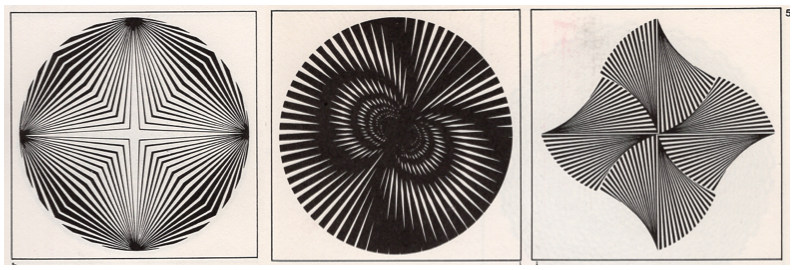

[MEDIA 2DF3](README.md)

-------------------------------------------------------------------------------

<h1 style="color: darkred;">Composition Techniques I – Part 2</h1>

<figure style="width: 80vw; margin: auto;">
  
  <figcaption style="text-align: center; font-style: italic; margin-top: 0.5em;">
    Examples by previous students.
  </figcaption>
</figure>

## Objective
Create **four digital compositions** that explore the **Interrelationships of Form**:  
1. Union
2. Subtraction
3. Intersection

In each composition should incorporate **Wucius Wong’s Principles of Two-Dimensional Design**—**Radiation, Anomaly, Contrast, Concentration, Texture, and Space**—to explore and highlight the visual characteristics of each interrelationship.  

Each composition must demonstrate a **thoughtful and cohesive integration** of form relationships and design principles.

## Design Restrictions
- Use **geometric, organic, or accidental shapes**
- Designs must be in **black and white**
- You must incorporate a **grid structure** for each composition (choose one per composition from the following):

**Software**:  
- **Adobe Illustrator** (vector-based composition)  
- **Adobe Photoshop** (texture/image-based processing only)

## Activities  
**Complete the following activities in order. Ask your professor for help if needed.**

---

<h3 style="color: darkred;">[15–20 min] Sketching</h3>

Sketch using either a **digital or physical notebook**.  
A sketch is “a rapidly executed freehand drawing that is not usually intended as a finished work.”

### Composition No. 1 – Union + Anomaly  
- Sketch a **Super-Unit** based on the **Union** interrelationship of form.  
- Choose one **grid structure** from the list under **Design Restrictions**.  
- Repeat your Super-Unit within the grid to create a composition that emphasizes **Anomaly** using variation or disruption in form, scale, or placement.

### Composition No. 2 – Subtraction + Concentration & Texture  
- Sketch a **Super-Unit** using the **Subtraction** interrelationship of form.  
- Choose one **grid structure** from the list under **Design Restrictions**. 
- Create a composition that emphasizes **Concentration** and **Texture**.  
- Describe the type of texture you will use: **photography, pattern, letterforms, etc.**  
  - Texture must be in **black and white** and will be applied **inside the Super-Unit**.

### Composition No. 3 – Intersection + Contrast & Texture  
- Sketch a **Super-Unit** using the **Intersection** interrelationship of form.  
- Create a **free-grid composition** using the Super-Unit.  
- Emphasize both **Contrast** and **Texture** in your design

### Composition No. 4 – Spatial Line Drawing  
Using **only lines**, sketch a composition inspired by one of the following Wong’s Principles of Space:

- Flat Space,  

- Illusory Space, or  

  
- or Fluctuating and Conflicting Space  

---

<h3 style="color: darkred;">[1h–1h30m] Executing in Adobe Illustrator & Photoshop</h3>

#### Document Setup (Required)  
> ⚠️ **You must follow the tutorial and file setup instructions exactly to avoid losing points.**  
> Skipping or incorrectly completing this step will affect your grade.

Before you begin, **watch the provided tutorial** on Illustrator document setup. Follow it step-by-step to create **one separate file per composition**.

<iframe src="https://www.iorad.com/player/2496000/Setup-Adobe-Illustrator-File?src=iframe&oembed=1" width="100%" height="500px" style="width: 100%; height: 500px; border-bottom: 1px solid #ccc;" referrerpolicy="strict-origin-when-cross-origin" frameborder="0" webkitallowfullscreen="webkitallowfullscreen" mozallowfullscreen="mozallowfullscreen" allowfullscreen="allowfullscreen" allow="camera; microphone; clipboard-write;" sandbox="allow-scripts allow-forms allow-same-origin allow-presentation allow-downloads allow-modals allow-popups allow-popups-to-escape-sandbox allow-top-navigation allow-top-navigation-by-user-activation"></iframe>

  
**Your Illustrator document must include the following settings:**
- **Units:** Pixels  
- **Size:** 1000 × 1000 px (1:1 aspect ratio)  
- **Color Mode:** RGB  
- **Raster Effects:** High (300 PPI)  
- **Naming Protocol:** `Lastname-Firstname-CompTech1-#.ai` -- starting with number 5.

These settings ensure your file is compatible with export and review processes. Files that do not follow the setup guidelines may be marked down.

---

### Build Your Compositions

#### More tools and behaviours in Adobe Illustrator

<iframe src="https://www.iorad.com/player/2498938/More-tools-and-behaviours-in-Adobe-Illustrator?src=iframe&oembed=1" width="100%" height="500px" style="width: 100%; height: 500px; border-bottom: 1px solid #ccc;" referrerpolicy="strict-origin-when-cross-origin" frameborder="0" webkitallowfullscreen="webkitallowfullscreen" mozallowfullscreen="mozallowfullscreen" allowfullscreen="allowfullscreen" allow="camera; microphone; clipboard-write;" sandbox="allow-scripts allow-forms allow-same-origin allow-presentation allow-downloads allow-modals allow-popups allow-popups-to-escape-sandbox allow-top-navigation allow-top-navigation-by-user-activation"></iframe>

---

#### Create Your Grids *(Compositions 1 & 2 only)*  

- Use your **sketched grids** as a reference when recreating them in Adobe Illustrator.
- Place all grid elements in the **"Grid"** or **"Guides"** layer to keep your file organized and editable.
- ⚠️ Grids must be properly structured to support your final composition. **Watch this tutorial** to learn how to properly set up your grids in Illustrator:  

<iframe src="https://www.iorad.com/player/2498981/Creating-more-complex-grids-in-Adobe-Illustrator?src=iframe&oembed=1" width="100%" height="500px" style="width: 100%; height: 500px; border-bottom: 1px solid #ccc;" referrerpolicy="strict-origin-when-cross-origin" frameborder="0" webkitallowfullscreen="webkitallowfullscreen" mozallowfullscreen="mozallowfullscreen" allowfullscreen="allowfullscreen" allow="camera; microphone; clipboard-write;" sandbox="allow-scripts allow-forms allow-same-origin allow-presentation allow-downloads allow-modals allow-popups allow-popups-to-escape-sandbox allow-top-navigation allow-top-navigation-by-user-activation"></iframe>

> Make sure to match the grid style (Inactive, Active, Visible, or Repetition-based) that you selected during your sketching phase.

---

#### Create Your Super-Units *(Compositions 1, 2 & 3)*  

- Use your sketches as guides.
- Follow the tutorial on visualizing **Interrelationships of Form** in Illustrator.
- Place the main shapes in the **"Composition" layer**.
- Don’t forget to **embed all linked images** on Adobe Illustrator.

<iframe src="https://www.iorad.com/player/2498921/Interrelationships-of-Form-in-Adobe-Illustrator-2?src=iframe&oembed=1" width="100%" height="500px" style="width: 100%; height: 500px; border-bottom: 1px solid #ccc;" referrerpolicy="strict-origin-when-cross-origin" frameborder="0" webkitallowfullscreen="webkitallowfullscreen" mozallowfullscreen="mozallowfullscreen" allowfullscreen="allowfullscreen" allow="camera; microphone; clipboard-write;" sandbox="allow-scripts allow-forms allow-same-origin allow-presentation allow-downloads allow-modals allow-popups allow-popups-to-escape-sandbox allow-top-navigation allow-top-navigation-by-user-activation"></iframe>

---

#### Download & Prepare Textures *(Compositions 2 & 3)*  
Textures must be in **black and white**, minimum **800px** on their shortest side.

<iframe src="https://www.iorad.com/player/2499003/Working-on-Image-Textures-in-Adobe-Photoshop?src=iframe&oembed=1" width="100%" height="500px" style="width: 100%; height: 500px; border-bottom: 1px solid #ccc;" referrerpolicy="strict-origin-when-cross-origin" frameborder="0" webkitallowfullscreen="webkitallowfullscreen" mozallowfullscreen="mozallowfullscreen" allowfullscreen="allowfullscreen" allow="camera; microphone; clipboard-write;" sandbox="allow-scripts allow-forms allow-same-origin allow-presentation allow-downloads allow-modals allow-popups allow-popups-to-escape-sandbox allow-top-navigation allow-top-navigation-by-user-activation"></iframe>

<iframe src="https://www.iorad.com/player/2499031/Importing-and-Masking-an-Image-in-Adobe-Illustrator?src=iframe&oembed=1" width="100%" height="500px" style="width: 100%; height: 500px; border-bottom: 1px solid #ccc;" referrerpolicy="strict-origin-when-cross-origin" frameborder="0" webkitallowfullscreen="webkitallowfullscreen" mozallowfullscreen="mozallowfullscreen" allowfullscreen="allowfullscreen" allow="camera; microphone; clipboard-write;" sandbox="allow-scripts allow-forms allow-same-origin allow-presentation allow-downloads allow-modals allow-popups allow-popups-to-escape-sandbox allow-top-navigation allow-top-navigation-by-user-activation"></iframe>

---

#### Build Your Final Compositions  
- Follow your sketches closely.  
- Integrate the appropriate Interrelationship of Form and Design Principles into each layout.  
- *(For Composition 4 only)* – Use the **Curvature Tool** and **Pen Tool** in Illustrator.
- Don’t forget to **embed all linked images** on Adobe Illustrator.

<iframe src="https://www.iorad.com/player/2499038/Curvature-and-Pen-Tool-in-Adobe-Illustrator-?src=iframe&oembed=1" width="100%" height="500px" style="width: 100%; height: 500px; border-bottom: 1px solid #ccc;" referrerpolicy="strict-origin-when-cross-origin" frameborder="0" webkitallowfullscreen="webkitallowfullscreen" mozallowfullscreen="mozallowfullscreen" allowfullscreen="allowfullscreen" allow="camera; microphone; clipboard-write;" sandbox="allow-scripts allow-forms allow-same-origin allow-presentation allow-downloads allow-modals allow-popups allow-popups-to-escape-sandbox allow-top-navigation allow-top-navigation-by-user-activation"></iframe>

---

<h3 style="color: darkred;">📥 Final Submission</h3>

1. A **single PDF file** containing your **sketches** for all four compositions  
   - **Naming:** `Lastname-Firstname-CompTech2-Sketches2.pdf`

2. **Four separate PDF files**, one for each **final composition**  
   - **Naming:**  
     - `Lastname-Firstname-CompTech2-5.pdf`  
     - `Lastname-Firstname-CompTech2-6.pdf`  
     - `Lastname-Firstname-CompTech2-7.pdf`  
     - `Lastname-Firstname-CompTech2-8.pdf`

> 📌 **Failure to follow document setup or naming instructions may result in a grade deduction.**

---
