# Composition Techniques II – Colour Application

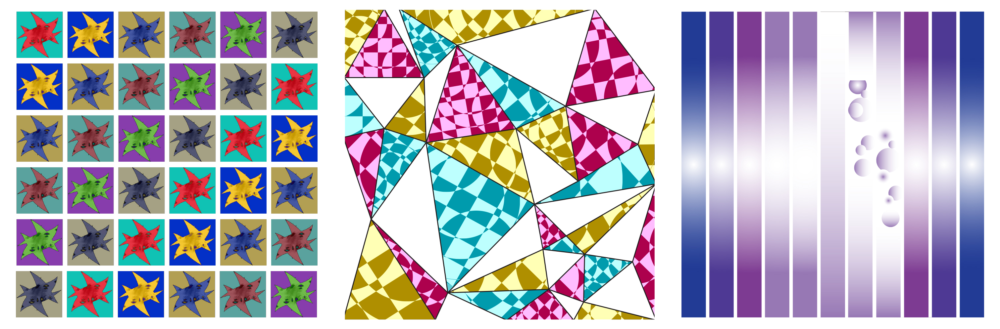

**Goal:** Design five colour palettes and apply three of them to previous compositions using intentional colour proportioning.

Each palette must demonstrate:

- One assigned **colour scheme**
- Six colour swatches
- Complete colour information
- A designed **colour proportion**
- Clear visual organization and consistent presentation

## Activity overview

- **Colour schemes:** Monochromatic, Complementary, Analogous, Triadic, and Tetradic (Square)
- **Palettes:** Five
- **Colours per palette:** Five
- **Samara concept:** Colour Proportioning
- **Previous compositions:** Select three from Composition Techniques I – Parts 1 and 2
- **Final colour compositions:** Three
- **Software:** Adobe Illustrator and Adobe Photoshop
- **Colour mode:** RGB

## Activity stages

Complete the following stages in order.

<!-- 
/////////////////
SECTION 1
/////////////////
-->

  

    1. Review the concepts
    
      Review colour modes, colour schemes, Itten’s colour relationships, and Samara’s colour proportioning before creating the palettes.
    
  

## Colour Modes and Values

Different colour models describe colour in different ways. Some are connected to a specific output, such as screens or print, while others are useful for selecting, adjusting, and communicating colour.

  <!-- RGB -->
  <figure class="gestalt-principle-card">
    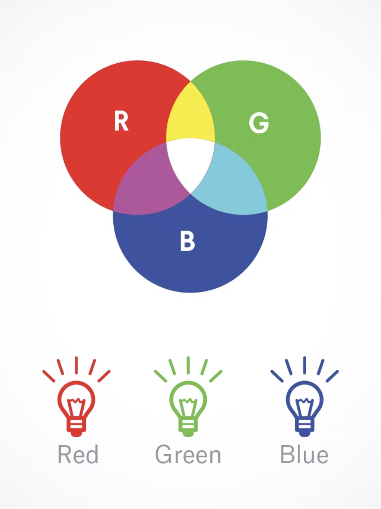

    <figcaption>
      <h3>RGB</h3>
      

        <strong>Red, Green, Blue.</strong> An additive colour model used primarily for screens and digital media. Different amounts of red, green, and blue light combine to produce colours.
      

    </figcaption>
  </figure>

  <!-- CMYK -->
  <figure class="gestalt-principle-card">
    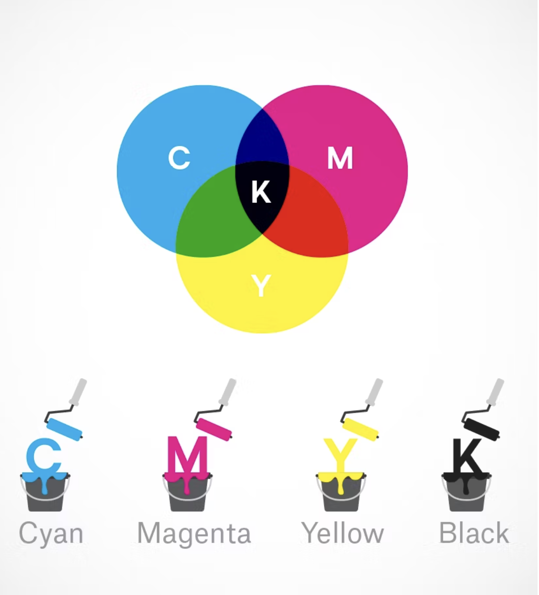

    <figcaption>
      <h3>CMYK</h3>
      

        <strong>Cyan, Magenta, Yellow, Black.</strong> A subtractive colour model used primarily for printing. Colours are created through combinations of printing inks on a physical surface.
      

    </figcaption>
  </figure>

  <!-- HSV / HSB -->
  <figure class="gestalt-principle-card">
    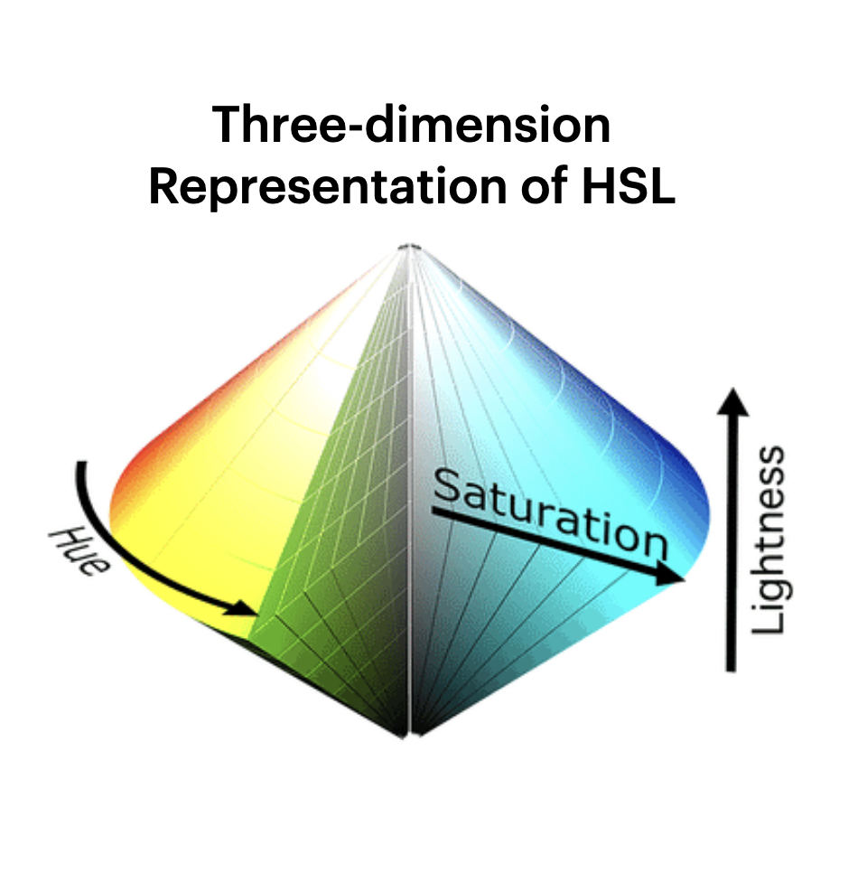

    <figcaption>
      <h3>HSV / HSB</h3>
      

        <strong>Hue, Saturation, Value/Brightness.</strong> HSV and HSB describe colour through its hue, intensity, and brightness. They are useful for making intuitive adjustments to colours in digital design software.
      

    </figcaption>
  </figure>

  <!-- HSL -->
  <figure class="gestalt-principle-card">
    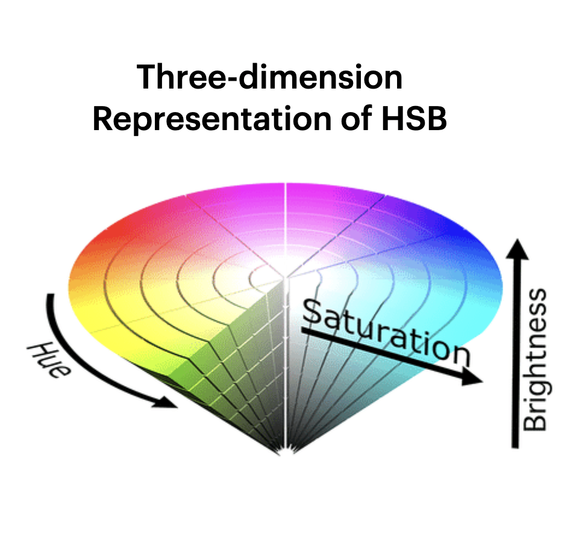

    <figcaption>
      <h3>HSL</h3>
      

        <strong>Hue, Saturation, Lightness.</strong> HSL organizes colour according to its hue, intensity, and relative lightness. It is especially useful for creating controlled lighter and darker variations of a colour.
      

    </figcaption>
  </figure>

  <!-- Hexadecimal -->
  <figure class="gestalt-principle-card">
    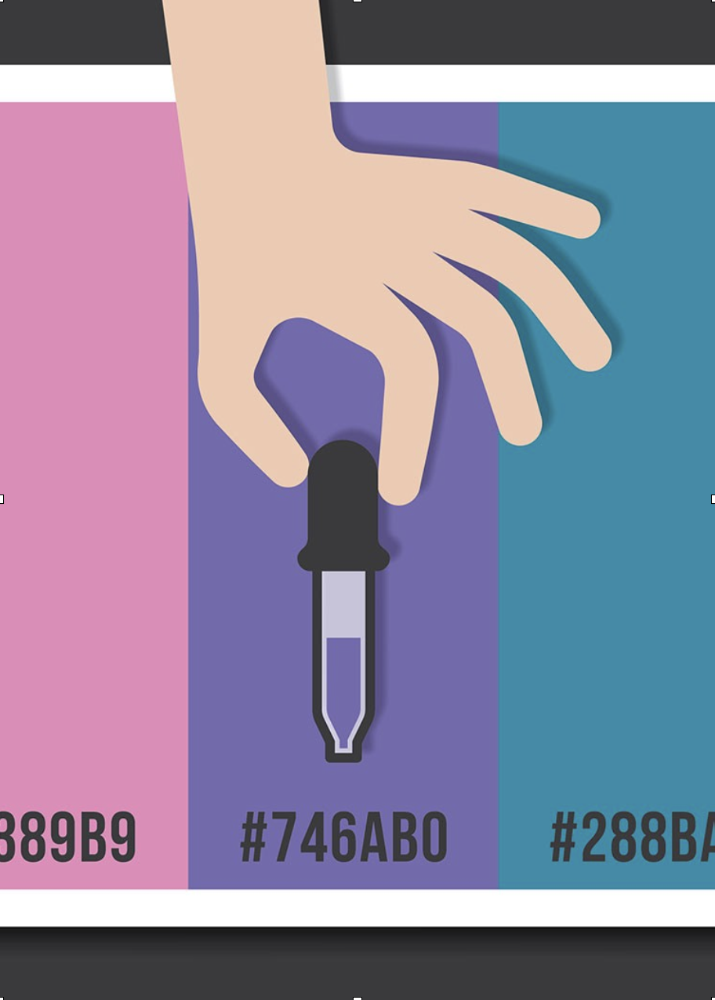

    <figcaption>
      <h3>Hexadecimal</h3>
      

        A hexadecimal colour code represents an RGB colour using six characters, such as <strong>#D94F70</strong>. Hex codes are commonly used to reproduce colours consistently in websites and other digital interfaces.
      

    </figcaption>
  </figure>

> **Remember:** HSB and HSV describe the same basic model; some software uses the term **Brightness**, while other systems use **Value**.

## Colour Schemes

A colour scheme is a structured relationship between colours on the colour wheel. For this activity, create one palette using each of the five schemes below.

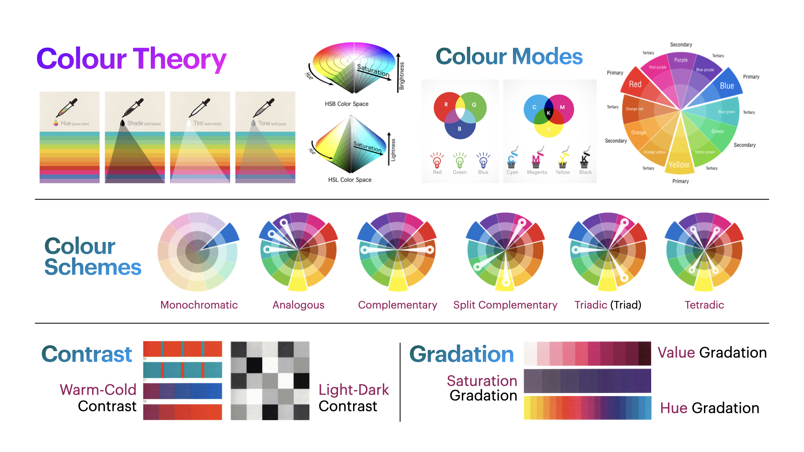

  <!-- Monochromatic -->
  <figure class="gestalt-principle-card">
    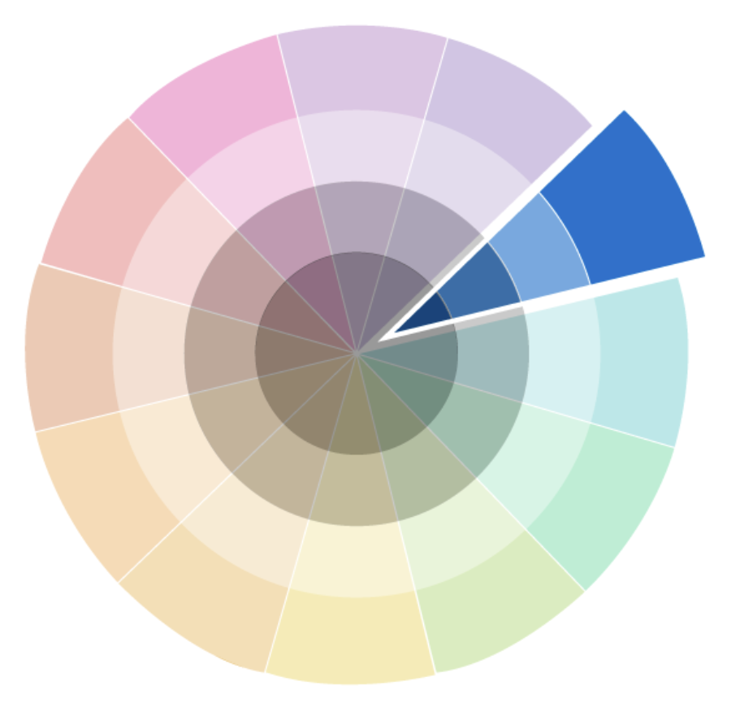

    <figcaption>
      <h3>Monochromatic</h3>
      

        Uses variations of a single hue. Differences in saturation, brightness, or lightness create contrast while maintaining a unified colour identity.
      

    </figcaption>
  </figure>

  <!-- Complementary -->
  <figure class="gestalt-principle-card">
    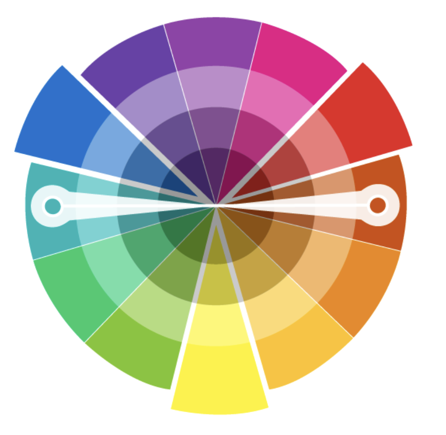

    <figcaption>
      <h3>Complementary</h3>
      

        Uses colours positioned opposite each other on the colour wheel. Their strong difference creates visual contrast and emphasis.
      

    </figcaption>
  </figure>

  <!-- Analogous -->
  <figure class="gestalt-principle-card">
    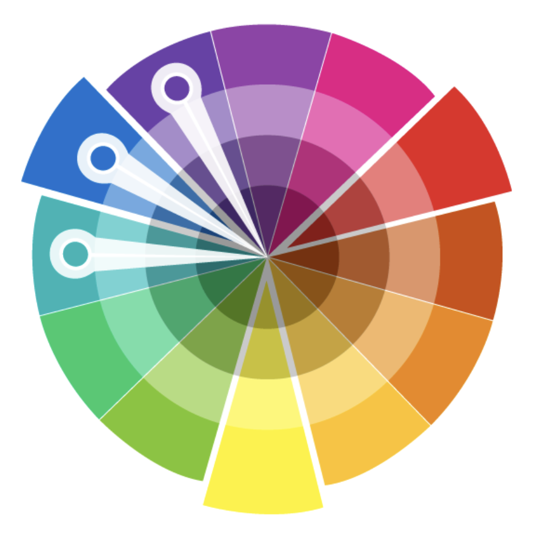

    <figcaption>
      <h3>Analogous</h3>
      

        Uses colours located next to each other on the colour wheel. Their shared characteristics create continuity and gradual visual transitions.
      

    </figcaption>
  </figure>

  <!-- Triadic -->
  <figure class="gestalt-principle-card">
    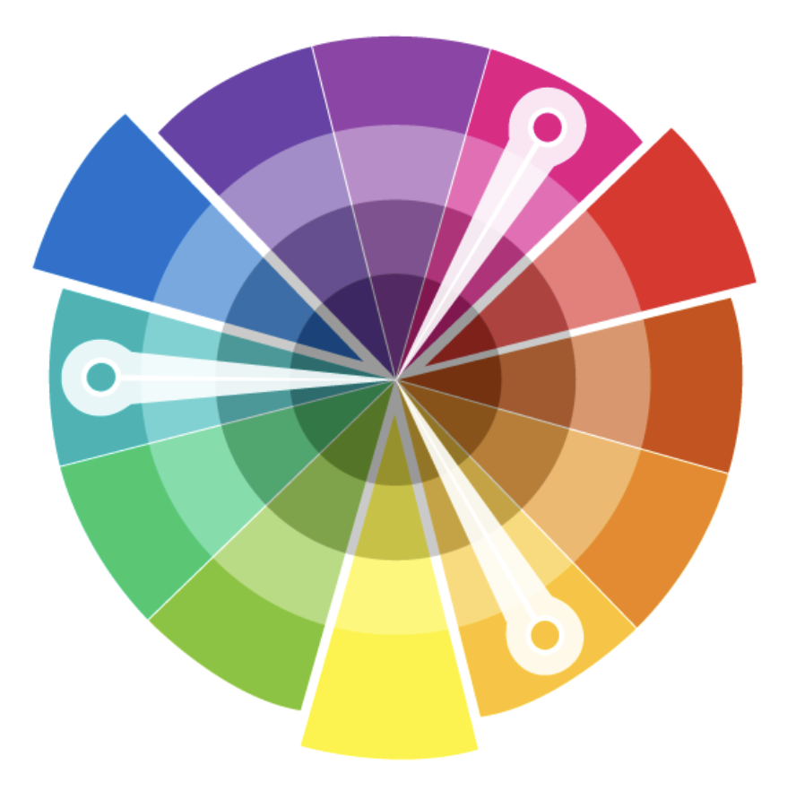

    <figcaption>
      <h3>Triadic</h3>
      

        Uses three colours distributed evenly around the colour wheel. The relationship can create variety while maintaining visual balance.
      

    </figcaption>
  </figure>

  <!-- Split Complementary -->
  <figure class="gestalt-principle-card">
    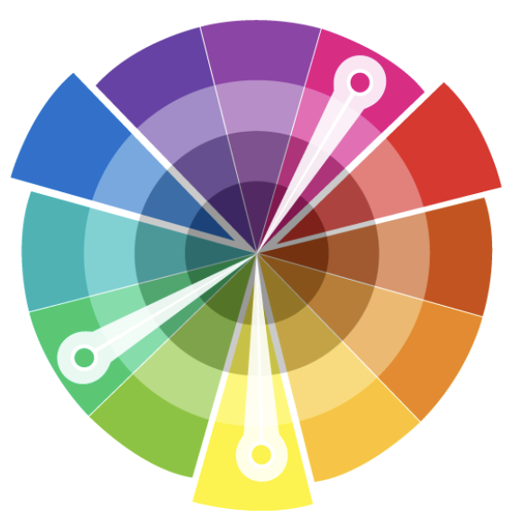

    <figcaption>
      <h3>Split Complementary</h3>
      

        Uses one base colour and the two colours adjacent to its complement. It creates strong contrast while offering more variation and less visual tension than a direct complementary scheme.
      

    </figcaption>
  </figure>

  <!-- Tetradic -->
  <figure class="gestalt-principle-card">
    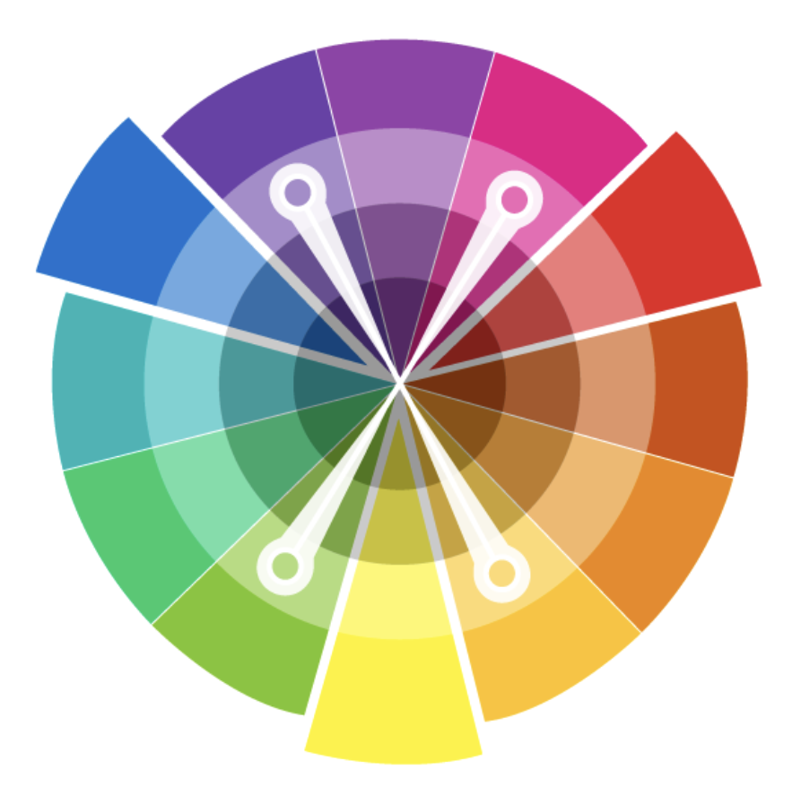

    <figcaption>
      <h3>Tetradic / Square</h3>
      

        Uses four colours spaced evenly around the colour wheel. Because the palette contains several strong colour relationships, careful proportioning is important.
      

    </figcaption>
  </figure>

## Johannes Itten — Colour Relationships

Johannes Itten explored how colours change visually according to their relationships with surrounding colours. For this activity, consider **contrast, perspective, and gradation** when applying colour to your compositions.

  <!-- Colour Contrast -->
  <figure class="gestalt-principle-card">
    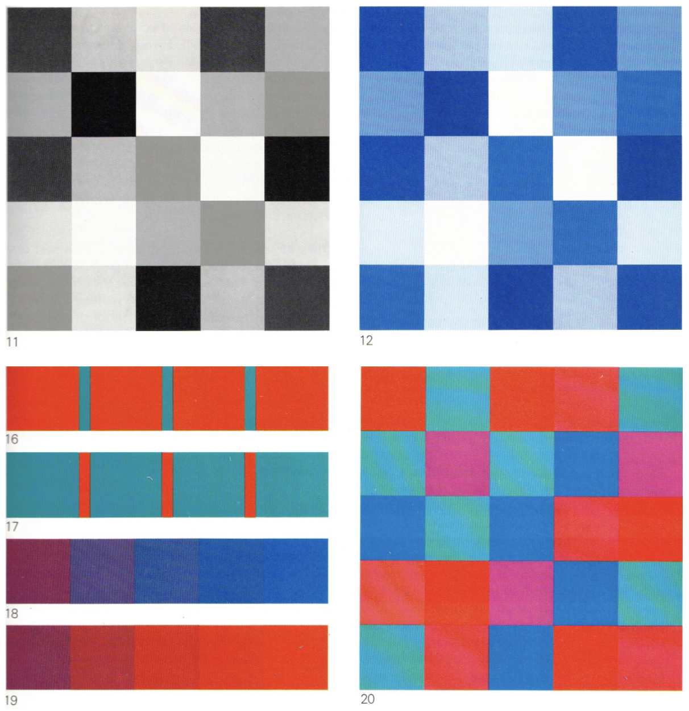

    <figcaption>
      <h3>Colour Contrast</h3>
      

        Colour contrast occurs when differences between colours make their relationship more visible. Contrast may be created through hue, light and dark, warm and cool colours, complementary relationships, saturation, or differences in the amount of colour.
      

    </figcaption>
  </figure>

  <!-- Colour Perspective -->
  <figure class="gestalt-principle-card">
    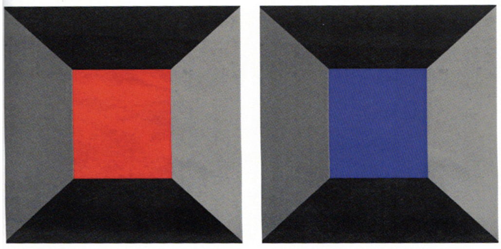

    <figcaption>
      <h3>Colour Perspective</h3>
      

        Colour can create the impression of spatial depth. Warm, bright, or highly saturated colours may appear to advance, while cooler, darker, or less saturated colours may appear to recede.
      

    </figcaption>
  </figure>

  <!-- Colour Gradation -->
  <figure class="gestalt-principle-card">
    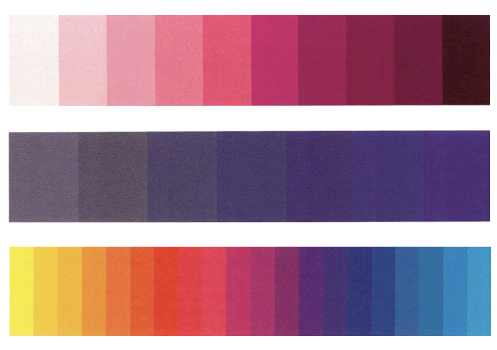

    <figcaption>
      <h3>Colour Gradation</h3>
      

        Colour gradation is a controlled progression from one colour condition to another. Gradual changes in hue, saturation, brightness, or lightness can create transition, rhythm, movement, and depth.
      

    </figcaption>
  </figure>

> **Source:** Johannes Itten, <em>The Art of Color</em>. Use these concepts to analyze how colour relationships change the visual effect of a composition.

## Timothy Samara — Colour Proportioning

  <!-- Colour Proportioning -->
  <figure class="gestalt-principle-card">
    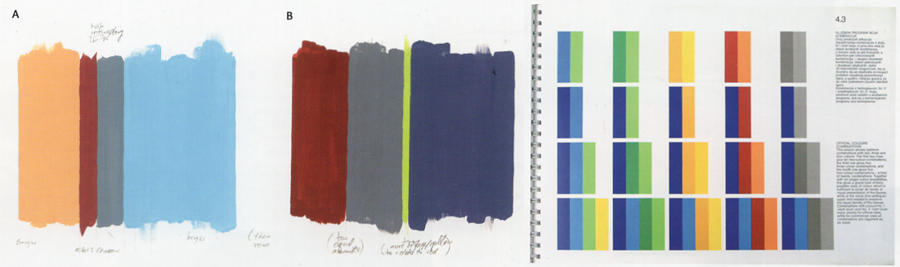

    <figcaption>
      <h3>Colour Proportioning</h3>
      

        Colour proportioning considers how much visual space each colour occupies. Changing the relative amount of a colour changes its visual weight, hierarchy, emphasis, and relationship to the other colours in the composition.
      

    </figcaption>
  </figure>

For this activity, **do not treat the six colours in a palette as equal**. Establish a deliberate relationship between:

- **Dominant colours** — occupy the largest areas
- **Secondary colours** — support the dominant colour
- **Accent colours** — occupy smaller areas and create emphasis

The proportions must first be designed and shown in each **colour palette sheet**. When you select three palettes for the final compositions, apply the corresponding proportioning system to each composition.

> **Important:** Colour proportioning is part of the composition. Two designs using exactly the same six colours can produce very different visual effects when the amount of each colour changes.

<!-- SECTION 2 -->

  

    2. Create the five colour palettes
    
      Develop five six-colour palettes and define an intentional colour proportion for each one.
    
  

## Create the colour schemes

Use [Adobe Color](https://color.adobe.com/){:target="_blank"} to create **five palettes**, each containing **six colours**.

Create one palette for each colour scheme:

1. **Monochromatic**
2. **Complementary**
3. **Analogous**
4. **Triadic**
5. **Tetradic (Square)**

Experiment with:

- Hue
- Saturation
- Brightness
- Value
- Relationships between dominant and secondary colours

Save the **Hex codes** for all six colours.

<iframe src="https://www.iorad.com/player/2502344/Adobe--Colour-Palette-Generator?src=iframe&oembed=1" width="100%" height="500px" style="width: 100%; height: 500px; border-bottom: 1px solid #ccc;" referrerpolicy="strict-origin-when-cross-origin" frameborder="0" webkitallowfullscreen="webkitallowfullscreen" mozallowfullscreen="mozallowfullscreen" allowfullscreen="allowfullscreen" allow="camera; microphone; clipboard-write;" sandbox="allow-scripts allow-forms allow-same-origin allow-presentation allow-downloads allow-modals allow-popups allow-popups-to-escape-sandbox allow-top-navigation allow-top-navigation-by-user-activation"></iframe>

## Define the colour proportioning

For **each palette**, decide how much visual space each of the six colours should occupy.

The six colours do not need to appear in equal amounts.

Consider:

- Which colour will be **dominant**
- Which colours will occupy **secondary areas**
- Which colours will function as **accents**
- The visual intensity of each colour
- How large and small areas of colour interact

Define a percentage for every colour. Together, the six proportions must equal **100%**.

For example:

| Colour | Intended proportion |
|---|---:|
| Colour 1 | 40% |
| Colour 2 | 25% |
| Colour 3 | 15% |
| Colour 4 | 10% |
| Colour 5 | 7% |
| Colour 6 | 3% |
| **Total** | **100%** |

> The percentages above are only an example. Design a different proportion according to the visual relationships within each palette.

The proportion must also be **visible in the design of the palette sheet**. Do not present all six colours as identical-sized swatches if they have different intended proportions.

> **Samara — Colour Proportioning:** Consider colour not only by hue, but by the relative amount of space each colour occupies. Changing the proportion of colours changes hierarchy, emphasis, balance, and the overall visual effect of the palette.

<!-- SECTION 2 -->

  

    2. Design the five colour palette sheets
    
      Build five consistent and professionally organized palette sheets that communicate colour values and proportions clearly.
    
  

Create **one Illustrator file containing five artboards**, one for each palette.

## Document setup

Use:

- **Units:** Pixels
- **Size:** 1000 × 1000 px
- **Aspect ratio:** 1:1
- **Colour mode:** RGB
- **Bleed:** 10 px on all sides
- **Raster effects:** High, 300 PPI
- **Artboards:** 5
- **Spacing:** 30 px
- **Filename:** `Lastname-Firstname-CompTech2-ColourPalettes.ai`

> **Required tutorial:** Follow the document setup tutorial step by step. It contains the required document settings, artboards, margins, bleed, and file organization.

<iframe src="https://www.iorad.com/player/2588725/Adobe-Illustrator-8--Document-Setup-?src=iframe&oembed=1" width="100%" height="500px" style="width: 100%; height: 500px; border-bottom: 1px solid #ccc;" referrerpolicy="strict-origin-when-cross-origin" frameborder="0" webkitallowfullscreen="webkitallowfullscreen" mozallowfullscreen="mozallowfullscreen" allowfullscreen="allowfullscreen" allow="camera; microphone; clipboard-write;" sandbox="allow-scripts allow-forms allow-same-origin allow-presentation allow-downloads allow-modals allow-popups allow-popups-to-escape-sandbox allow-top-navigation allow-top-navigation-by-user-activation"></iframe>

## Design each palette sheet

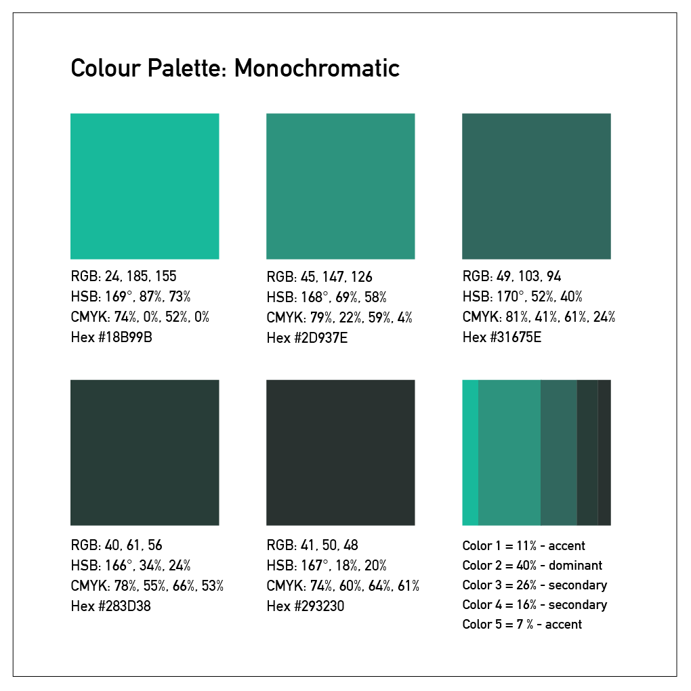

Each artboard must include:

- The **name of the colour scheme**
- Six colour swatches
- The intended **percentage/proportion** of each colour
- A visual representation of the colour proportioning
- **RGB** values
- **CMYK** values
- **Hex code**
- **HSV** values

The palette sheet is itself a **design composition**. Do not simply place six colour boxes and labels on the artboard.

Consider:

- **Placement:** Position information intentionally within the artboard.
- **Alignment:** Establish clear alignments between swatches, values, titles, and labels.
- **Spacing:** Maintain consistent distances between related elements.
- **Hierarchy:** Make the palette name, colours, proportions, and technical information easy to distinguish.
- **Typography:** Use a readable font and appropriate font sizes.
- **Legibility:** Ensure text remains readable against its background.
- **Consistency:** Use the same visual system across all five palette sheets.
- **Proportion:** Make the relative amount of each colour visually understandable.

You may vary the proportions of the colour areas while keeping the overall layout system consistent across all five artboards.

> All five artboards should look like parts of the same designed set. Changes between pages should come primarily from the colour palettes and their proportions, not from unrelated layouts or typography.

## Check the colour information

To check a colour in Adobe Illustrator:

1. Select the coloured shape.
2. Double-click the **Fill** tool.
3. Record the required RGB, CMYK, Hex, and HSV information.

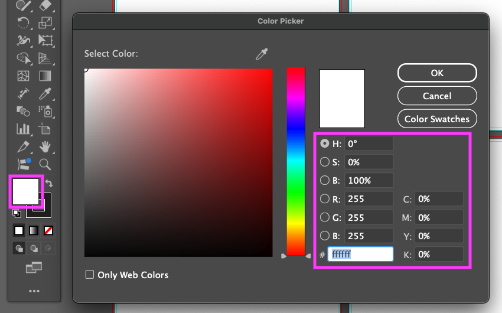

<!-- SECTION 3 -->

  

    3. Select three palettes and compositions
    
      Select three colour systems and three previous compositions, then plan how each palette proportion will operate in the selected design.
    
  

Select **three of the five palettes**.

Then select **three different compositions** created for Composition Techniques I – Parts 1 and 2.

Assign one selected palette to each composition.

| Final composition | Selected previous composition | Selected palette | Required colour approach |
|---|---|---|---|
| **1** | Your choice | Palette 1 | Apply the palette's designed colour proportion |
| **2** | Your choice | Palette 2 | Apply the palette's designed colour proportion |
| **3** | Your choice | Palette 3 | Apply the palette's designed colour proportion |

Use **three different palettes**.

Duplicate the original Illustrator files before editing. **Do not overwrite your original Composition Techniques I files.**

## Plan the colour application

Before recolouring each composition, identify:

1. The dominant colour.
2. The secondary colours.
3. The accent colours.
4. The approximate percentage assigned to each colour.
5. Which parts of the existing composition will receive each colour.

The proportioning defined in the palette sheet must guide the final composition.

For example, if one colour represents approximately **40%** of your palette and another represents **5%**, those colours should not appear in approximately equal amounts in the final composition.

> You are applying a colour **system**, not simply choosing six colours from the palette.

<!-- SECTION 4 -->

  

    4. Apply colour proportioning to the three compositions
    
      Rework three previous compositions using the selected palettes and their established colour proportions.
    
  

Apply one selected palette to each composition.

For each composition:

1. Use all six colours from the selected palette.
2. Apply the **colour proportioning established on the palette sheet**.
3. Preserve the main formal structure of the original Composition Techniques I work.
4. Use colour to strengthen hierarchy, contrast, depth, grouping, movement, or emphasis.
5. Maintain a consistent relationship between dominant, secondary, and accent colours.
6. Refine the distribution by eye while remaining recognizably connected to the planned proportions.

The percentages do not need to be measured pixel by pixel. They should function as a clear visual guide for the relative amount of each colour.

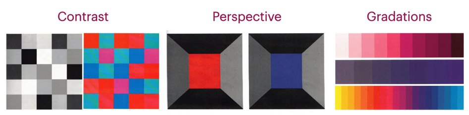

## Gradients

Gradients may be used when they support the selected palette and colour proportions.

<iframe src="https://www.iorad.com/player/2502356/Adobe-Illustrator--Colour-Gradients?src=iframe&oembed=1" width="100%" height="500px" style="width: 100%; height: 500px; border-bottom: 1px solid #ccc;" referrerpolicy="strict-origin-when-cross-origin" frameborder="0" webkitallowfullscreen="webkitallowfullscreen" mozallowfullscreen="mozallowfullscreen" allowfullscreen="allowfullscreen" allow="camera; microphone; clipboard-write;" sandbox="allow-scripts allow-forms allow-same-origin allow-presentation allow-downloads allow-modals allow-popups allow-popups-to-escape-sandbox allow-top-navigation allow-top-navigation-by-user-activation"></iframe>

## Coloured textures

When the selected Composition Techniques I work includes texture, you may colour the existing texture in Adobe Photoshop.

<iframe src="https://www.iorad.com/player/2502360/Adobe-Photoshop--Colour-Filters?src=iframe&oembed=1" width="100%" height="500px" style="width: 100%; height: 500px; border-bottom: 1px solid #ccc;" referrerpolicy="strict-origin-when-cross-origin" frameborder="0" webkitallowfullscreen="webkitallowfullscreen" mozallowfullscreen="mozallowfullscreen" allowfullscreen="allowfullscreen" allow="camera; microphone; clipboard-write;" sandbox="allow-scripts allow-forms allow-same-origin allow-presentation allow-downloads allow-modals allow-popups allow-popups-to-escape-sandbox allow-top-navigation allow-top-navigation-by-user-activation"></iframe>

<iframe src="https://www.iorad.com/player/2499031/Adobe-Illustrator-6--Importing-and-Masking-Images?src=iframe&oembed=1" width="100%" height="500px" style="width: 100%; height: 500px; border-bottom: 1px solid #ccc;" referrerpolicy="strict-origin-when-cross-origin" frameborder="0" webkitallowfullscreen="webkitallowfullscreen" mozallowfullscreen="mozallowfullscreen" allowfullscreen="allowfullscreen" allow="camera; microphone; clipboard-write;" sandbox="allow-scripts allow-forms allow-same-origin allow-presentation allow-downloads allow-modals allow-popups allow-popups-to-escape-sandbox allow-top-navigation allow-top-navigation-by-user-activation"></iframe>

> Embed all raster images before saving and exporting the Illustrator file.

<!-- SECTION 5 -->

  

    5. Review and export Composition Techniques II
    
      Check the palette design, colour proportions, three compositions, and required files before submitting.
    
  

<fieldset class="equipment-checklist">
  <legend>Final review checklist</legend>

  <label class="checklist-item">
    <input type="checkbox">
    
      <strong>Five colour schemes are included.</strong>
      Monochromatic, Complementary, Analogous, Triadic, and Tetradic palettes are present.
    
  </label>

  <label class="checklist-item">
    <input type="checkbox">
    
      <strong>Each palette contains six colours.</strong>
      Every colour includes the required RGB, CMYK, Hex, and HSV information.
    
  </label>

  <label class="checklist-item">
    <input type="checkbox">
    
      <strong>Each palette defines colour proportioning.</strong>
      The intended amount of each colour is identified and the complete palette equals 100%.
    
  </label>

  <label class="checklist-item">
    <input type="checkbox">
    
      <strong>The proportions are visually represented.</strong>
      Swatch sizes or an additional proportion diagram clearly communicate dominant, secondary, and accent colours.
    
  </label>

  <label class="checklist-item">
    <input type="checkbox">
    
      <strong>The palette sheets are carefully designed.</strong>
      Placement, alignment, spacing, hierarchy, typography, and legibility are intentional.
    
  </label>

  <label class="checklist-item">
    <input type="checkbox">
    
      <strong>The five palette sheets are consistent.</strong>
      They use the same underlying layout, typography, information structure, and visual system.
    
  </label>

  <label class="checklist-item">
    <input type="checkbox">
    
      <strong>Three different palettes are applied.</strong>
      Each final composition uses a different selected palette.
    
  </label>

  <label class="checklist-item">
    <input type="checkbox">
    
      <strong>The planned colour proportions are applied.</strong>
      The relative amount of each colour in the final compositions reflects the proportion developed in the corresponding palette sheet.
    
  </label>

  <label class="checklist-item">
    <input type="checkbox">
    
      <strong>The files remain technically complete.</strong>
      Required layers, guides, margins, editable vector elements, and embedded images remain available where applicable.
    
  </label>

</fieldset>

---

## Submission files

| Item | Required filename |
|---|---|
| Five colour palettes | `Lastname-Firstname-CompTech2-ColourPalettes.pdf` |
| Composition 1 | `Lastname-Firstname-CompTech2-1.pdf` |
| Composition 2 | `Lastname-Firstname-CompTech2-2.pdf` |
| Composition 3 | `Lastname-Firstname-CompTech2-3.pdf` |

Incorrect filenames, incomplete colour information, poorly organized palette sheets, missing colour proportions, inconsistent palette presentation, or compositions that do not apply the planned colour proportions will affect the grade.