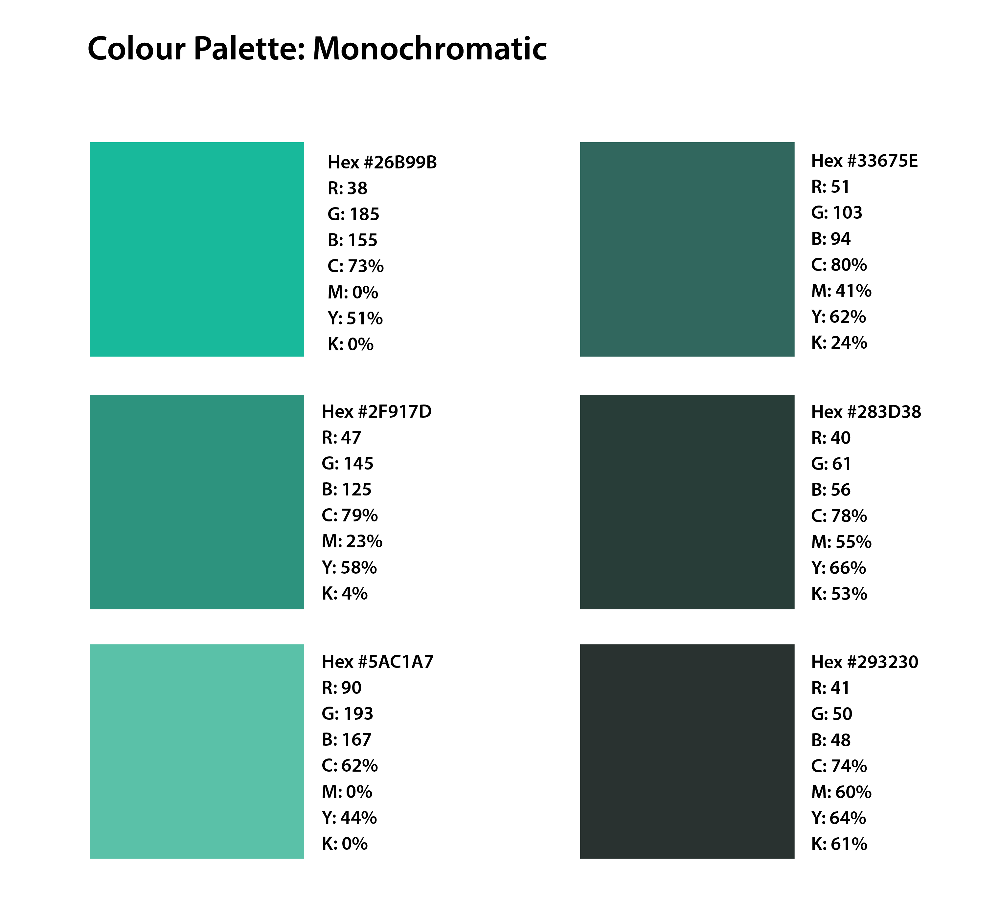

[MEDIA 2DF3](README.md)

-------------------------------------------------------------------------------

<h1 style="color: darkred;">Composition Techniques II – Colour Application</h1>

<figure style="width: 50vw; margin: auto;">
  
  <figcaption style="text-align: center; font-style: italic; margin-top: 0.5em;">
    Examples by previous students.
  </figcaption>
</figure>

## Objective
Create **five colour palettes** using the following colour schemes:
- Monochromatic  
- Complementary  
- Analogous  
- Triadic  
- Tetradic (Square)

Then apply **three of these palettes** to compositions you created in **Composition Techniques I (Parts 1 & 2)**.  
Each resulting composition should demonstrate a thoughtful use of colour, especially in relation to **contrast**, **perspective**, and **gradation**.

**Software**:
- **Adobe Illustrator** (vector-based visual composition)  
- **Adobe Photoshop** (for optional colour texturing and enhancement)

---

## Activities  
**Complete the following activities in order. Ask your professor for help if needed.**

---

<h3 style="color: darkred;">[30–40 min] Create Colour Palettes</h3>

### Using Adobe Color
- Go to <a href="https://color.adobe.com/" target="_blank" rel="noopener noreferrer">Adobe Color</a>
- Create **five colour palettes**, each containing **six swatches**, based on:
  - Monochromatic
  - Complementary
  - Analogous
  - Triadic
  - Tetradic (Square)
- Experiment with **hue, saturation, and brightness**
- Save the **hex codes** for each swatch in a safe place.

<iframe src="https://www.iorad.com/player/2502344/Adobe--Colour-Palette-Generator?src=iframe&oembed=1" width="100%" height="500px" style="width: 100%; height: 500px; border-bottom: 1px solid #ccc;" referrerpolicy="strict-origin-when-cross-origin" frameborder="0" webkitallowfullscreen="webkitallowfullscreen" mozallowfullscreen="mozallowfullscreen" allowfullscreen="allowfullscreen" allow="camera; microphone; clipboard-write;" sandbox="allow-scripts allow-forms allow-same-origin allow-presentation allow-downloads allow-modals allow-popups allow-popups-to-escape-sandbox allow-top-navigation allow-top-navigation-by-user-activation"></iframe>

---

### Document Setup (Required)  

> ⚠️ **You must follow the tutorial and file setup instructions exactly to avoid losing points.**  
> Skipping or incorrectly completing this step will affect your grade.

Before you begin, **watch the provided tutorial** on Illustrator document setup. Follow it step-by-step to create **one file for all compositions**.

<iframe src="https://www.iorad.com/player/2588725/Adobe-Illustrator-8--Document-Setup-?src=iframe&oembed=1" width="100%" height="500px" style="width: 100%; height: 500px; border-bottom: 1px solid #ccc;" referrerpolicy="strict-origin-when-cross-origin" frameborder="0" webkitallowfullscreen="webkitallowfullscreen" mozallowfullscreen="mozallowfullscreen" allowfullscreen="allowfullscreen" allow="camera; microphone; clipboard-write;" sandbox="allow-scripts allow-forms allow-same-origin allow-presentation allow-downloads allow-modals allow-popups allow-popups-to-escape-sandbox allow-top-navigation allow-top-navigation-by-user-activation"></iframe>

**Your Illustrator document must include the following settings:**
- **Units:** Pixels  
- **Size:** 1000 × 1000 px (1:1 aspect ratio)  
- **Color Mode:** RGB
- **Bleed:** 10 px (on all sides) 
- **Raster Effects:** High (300 PPI)
- **Artboards**: 5 (one for each palette)
- **Spacing:** 30 px 
- **Naming Protocol:** `Lastname-Firstname-ColourPalettes.ai`

These settings ensure your file is compatible with export and review processes. Files that do not follow the setup guidelines may be marked down.

---

### Create and Organize Your Palettes

Use the hex codes from Adobe Color to manually recreate and organize your palettes in Illustrator:

- Create **one palette per artboard** following the above example.
- Clearly **label each colour scheme** (e.g., Monochromatic, Analogous, etc.)
- For each swatch, include the following information:
  - **RGB values**
  - **CMYK values**
  - **Hex code**
  - **HSV (Hue, Saturation, Value)**
- Ensure your file is **visually organized** and professionally presented. Be intentional with **font choice**, **typographic hierarchy**, and the **placement** of labels and titles—this will contribute to the overall **visual identity** of your palette sheet.

To check the information about a color in Adobe Illustrator, select the shape with the color, then double-click on the **Fill** tool.  
You can view the **CMYK**, **RGB**, **Hex**, and **HSV** values here.

Alternatively, you can also choose the **Eyedropper Tool** from the Fill settings to sample colors directly from your artwork.

##### ❗ Why Colour Modes & Formats Matter

In professional design workflows, it is essential to understand and correctly apply colour models and values depending on the intended output.

- **RGB (Red, Green, Blue)** is used for **screen-based** media such as websites, digital ads, and video. It allows for bright, vibrant colours by combining light.  
- **CMYK (Cyan, Magenta, Yellow, Black)** is used for **print production**—this subtractive model ensures colours are accurately translated to physical formats like posters, packaging, and books.  
- **Hex codes** are a standard in **web design and development**, offering a six-digit alphanumeric representation of RGB colours that ensures consistency across browsers and devices.  
- **HSV (Hue, Saturation, Value)** is a model used to adjust colours intuitively in design tools—especially useful for refining tonal balance, contrast, and mood in an artwork.

> Setting up your colour palettes with these values ensures your work is **adaptable, consistent, and ready for real-world applications**—from digital publishing to professional printing and web deployment.

---

<h3 style="color: darkred;">[60–80 min] Add Colour to Previous Compositions</h3>

### Select Compositions
- Choose **three compositions** from **Composition Techniques I – Part 1 & 2**
- Duplicate your Illustrator files for editing (do not overwrite originals)
- Don’t forget to **embed all linked images** on Adobe Illustrator.

### Apply Your Colour Palettes  
Apply one of your custom palettes to each duplicated composition.  
Focus on:
- **Contrast** (light vs dark, warm vs cool)  
- **Perspective** (depth, spatial effect using colour)  
- **Gradation** (smooth transitions of hue, saturation, or brightness)
- **Naming Protocol:** `Lastname-Firstname-CompTech2-#.ai`

#### Use Gradients

<iframe src="https://www.iorad.com/player/2502356/Adobe-Illustrator--Colour-Gradients?src=iframe&oembed=1" width="100%" height="500px" style="width: 100%; height: 500px; border-bottom: 1px solid #ccc;" referrerpolicy="strict-origin-when-cross-origin" frameborder="0" webkitallowfullscreen="webkitallowfullscreen" mozallowfullscreen="mozallowfullscreen" allowfullscreen="allowfullscreen" allow="camera; microphone; clipboard-write;" sandbox="allow-scripts allow-forms allow-same-origin allow-presentation allow-downloads allow-modals allow-popups allow-popups-to-escape-sandbox allow-top-navigation allow-top-navigation-by-user-activation"></iframe>

#### Add Coloured Textures in Photoshop

<iframe src="https://www.iorad.com/player/2502360/Adobe-Photoshop--Colour-Filters?src=iframe&oembed=1" width="100%" height="500px" style="width: 100%; height: 500px; border-bottom: 1px solid #ccc;" referrerpolicy="strict-origin-when-cross-origin" frameborder="0" webkitallowfullscreen="webkitallowfullscreen" mozallowfullscreen="mozallowfullscreen" allowfullscreen="allowfullscreen" allow="camera; microphone; clipboard-write;" sandbox="allow-scripts allow-forms allow-same-origin allow-presentation allow-downloads allow-modals allow-popups allow-popups-to-escape-sandbox allow-top-navigation allow-top-navigation-by-user-activation"></iframe>

<iframe src="https://www.iorad.com/player/2499031/Adobe-Illustrator-6--Importing-and-Masking-Images?src=iframe&oembed=1" width="100%" height="500px" style="width: 100%; height: 500px; border-bottom: 1px solid #ccc;" referrerpolicy="strict-origin-when-cross-origin" frameborder="0" webkitallowfullscreen="webkitallowfullscreen" mozallowfullscreen="mozallowfullscreen" allowfullscreen="allowfullscreen" allow="camera; microphone; clipboard-write;" sandbox="allow-scripts allow-forms allow-same-origin allow-presentation allow-downloads allow-modals allow-popups allow-popups-to-escape-sandbox allow-top-navigation allow-top-navigation-by-user-activation"></iframe>

---

<h3 style="color: darkred;">📥 Final Submission</h3>

Submit the following:

1. A **single PDF file** containing your **five colour palettes**  
   - `Lastname-Firstname-CompTech2-ColourPalettes.pdf`

2. **Three separate PDF files** for your **coloured compositions**  
   - `Lastname-Firstname-CompTech2-1.pdf`  
   - `Lastname-Firstname-CompTech2-2.pdf`  
   - `Lastname-Firstname-CompTech2-3.pdf`

> 📌 **Failure to follow document setup or naming instructions may result in a grade deduction.**

---
