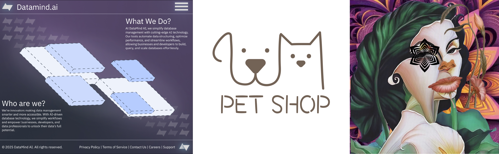
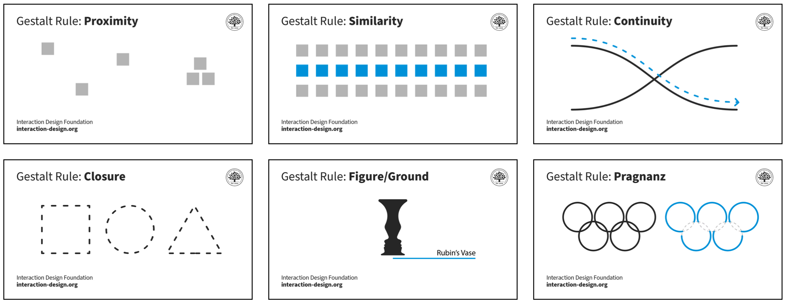

[MEDIA 2DF3](README.md)

-------------------------------------------------------------------------------

<h1 style="color: darkred;">Composition Techniques III – Part 1</h1>

<figure style="width: 80vw; margin: auto;">
  
  <figcaption style="text-align: center; font-style: italic; margin-top: 0.5em;">
    Examples by previous students.
  </figcaption>
</figure>

## Objective

Create **three digital compositions**, each combining **two different Gestalt Principles of Design** from the list below:  
1. Proximity  
2. Similarity  
3. Continuity  
4. Closure  
5. Figure/Ground  
6. Prägnanz

Each composition should demonstrate how the selected principles interact to affect **form**, **structure**, and **visual perception**.  
Use what you’ve learned so far (e.g., layout, grids, colour theory, texture) along with the **new Gestalt concepts and examples** introduced in class to produce designs that are **intentional**, **engaging**, and **format-aware**.

## Software** 
- **Adobe Illustrator** (vector-based) – for general layout, shapes, and composition setup  
- **Adobe Photoshop** (pixel-based) – for textures, photomontage, or image-based enhancements

## Activities  
**Complete the following activities in order. Ask your professor for help if needed.**

---

<h3 style="color: darkred;">[15–20 min] Sketching</h3>

You may sketch using a **digital or physical notebook**.  
According to Wikipedia, a sketch is “a rapidly executed freehand drawing that is not usually intended as a finished work.”

#### Task:
- Sketch **three compositions** (one per format), each combining **two different Gestalt principles** from the list above.
- Explore how these principles interact visually to create structure and meaning.

#### Composition Formats (Choose one per sketch):
- **Graphic Design** → Logo or Poster  
- **UI Design** → One-page website mockup or App intro + second screen  
- **Photomontage** → A photographic composition using collage and texture  

#### Focus on:
- Artistic experimentation – explore **unexpected visual relationships**  
- Communication – ensure Gestalt principles support **clarity and impact**  
- Negative space and layering – enhance **visual hierarchy**  
- Viewer experience – guide the eye and create **unity in complexity**  
- Colour & contrast – use them to support perceptual grouping and focus  

> Ask the professor for feedback during sketching!

---

<h3 style="color: darkred;">[15 min] Setup</h3>

Set up your documents in **Adobe Illustrator** and/or **Photoshop** based on the format of each composition.  
You must follow the appropriate setup tutorial and use correct **file naming** conventions.

---

### Graphic Design (Logo or Poster)  

- **Primary Software**: Adobe Illustrator
- **Optional**: Adobe Photoshop (for prepping raster images)
- **Naming Protocol**: `Lastname-Firstname-CompTech3-1.ai`
- Don’t forget to **embed all linked images**.

#### Follow these tutorials to properly set up your document

<iframe src="https://www.iorad.com/player/2516211/Adobe-Illustrator--Logo-Setup?src=iframe&oembed=1" width="100%" height="500px" style="width: 100%; height: 500px; border-bottom: 1px solid #ccc;" referrerpolicy="strict-origin-when-cross-origin" frameborder="0" webkitallowfullscreen="webkitallowfullscreen" mozallowfullscreen="mozallowfullscreen" allowfullscreen="allowfullscreen" allow="camera; microphone; clipboard-write;" sandbox="allow-scripts allow-forms allow-same-origin allow-presentation allow-downloads allow-modals allow-popups allow-popups-to-escape-sandbox allow-top-navigation allow-top-navigation-by-user-activation"></iframe>

<iframe src="https://www.iorad.com/player/2516192/Adobe-Illustrator--Poster-Setup?src=iframe&oembed=1" width="100%" height="500px" style="width: 100%; height: 500px; border-bottom: 1px solid #ccc;" referrerpolicy="strict-origin-when-cross-origin" frameborder="0" webkitallowfullscreen="webkitallowfullscreen" mozallowfullscreen="mozallowfullscreen" allowfullscreen="allowfullscreen" allow="camera; microphone; clipboard-write;" sandbox="allow-scripts allow-forms allow-same-origin allow-presentation allow-downloads allow-modals allow-popups allow-popups-to-escape-sandbox allow-top-navigation allow-top-navigation-by-user-activation"></iframe>

#### Recommended tutorials

<iframe width="560" height="315" src="https://www.youtube.com/embed/8kz0bZQDm60?si=H4R5TaLiks80geV6" title="YouTube video player" frameborder="0" allow="accelerometer; autoplay; clipboard-write; encrypted-media; gyroscope; picture-in-picture; web-share" referrerpolicy="strict-origin-when-cross-origin" allowfullscreen></iframe>

<iframe width="560" height="315" src="https://www.youtube.com/embed/AUxtDCyaPFg?si=u9MD48P1sKyNpx8K" title="YouTube video player" frameborder="0" allow="accelerometer; autoplay; clipboard-write; encrypted-media; gyroscope; picture-in-picture; web-share" referrerpolicy="strict-origin-when-cross-origin" allowfullscreen></iframe>

<iframe width="560" height="315" src="https://www.youtube.com/embed/svd4WQE_92Y?si=O0_aL82zce8HYo40" title="YouTube video player" frameborder="0" allow="accelerometer; autoplay; clipboard-write; encrypted-media; gyroscope; picture-in-picture; web-share" referrerpolicy="strict-origin-when-cross-origin" allowfullscreen></iframe>

---

### UI/UX Design (Website or App Screens)  

- **Primary Software**: Adobe Illustrator
- **Optional**: Adobe Photoshop (for preparing assets/images)
- **Naming Protocol**: `Lastname-Firstname-CompTech3-2.ai`
- Don’t forget to **embed all linked images**.

#### Follow these tutorials to properly set up your document

<iframe src="https://www.iorad.com/player/2516233/Adobe-Illustrator--Website-Setup?src=iframe&oembed=1" width="100%" height="500px" style="width: 100%; height: 500px; border-bottom: 1px solid #ccc;" referrerpolicy="strict-origin-when-cross-origin" frameborder="0" webkitallowfullscreen="webkitallowfullscreen" mozallowfullscreen="mozallowfullscreen" allowfullscreen="allowfullscreen" allow="camera; microphone; clipboard-write;" sandbox="allow-scripts allow-forms allow-same-origin allow-presentation allow-downloads allow-modals allow-popups allow-popups-to-escape-sandbox allow-top-navigation allow-top-navigation-by-user-activation"></iframe>

<iframe src="https://www.iorad.com/player/2516262/Adobe-Illustrator--App-Design-Setup?src=iframe&oembed=1" width="100%" height="500px" style="width: 100%; height: 500px; border-bottom: 1px solid #ccc;" referrerpolicy="strict-origin-when-cross-origin" frameborder="0" webkitallowfullscreen="webkitallowfullscreen" mozallowfullscreen="mozallowfullscreen" allowfullscreen="allowfullscreen" allow="camera; microphone; clipboard-write;" sandbox="allow-scripts allow-forms allow-same-origin allow-presentation allow-downloads allow-modals allow-popups allow-popups-to-escape-sandbox allow-top-navigation allow-top-navigation-by-user-activation"></iframe>

---

### Photomontage  

- **Primary Software**: Adobe Photoshop
- **Optional**: Adobe Illustrator ((for preparing or exporting vector-based elements)
- **Naming Protocol**: `Lastname-Firstname-CompTech3-2.psd`

#### Follow these tutorials to properly set up your document

#### Recommended tutorials

<iframe width="560" height="315" src="https://www.youtube.com/embed/icNXrgD08qE?si=m7zAQ1JK1wQHwAP4" title="YouTube video player" frameborder="0" allow="accelerometer; autoplay; clipboard-write; encrypted-media; gyroscope; picture-in-picture; web-share" referrerpolicy="strict-origin-when-cross-origin" allowfullscreen></iframe>

<iframe width="560" height="315" src="https://www.youtube.com/embed/iOYz669WNpU?si=24OeqEx7oEo1Qe7n" title="YouTube video player" frameborder="0" allow="accelerometer; autoplay; clipboard-write; encrypted-media; gyroscope; picture-in-picture; web-share" referrerpolicy="strict-origin-when-cross-origin" allowfullscreen></iframe>

---

<h3 style="color: darkred;">[Rest of class] Create Your Compositions</h3>

Ask yourself as you work:
- Are the **Gestalt principles clearly integrated** and visually understandable?
- Does the composition **guide the viewer’s eye** effectively?
- Are **form, space, contrast, and balance** working together harmoniously?
- Does the final output align with your **sketch and chosen format**?

---

<h3 style="color: darkred;">📥 Final Submission</h3>

Submit the following:

1. A **single PDF** file containing your **three sketches**  
   - Naming: `Lastname-Firstname-CompTech3-Sketches.pdf`

2. **Three separate PDF files**, one for each **digital composition**  
   - **Naming:** `Lastname-Firstname-CompTech3-1.pdf`
   - **Naming:** `Lastname-Firstname-CompTech3-2.pdf`
   - **Naming:** `Lastname-Firstname-CompTech3-3.pdf`

3. **Two-sentence description for each composition**  
   - Post directly into **Avenue to Learn** (not as a file)  
   - Each description must briefly explain the concept and identify the Gestalt principles used  

**Example**:  
> "This composition explores urban isolation through the use of Figure/Ground and Continuity. The contrast between overlapping silhouettes and blurred cityscapes emphasizes the fragmented experience of city life."

> ❗ **Follow submission and naming instructions carefully to avoid losing points.**

---
