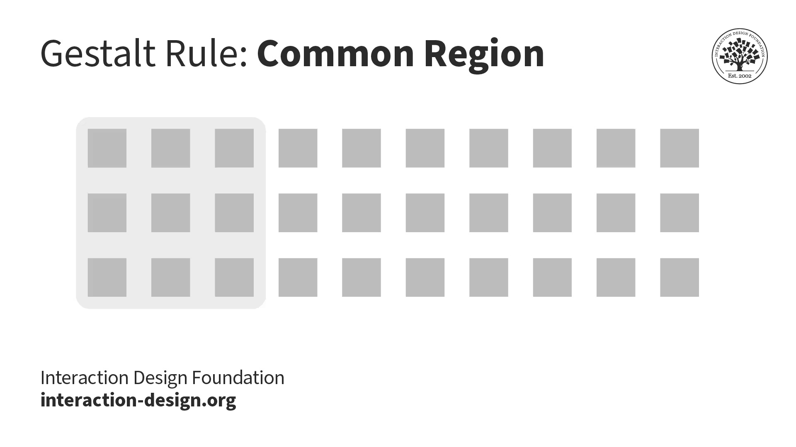
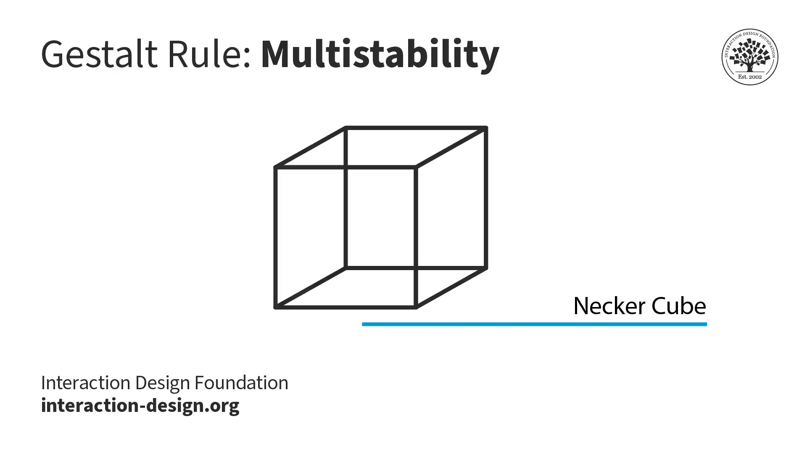

[MEDIAART 2DF3](README.md)

# Composition Techniques III – Part 1

## Goal

Design and create **three digital compositions** that integrate visual styles, Gestalt principles, and practical design rules across three different formats.

Each composition must combine:

- **One design format**
- **One style pairing** from the five options provided
- **Two Gestalt principles** assigned to that style
- **Two rules** from Timothy Samara’s *20 Rules for Making Good Design*
- **One clear concept** that guides the visual and formal decisions

## Activity overview

- **Formats:** One logo, one one-page website mockup, and one photomontage
- **Style options:** Art Nouveau, DORFic, Utopian Scholastic, Memphis Design, and Olderbrothercore
- **Gestalt principles:** Emergence, Closure, Common Region, Continuity, Proximity, and Multistability
- **Software:** Adobe Illustrator and Adobe Photoshop

## Accessibility and learning support

- The written instructions on this page contain the required steps. Embedded videos provide additional demonstrations.
- You may use zoom, screen magnification, keyboard navigation, adapted input devices, or other assistive technology.
- If sketching, photography, using Illustrator or Photoshop, or completing another required process creates an access barrier, contact the instructor to arrange an alternative method that demonstrates the same learning outcomes.
- Make the analysis PDF text-based, with selectable text, clear headings, strong contrast, and a logical reading order.

## Complete the activity in six stages

Complete the following stages in order.

<!-- 
/////////////////
SECTION 1
/////////////////
-->

  

    Stage 1: Review the Concepts
    
      Review the Gestalt principles, art styles, and design rules before planning your compositions.
    
  

  

  <!-- 
/////////////////
SUB-SECTION A
/////////////////
-->

  

    Review the Gestalt Principles
    
      Review how viewers recognize forms, follow visual paths, group elements, and interpret ambiguous images.
    
  

  

    

      <!-- Emergence -->
      <figure class="gestalt-principle-card">
        

        <figcaption>
          <h3 role="heading" aria-level="5">Emergence</h3>
          

            The viewer perceives a recognizable whole before identifying its individual parts. A larger image or form emerges from separate visual elements.
          

        </figcaption>
      </figure>

      <!-- Closure -->
      <figure class="gestalt-principle-card">
        

        <figcaption>
          <h3 role="heading" aria-level="5">Closure</h3>
          

            The viewer fills gaps and completes incomplete forms when enough visual information suggests a recognizable shape or whole.
          

        </figcaption>
      </figure>

      <!-- Common Region -->
      <figure class="gestalt-principle-card">
        

        <figcaption>
          <h3 role="heading" aria-level="5">Common Region</h3>
          

            Elements placed inside the same enclosed area are perceived as belonging together, even when they are similar to elements outside that area.
          

        </figcaption>
      </figure>

      <!-- Continuity -->
      <figure class="gestalt-principle-card">
        

        <figcaption>
          <h3 role="heading" aria-level="5">Continuity</h3>
          

            Elements that follow the same line, curve, or direction are perceived as connected. The viewer’s eye continues along the visual path even when it crosses another element.
          

        </figcaption>
      </figure>

      <!-- Proximity -->
      <figure class="gestalt-principle-card">
        

        <figcaption>
          <h3 role="heading" aria-level="5">Proximity</h3>
          

            Elements placed close together are perceived as a group. Greater distance separates elements and suggests different relationships.
          

        </figcaption>
      </figure>

      <!-- Multistability -->
      <figure class="gestalt-principle-card">
        

        <figcaption>
          <h3 role="heading" aria-level="5">Multistability</h3>
          

            An ambiguous image can support more than one interpretation. The viewer’s perception shifts between possible readings, but the interpretations are not usually perceived at the same time.
          

        </figcaption>
      </figure>

    

    

      Reference images:
      <a
        href="https://ixdf.org/literature/topics/gestalt-principles"

        rel="noopener noreferrer"
      >
        Interaction Design Foundation, CC BY-SA 4.0
      </a>.
    

  

    <!-- 
    /////////////////
    SUB-SECTION B
    /////////////////
    -->

    

      

        Review the Art Styles
        
          Review the visual characteristics, historical context, and design approaches associated with the five styles used in this activity.
        
      

      

        

          <!-- Art Nouveau -->
          <article class="style-review-row">

            

              <video controls preload="metadata">
                <source src="imgs/art-nouveau.mp4" type="video/mp4">
                Your browser does not support embedded video.
              </video>
            

            

              <h3 role="heading" aria-level="5">Art Nouveau</h3>

              

                Art Nouveau uses flowing lines, organic shapes, botanical forms, decorative borders, and integrated relationships between image and typography.
              

              <h4 role="heading" aria-level="6">Relevant links</h4>

              <ul>
                <li>
                  <a
                    href="https://aesthetics.fandom.com/wiki/Art_Nouveau"

                    rel="noopener noreferrer"
                  >
                    Art Nouveau overview
                  </a>
                  

                    A brief introduction to the movement, its historical context, and its main visual characteristics.
                  

                </li>

                <li>
                  <a
                    href="https://www.google.com/search?tbm=isch&amp;q=Art+Nouveau"

                    rel="noopener noreferrer"
                  >
                    Art Nouveau examples
                  </a>
                  

                    A collection of posters, illustrations, architecture, and decorative design associated with the style.
                  

                </li>
              </ul>
            

          </article>

          <!-- DORFic -->
          <article class="style-review-row">

            

              <video controls preload="metadata">
                <source src="imgs/dorfic.mp4" type="video/mp4">
                Your browser does not support embedded video.
              </video>
            

            

              <h3 role="heading" aria-level="5">DORFic</h3>

              

                DORFic combines restrained geometry, fine lines, technological imagery, translucent layers, neutral space, and interface-like visual systems.
              

              <h4 role="heading" aria-level="6">Relevant links</h4>

              <ul>
                <li>
                  <a
                    href="https://aesthetics.fandom.com/wiki/DORFic"

                    rel="noopener noreferrer"
                  >
                    DORFic overview
                  </a>
                  

                    An introduction to the visual language and digital design context associated with DORFic.
                  

                </li>

                <li>
                  <a
                    href="https://www.google.com/search?tbm=isch&amp;q=DORFic"

                    rel="noopener noreferrer"
                  >
                    DORFic examples
                  </a>
                  

                    Examples of layouts, interfaces, graphics, and technological imagery connected to the style.
                  

                </li>
              </ul>
            

          </article>

          <!-- Utopian Scholastic -->
          <article class="style-review-row">

            

              <video controls preload="metadata">
                <source src="imgs/utopian-scholastic.mp4" type="video/mp4">
                Your browser does not support embedded video.
              </video>
            

            

              <h3 role="heading" aria-level="5">Utopian Scholastic</h3>

              

                Utopian Scholastic uses diagrams, archival photographs, educational imagery, classical typography, labels, and carefully organized information.
              

              <h4 role="heading" aria-level="6">Relevant links</h4>

              <ul>
                <li>
                  <a
                    href="https://aesthetics.fandom.com/wiki/Utopian_Scholastic"

                    rel="noopener noreferrer"
                  >
                    Utopian Scholastic overview
                  </a>
                  

                    A description of the style’s use of educational, archival, scientific, and institutional visual references.
                  

                </li>

                <li>
                  <a
                    href="https://www.google.com/search?tbm=isch&amp;q=Utopian+Scholastic"

                    rel="noopener noreferrer"
                  >
                    Utopian Scholastic examples
                  </a>
                  

                    Examples of editorial layouts, diagrams, informational graphics, and research-based compositions.
                  

                </li>
              </ul>
            

          </article>

          <!-- Memphis Design -->
          <article class="style-review-row">

            

              <video controls preload="metadata">
                <source src="imgs/memphis-design.mp4" type="video/mp4">
                Your browser does not support embedded video.
              </video>
            

            

              <h3 role="heading" aria-level="5">Memphis Design</h3>

              

                Memphis Design uses bold geometry, repeated patterns, contrasting colours, dots, stripes, squiggles, and deliberately playful arrangements.
              

              <h4 role="heading" aria-level="6">Relevant links</h4>

              <ul>
                <li>
                  <a
                    href="https://aesthetics.fandom.com/wiki/Memphis_Design"

                    rel="noopener noreferrer"
                  >
                    Memphis Design overview
                  </a>
                  

                    An introduction to the Memphis Group and its response to restrained modernist design.
                  

                </li>

                <li>
                  <a
                    href="https://www.google.com/search?tbm=isch&amp;q=Memphis+Design"

                    rel="noopener noreferrer"
                  >
                    Memphis Design examples
                  </a>
                  

                    Examples of furniture, graphic design, patterns, interiors, and visual compositions associated with the movement.
                  

                </li>
              </ul>
            

          </article>

          <!-- Olderbrothercore -->
          <article class="style-review-row">

            

              <video controls preload="metadata">
                <source src="imgs/olderbrothercore.mp4" type="video/mp4">
                Your browser does not support embedded video.
              </video>
            

            

              <h3 role="heading" aria-level="5">Olderbrothercore</h3>

              

                Olderbrothercore draws from early-2000s youth culture through lo-fi photographs, posters, stickers, screenshots, distressed textures, and layered media fragments.
              

              <h4 role="heading" aria-level="6">Relevant links</h4>

              <ul>
                <li>
                  <a
                    href="https://aesthetics.fandom.com/wiki/Olderbrothercore"

                    rel="noopener noreferrer"
                  >
                    Olderbrothercore overview
                  </a>
                  

                    A description of the style’s references to early digital culture, music, gaming, bedrooms, and personal media collections.
                  

                </li>

                <li>
                  <a
                    href="https://www.google.com/search?tbm=isch&amp;q=Olderbrothercore"

                    rel="noopener noreferrer"
                  >
                    Olderbrothercore examples
                  </a>
                  

                    Examples of visual materials, layouts, objects, and media associated with the style.
                  

                </li>
              </ul>
            

          </article>

        

        <blockquote>
          

            <strong>Video source:</strong>
            <a
              href="https://www.instagram.com/thesupergraphics/"

              rel="noopener noreferrer"
            >
              <em>The Supergraphics: Fine Art</em> by Harald Austad
            </a>.
            Videos are included for educational review.
          

        </blockquote>

      

    

    <!-- 
    /////////////////
    SUB-SECTION C
    /////////////////
    -->

    

      

        Review Samara’s Rules for Making Good Design
        
          Review the ten rules assigned to this activity and consider how each one can guide your design decisions.
        
      

      

        

          <!-- Rule 1 -->
          <figure class="samara-rule-card">
            
            <figcaption>
              <h3 role="heading" aria-level="5">1. Have a concept</h3>
              

                Begin with a clear idea. The composition, style, imagery, colour, and typography should support the same central concept.
              

            </figcaption>
          </figure>

          <!-- Rule 2 -->
          <figure class="samara-rule-card">
            
            <figcaption>
              <h3 role="heading" aria-level="5">2. Communicate—don’t decorate</h3>
              

                Every visual element should contribute to the message. Avoid adding shapes, patterns, images, or effects without a clear purpose.
              

            </figcaption>
          </figure>

          <!-- Rule 3 -->
          <figure class="samara-rule-card">
            
            <figcaption>
              <h3 role="heading" aria-level="5">3. Speak with one visual voice</h3>
              

                Create consistency across the composition. Image, type, colour, texture, and spacing should feel connected to the same visual system.
              

            </figcaption>
          </figure>

          <!-- Rule 7 -->
          <figure class="samara-rule-card">
            
            <figcaption>
              <h3 role="heading" aria-level="5">7. If you can do it with less, then do it</h3>
              

                Remove unnecessary elements. A reduced composition can make the main idea, hierarchy, and relationships easier to understand.
              

            </figcaption>
          </figure>

          <!-- Rule 8 -->
          <figure class="samara-rule-card">
            
            <figcaption>
              <h3 role="heading" aria-level="5">8. Negative space is magical—create it, don’t just fill it up</h3>
              

                Treat empty space as an active part of the design. Use it to separate groups, establish emphasis, and clarify figure-and-ground relationships.
              

            </figcaption>
          </figure>

          <!-- Rule 11 -->
          <figure class="samara-rule-card">
            
            <figcaption>
              <h3 role="heading" aria-level="5">11. Be universal; remember that it’s not about you</h3>
              

                Consider the intended audience. Test whether the visual organization and message can be understood by someone who did not create the work.
              

            </figcaption>
          </figure>

          <!-- Rule 12 -->
          <figure class="samara-rule-card">
            
            <figcaption>
              <h3 role="heading" aria-level="5">12. Squish and separate</h3>
              

                Use spacing to establish relationships. Place connected elements close together and create greater distance between unrelated groups.
              

            </figcaption>
          </figure>

          <!-- Rule 14 -->
          <figure class="samara-rule-card">
            
            <figcaption>
              <h3 role="heading" aria-level="5">14. Be decisive. Do it on purpose—or don’t do it at all</h3>
              

                Make visual decisions clearly. Scale, alignment, contrast, cropping, spacing, and repetition should appear intentional rather than accidental.
              

            </figcaption>
          </figure>

          <!-- Rule 15 -->
          <figure class="samara-rule-card">
            
            <figcaption>
              <h3 role="heading" aria-level="5">15. Measure with your eyes: design is visual</h3>
              

                Mathematical alignment does not always appear visually balanced. Adjust scale, spacing, and placement according to how the composition is perceived.
              

            </figcaption>
          </figure>

          <!-- Rule 16 -->
          <figure class="samara-rule-card">
            
            <figcaption>
              <h3 role="heading" aria-level="5">16. Create images—don’t scavenge</h3>
              

                Create original visual material or substantially transform your sources. Avoid relying on unedited images collected from the internet.
              

            </figcaption>
          </figure>

        

        <blockquote>
          

            <strong>Source:</strong>
            Samara, T. (2007) <em>Design Elements: A Graphic Style Manual</em>. Rockport publishers. Images (pp.10-29) are included for educational review.
          

        </blockquote>

      

    

  

<!-- 
/////////////////
SECTION 2
/////////////////
-->

  

    Stage 2: Choose three style pairings
    
      Select three options and use one pairing for each composition.
    
  

Choose **three of the five options** below. You may apply the selected pairings to the three formats in any order.

| Option | Leading style | Gestalt principles | Samara rules | Required visual direction |
|---|---|---|---|---|
| **1** | **Art Nouveau** | Continuity + Closure | **3. Speak with one visual voice.** **14. Be decisive. Do it on purpose—or don’t do it at all.** | Use flowing lines, organic shapes, decorative borders, repeated botanical forms, and partial contours. Lines should connect elements, guide the eye, and allow incomplete forms to be visually completed. |
| **2** | **DORFic** | Emergence + Multistability | **7. If you can do it with less, then do it.** **8. Negative space is magical—create it, don’t just fill it up.** | Use restrained geometry, fine lines, technical imagery, translucent layers, and substantial negative space. Build a larger recognizable form from simplified parts and create more than one possible visual interpretation. |
| **3** | **Utopian Scholastic** | Proximity + Common Region | **1. Have a concept.** **11. Be universal; remember that it’s not about you.** | Organize photographs, diagrams, labels, symbols, and educational imagery into clear groups. Use spacing, borders, panels, or enclosed areas to communicate relationships and support quick understanding. |
| **4** | **Memphis Design** | Common Region + Emergence | **2. Communicate—don’t decorate.** **15. Measure with your eyes: design is visual.** | Use repeated geometric forms, dots, stripes, squiggles, and strong contrast. Arrange elements within distinct visual areas and allow a larger image, symbol, or pattern to emerge from the smaller forms. |
| **5** | **Olderbrothercore** | Proximity + Closure | **12. Squish and separate.** **16. Create images—don’t scavenge.** | Use original or substantially transformed lo-fi photographs, labels, interface fragments, distressed textures, cropped imagery, and layered media. Group related fragments closely and use incomplete or cropped forms that the viewer can visually complete. |

##### Note on Rule 11

For this activity, interpret “Be universal” as **design for a defined audience and communicate clearly**. Do not assume that every viewer interprets images, symbols, or styles in the same way.

<!-- 
/////////////////
SECTION 3
/////////////////
-->

  

    Stage 3: Assign one pairing to each required format
    
      Create one logo, one one-page website mockup, and one photomontage.
    
  

Create one composition in each category:

| Category | Required format | Main software |
|---|---|---|
| **Graphic design** | Logo | Adobe Illustrator |
| **UI design** | One-page website mockup | Adobe Illustrator |
| **Photomontage** | Photographic collage using image layers and texture | Adobe Photoshop |

Assign one of your three selected style pairings to each required format. Consider which pairing best supports the purpose, structure, and intended audience of each composition.
#### Review the required formats

  <!-- Logo -->
  <figure class="format-option-card">
    <h3 role="heading" aria-level="5">Logo</h3>
    

      A logo identifies an organization, project, event, product, or service through a clear and recognizable visual mark.
    

    

      It should remain legible at different sizes and communicate through simplified shapes, typography, colour, or symbols.
    

    
    <figcaption>
      Example: Logo by American designer <a href="https://andwalsh.com/">Jessica Walsh</a>
    </figcaption>
  </figure>

  <!-- Website -->
  <figure class="format-option-card">
    <h3 role="heading" aria-level="5">Website: Homepage</h3>
    

      A one-page website organizes information within a continuous vertical layout.
    

    

      It should guide the viewer through clearly defined sections while establishing hierarchy, readability, navigation, and a consistent visual system.
    

    
    <figcaption>
      Example: Website homepage by English artist <a href="https://shantellmartin.art/homepage">Shantell Martin</a>
    </figcaption>
  </figure>

  <!-- Photomontage -->
  <figure class="format-option-card">
    <h3 role="heading" aria-level="5">Photomontage</h3>
    

      A photomontage combines photographs, textures, fragments, and graphic elements to construct a new image or visual argument.
    

    

      It may communicate through contrast, juxtaposition, scale, layering, transformation, or unexpected relationships between images.
    

    
    <figcaption>
      Example: Photomontage by American artist <a href="https://www.martharosler.net/photomontages">Martha Rosler</a>
    </figcaption>
  </figure>

#### Assign the style pairings

Use each selected pairing once:

- Assign one pairing to the logo.
- Assign one pairing to the one-page website.
- Assign one pairing to the photomontage.
- Do not repeat the same style pairing across two formats.

Consider how the characteristics of each style support the format. A style that depends on simplified forms may work well for a logo, while a style based on layered images and textures may be more appropriate for a photomontage.

<!-- 
/////////////////
SECTION 4
/////////////////
-->

  

    Stage 4: Plan and sketch the three compositions
    
      Define the concept and create one annotated sketch for each required format.
    
  

Create one planning sketch for each composition:

- One logo
- One one-page website
- One photomontage

The sketches may be drawn by hand, photographed or scanned, or created digitally. They do not need to be polished, but the structure and written notes must be clear.

Use simple shapes, lines, labels, and arrows to show where the main elements will appear.

**Planning requirements for each composition**

- [ ] **Identify the format.** State whether the sketch is for the logo, one-page website, or photomontage.
- [ ] **Define the concept and audience.** Write one sentence explaining what the composition communicates and who it is intended for.
- [ ] **Identify the style pairing.** Name the selected style, two Gestalt principles, and two Samara rules.
- [ ] **Draw the main structure.** Show the placement of images, text, shapes, sections, and other important elements.
- [ ] **Mark the visual organization.** Identify the focal area, reading order, grouping, movement, and negative space.
- [ ] **Add visual notes.** Include brief notes about the planned colours, imagery, textures, typography, and recognizable characteristics of the selected style.
- [ ] **Prepare the sketches for submission.** Photograph, scan, or export the sketches clearly, then combine them into one three-page PDF in the following order: logo, one-page website, and photomontage.

Save the completed planning document as:

- **Format:** PDF
- **Filename:** `Lastname-Firstname-CompTech3-Part1-Sketches.pdf`

Ask the instructor for feedback before beginning the final digital compositions.

<!-- 
/////////////////
SECTION 5
/////////////////
-->

  

    Stage 5: Set up the digital files
    
      Create the required Illustrator and Photoshop documents using the correct dimensions, layers, and filenames.
    
  

<!-- 
/////////////////
SUB-SECTION A
/////////////////
-->

  

    Graphic Design: Logo
    
      Set up the Illustrator document and review the tutorials required to create the logo.
    
  

Use Adobe Illustrator to create the logo. Adobe Photoshop may be used to prepare raster images.

> **Embed all linked images before exporting**. You will loose point if images are not embed it.

##### Document setup

| Setting | Requirement |
|---|---|
| Filename | `Lastname-Firstname-CompTech3-Part1-Logo` |
| Units | Pixels |
| Size | 1000 × 1000 px |
| Aspect ratio | 1:1 |
| Bleed | 10 px on all sides |
| Colour mode | RGB |
| Raster effects | High, 300 PPI |
| Guides | Inner rectangular border 20 px from the edges |
| Layers | Guides, Composition, Background |

##### Graphic design tutorials

  <iframe
    src="https://www.youtube.com/embed/8kz0bZQDm60?si=H4R5TaLiks80geV6"
    title="Adobe Illustrator Tutorial: Create a Vector Logo from a Sketch in 2024!"
    allow="accelerometer; autoplay; clipboard-write; encrypted-media; gyroscope; picture-in-picture; web-share"
    allowfullscreen>
  </iframe>

[Open the “Adobe Illustrator Tutorial: Create a Vector Logo from a Sketch in 2024!” tutorial directly](https://www.youtube.com/embed/8kz0bZQDm60?si=H4R5TaLiks80geV6)

  <iframe
    src="https://www.youtube.com/embed/AUxtDCyaPFg?si=u9MD48P1sKyNpx8K"
    title="How to use Image Trace in Adobe Illustrator"
    allow="accelerometer; autoplay; clipboard-write; encrypted-media; gyroscope; picture-in-picture; web-share"
    allowfullscreen>
  </iframe>

[Open the “How to use Image Trace in Adobe Illustrator” tutorial directly](https://www.youtube.com/embed/AUxtDCyaPFg?si=u9MD48P1sKyNpx8K)

> **Additional Illustrator reference:** Review [Tamaken Design](https://www.instagram.com/tamaken_design/) for visual references and short image and video tutorials on creating specific effects, shapes, patterns, gradients, and transformations in Adobe Illustrator.

<!-- 
/////////////////
SUB-SECTION B
/////////////////
-->

  

    UI Design: One-Page Website
    
      Set up the Illustrator document for the one-page website mockup.
    
  

Use Adobe Illustrator to create the one-page website mockup. Adobe Photoshop may be used to prepare images and textures.

> **Embed all linked images before exporting**. You will loose point if images are not embed it.

##### Document setup

| Setting | Requirement |
|---|---|
| Filename | `Lastname-Firstname-CompTech3-Part1-Website` |
| Units | Pixels |
| Size | 1920 × 1080 px |
| Bleed | 10 px on all sides |
| Colour mode | RGB |
| Raster effects | High, 300 PPI |
| Guides | Inner rectangular border 50 px from the edges |
| Layers | Guides, Composition, Background |

##### Website design tutorials

  <iframe
    src="https://www.youtube.com/embed/XeQo6fT0n_o?si=0UiNLZHDC1gbWn6f"
    title="All 20+ Effects in Adobe Illustrator Explained"
    allow="accelerometer; autoplay; clipboard-write; encrypted-media; gyroscope; picture-in-picture; web-share"
    allowfullscreen>
  </iframe>

[Open the “All 20+ Effects in Adobe Illustrator Explained” tutorial directly](https://www.youtube.com/embed/XeQo6fT0n_o?si=0UiNLZHDC1gbWn6f)

> **Additional Illustrator reference:** Review [Tamaken Design](https://www.instagram.com/tamaken_design/) for visual references and short image and video tutorials on creating specific effects, shapes, patterns, gradients, and transformations in Adobe Illustrator.

<!-- 
/////////////////
SUB-SECTION C
/////////////////
-->

  

    Photomontage
    
      Take an original DSLR photograph and set up the layered Photoshop document.
    
  

Create the photomontage in Adobe Photoshop using photographs, textures, image fragments, and graphic elements.

The final composition must include **at least one original photograph taken specifically for this activity**.

The following files are required for submission:

- The completed photomontage saved as a layered TIFF, with all layers preserved and editable
- The original, unedited camera file used in the photomontage

##### Original photography requirement

Book and use a **Canon EOS Rebel T4i DSLR camera**.

Set the camera to **Aperture Priority (`Av`) mode** and photograph a subject, object, texture, place, or environment that supports the concept of the photomontage.

The original photograph must remain identifiable within the final composition, even when it is cropped, layered, adjusted, or transformed.

##### Camera tutorials

- [Available Equipment](Equipment.md)
- [DSRL Camera Introduction to Camera Parts and Settings](DSRL-Camera.md)

##### Photoshop document setup

| Setting | Requirement |
|---|---|
| Filename | `Lastname-Firstname-CompTech3-Part1-Photomontage` |
| Units | Inches |
| Size | 11 × 17 in vertical or 17 × 11 in horizontal |
| Resolution | 300 PPI |
| Colour mode | RGB |
| Bit depth | 16 bits |

##### Photomontage tutorials

  <iframe
    src="https://www.youtube.com/embed/5j9_ywshuDw?si=Rq7xh98wm4SoDXY4"
    title="Beginner's Guide to Photoshop Collages!"
    allow="accelerometer; autoplay; clipboard-write; encrypted-media; gyroscope; picture-in-picture; web-share"
    allowfullscreen>
  </iframe>

[Open the “Beginner's Guide to Photoshop Collages!” tutorial directly](https://www.youtube.com/embed/5j9_ywshuDw?si=Rq7xh98wm4SoDXY4)

  <iframe
    src="https://www.youtube.com/embed/VsSjXNOE7NM?si=cIoo4sbk5tVRM-S9"
    title="Master the Pen Tool in Under 8 Minutes (Photoshop)"
    allow="accelerometer; autoplay; clipboard-write; encrypted-media; gyroscope; picture-in-picture; web-share"
    allowfullscreen>
  </iframe>

[Open the “Master the Pen Tool in Under 8 Minutes (Photoshop)” tutorial directly](https://www.youtube.com/embed/VsSjXNOE7NM?si=cIoo4sbk5tVRM-S9)

<!-- 
/////////////////
SECTION 6
/////////////////
-->

  

    Stage 6: Create, review, and analyze the three compositions
    
      Develop the three final designs, review their conceptual and technical requirements, and create one analysis PDF presenting all three compositions.
    
  

#### Create the three compositions
Use the approved sketches as the starting point for each composition:

- One logo
- One one-page website mockup
- One photomontage

The final compositions do not need to reproduce the sketches exactly. Adjust the spacing, scale, colour, typography, imagery, and hierarchy when these elements do not work effectively in the digital file.

Each decision should support the concept, selected style, assigned Gestalt principles, Samara rules, and purpose of the design format.

#### Review the three compositions
**Review each composition before exporting**

- [ ] **The concept is clear.** The composition communicates a specific subject, purpose, message, or function.
- [ ] **The format is used appropriately.** The design works as a logo, website mockup, or photomontage and responds to the purpose of that format.
- [ ] **The selected style is recognizable.** At least three characteristics of the style are visible and adapted to the composition rather than copied directly from an example.
- [ ] **Both Gestalt principles organize the composition.** The assigned principles are clearly visible in the grouping, relationships, hierarchy, or movement of the visual elements.
- [ ] **Both Samara rules guide the design.** The assigned rules influence the composition, hierarchy, spacing, image-making, reduction, or communication strategy.
- [ ] **The visual hierarchy is clear.** The viewer can identify the focal area, reading order, grouped elements, directional movement, and negative space.
- [ ] **The visual elements are consistent.** Colour, typography, imagery, shapes, textures, and spacing work together as one coherent composition.
- [ ] **The file is technically complete.** The dimensions, colour mode, resolution, margins, guides, layers, embedded images, and filename follow the instructions.
- [ ] **The photomontage requirements are complete.** The original DSLR photograph is used in the composition, the TIFF preserves active layers, and the original unedited camera file is ready for submission.

Make final corrections before exporting the logo and website as PDF files and saving the photomontage as a layered TIFF.

#### Create the design analysis PDF
Create **one three-page PDF** that presents and analyzes **all three final compositions**. Use one page for each design.

The document must include:

- Logo
- One-page website
- Photomontage
- A **250-word analysis for each design**

This means the complete document will contain approximately **750 words** of written analysis.

##### Document format

- **Orientation:** Horizontal / landscape
- **Pages:** 3 pages, one design per page
- **Designs included:** All three compositions
- **Layout:** Use the same two-column structure on each page
- **Left column:** Image of the final design
- **Right column:** 250-word written analysis with a descriptive heading
- **Typography:** Clear and readable; use body text that remains comfortable to read at 100% zoom
- **Spacing and alignment:** Consistent and intentional
- **Accessibility:** Use selectable text, strong contrast, a logical page order, and meaningful headings
- **Filename:** `Lastname-Firstname-CompTech3-Part1-Analysis.pdf`

#### Write the three 250-word analyses
For **each composition**, write approximately **250 words**.

Address:

1. The **concept** and intended purpose of the design.
2. The selected **visual style** and how its characteristics are visible in the work.
3. The two assigned **Gestalt principles** and how they organize the composition.
4. The two **Samara rules** and how they influenced specific design decisions.
5. At least **one specific visual element or area** and how it supports the concept, message, purpose, or function of the design.

> Do not only list the style, Gestalt principles, and Samara rules. Explain how they are visible through specific design decisions.

---

## Submission files

| Item | Required filename |
|---|---|
| Sketches PDF | `Lastname-Firstname-CompTech3-Part1-Sketches.pdf` |
| Design analysis PDF | `Lastname-Firstname-CompTech3-Part1-Analysis.pdf` |
| Logo PDF | `Lastname-Firstname-CompTech3-Part1-Logo.pdf` |
| Website PDF | `Lastname-Firstname-CompTech3-Part1-Website.pdf` |
| Layered photomontage TIFF | `Lastname-Firstname-CompTech3-Part1-Photomontage.tiff` |
| Original photograph | `Lastname-Firstname-CompTech3-Part1-Photography.JPG` |

Confirm that all files open correctly before submitting. Files that cannot be opened, identified, or accessed may need to be resubmitted and may be considered late. Missing files, unembedded images, flattened Photoshop files, or incomplete document setup will affect the grade.

---
Credits: Jessica A. Rodríguez
