[MEDIAART 2DF3](README.md)

# Composition Techniques III – Part 1

**Goal:** Design and create **three digital compositions** that integrate visual styles, Gestalt principles, and practical design rules across three different formats.

Each composition must combine:

- **One design format**
- **One style pairing** from the five options provided
- **Two Gestalt principles** assigned to that style
- **Two rules** from Timothy Samara’s *20 Rules for Making Good Design*
- **One clear concept** that guides the visual and formal decisions

## Activity overview

- **Formats:** One logo, one one-page website mockup, and one photomontage
- **Style options:** Art Nouveau, DORFic, Utopian Scholastic, Memphis Design, and Olderbrothercore
- **Gestalt principles:** Emergence, Closure, Continuity, Proximity, Similarity, and Figure/Ground
- **Software:** Adobe Illustrator and Adobe Photoshop

## Submission Files

| Item | Required filename |
|---|---|
| Sketches PDF | `Lastname-Firstname-CompTech3-Part1-Sketches.pdf` |
| Logo PDF | `Lastname-Firstname-CompTech3-Part1-Logo.pdf` |
| Website PDF | `Lastname-Firstname-CompTech3-Part1-Website.pdf` |
| Layered photomontage TIFF | `Lastname-Firstname-CompTech3-Part1-Photomontage.tiff` |
| Original photograph | `Lastname-Firstname-CompTech3-Part1-Photography.JPG` |

## Activity stages

Complete the following stages in order.

<!-- 
/////////////////
SECTION 1
/////////////////
-->

  

    1. Review the Concepts
    
      Review the Gestalt principles, art styles, and design rules before planning your compositions.
    
  

  

    <!-- 
/////////////////
SUB-SECTION A
/////////////////
-->

  

    Review the Gestalt Principles
    
      Review how recognizable forms and groups emerge through visual organization.
    
  

  

    

      <!-- Emergence -->
      <figure class="gestalt-principle-card">
        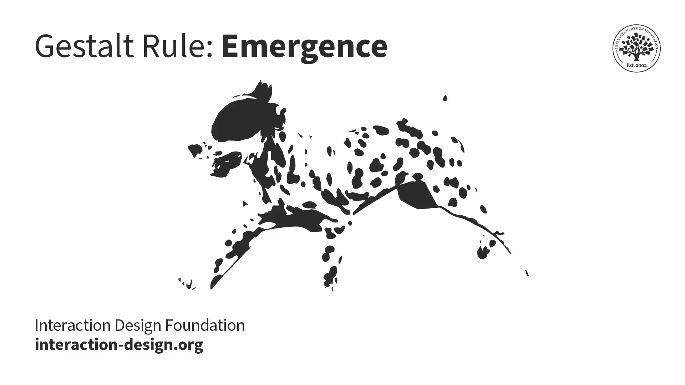

        <figcaption>
          <h3>Emergence</h3>
          

            The viewer perceives a recognizable whole before identifying its individual parts. A larger image or form emerges from separate visual elements.
          

        </figcaption>
      </figure>

      <!-- Closure -->
      <figure class="gestalt-principle-card">
        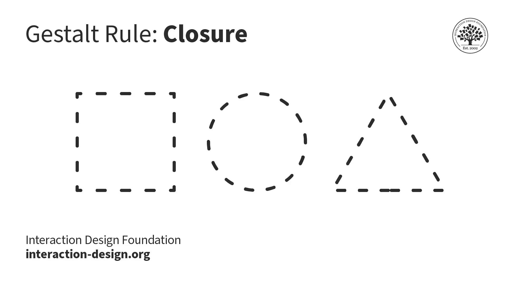

        <figcaption>
          <h3>Closure</h3>
          

            The viewer fills gaps and completes incomplete forms when enough information suggests a recognizable whole.
          

        </figcaption>
      </figure>

      <!-- Continuity -->
      <figure class="gestalt-principle-card">
        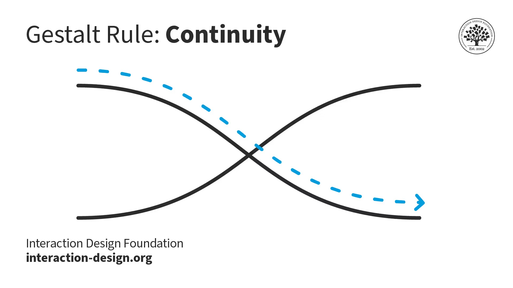

        <figcaption>
          <h3>Continuity</h3>
          

            Elements that follow the same line, curve, or direction are perceived as connected. The eye continues along the path even when it is interrupted.
          

        </figcaption>
      </figure>

      <!-- Proximity -->
      <figure class="gestalt-principle-card">
        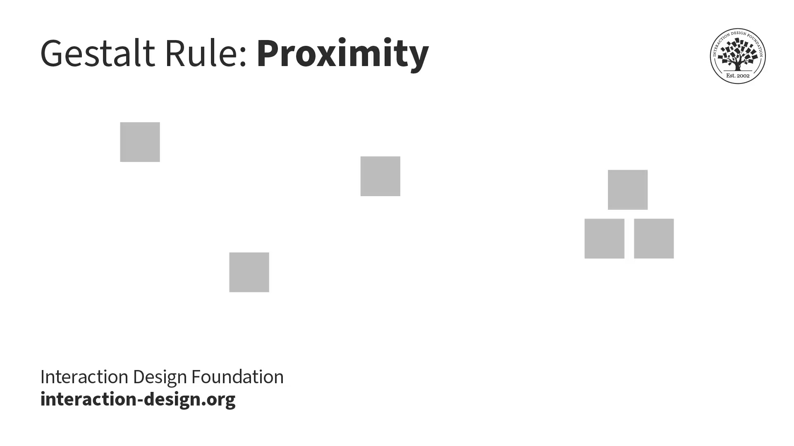

        <figcaption>
          <h3>Proximity</h3>
          

            Elements placed close together are perceived as a group. Greater distance separates elements into different groups.
          

        </figcaption>
      </figure>

      <!-- Similarity -->
      <figure class="gestalt-principle-card">
        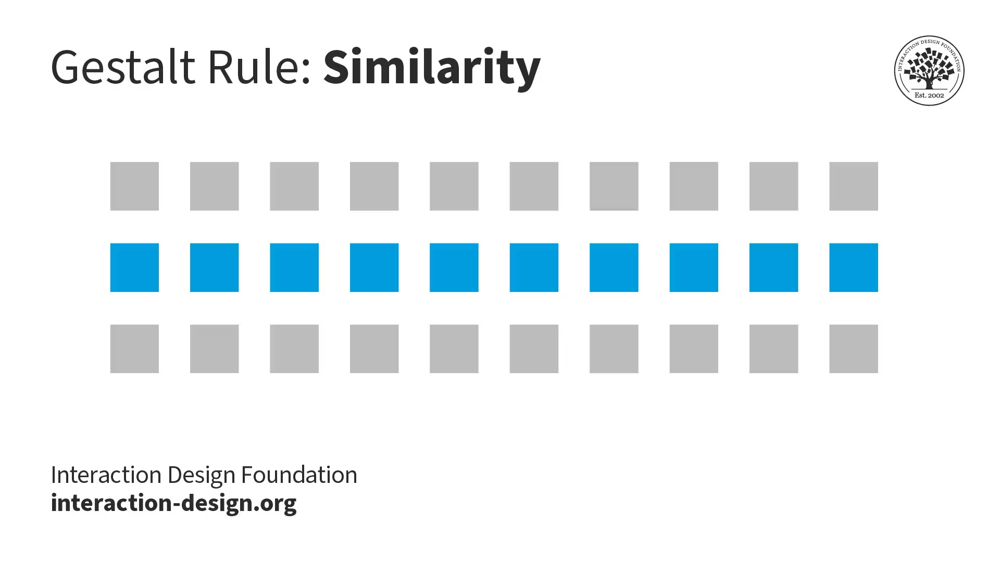

        <figcaption>
          <h3>Similarity</h3>
          

            Elements that share colour, shape, size, texture, or direction are perceived as related.
          

        </figcaption>
      </figure>

      <!-- Figure/Ground -->
      <figure class="gestalt-principle-card">
        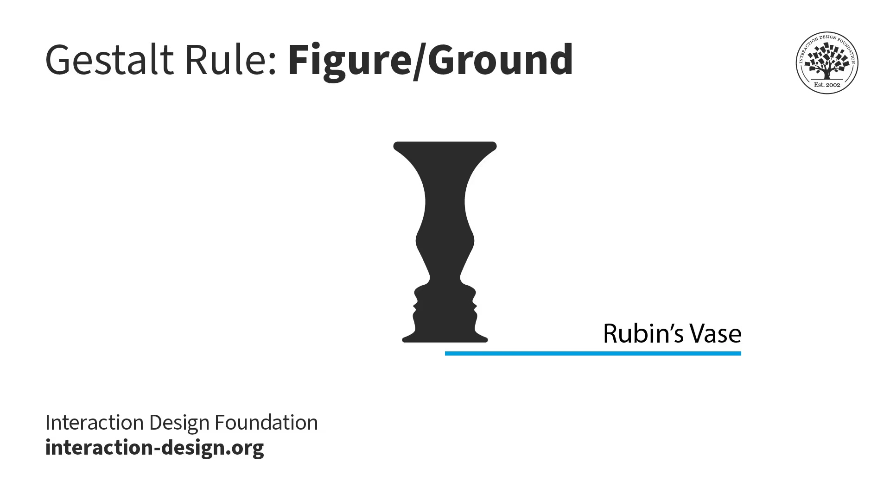

        <figcaption>
          <h3>Figure/Ground</h3>
          

            The viewer separates a subject from its surrounding field. The relationship may remain stable or shift between two interpretations.
          

        </figcaption>
      </figure>

    

    

      Reference images:
      <a
        href="https://ixdf.org/literature/topics/gestalt-principles"
        target="_blank"
        rel="noopener noreferrer"
      >
        Interaction Design Foundation, CC BY-SA 4.0
      </a>.
    

  

    <!-- 
    /////////////////
    SUB-SECTION B
    /////////////////
    -->

    

      

        Review the Art Styles
        
          Review the visual characteristics, historical context, and design approaches associated with the five styles used in this activity.
        
      

      

        

          <!-- Art Nouveau -->
          <article class="style-review-row">

            

              <video controls preload="metadata">
                <source src="imgs/art-nouveau.mp4" type="video/mp4">
                Your browser does not support embedded video.
              </video>
            

            

              <h3>Art Nouveau</h3>

              

                Art Nouveau uses flowing lines, organic shapes, botanical forms, decorative borders, and integrated relationships between image and typography.
              

              <h4>Relevant links</h4>

              <ul>
                <li>
                  <a
                    href="https://aesthetics.fandom.com/wiki/Art_Nouveau"
                    target="_blank"
                    rel="noopener noreferrer"
                  >
                    Art Nouveau overview
                  </a>
                  

                    A brief introduction to the movement, its historical context, and its main visual characteristics.
                  

                </li>

                <li>
                  <a
                    href="https://www.google.com/search?tbm=isch&amp;q=Art+Nouveau"
                    target="_blank"
                    rel="noopener noreferrer"
                  >
                    Art Nouveau examples
                  </a>
                  

                    A collection of posters, illustrations, architecture, and decorative design associated with the style.
                  

                </li>
              </ul>
            

          </article>

          <!-- DORFic -->
          <article class="style-review-row">

            

              <video controls preload="metadata">
                <source src="imgs/dorfic.mp4" type="video/mp4">
                Your browser does not support embedded video.
              </video>
            

            

              <h3>DORFic</h3>

              

                DORFic combines restrained geometry, fine lines, technological imagery, translucent layers, neutral space, and interface-like visual systems.
              

              <h4>Relevant links</h4>

              <ul>
                <li>
                  <a
                    href="https://aesthetics.fandom.com/wiki/DORFic"
                    target="_blank"
                    rel="noopener noreferrer"
                  >
                    DORFic overview
                  </a>
                  

                    An introduction to the visual language and digital design context associated with DORFic.
                  

                </li>

                <li>
                  <a
                    href="https://www.google.com/search?tbm=isch&amp;q=DORFic"
                    target="_blank"
                    rel="noopener noreferrer"
                  >
                    DORFic examples
                  </a>
                  

                    Examples of layouts, interfaces, graphics, and technological imagery connected to the style.
                  

                </li>
              </ul>
            

          </article>

          <!-- Utopian Scholastic -->
          <article class="style-review-row">

            

              <video controls preload="metadata">
                <source src="imgs/utopian-scholastic.mp4" type="video/mp4">
                Your browser does not support embedded video.
              </video>
            

            

              <h3>Utopian Scholastic</h3>

              

                Utopian Scholastic uses diagrams, archival photographs, educational imagery, classical typography, labels, and carefully organized information.
              

              <h4>Relevant links</h4>

              <ul>
                <li>
                  <a
                    href="https://aesthetics.fandom.com/wiki/Utopian_Scholastic"
                    target="_blank"
                    rel="noopener noreferrer"
                  >
                    Utopian Scholastic overview
                  </a>
                  

                    A description of the style’s use of educational, archival, scientific, and institutional visual references.
                  

                </li>

                <li>
                  <a
                    href="https://www.google.com/search?tbm=isch&amp;q=Utopian+Scholastic"
                    target="_blank"
                    rel="noopener noreferrer"
                  >
                    Utopian Scholastic examples
                  </a>
                  

                    Examples of editorial layouts, diagrams, informational graphics, and research-based compositions.
                  

                </li>
              </ul>
            

          </article>

          <!-- Memphis Design -->
          <article class="style-review-row">

            

              <video controls preload="metadata">
                <source src="imgs/memphis-design.mp4" type="video/mp4">
                Your browser does not support embedded video.
              </video>
            

            

              <h3>Memphis Design</h3>

              

                Memphis Design uses bold geometry, repeated patterns, contrasting colours, dots, stripes, squiggles, and deliberately playful arrangements.
              

              <h4>Relevant links</h4>

              <ul>
                <li>
                  <a
                    href="https://aesthetics.fandom.com/wiki/Memphis_Design"
                    target="_blank"
                    rel="noopener noreferrer"
                  >
                    Memphis Design overview
                  </a>
                  

                    An introduction to the Memphis Group and its response to restrained modernist design.
                  

                </li>

                <li>
                  <a
                    href="https://www.google.com/search?tbm=isch&amp;q=Memphis+Design"
                    target="_blank"
                    rel="noopener noreferrer"
                  >
                    Memphis Design examples
                  </a>
                  

                    Examples of furniture, graphic design, patterns, interiors, and visual compositions associated with the movement.
                  

                </li>
              </ul>
            

          </article>

          <!-- Olderbrothercore -->
          <article class="style-review-row">

            

              <video controls preload="metadata">
                <source src="imgs/olderbrothercore.mp4" type="video/mp4">
                Your browser does not support embedded video.
              </video>
            

            

              <h3>Olderbrothercore</h3>

              

                Olderbrothercore draws from early-2000s youth culture through lo-fi photographs, posters, stickers, screenshots, distressed textures, and layered media fragments.
              

              <h4>Relevant links</h4>

              <ul>
                <li>
                  <a
                    href="https://aesthetics.fandom.com/wiki/Olderbrothercore"
                    target="_blank"
                    rel="noopener noreferrer"
                  >
                    Olderbrothercore overview
                  </a>
                  

                    A description of the style’s references to early digital culture, music, gaming, bedrooms, and personal media collections.
                  

                </li>

                <li>
                  <a
                    href="https://www.google.com/search?tbm=isch&amp;q=Olderbrothercore"
                    target="_blank"
                    rel="noopener noreferrer"
                  >
                    Olderbrothercore examples
                  </a>
                  

                    Examples of visual materials, layouts, objects, and media associated with the style.
                  

                </li>
              </ul>
            

          </article>

        

        <blockquote>
          

            <strong>Video source:</strong>
            <a
              href="https://www.instagram.com/thesupergraphics/"
              target="_blank"
              rel="noopener noreferrer"
            >
              <em>The Supergraphics: Fine Art</em> by Harald Austad
            </a>.
            Videos are included for educational review.
          

        </blockquote>

      

    

    <!-- 
    /////////////////
    SUB-SECTION C
    /////////////////
    -->

    

      

        Review Samara’s Rules for Making Good Design
        
          Review the ten rules assigned to this activity and consider how each one can guide your design decisions.
        
      

      

        

          <!-- Rule 1 -->
          <figure class="samara-rule-card">
            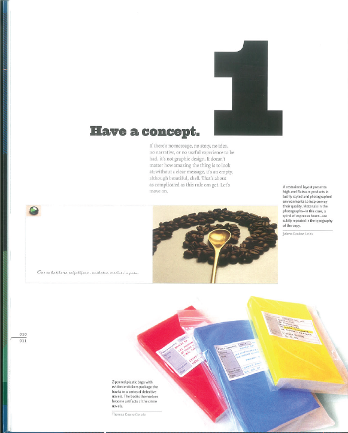
            <figcaption>
              <h3>1. Have a concept</h3>
              

                Begin with a clear idea. The composition, style, imagery, colour, and typography should support the same central concept.
              

            </figcaption>
          </figure>

          <!-- Rule 2 -->
          <figure class="samara-rule-card">
            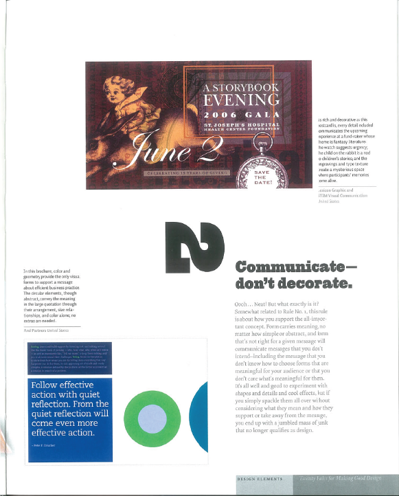
            <figcaption>
              <h3>2. Communicate—don’t decorate</h3>
              

                Every visual element should contribute to the message. Avoid adding shapes, patterns, images, or effects without a clear purpose.
              

            </figcaption>
          </figure>

          <!-- Rule 3 -->
          <figure class="samara-rule-card">
            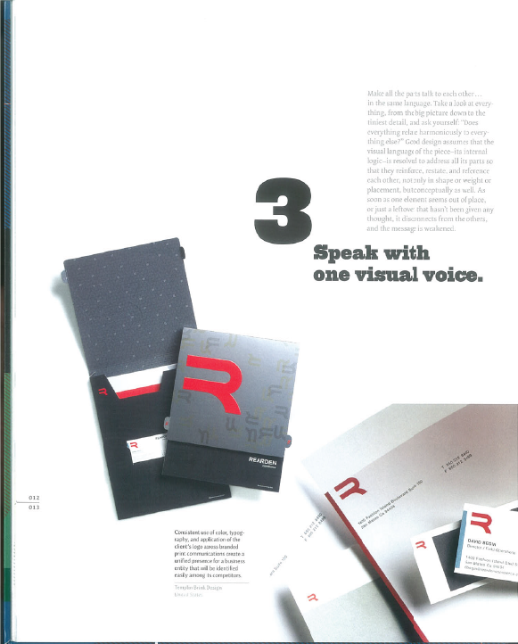
            <figcaption>
              <h3>3. Speak with one visual voice</h3>
              

                Create consistency across the composition. Image, type, colour, texture, and spacing should feel connected to the same visual system.
              

            </figcaption>
          </figure>

          <!-- Rule 7 -->
          <figure class="samara-rule-card">
            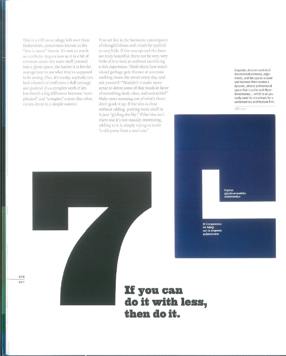
            <figcaption>
              <h3>7. If you can do it with less, then do it</h3>
              

                Remove unnecessary elements. A reduced composition can make the main idea, hierarchy, and relationships easier to understand.
              

            </figcaption>
          </figure>

          <!-- Rule 8 -->
          <figure class="samara-rule-card">
            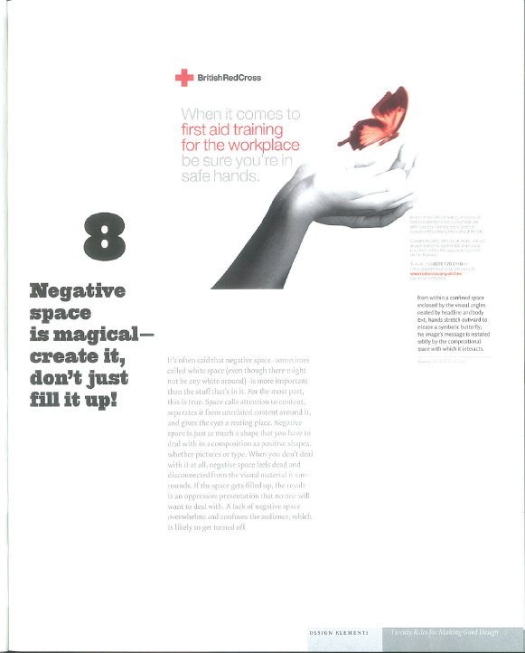
            <figcaption>
              <h3>8. Negative space is magical—create it, don’t just fill it up</h3>
              

                Treat empty space as an active part of the design. Use it to separate groups, establish emphasis, and clarify figure-and-ground relationships.
              

            </figcaption>
          </figure>

          <!-- Rule 11 -->
          <figure class="samara-rule-card">
            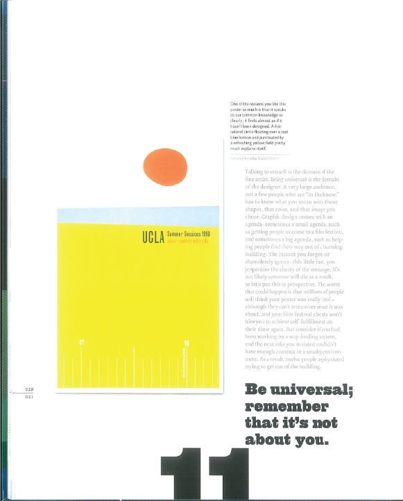
            <figcaption>
              <h3>11. Be universal; remember that it’s not about you</h3>
              

                Consider the intended audience. Test whether the visual organization and message can be understood by someone who did not create the work.
              

            </figcaption>
          </figure>

          <!-- Rule 12 -->
          <figure class="samara-rule-card">
            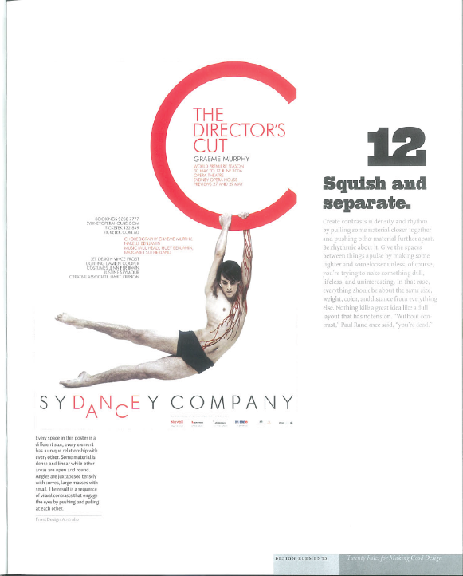
            <figcaption>
              <h3>12. Squish and separate</h3>
              

                Use spacing to establish relationships. Place connected elements close together and create greater distance between unrelated groups.
              

            </figcaption>
          </figure>

          <!-- Rule 14 -->
          <figure class="samara-rule-card">
            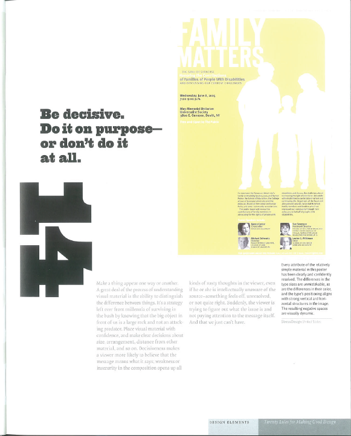
            <figcaption>
              <h3>14. Be decisive. Do it on purpose—or don’t do it at all</h3>
              

                Make visual decisions clearly. Scale, alignment, contrast, cropping, spacing, and repetition should appear intentional rather than accidental.
              

            </figcaption>
          </figure>

          <!-- Rule 15 -->
          <figure class="samara-rule-card">
            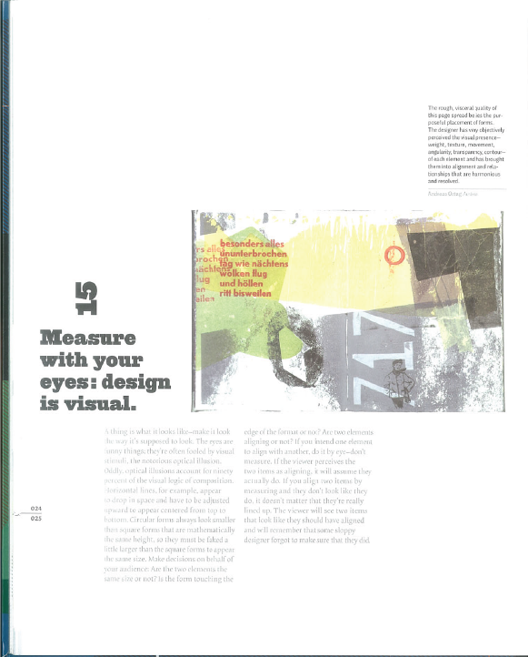
            <figcaption>
              <h3>15. Measure with your eyes: design is visual</h3>
              

                Mathematical alignment does not always appear visually balanced. Adjust scale, spacing, and placement according to how the composition is perceived.
              

            </figcaption>
          </figure>

          <!-- Rule 16 -->
          <figure class="samara-rule-card">
            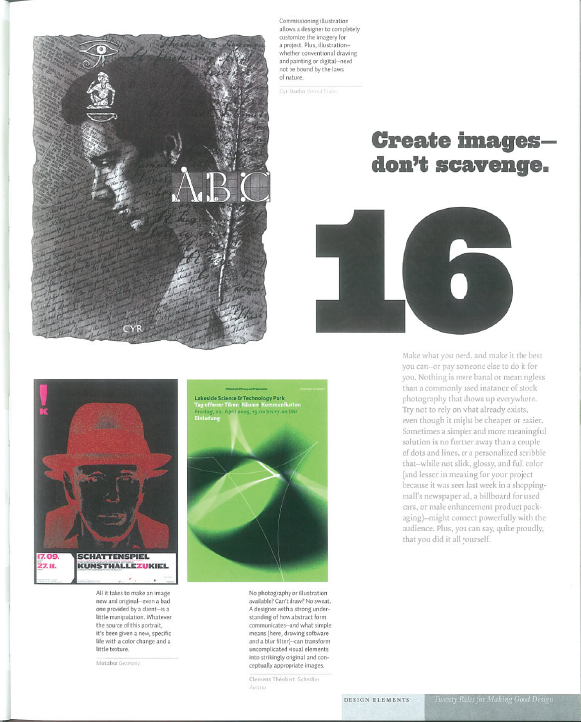
            <figcaption>
              <h3>16. Create images—don’t scavenge</h3>
              

                Create original visual material or substantially transform your sources. Avoid relying on unedited images collected from the internet.
              

            </figcaption>
          </figure>

        

        <blockquote>
          

            <strong>Source:</strong>
            Samara, T. (2007) <em>Design Elements: A Graphic Style Manual</em>. Rockport publishers. Images (pp.10-29) are included for educational review.
          

        </blockquote>

      

    

  

<!-- 
/////////////////
SECTION 2
/////////////////
-->

  

    2. Choose three style pairings
    
      Select three options and use one pairing for each composition.
    
  

Choose **three of the five options** below. You may apply the selected pairings to the three formats in any order.

| Option | Leading style | Gestalt principles | Samara rules | Required visual direction |
|---|---|---|---|---|
| **1** | **Art Nouveau** | Continuity + Closure | **3. Speak with one visual voice.** **14. Be decisive. Do it on purpose—or don’t do it at all.** | Use flowing lines, organic shapes, decorative borders, repeated botanical forms, and partial contours. Lines should connect elements and guide the eye. |
| **2** | **DORFic** | Figure/Ground + Emergence | **7. If you can do it with less, then do it.** **8. Negative space is magical—create it, don’t just fill it up.** | Use restrained geometry, fine lines, technical imagery, translucent layers, and substantial negative space. Build a larger readable form or system from simplified parts. |
| **3** | **Utopian Scholastic** | Proximity + Similarity | **1. Have a concept.** **11. Be universal; remember that it’s not about you.** | Organize photographs, diagrams, labels, symbols, and educational imagery into clear groups. Use spacing and repetition to support quick understanding. |
| **4** | **Memphis Design** | Similarity + Figure/Ground | **2. Communicate—don’t decorate.** **15. Measure with your eyes: design is visual.** | Use repeated geometric forms, dots, stripes, squiggles, and strong contrast. Decorative elements must support the concept and hierarchy. |
| **5** | **Olderbrothercore** | Proximity + Closure | **12. Squish and separate.** **16. Create images—don’t scavenge.** | Use lo-fi photographs, labels, interface fragments, distressed textures, cropped imagery, and layered media. Create or substantially transform the visual material. |

### Note on Rule 11

For this activity, interpret “Be universal” as **design for a defined audience and communicate clearly**. Do not assume that every viewer interprets images, symbols, or styles in the same way.

<!-- 
/////////////////
SECTION 3
/////////////////
-->

  

    3. Assign one pairing to each required format
    
      Create one logo, one one-page website mockup, and one photomontage.
    
  

Create one composition in each category:

| Category | Required format | Main software |
|---|---|---|
| **Graphic design** | Logo | Adobe Illustrator |
| **UI design** | One-page website mockup | Adobe Illustrator |
| **Photomontage** | Photographic collage using image layers and texture | Adobe Photoshop |

Assign one of your three selected style pairings to each required format. Consider which pairing best supports the purpose, structure, and intended audience of each composition.
## Review the required formats

  <!-- Logo -->
  <figure class="format-option-card">
    <h3>Logo</h3>
    

      A logo identifies an organization, project, event, product, or service through a clear and recognizable visual mark.
    

    

      It should remain legible at different sizes and communicate through simplified shapes, typography, colour, or symbols.
    

    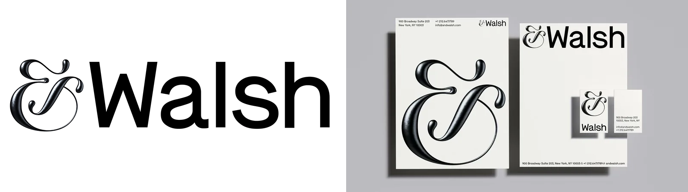
    <figcaption>
      Logo by American designer <a href="https://andwalsh.com/" target="_blank" rel="noopener noreferrer">Jessica Walsh</a>
    </figcaption>
  </figure>

  <!-- Website -->
  <figure class="format-option-card">
    <h3>Website: Homepage</h3>
    

      A one-page website organizes information within a continuous vertical layout.
    

    

      It should guide the viewer through clearly defined sections while establishing hierarchy, readability, navigation, and a consistent visual system.
    

    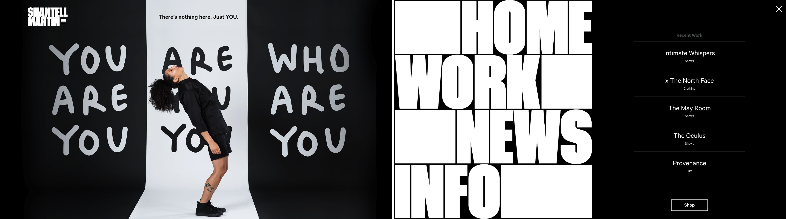
    <figcaption>
      Website homepage by English artist <a href="https://shantellmartin.art/homepage" target="_blank" rel="noopener noreferrer">Shantell Martin</a>
    </figcaption>
  </figure>

  <!-- Photomontage -->
  <figure class="format-option-card">
    <h3>Photomontage</h3>
    

      A photomontage combines photographs, textures, fragments, and graphic elements to construct a new image or visual argument.
    

    

      It may communicate through contrast, juxtaposition, scale, layering, transformation, or unexpected relationships between images.
    

    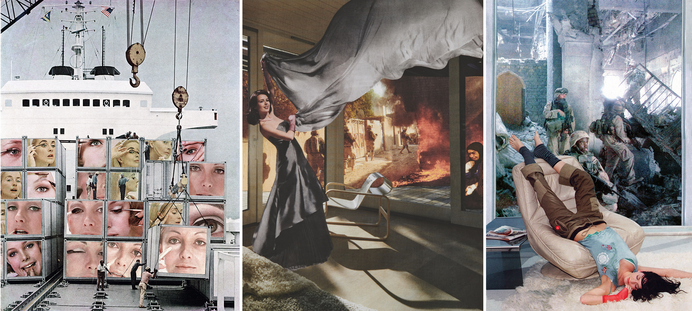
    <figcaption>
      Photomontage by American artist <a href="https://www.martharosler.net/photomontages" target="_blank" rel="noopener noreferrer">Martha Rosler</a>
    </figcaption>
  </figure>

## Assign the style pairings

Use each selected pairing once:

- Assign one pairing to the logo.
- Assign one pairing to the one-page website.
- Assign one pairing to the photomontage.
- Do not repeat the same style pairing across two formats.

Consider how the characteristics of each style support the format. A style that depends on simplified forms may work well for a logo, while a style based on layered images and textures may be more appropriate for a photomontage.

<!-- 
/////////////////
SECTION 4
/////////////////
-->

  

    4. Plan and sketch the three compositions
    
      Define the concept and create one annotated sketch for each required format.
    
  

Create one planning sketch for each composition:

- One logo
- One one-page website
- One photomontage

The sketches may be drawn by hand, photographed or scanned, or created digitally. They do not need to be polished, but the structure and written notes must be clear.

Use simple shapes, lines, labels, and arrows to show where the main elements will appear.

<fieldset class="equipment-checklist">
  <legend>Planning requirements for each composition</legend>

  <label class="checklist-item">
    <input type="checkbox">
    
      <strong>Identify the format.</strong>
      State whether the sketch is for the logo, one-page website, or photomontage.
    
  </label>

  <label class="checklist-item">
    <input type="checkbox">
    
      <strong>Define the concept and audience.</strong>
      Write one sentence explaining what the composition communicates and who it is intended for.
    
  </label>

  <label class="checklist-item">
    <input type="checkbox">
    
      <strong>Identify the style pairing.</strong>
      Name the selected style, two Gestalt principles, and two Samara rules.
    
  </label>

  <label class="checklist-item">
    <input type="checkbox">
    
      <strong>Draw the main structure.</strong>
      Show the placement of images, text, shapes, sections, and other important elements.
    
  </label>

  <label class="checklist-item">
    <input type="checkbox">
    
      <strong>Mark the visual organization.</strong>
      Identify the focal area, reading order, grouping, movement, and negative space.
    
  </label>

  <label class="checklist-item">
    <input type="checkbox">
    
      <strong>Add visual notes.</strong>
      Include brief notes about the planned colours, imagery, textures, typography, and recognizable characteristics of the selected style.
    
  </label>

  <label class="checklist-item">
    <input type="checkbox">
    
      <strong>Prepare the sketches for submission.</strong>
      Photograph, scan, or export the sketches clearly, then combine them into one three-page PDF in the following order: logo, one-page website, and photomontage.
    
  </label>
</fieldset>

Save the completed planning document as:

- **Format:** PDF
- **Filename:** `Lastname-Firstname-CompTech3-Part1-Sketches.pdf`

Ask the instructor for feedback before beginning the final digital compositions.

<!-- 
/////////////////
SECTION 5
/////////////////
-->

  

    5. Set up the digital files
    
      Create the required Illustrator and Photoshop documents using the correct dimensions, layers, and filenames.
    
  

<!-- 
/////////////////
SUB-SECTION A
/////////////////
-->

  

    Graphic Design: Logo
    
      Set up the Illustrator document and review the tutorials required to create the logo.
    
  

Use Adobe Illustrator to create the logo. Adobe Photoshop may be used to prepare raster images.

Embed all linked images before exporting.

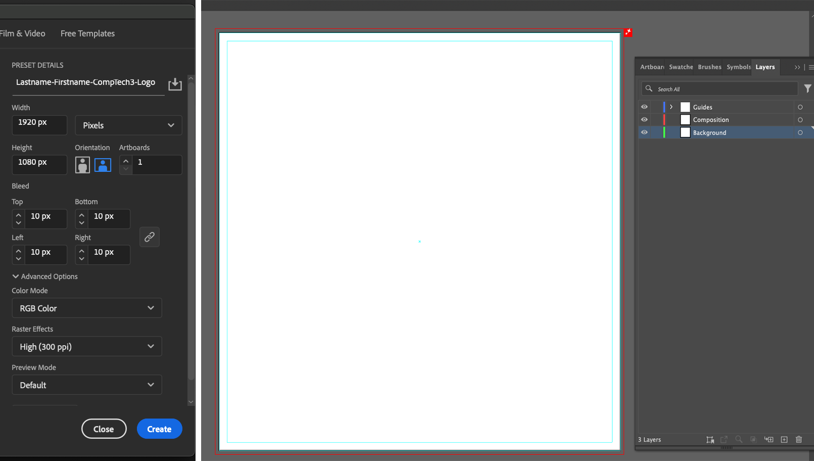

### Document setup

| Setting | Requirement |
|---|---|
| Filename | `Lastname-Firstname-CompTech3-Logo` |
| Units | Pixels |
| Size | 1000 × 1000 px |
| Aspect ratio | 1:1 |
| Bleed | 10 px on all sides |
| Colour mode | RGB |
| Raster effects | High, 300 PPI |
| Guides | Inner rectangular border 20 px from the edges |
| Layers | Guides, Composition, Background |

### Graphic design tutorials

<iframe width="560" height="315" src="https://www.youtube.com/embed/8kz0bZQDm60?si=H4R5TaLiks80geV6" title="Graphic design tutorial 1" frameborder="0" allow="accelerometer; autoplay; clipboard-write; encrypted-media; gyroscope; picture-in-picture; web-share" referrerpolicy="strict-origin-when-cross-origin" allowfullscreen></iframe>

<iframe width="560" height="315" src="https://www.youtube.com/embed/AUxtDCyaPFg?si=u9MD48P1sKyNpx8K" title="Graphic design tutorial 2" frameborder="0" allow="accelerometer; autoplay; clipboard-write; encrypted-media; gyroscope; picture-in-picture; web-share" referrerpolicy="strict-origin-when-cross-origin" allowfullscreen></iframe>

<iframe width="560" height="315" src="https://www.youtube.com/embed/svd4WQE_92Y?si=O0_aL82zce8HYo40" title="Graphic design tutorial 3" frameborder="0" allow="accelerometer; autoplay; clipboard-write; encrypted-media; gyroscope; picture-in-picture; web-share" referrerpolicy="strict-origin-when-cross-origin" allowfullscreen></iframe>

<!-- 
/////////////////
SUB-SECTION B
/////////////////
-->

  

    UI Design: One-Page Website
    
      Set up the Illustrator document for the one-page website mockup.
    
  

Use Adobe Illustrator to create the one-page website mockup. Adobe Photoshop may be used to prepare images and textures.

> **Embed all linked images before exporting**. You will loose point if images are not embed it.

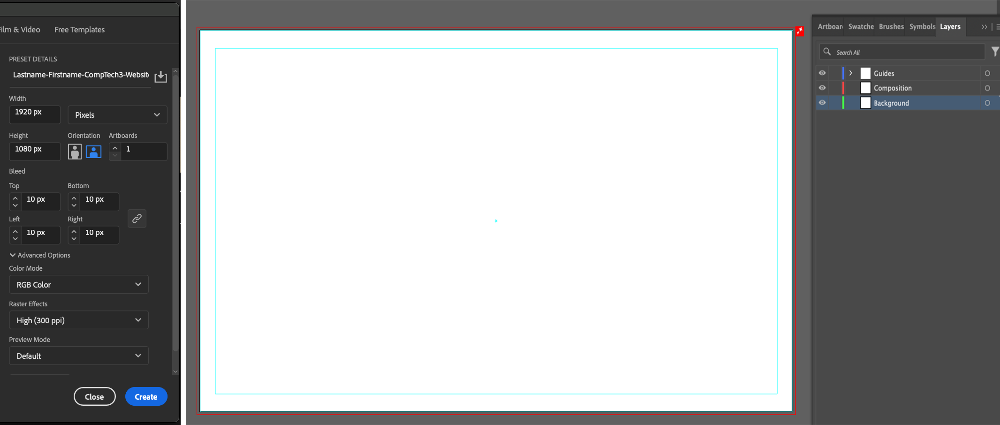

### Document setup

| Setting | Requirement |
|---|---|
| Filename | `Lastname-Firstname-CompTech3-Website` |
| Units | Pixels |
| Size | 1920 × 1080 px |
| Bleed | 10 px on all sides |
| Colour mode | RGB |
| Raster effects | High, 300 PPI |
| Guides | Inner rectangular border 50 px from the edges |
| Layers | Guides, Composition, Background |

<!-- 
/////////////////
SUB-SECTION C
/////////////////
-->

  

    Photomontage
    
      Take an original DSLR photograph and set up the layered Photoshop document.
    
  

Create the photomontage in Adobe Photoshop using photographs, textures, image fragments, and graphic elements.

The final composition must include **at least one original photograph taken specifically for this activity**.

The following files are required for submission:

- The completed photomontage
- The layered Photoshop document
- The original, unedited camera file

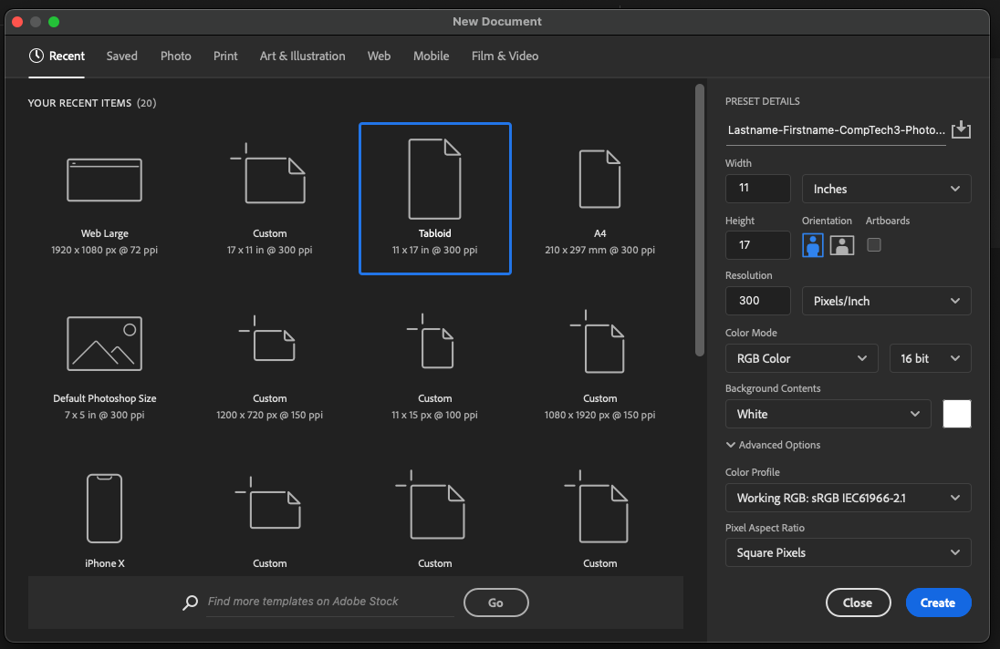

### Original photography requirement

Book and use a **Canon EOS Rebel T4i DSLR camera**.

Set the camera to **Aperture Priority (`Av`) mode** and photograph a subject, object, texture, place, or environment that supports the concept of the photomontage.

The original photograph must remain identifiable within the final composition, even when it is cropped, layered, adjusted, or transformed.

### Camera tutorials

- [Canon Rebel T4i Quick Reference Guide](https://jac307.github.io/summer-camp/tutorials/Photography/00_Canon_T4i_Quick_Reference.html){:target="_blank"}
- [Canon Rebel T4i Camera and Lens Anatomy](https://jac307.github.io/summer-camp/tutorials/Photography/01_Camera_and_Lens_Anatomy.html){:target="_blank"}
- [Camera Setup and Aperture Priority Mode](https://jac307.github.io/summer-camp/tutorials/Photography/02_Camera_Setup_and_Av_Mode.html){:target="_blank"}

### Photoshop document setup

| Setting | Requirement |
|---|---|
| Filename | `Lastname-Firstname-CompTech3-Photomontage` |
| Units | Inches |
| Size | 11 × 17 in vertical or 17 × 11 in horizontal |
| Resolution | 300 PPI |
| Colour mode | RGB |
| Bit depth | 16 bits |

### Photomontage tutorials

<iframe width="560" height="315" src="https://www.youtube.com/embed/icNXrgD08qE?si=m7zAQ1JK1wQHwAP4" title="Photomontage tutorial 1" frameborder="0" allow="accelerometer; autoplay; clipboard-write; encrypted-media; gyroscope; picture-in-picture; web-share" referrerpolicy="strict-origin-when-cross-origin" allowfullscreen></iframe>

<iframe width="560" height="315" src="https://www.youtube.com/embed/iOYz669WNpU?si=24OeqEx7oEo1Qe7n" title="Photomontage tutorial 2" frameborder="0" allow="accelerometer; autoplay; clipboard-write; encrypted-media; gyroscope; picture-in-picture; web-share" referrerpolicy="strict-origin-when-cross-origin" allowfullscreen></iframe>

<!-- 
/////////////////
SECTION 6
/////////////////
-->

  

    6. Create and review the compositions
    
      Build each composition from the approved sketch and verify that every formal requirement is visible.
    
  

Use the sketches as the starting point, but make adjustments when spacing, scale, colour, or hierarchy does not work in the digital file.

<fieldset class="equipment-checklist">
  <legend>Review each composition before exporting</legend>

  <label class="checklist-item">
    <input type="checkbox">
    
      <strong>The concept is clear.</strong>
      The composition communicates a specific subject, purpose, or message.
    
  </label>

  <label class="checklist-item">
    <input type="checkbox">
    
      <strong>The style is recognizable.</strong>
      At least three characteristics of the selected style are visible and adapted to the concept.
    
  </label>

  <label class="checklist-item">
    <input type="checkbox">
    
      <strong>Both Gestalt principles are visible.</strong>
      The principles organize the composition rather than appearing as isolated effects.
    
  </label>

  <label class="checklist-item">
    <input type="checkbox">
    
      <strong>Both Samara rules affect the design.</strong>
      The rules are evident in the hierarchy, spacing, image-making, reduction, or communication strategy.
    
  </label>

  <label class="checklist-item">
    <input type="checkbox">
    
      <strong>The viewer’s path is controlled.</strong>
      The composition establishes grouping, hierarchy, movement, and negative space.
    
  </label>

  <label class="checklist-item">
    <input type="checkbox">
    
      <strong>The file is technically complete.</strong>
      Dimensions, colour mode, resolution, layers, margins, embedded images, and filename are correct.
    
  </label>
</fieldset>

<!-- 
/////////////////
SECTION 7
/////////////////
-->

  

    7. Export and submit Part 1
    
      Export the sketches and three compositions, then post a short description of each work.
    
  

## Required files

| Item | Required filename |
|---|---|
| Sketches PDF | `Lastname-Firstname-CompTech3-Part1-Sketches.pdf` |
| Logo PDF | `Lastname-Firstname-CompTech3-Part1-Logo.pdf` |
| Website PDF | `Lastname-Firstname-CompTech3-Part1-Website.pdf` |
| Layered photomontage TIFF | `Lastname-Firstname-CompTech3-Part1-Photomontage.tiff` |
| Original photograph | `Lastname-Firstname-CompTech3-Part1-Photography.JPG` |

## Written descriptions

Post a **two-sentence description for each composition** directly in Avenue to Learn.

Each description must:

1. State the concept and selected style.
2. Identify the two Gestalt principles and explain how the two Samara rules shaped the design.

### Example

> This poster presents a fictional public garden through an Art Nouveau visual language based on flowing botanical forms and decorative borders. Continuity and closure guide the reading path, while Rules 3 and 14 establish one consistent visual voice and keep each formal decision deliberate.

Confirm that all files open correctly before submitting. Incorrect filenames, missing files, or incomplete document setup may affect the grade.

---

Credits: Jessica A. Rodríguez
