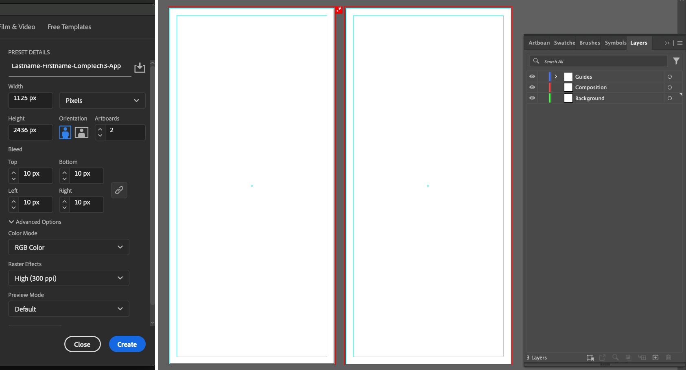

[MEDIAART 2DF3](README.md)

# Composition Techniques III – Part 1

## Individual activity

## Goal

Create **three digital compositions** that apply Gestalt principles through three different design formats.

Each composition must combine:

- **One design format**
- **One style pairing** from the five options provided
- **Two Gestalt principles** assigned to that style
- **Two rules** from Timothy Samara’s *20 Rules for Making Good Design*
- **One clear concept**

## Activity overview

- **Outputs:** Three sketches and three digital compositions
- **Formats:** One graphic design, one UI design, and one photomontage
- **Style options:** Art Nouveau, DORFic, Utopian Scholastic, Memphis Design, and Olderbrothercore
- **Gestalt principles:** Emergence, Closure, Continuity, Proximity, Similarity, and Figure/Ground
- **Software:** Adobe Illustrator and Adobe Photoshop
- **Colour:** Full colour is permitted
- **Work period:** During class, with additional work completed before the deadline
- **Submission:** Sketch PDF, three composition PDFs, and written descriptions on Avenue to Learn

## Activity stages

Complete the following stages in order.

<!-- 
/////////////////
SECTION 1
/////////////////
-->

  

    1. Review ?
    
      R?
    
  

<!-- 
/////////////////
SUB-SECTION A
/////////////////
-->

  

    1. Review the Gestalt principles
    
      Review how recognizable forms and groups emerge through visual organization.
    
  

Select an example to review its definition.

  

    <button
      class="image-choice is-active"
      type="button"
      data-target="gestalt-w7-emergence"
      aria-controls="gestalt-w7-emergence"
      aria-pressed="true"
    >
      
      Emergence
    </button>

    <button
      class="image-choice"
      type="button"
      data-target="gestalt-w7-closure"
      aria-controls="gestalt-w7-closure"
      aria-pressed="false"
    >
      
      Closure
    </button>

    <button
      class="image-choice"
      type="button"
      data-target="gestalt-w7-continuity"
      aria-controls="gestalt-w7-continuity"
      aria-pressed="false"
    >
      
      Continuity
    </button>

    <button
      class="image-choice"
      type="button"
      data-target="gestalt-w7-proximity"
      aria-controls="gestalt-w7-proximity"
      aria-pressed="false"
    >
      
      Proximity
    </button>

    <button
      class="image-choice"
      type="button"
      data-target="gestalt-w7-similarity"
      aria-controls="gestalt-w7-similarity"
      aria-pressed="false"
    >
      
      Similarity
    </button>

    <button
      class="image-choice"
      type="button"
      data-target="gestalt-w7-figure-ground"
      aria-controls="gestalt-w7-figure-ground"
      aria-pressed="false"
    >
      
      Figure/Ground
    </button>
  

  

    <section
      id="gestalt-w7-emergence"
      class="image-information-panel"
    >
      
Gestalt principle

      <h3>Emergence</h3>
      

        The viewer perceives a recognizable whole before identifying its individual parts. A larger image or form emerges from separate visual elements.
      

    </section>

    <section
      id="gestalt-w7-closure"
      class="image-information-panel"
      hidden
    >
      
Gestalt principle

      <h3>Closure</h3>
      

        The viewer fills gaps and completes incomplete forms when enough information suggests a recognizable whole.
      

    </section>

    <section
      id="gestalt-w7-continuity"
      class="image-information-panel"
      hidden
    >
      
Gestalt principle

      <h3>Continuity</h3>
      

        Elements that follow the same line, curve, or direction are perceived as connected. The eye continues along the path even when it is interrupted.
      

    </section>

    <section
      id="gestalt-w7-proximity"
      class="image-information-panel"
      hidden
    >
      
Gestalt principle

      <h3>Proximity</h3>
      

        Elements placed close together are perceived as a group. Greater distance separates elements into different groups.
      

    </section>

    <section
      id="gestalt-w7-similarity"
      class="image-information-panel"
      hidden
    >
      
Gestalt principle

      <h3>Similarity</h3>
      

        Elements that share colour, shape, size, texture, or direction are perceived as related.
      

    </section>

    <section
      id="gestalt-w7-figure-ground"
      class="image-information-panel"
      hidden
    >
      
Gestalt principle

      <h3>Figure/Ground</h3>
      

        The viewer separates a subject from its surrounding field. The relationship may remain stable or shift between two interpretations.
      

    </section>
  

Reference images: [Interaction Design Foundation, CC BY-SA 4.0](https://ixdf.org/literature/topics/gestalt-principles){:target="_blank"}.

<!-- 
/////////////////
SUB-SECTION B
/////////////////
-->

  

    Review the Art Styles
    
      Review the visual characteristics, historical context, and design approaches associated with the five styles used in this activity.
    
  

  

    Select each video to review the style before choosing an option for your compositions.

  <!-- Art Nouveau -->
  <article class="style-review-row">

    

      <video controls preload="metadata">
        <source src="imgs/art-nouveau.mp4" type="video/mp4">
        Your browser does not support embedded video.
      </video>
    

    

### Art Nouveau

Art Nouveau uses flowing lines, organic shapes, botanical forms, decorative borders, and integrated relationships between image and typography.

#### Relevant links

- [Art Nouveau overview](https://aesthetics.fandom.com/wiki/Art_Nouveau){:target="_blank"}  
  A brief introduction to the movement, its historical context, and its main visual characteristics.

- [Art Nouveau examples](https://www.google.com/search?tbm=isch&q=Art+Nouveau){:target="_blank"}  
  A collection of posters, illustrations, architecture, and decorative design associated with the style.

    

  </article>

  <!-- DORFic -->
  <article class="style-review-row">

    

      <video controls preload="metadata">
        <source src="imgs/dorfic.mp4" type="video/mp4">
        Your browser does not support embedded video.
      </video>
    

    

### DORFic

DORFic combines restrained geometry, fine lines, technological imagery, translucent layers, neutral space, and interface-like visual systems.

#### Relevant links

- [DORFic overview](https://aesthetics.fandom.com/wiki/DORFic){:target="_blank"}  
  An introduction to the visual language and digital design context associated with DORFic.

- [DORFic examples](https://www.google.com/search?tbm=isch&q=DORFic){:target="_blank"}  
  Examples of layouts, interfaces, graphics, and technological imagery connected to the style.

    

  </article>

  <!-- Utopian Scholastic -->
  <article class="style-review-row">

    

      <video controls preload="metadata">
        <source src="imgs/utopian-scholastic.mp4" type="video/mp4">
        Your browser does not support embedded video.
      </video>
    

    

### Utopian Scholastic

Utopian Scholastic uses diagrams, archival photographs, educational imagery, classical typography, labels, and carefully organized information.

#### Relevant links

- [Utopian Scholastic overview](https://aesthetics.fandom.com/wiki/Utopian_Scholastic){:target="_blank"}  
  A description of the style’s use of educational, archival, scientific, and institutional visual references.

- [Utopian Scholastic examples](https://www.google.com/search?tbm=isch&q=Utopian+Scholastic){:target="_blank"}  
  Examples of editorial layouts, diagrams, informational graphics, and research-based compositions.

    

  </article>

  <!-- Memphis Design -->
  <article class="style-review-row">

    

      <video controls preload="metadata">
        <source src="imgs/memphis-design.mp4" type="video/mp4">
        Your browser does not support embedded video.
      </video>
    

    

### Memphis Design

Memphis Design uses bold geometry, repeated patterns, contrasting colours, dots, stripes, squiggles, and deliberately playful arrangements.

#### Relevant links

- [Memphis Design overview](https://aesthetics.fandom.com/wiki/Memphis_Design){:target="_blank"}  
  An introduction to the Memphis Group and its response to restrained modernist design.

- [Memphis Design examples](https://www.google.com/search?tbm=isch&q=Memphis+Design){:target="_blank"}  
  Examples of furniture, graphic design, patterns, interiors, and visual compositions associated with the movement.

    

  </article>

  <!-- Olderbrothercore -->
  <article class="style-review-row">

    

      <video controls preload="metadata">
        <source src="imgs/olderbrothercore.mp4" type="video/mp4">
        Your browser does not support embedded video.
      </video>
    

    

### Olderbrothercore

Olderbrothercore draws from early-2000s youth culture through lo-fi photographs, posters, stickers, screenshots, distressed textures, and layered media fragments.

#### Relevant links

- [Olderbrothercore overview](https://aesthetics.fandom.com/wiki/Olderbrothercore){:target="_blank"}  
  A description of the style’s references to early digital culture, music, gaming, bedrooms, and personal media collections.

- [Olderbrothercore examples](https://www.google.com/search?tbm=isch&q=Olderbrothercore){:target="_blank"}  
  Examples of visual materials, layouts, objects, and media associated with the style.

    

  </article>

> Video source: *The Supergraphics: Fine Art* by Harald Austad. Videos are included for educational review.

  

<!-- 
/////////////////
SUB-SECTION C
/////////////////
-->

<!-- 
/////////////////
SECTION 2
/////////////////
-->

  

    2. Choose three style pairings
    
      Select three options and use one pairing for each composition.
    
  

Choose **three of the five options** below. You may apply the selected pairings to the three formats in any order.

| Option | Leading style | Gestalt principles | Samara rules | Required visual direction |
|---|---|---|---|---|
| **1** | **Art Nouveau** | Continuity + Closure | **3. Speak with one visual voice.** **14. Be decisive. Do it on purpose—or don’t do it at all.** | Use flowing lines, organic shapes, decorative borders, repeated botanical forms, and partial contours. Lines should connect elements and guide the eye. |
| **2** | **DORFic** | Figure/Ground + Emergence | **7. If you can do it with less, then do it.** **8. Negative space is magical—create it, don’t just fill it up.** | Use restrained geometry, fine lines, technical imagery, translucent layers, and substantial negative space. Build a larger readable form or system from simplified parts. |
| **3** | **Utopian Scholastic** | Proximity + Similarity | **1. Have a concept.** **11. Be universal; remember that it’s not about you.** | Organize photographs, diagrams, labels, symbols, and educational imagery into clear groups. Use spacing and repetition to support quick understanding. |
| **4** | **Memphis Design** | Similarity + Figure/Ground | **2. Communicate—don’t decorate.** **15. Measure with your eyes: design is visual.** | Use repeated geometric forms, dots, stripes, squiggles, and strong contrast. Decorative elements must support the concept and hierarchy. |
| **5** | **Olderbrothercore** | Proximity + Closure | **12. Squish and separate.** **16. Create images—don’t scavenge.** | Use lo-fi photographs, labels, interface fragments, distressed textures, cropped imagery, and layered media. Create or substantially transform the visual material. |

### Note on Rule 11

For this activity, interpret “Be universal” as **design for a defined audience and communicate clearly**. Do not assume that every viewer interprets images, symbols, or styles in the same way.

<!-- 
/////////////////
SECTION 3
/////////////////
-->

  

    3. Assign one format to each pairing
    
      Complete one graphic design, one UI design, and one photomontage.
    
  

Create one composition in each category:

| Category | Choose one format | Main software |
|---|---|---|
| **Graphic design** | Logo or poster | Adobe Illustrator |
| **UI design** | One-page website mockup or two app screens | Adobe Illustrator |
| **Photomontage** | Photographic collage using image layers and texture | Adobe Photoshop |

Assign one selected style pairing to each category. Consider which pairing best supports the purpose and structure of the format.

## Define the concept

Before sketching, write one sentence that states what each composition communicates. The concept may describe an event, organization, service, place, product, interface, or visual message.

The style and Gestalt principles must support the concept. Do not begin by selecting decorative elements without deciding what the composition communicates.

<!-- 
/////////////////
SECTION 4
/////////////////
-->

  

    4. Sketch the three compositions
    
      Plan the concept, hierarchy, style, Gestalt principles, and main visual elements before opening the software.
    
  

Sketch in a physical or digital notebook. Create **one sketch for each composition**.

Each sketch must identify:

<fieldset class="equipment-checklist">
  <legend>Required information for each sketch</legend>

  <label class="checklist-item">
    <input type="checkbox">
    
      <strong>Format</strong>
      Identify the logo, poster, website, app, or photomontage format.
    
  </label>

  <label class="checklist-item">
    <input type="checkbox">
    
      <strong>Concept</strong>
      Write one sentence stating what the composition communicates.
    
  </label>

  <label class="checklist-item">
    <input type="checkbox">
    
      <strong>Style pairing</strong>
      Name the selected style and list at least three visual characteristics you will use.
    
  </label>

  <label class="checklist-item">
    <input type="checkbox">
    
      <strong>Gestalt principles</strong>
      Label where each assigned principle appears in the sketch.
    
  </label>

  <label class="checklist-item">
    <input type="checkbox">
    
      <strong>Samara rules</strong>
      Write both assigned rules and note how each one affects the design.
    
  </label>

  <label class="checklist-item">
    <input type="checkbox">
    
      <strong>Hierarchy and movement</strong>
      Mark the focal area, reading order, grouping, negative space, and main directional path.
    
  </label>

  <label class="checklist-item">
    <input type="checkbox">
    
      <strong>Colour and image plan</strong>
      Indicate the main colours, image sources, textures, and type choices.
    
  </label>
</fieldset>

Ask the instructor for feedback before beginning the digital files.

<!-- 
/////////////////
SECTION 5
/////////////////
-->

  

    5. Set up the digital files
    
      Create the required Illustrator and Photoshop documents using the correct dimensions, layers, and filenames.
    
  

## Graphic design

Use Adobe Illustrator. Adobe Photoshop may be used to prepare raster images. Embed all linked images before exporting.

### Logo

| Setting | Requirement |
|---|---|
| Filename | `Lastname-Firstname-CompTech3-Part1-Logo` |
| Units | Pixels |
| Size | 1000 × 1000 px |
| Aspect ratio | 1:1 |
| Bleed | 10 px on all sides |
| Colour mode | RGB |
| Raster effects | High, 300 PPI |
| Guides | Inner rectangular border 20 px from the edges |
| Layers | Guides, Composition, Background |

### Poster

| Setting | Requirement |
|---|---|
| Filename | `Lastname-Firstname-CompTech3-Part1-Poster` |
| Units | Inches |
| Size | 11 × 17 in vertical or 17 × 11 in horizontal |
| Bleed | 0.3 in on all sides |
| Colour mode | RGB |
| Raster effects | High, 300 PPI |
| Guides | Inner rectangular border 0.5 in from the edges |
| Layers | Guides, Composition, Background |

### Graphic design tutorials

<iframe width="560" height="315" src="https://www.youtube.com/embed/8kz0bZQDm60?si=H4R5TaLiks80geV6" title="YouTube video player" frameborder="0" allow="accelerometer; autoplay; clipboard-write; encrypted-media; gyroscope; picture-in-picture; web-share" referrerpolicy="strict-origin-when-cross-origin" allowfullscreen></iframe>

<iframe width="560" height="315" src="https://www.youtube.com/embed/AUxtDCyaPFg?si=u9MD48P1sKyNpx8K" title="YouTube video player" frameborder="0" allow="accelerometer; autoplay; clipboard-write; encrypted-media; gyroscope; picture-in-picture; web-share" referrerpolicy="strict-origin-when-cross-origin" allowfullscreen></iframe>

<iframe width="560" height="315" src="https://www.youtube.com/embed/svd4WQE_92Y?si=O0_aL82zce8HYo40" title="YouTube video player" frameborder="0" allow="accelerometer; autoplay; clipboard-write; encrypted-media; gyroscope; picture-in-picture; web-share" referrerpolicy="strict-origin-when-cross-origin" allowfullscreen></iframe>

## UI design

Use Adobe Illustrator. Adobe Photoshop may be used to prepare images and textures. Embed all linked images before exporting.

### Website

| Setting | Requirement |
|---|---|
| Filename | `Lastname-Firstname-CompTech3-Part1-Website` |
| Units | Pixels |
| Size | 1920 × 1080 px |
| Bleed | 10 px on all sides |
| Colour mode | RGB |
| Raster effects | High, 300 PPI |
| Guides | Inner rectangular border 50 px from the edges |
| Layers | Guides, Composition, Background |

### App

| Setting | Requirement |
|---|---|
| Filename | `Lastname-Firstname-CompTech3-Part1-App` |
| Units | Pixels |
| Size | 1125 × 2436 px |
| Artboards | Two |
| Bleed | 10 px on all sides |
| Colour mode | RGB |
| Raster effects | High, 300 PPI |
| Guides | Inner rectangular border 50 px from the edges |
| Layers | Guides, Composition, Background |

## Photomontage

Use Adobe Photoshop. Adobe Illustrator may be used to prepare vector elements.

| Setting | Requirement |
|---|---|
| Filename | `Lastname-Firstname-CompTech3-Part1-Photomontage` |
| Units | Inches |
| Size | 11 × 17 in vertical or 17 × 11 in horizontal |
| Resolution | 300 PPI |
| Colour mode | RGB |
| Bit depth | 16 bits |

### Photomontage tutorials

<iframe width="560" height="315" src="https://www.youtube.com/embed/icNXrgD08qE?si=m7zAQ1JK1wQHwAP4" title="YouTube video player" frameborder="0" allow="accelerometer; autoplay; clipboard-write; encrypted-media; gyroscope; picture-in-picture; web-share" referrerpolicy="strict-origin-when-cross-origin" allowfullscreen></iframe>

<iframe width="560" height="315" src="https://www.youtube.com/embed/iOYz669WNpU?si=24OeqEx7oEo1Qe7n" title="YouTube video player" frameborder="0" allow="accelerometer; autoplay; clipboard-write; encrypted-media; gyroscope; picture-in-picture; web-share" referrerpolicy="strict-origin-when-cross-origin" allowfullscreen></iframe>

<!-- 
/////////////////
SECTION 6
/////////////////
-->

  

    6. Create and review the compositions
    
      Build each composition from the approved sketch and verify that every formal requirement is visible.
    
  

Use the sketches as the starting point, but make adjustments when spacing, scale, colour, or hierarchy does not work in the digital file.

<fieldset class="equipment-checklist">
  <legend>Review each composition before exporting</legend>

  <label class="checklist-item">
    <input type="checkbox">
    
      <strong>The concept is clear.</strong>
      The composition communicates a specific subject, purpose, or message.
    
  </label>

  <label class="checklist-item">
    <input type="checkbox">
    
      <strong>The style is recognizable.</strong>
      At least three characteristics of the selected style are visible and adapted to the concept.
    
  </label>

  <label class="checklist-item">
    <input type="checkbox">
    
      <strong>Both Gestalt principles are visible.</strong>
      The principles organize the composition rather than appearing as isolated effects.
    
  </label>

  <label class="checklist-item">
    <input type="checkbox">
    
      <strong>Both Samara rules affect the design.</strong>
      The rules are evident in the hierarchy, spacing, image-making, reduction, or communication strategy.
    
  </label>

  <label class="checklist-item">
    <input type="checkbox">
    
      <strong>The viewer’s path is controlled.</strong>
      The composition establishes grouping, hierarchy, movement, and negative space.
    
  </label>

  <label class="checklist-item">
    <input type="checkbox">
    
      <strong>The file is technically complete.</strong>
      Dimensions, colour mode, resolution, layers, margins, embedded images, and filename are correct.
    
  </label>
</fieldset>

<!-- 
/////////////////
SECTION 7
/////////////////
-->

  

    7. Export and submit Part 1
    
      Export the sketches and three compositions, then post a short description of each work.
    
  

## Required files

| Item | Required filename |
|---|---|
| Sketches PDF | `Lastname-Firstname-CompTech3-Part1-Sketches.pdf` |
| Graphic design PDF | `Lastname-Firstname-CompTech3-Part1-Logo.pdf` or `Lastname-Firstname-CompTech3-Part1-Poster.pdf` |
| UI design PDF | `Lastname-Firstname-CompTech3-Part1-Website.pdf` or `Lastname-Firstname-CompTech3-Part1-App.pdf` |
| Photomontage PDF | `Lastname-Firstname-CompTech3-Part1-Photomontage.pdf` |

## Written descriptions

Post a **two-sentence description for each composition** directly in Avenue to Learn.

Each description must:

1. State the concept and selected style.
2. Identify the two Gestalt principles and explain how the two Samara rules shaped the design.

### Example

> This poster presents a fictional public garden through an Art Nouveau visual language based on flowing botanical forms and decorative borders. Continuity and closure guide the reading path, while Rules 3 and 14 establish one consistent visual voice and keep each formal decision deliberate.

Confirm that all files open correctly before submitting. Incorrect filenames, missing files, or incomplete document setup may affect the grade.

---

Credits: Jessica A. Rodríguez
