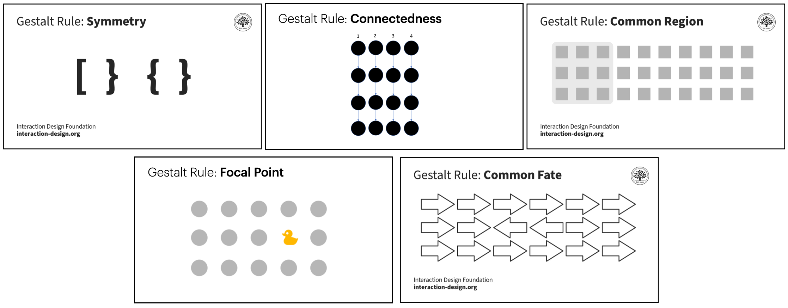

[MEDIAART 2DF3](README.md)

# Composition Techniques III – Part 2

## Individual activity

## Goal

Create **three new digital compositions** that apply Gestalt principles through three different design formats.

Each composition must combine:

- **One design format**
- **One style pairing** from the five options provided
- **Two Gestalt principles** assigned to that style
- **Two rules** from Timothy Samara’s *20 Rules for Making Good Design*
- **One clear concept**

## Activity overview

- **Outputs:** Three sketches and three digital compositions
- **Formats:** One graphic design, one UI design, and one photomontage
- **Style options:** Atomic Age, Wacky PoMo, Whimsigoth, Synthwave, and Solarpunk
- **Gestalt principles:** Symmetry, Connectedness, Common Region, Focal Point, and Common Fate
- **Software:** Adobe Illustrator and Adobe Photoshop
- **Colour:** Full colour is permitted
- **Work period:** During class, with additional work completed before the deadline
- **Submission:** Sketch PDF, three composition PDFs, and written descriptions on Avenue to Learn

## Required composition formula

Use the following formula for each composition:

> **One format + one style pairing + two Gestalt principles + two Samara rules + one concept**

Across the three compositions:

- Select **three different style pairings** from the five options.
- Use each selected pairing only once.
- Complete one work in each required format.
- Apply at least **three recognizable characteristics** of the selected style.
- Make both Gestalt principles visible in the composition.
- Apply both Samara rules as design decisions, not only as written explanations.

## Activity stages

Complete the following stages in order.

<!-- 
/////////////////
SECTION 1
/////////////////
-->

  

    1. Review the Gestalt principles
    
      Review how visual elements are balanced, linked, contained, emphasized, and directed.
    
  

## Symmetry

Elements are arranged around an axis or centre. Symmetry may be exact, approximate, radial, or deliberately interrupted.

## Connectedness

Elements joined by lines, shapes, paths, or shared surfaces are perceived as belonging together.

## Common Region

Elements placed inside the same boundary or field are perceived as a group.

## Focal Point

A dominant element attracts attention through contrast, position, scale, colour, detail, or isolation.

## Common Fate

Elements moving or pointing in the same direction are perceived as related. In static compositions, direction and repeated orientation can imply shared movement.

<!-- 
/////////////////
SECTION 2
/////////////////
-->

  

    2. Choose three style pairings
    
      Select three options and use one pairing for each composition.
    
  

Choose **three of the five options** below. You may apply the selected pairings to the three formats in any order.

| Option | Leading style | Gestalt principles | Samara rules | Required visual direction |
|---|---|---|---|---|
| **1** | **Atomic Age** | Symmetry + Focal Point | **19. Look to history, but don’t repeat it.** **20. Symmetry is the ultimate evil.** | Use starbursts, orbital forms, boomerangs, atomic symbols, central motifs, and radiating lines. Begin with symmetry, then interrupt or offset it to avoid a static result. |
| **2** | **Wacky PoMo** | Focal Point + Common Fate | **5. Use the one-two punch.** **18. Move it! Static equals dull.** | Use exaggerated scale, tilted forms, splats, spirals, arrows, cartoon imagery, and energetic paths. Establish one dominant element and a clear secondary element. |
| **3** | **Whimsigoth** | Symmetry + Common Region | **6. Pick colours on purpose.** **13. Distribute light and dark like firecrackers and the rising sun.** | Use celestial symbols, mirrored arrangements, decorative frames, dark backgrounds, layered textures, and luminous details. Use tonal fields and boundaries to organize the composition. |
| **4** | **Synthwave** | Connectedness + Common Fate | **4. Use two typeface families maximum. OK, maybe three.** **9. Treat type as image, as though it’s just as important.** | Use perspective grids, horizon lines, central suns, dimensional type, and elements directed toward a shared vanishing point. Integrate typography into the visual structure. |
| **5** | **Solarpunk** | Connectedness + Common Region | **10. Type is only type when it’s friendly.** **17. Ignore fashion. Seriously.** | Use ecological networks, renewable technologies, architecture, vegetation, shared spaces, and connected systems. Build a specific social or ecological concept rather than a generic green aesthetic. |

### Note on Rule 20

Treat “Symmetry is the ultimate evil” as a provocation rather than a prohibition. Test whether symmetry supports the concept, then interrupt, offset, or vary it when the composition becomes static.

<!-- 
/////////////////
SECTION 3
/////////////////
-->

  

    3. Assign one format to each pairing
    
      Use the alternate graphic and UI formats from Part 1, then create a new photomontage.
    
  

Create one composition in each category:

| Category | Part 2 requirement | Main software |
|---|---|---|
| **Graphic design** | Use the option not selected in Part 1: logo or poster | Adobe Illustrator |
| **UI design** | Use the option not selected in Part 1: website or app | Adobe Illustrator |
| **Photomontage** | Create a new photographic collage using different source material and a new concept | Adobe Photoshop |

Examples:

- If you created a **logo** in Part 1, create a **poster** in Part 2.
- If you created a **poster** in Part 1, create a **logo** in Part 2.
- If you created a **website** in Part 1, create an **app** in Part 2.
- If you created an **app** in Part 1, create a **website** in Part 2.

Assign one selected style pairing to each category. Consider which pairing best supports the purpose and structure of the format.

## Define the concept

Before sketching, write one sentence that states what each composition communicates. The concept may describe an event, organization, service, place, product, interface, or visual message.

The style and Gestalt principles must support the concept. Do not begin by selecting decorative elements without deciding what the composition communicates.

<!-- 
/////////////////
SECTION 4
/////////////////
-->

  

    4. Sketch the three compositions
    
      Plan the concept, hierarchy, style, Gestalt principles, and main visual elements before opening the software.
    
  

Sketch in a physical or digital notebook. Create **one sketch for each composition**.

Each sketch must identify:

<fieldset class="equipment-checklist">
  <legend>Required information for each sketch</legend>

  <label class="checklist-item">
    <input type="checkbox">
    
      <strong>Format</strong>
      Identify the logo, poster, website, app, or photomontage format.
    
  </label>

  <label class="checklist-item">
    <input type="checkbox">
    
      <strong>Concept</strong>
      Write one sentence stating what the composition communicates.
    
  </label>

  <label class="checklist-item">
    <input type="checkbox">
    
      <strong>Style pairing</strong>
      Name the selected style and list at least three visual characteristics you will use.
    
  </label>

  <label class="checklist-item">
    <input type="checkbox">
    
      <strong>Gestalt principles</strong>
      Label where each assigned principle appears in the sketch.
    
  </label>

  <label class="checklist-item">
    <input type="checkbox">
    
      <strong>Samara rules</strong>
      Write both assigned rules and note how each one affects the design.
    
  </label>

  <label class="checklist-item">
    <input type="checkbox">
    
      <strong>Hierarchy and movement</strong>
      Mark the focal area, reading order, grouping, direction, boundaries, and use of symmetry.
    
  </label>

  <label class="checklist-item">
    <input type="checkbox">
    
      <strong>Colour and image plan</strong>
      Indicate the main colours, image sources, textures, and type choices.
    
  </label>
</fieldset>

Ask the instructor for feedback before beginning the digital files.

<!-- 
/////////////////
SECTION 5
/////////////////
-->

  

    5. Set up the digital files
    
      Create the required Illustrator and Photoshop documents using the correct dimensions, layers, and filenames.
    
  

## Graphic design

Use Adobe Illustrator. Adobe Photoshop may be used to prepare raster images. Embed all linked images before exporting.

### Logo

| Setting | Requirement |
|---|---|
| Filename | `Lastname-Firstname-CompTech3-Part2-Logo` |
| Units | Pixels |
| Size | 1000 × 1000 px |
| Aspect ratio | 1:1 |
| Bleed | 10 px on all sides |
| Colour mode | RGB |
| Raster effects | High, 300 PPI |
| Guides | Inner rectangular border 20 px from the edges |
| Layers | Guides, Composition, Background |

### Poster

| Setting | Requirement |
|---|---|
| Filename | `Lastname-Firstname-CompTech3-Part2-Poster` |
| Units | Inches |
| Size | 11 × 17 in vertical or 17 × 11 in horizontal |
| Bleed | 0.3 in on all sides |
| Colour mode | RGB |
| Raster effects | High, 300 PPI |
| Guides | Inner rectangular border 0.5 in from the edges |
| Layers | Guides, Composition, Background |

### Graphic design tutorials

<iframe width="560" height="315" src="https://www.youtube.com/embed/8kz0bZQDm60?si=H4R5TaLiks80geV6" title="YouTube video player" frameborder="0" allow="accelerometer; autoplay; clipboard-write; encrypted-media; gyroscope; picture-in-picture; web-share" referrerpolicy="strict-origin-when-cross-origin" allowfullscreen></iframe>

<iframe width="560" height="315" src="https://www.youtube.com/embed/AUxtDCyaPFg?si=u9MD48P1sKyNpx8K" title="YouTube video player" frameborder="0" allow="accelerometer; autoplay; clipboard-write; encrypted-media; gyroscope; picture-in-picture; web-share" referrerpolicy="strict-origin-when-cross-origin" allowfullscreen></iframe>

<iframe width="560" height="315" src="https://www.youtube.com/embed/svd4WQE_92Y?si=O0_aL82zce8HYo40" title="YouTube video player" frameborder="0" allow="accelerometer; autoplay; clipboard-write; encrypted-media; gyroscope; picture-in-picture; web-share" referrerpolicy="strict-origin-when-cross-origin" allowfullscreen></iframe>

## UI design

Use Adobe Illustrator. Adobe Photoshop may be used to prepare images and textures. Embed all linked images before exporting.

### Website

| Setting | Requirement |
|---|---|
| Filename | `Lastname-Firstname-CompTech3-Part2-Website` |
| Units | Pixels |
| Size | 1920 × 1080 px |
| Bleed | 10 px on all sides |
| Colour mode | RGB |
| Raster effects | High, 300 PPI |
| Guides | Inner rectangular border 50 px from the edges |
| Layers | Guides, Composition, Background |

### App

| Setting | Requirement |
|---|---|
| Filename | `Lastname-Firstname-CompTech3-Part2-App` |
| Units | Pixels |
| Size | 1125 × 2436 px |
| Artboards | Two |
| Bleed | 10 px on all sides |
| Colour mode | RGB |
| Raster effects | High, 300 PPI |
| Guides | Inner rectangular border 50 px from the edges |
| Layers | Guides, Composition, Background |

## Photomontage

Use Adobe Photoshop. Adobe Illustrator may be used to prepare vector elements.

| Setting | Requirement |
|---|---|
| Filename | `Lastname-Firstname-CompTech3-Part2-Photomontage` |
| Units | Inches |
| Size | 11 × 17 in vertical or 17 × 11 in horizontal |
| Resolution | 300 PPI |
| Colour mode | RGB |
| Bit depth | 16 bits |

### Photomontage tutorials

<iframe width="560" height="315" src="https://www.youtube.com/embed/icNXrgD08qE?si=m7zAQ1JK1wQHwAP4" title="YouTube video player" frameborder="0" allow="accelerometer; autoplay; clipboard-write; encrypted-media; gyroscope; picture-in-picture; web-share" referrerpolicy="strict-origin-when-cross-origin" allowfullscreen></iframe>

<iframe width="560" height="315" src="https://www.youtube.com/embed/iOYz669WNpU?si=24OeqEx7oEo1Qe7n" title="YouTube video player" frameborder="0" allow="accelerometer; autoplay; clipboard-write; encrypted-media; gyroscope; picture-in-picture; web-share" referrerpolicy="strict-origin-when-cross-origin" allowfullscreen></iframe>

<!-- 
/////////////////
SECTION 6
/////////////////
-->

  

    6. Create and review the compositions
    
      Build each composition from the approved sketch and verify that every formal requirement is visible.
    
  

Use the sketches as the starting point, but make adjustments when spacing, scale, colour, direction, or hierarchy does not work in the digital file.

<fieldset class="equipment-checklist">
  <legend>Review each composition before exporting</legend>

  <label class="checklist-item">
    <input type="checkbox">
    
      <strong>The concept is clear.</strong>
      The composition communicates a specific subject, purpose, or message.
    
  </label>

  <label class="checklist-item">
    <input type="checkbox">
    
      <strong>The style is recognizable.</strong>
      At least three characteristics of the selected style are visible and adapted to the concept.
    
  </label>

  <label class="checklist-item">
    <input type="checkbox">
    
      <strong>Both Gestalt principles are visible.</strong>
      The principles organize the composition rather than appearing as isolated effects.
    
  </label>

  <label class="checklist-item">
    <input type="checkbox">
    
      <strong>Both Samara rules affect the design.</strong>
      The rules are evident in the hierarchy, colour, typography, movement, historical reference, or communication strategy.
    
  </label>

  <label class="checklist-item">
    <input type="checkbox">
    
      <strong>The viewer’s path is controlled.</strong>
      The composition establishes hierarchy, direction, connection, boundaries, and movement.
    
  </label>

  <label class="checklist-item">
    <input type="checkbox">
    
      <strong>The file is technically complete.</strong>
      Dimensions, colour mode, resolution, layers, margins, embedded images, and filename are correct.
    
  </label>
</fieldset>

<!-- 
/////////////////
SECTION 7
/////////////////
-->

  

    7. Export and submit Part 2
    
      Export the sketches and three compositions, then post a short description of each work.
    
  

## Required files

| Item | Required filename |
|---|---|
| Sketches PDF | `Lastname-Firstname-CompTech3-Part2-Sketches.pdf` |
| Graphic design PDF | `Lastname-Firstname-CompTech3-Part2-Logo.pdf` or `Lastname-Firstname-CompTech3-Part2-Poster.pdf` |
| UI design PDF | `Lastname-Firstname-CompTech3-Part2-Website.pdf` or `Lastname-Firstname-CompTech3-Part2-App.pdf` |
| Photomontage PDF | `Lastname-Firstname-CompTech3-Part2-Photomontage.pdf` |

## Written descriptions

Post a **two-sentence description for each composition** directly in Avenue to Learn.

Each description must:

1. State the concept and selected style.
2. Identify the two Gestalt principles and explain how the two Samara rules shaped the design.

### Example

> This interface presents a fictional overnight transit service through a Synthwave visual language based on a perspective grid, a central horizon, and dimensional type. Connectedness and common fate direct the elements toward one vanishing point, while Rules 4 and 9 limit the type system and integrate typography into the image.

Confirm that all files open correctly before submitting. Incorrect filenames, missing files, or incomplete document setup may affect the grade.

---

Credits: Jessica A. Rodríguez
