[MEDIAART 2DF3](README.md)

# Composition Techniques III – Part 2

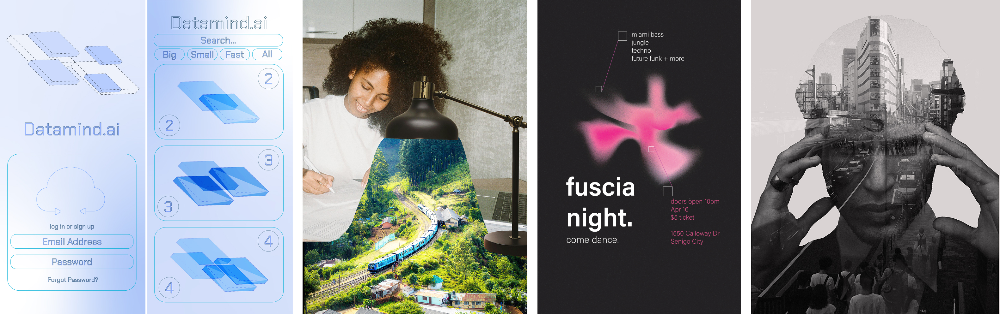

**Goal:** Design and create **three new digital compositions** that integrate visual styles, Gestalt principles, and practical design rules across three different formats.

Each composition must combine:

- **One design format**
- **One style pairing** from the five options provided
- **Two Gestalt principles** assigned to that style
- **Two rules** from Timothy Samara’s *20 Rules for Making Good Design*
- **One clear concept** that guides the visual and formal decisions

## Activity overview

- **Formats:** One poster, two connected app screens, and one photomontage
- **Style options:** Atomic Age, Wacky PoMo, Whimsigothic, Synthwave, and Solarpunk
- **Gestalt principles:** Figure/Ground, Invariance, Prägnanz, Similarity, Symmetry and Order, and Common Fate
- **Software:** Adobe Illustrator and Adobe Photoshop

Part 2 uses new formats, styles, Gestalt principles, and Samara rules. Do not repeat a composition, concept, or style pairing from Part 1.

## Activity stages

Complete the following stages in order.

<!-- 
/////////////////
SECTION 1
/////////////////
-->

  

    1. Review the Concepts
    
      Review the new Gestalt principles, art styles, and design rules before planning your compositions.
    
  

  

<!-- 
/////////////////
SUB-SECTION A
/////////////////
-->

  

    Review the Gestalt Principles
    
      Review how viewers separate subjects from backgrounds, recognize transformed forms, simplify visual information, and group elements through appearance, order, and direction.
    
  

  

    

      <!-- Figure/Ground -->
      <figure class="gestalt-principle-card">
        

        <figcaption>
          <h3>Figure/Ground</h3>
          

            The viewer separates a primary subject, or figure, from its surrounding background. In an ambiguous composition, the figure and ground may exchange roles and create different interpretations.
          

        </figcaption>
      </figure>

      <!-- Invariance -->
      <figure class="gestalt-principle-card">
        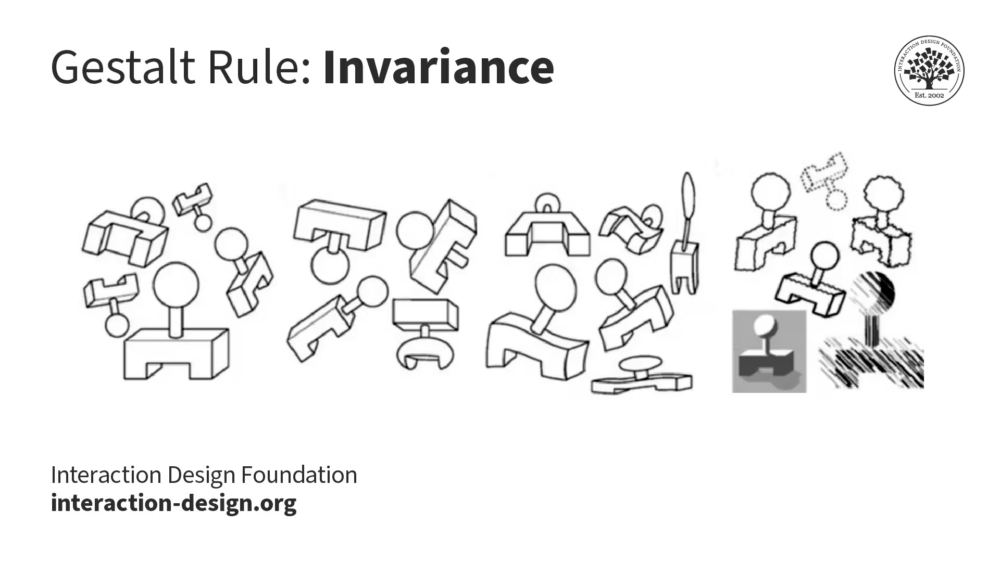

        <figcaption>
          <h3>Invariance</h3>
          

            A form remains recognizable when its scale, rotation, position, perspective, or visual treatment changes. The viewer identifies the same object despite these variations.
          

        </figcaption>
      </figure>

      <!-- Prägnanz -->
      <figure class="gestalt-principle-card">
        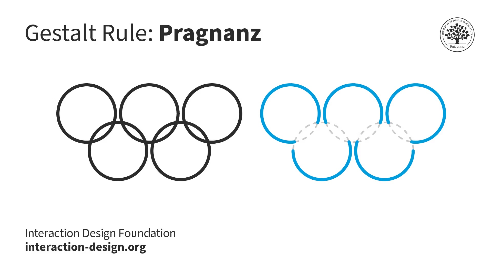

        <figcaption>
          <h3>Prägnanz</h3>
          

            The viewer tends to interpret complex visual information as the simplest, clearest, and most stable arrangement possible.
          

        </figcaption>
      </figure>

      <!-- Similarity -->
      <figure class="gestalt-principle-card">
        

        <figcaption>
          <h3>Similarity</h3>
          

            Elements that share characteristics such as colour, shape, size, texture, or direction are perceived as belonging to the same group.
          

        </figcaption>
      </figure>

      <!-- Symmetry and Order -->
      <figure class="gestalt-principle-card">
        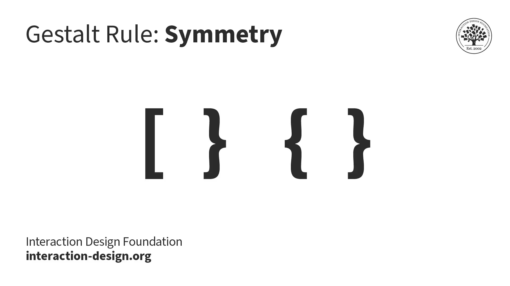

        <figcaption>
          <h3>Symmetry and Order</h3>
          

            Mirrored or visually balanced elements are perceived as related and organized. Symmetry can create stability, structure, and a clear relationship between parts.
          

        </figcaption>
      </figure>

      <!-- Common Fate -->
      <figure class="gestalt-principle-card">
        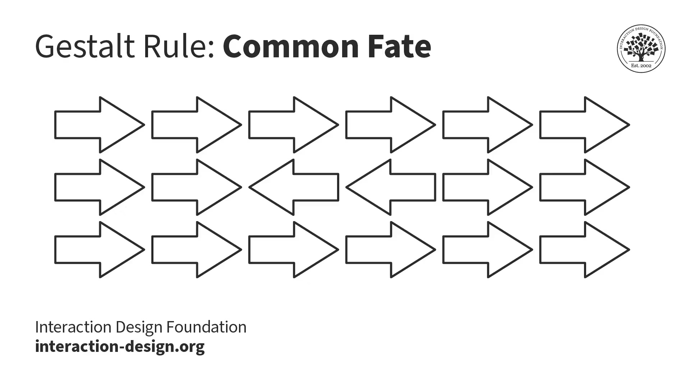

        <figcaption>
          <h3>Common Fate</h3>
          

            Elements moving, pointing, or appearing to travel in the same direction are perceived as a group. In static designs, repeated direction can suggest shared movement or purpose.
          

        </figcaption>
      </figure>

    

    

      Reference images:
      <a
        href="https://ixdf.org/literature/topics/gestalt-principles"
        target="_blank"
        rel="noopener noreferrer"
      >
        Interaction Design Foundation, CC BY-SA 4.0
      </a>.
    

  

    <!-- 
    /////////////////
    SUB-SECTION B
    /////////////////
    -->

    

      

        Review the Art Styles
        
          Review the visual characteristics, historical references, and design approaches associated with the five styles used in Part 2.
        
      

      

        

<!-- Atomic Age -->
<article class="style-review-row">

  

    <video controls preload="metadata">
      <source src="imgs/atomic-age.mp4" type="video/mp4">
      Your browser does not support embedded video.
    </video>
  

  

    <h3>Atomic Age</h3>

    

      Atomic Age design draws from mid-century scientific optimism through starbursts, boomerangs, atoms, rockets, satellites, simplified geometry, and bold contrasting palettes.
    

    <h4>Relevant links</h4>

    <ul>
      <li>
        <a
          href="https://aesthetics.fandom.com/wiki/Atomic_Age"
          target="_blank"
          rel="noopener noreferrer"
        >
          Atomic Age overview
        </a>
        

          An introduction to the post-war visual language of atomic science, the Space Race, and mid-century futurism.
        

      </li>

      <li>
        <a
          href="https://www.google.com/search?tbm=isch&amp;q=Atomic+Age+graphic+design"
          target="_blank"
          rel="noopener noreferrer"
        >
          Atomic Age examples
        </a>
        

          Examples of advertising, illustration, architecture, posters, and product design associated with the Atomic Age.
        

      </li>
    </ul>
  

</article>

<!-- Wacky PoMo -->
<article class="style-review-row">

  

    <video controls preload="metadata">
      <source src="imgs/wacky-pomo.mp4" type="video/mp4">
      Your browser does not support embedded video.
    </video>
  

  

    <h3>Wacky PoMo</h3>

    

      Wacky PoMo uses cartoon-like forms, exaggerated typography, irregular grids, clashing colours, playful patterns, and intentionally disruptive postmodern arrangements.
    

    <h4>Relevant links</h4>

    <ul>
      <li>
        <a
          href="https://aesthetics.fandom.com/wiki/Wacky_Pomo"
          target="_blank"
          rel="noopener noreferrer"
        >
          Wacky PoMo overview
        </a>
        

          A description of Wacky PoMo and its use in 1990s and early-2000s marketing, publishing, packaging, and youth-oriented design.
        

      </li>

      <li>
        <a
          href="https://www.google.com/search?tbm=isch&amp;q=Wacky+PoMo+graphic+design"
          target="_blank"
          rel="noopener noreferrer"
        >
          Wacky PoMo examples
        </a>
        

          Examples of expressive typography, irregular layouts, characters, patterns, and colourful postmodern graphics.
        

      </li>
    </ul>
  

</article>

<!-- Whimsigothic -->
<article class="style-review-row">

  

    <video controls preload="metadata">
      <source src="imgs/whimsigothic.mp4" type="video/mp4">
      Your browser does not support embedded video.
    </video>
  

  

    <h3>Whimsigothic</h3>

    

      Whimsigothic combines dark romantic colour palettes with celestial symbols, botanical forms, ornate frames, candles, moons, stars, crystals, and layered mystical textures.
    

    <h4>Relevant links</h4>

    <ul>
      <li>
        <a
          href="https://aesthetics.fandom.com/wiki/Whimsigothic"
          target="_blank"
          rel="noopener noreferrer"
        >
          Whimsigothic overview
        </a>
        

          An overview of the style also known as Whimsigoth, including its celestial, gothic, botanical, and decorative references.
        

      </li>

      <li>
        <a
          href="https://www.google.com/search?tbm=isch&amp;q=Whimsigothic+Whimsigoth+graphic+design"
          target="_blank"
          rel="noopener noreferrer"
        >
          Whimsigothic examples
        </a>
        

          Examples of dark romantic layouts, celestial motifs, ornamental borders, typography, and layered textures.
        

      </li>
    </ul>
  

</article>

<!-- Synthwave -->
<article class="style-review-row">

  

    <video controls preload="metadata">
      <source src="imgs/synthwave.mp4" type="video/mp4">
      Your browser does not support embedded video.
    </video>
  

  

    <h3>Synthwave</h3>

    

      Synthwave draws from retro-futurist interpretations of the 1980s through neon gradients, perspective grids, chrome typography, glowing horizons, geometric landscapes, and high contrast.
    

    <h4>Relevant links</h4>

    <ul>
      <li>
        <a
          href="https://aesthetics.fandom.com/wiki/Synthwave"
          target="_blank"
          rel="noopener noreferrer"
        >
          Synthwave overview
        </a>
        

          An introduction to the visual language of neon grids, striped sunsets, chrome type, retro technology, and cinematic 1980s futurism.
        

      </li>

      <li>
        <a
          href="https://www.google.com/search?tbm=isch&amp;q=Synthwave+graphic+design"
          target="_blank"
          rel="noopener noreferrer"
        >
          Synthwave examples
        </a>
        

          Examples of album covers, posters, interface graphics, landscapes, gradients, and retro-futurist typography.
        

      </li>
    </ul>
  

</article>

<!-- Solarpunk -->
<article class="style-review-row">

  

    <video controls preload="metadata">
      <source src="imgs/solarpunk.mp4" type="video/mp4">
      Your browser does not support embedded video.
    </video>
  

  

    <h3>Solarpunk</h3>

    

      Solarpunk imagines sustainable futures through vegetation, renewable technology, warm daylight, community spaces, organic architecture, local systems, and relationships between ecological and technological forms.
    

    <h4>Relevant links</h4>

    <ul>
      <li>
        <a
          href="https://aesthetics.fandom.com/wiki/Solarpunk"
          target="_blank"
          rel="noopener noreferrer"
        >
          Solarpunk overview
        </a>
        

          An introduction to Solarpunk as an ecological, community-oriented, and speculative approach to future design.
        

      </li>

      <li>
        <a
          href="https://www.google.com/search?tbm=isch&amp;q=Solarpunk+graphic+design"
          target="_blank"
          rel="noopener noreferrer"
        >
          Solarpunk examples
        </a>
        

          Examples of green cities, renewable systems, community spaces, botanical graphics, and optimistic future-oriented design.
        

      </li>
    </ul>
  

</article>

    

    <blockquote>
      

        <strong>Video source:</strong>
        <a
          href="https://www.instagram.com/thesupergraphics/"
          target="_blank"
          rel="noopener noreferrer"
        >
          <em>The Supergraphics: Fine Art</em> by Harald Austad
        </a>.
        Videos are included for educational review.
      

    </blockquote>

  

<!-- 
/////////////////
SUB-SECTION C
/////////////////
-->

  

    Review Samara’s Rules for Making Good Design
    
      Review the ten rules assigned to Part 2 and consider how each one can guide your design decisions.
    
  

  

    

<!-- Rule 4 -->
<figure class="samara-rule-card">
  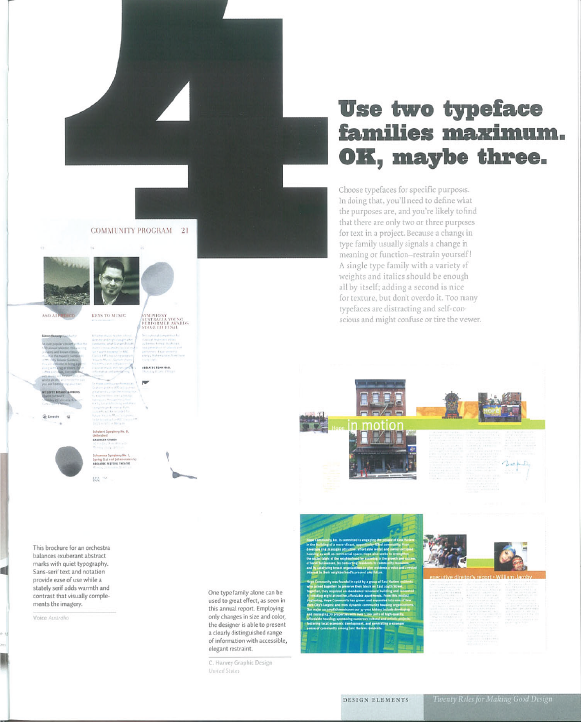
  <figcaption>
    <h3>4. Use two typefaces—maximum</h3>
    

      Limit the composition to one or two type families. Create hierarchy through size, weight, spacing, and placement rather than adding unnecessary fonts.
    

  </figcaption>
</figure>

<!-- Rule 5 -->
<figure class="samara-rule-card">
  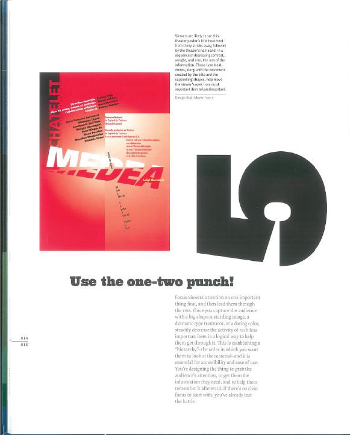
  <figcaption>
    <h3>5. Show one thing first</h3>
    

      Establish a clear focal point. Use scale, colour, contrast, placement, or isolation to show the viewer where to begin.
    

  </figcaption>
</figure>

<!-- Rule 6 -->
<figure class="samara-rule-card">
  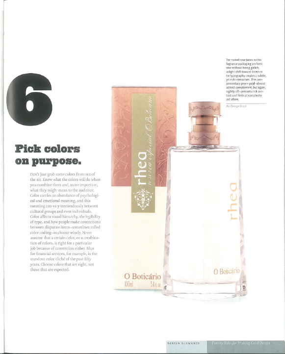
  <figcaption>
    <h3>6. Pick colours for a purpose</h3>
    

      Choose colours that support the concept, audience, hierarchy, and intended emotional effect. Do not select colours only because they look appealing.
    

  </figcaption>
</figure>

<!-- Rule 9 -->
<figure class="samara-rule-card">
  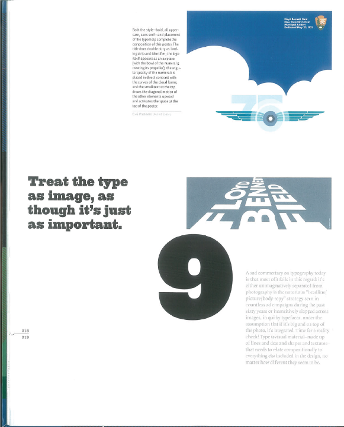
  <figcaption>
    <h3>9. Treat type like image</h3>
    

      Consider letters and words as visual forms. Integrate typography with the shapes, rhythms, textures, and spatial structure of the composition.
    

  </figcaption>
</figure>

<!-- Rule 10 -->
<figure class="samara-rule-card">
  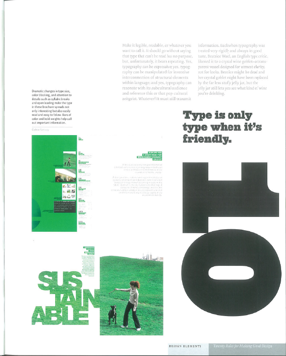
  <figcaption>
    <h3>10. Keep type friendly</h3>
    

      Typography may be expressive, but it must remain readable or clearly meaningful for the intended audience and design function.
    

  </figcaption>
</figure>

<!-- Rule 13 -->
<figure class="samara-rule-card">
  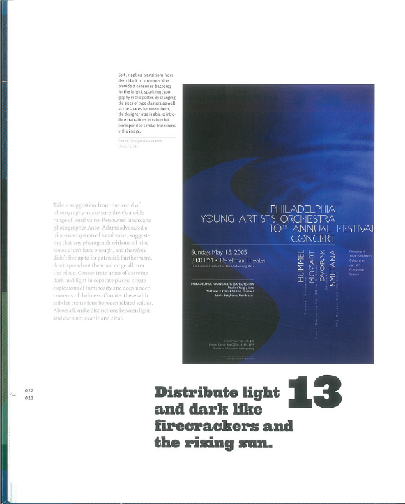
  <figcaption>
    <h3>13. Distribute light and dark</h3>
    

      Use concentrated areas of light, middle values, and darkness to establish contrast, depth, emphasis, and visual rhythm.
    

  </figcaption>
</figure>

<!-- Rule 17 -->
<figure class="samara-rule-card">
  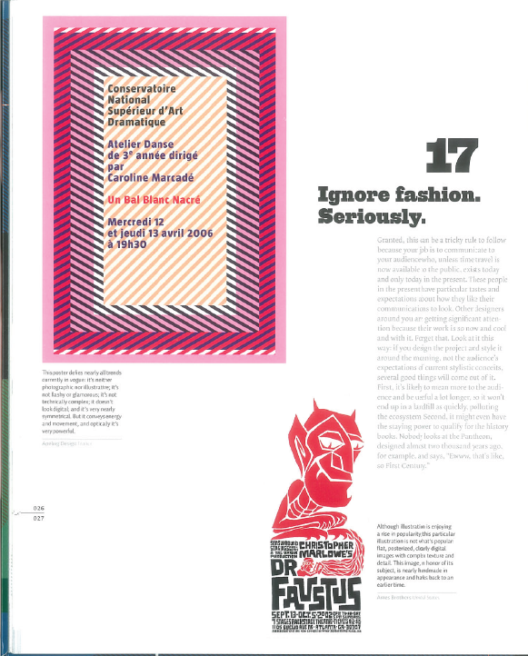
  <figcaption>
    <h3>17. Try to ignore fashion. Really!</h3>
    

      Make decisions from the concept, audience, and function rather than reproducing a current trend without a clear reason.
    

  </figcaption>
</figure>

<!-- Rule 18 -->
<figure class="samara-rule-card">
  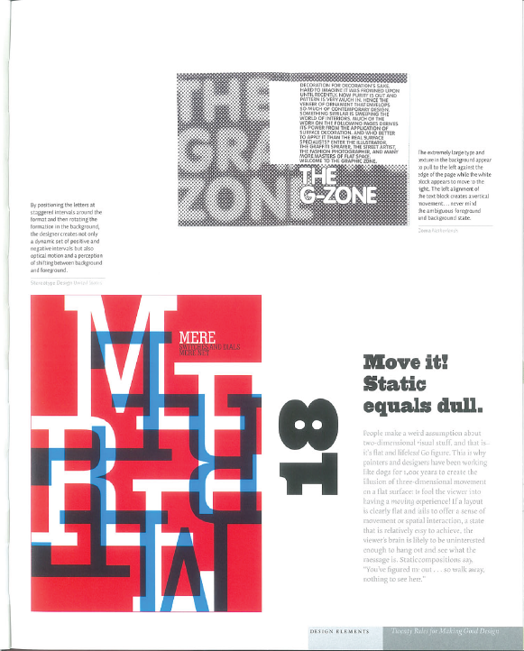
  <figcaption>
    <h3>18. Move it! Static equals dull</h3>
    

      Create energy through direction, scale changes, diagonals, perspective, repetition, and unequal spacing. The composition should guide the eye through space.
    

  </figcaption>
</figure>

<!-- Rule 19 -->
<figure class="samara-rule-card">
  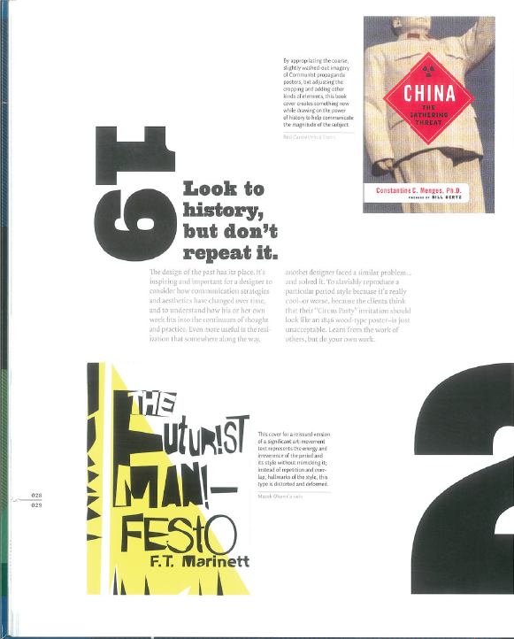
  <figcaption>
    <h3>19. Look to history—do not repeat it</h3>
    

      Study historical styles to understand how they communicate, then transform those references into an original response rather than copying an existing design.
    

  </figcaption>
</figure>

<!-- Rule 20 -->
<figure class="samara-rule-card">
  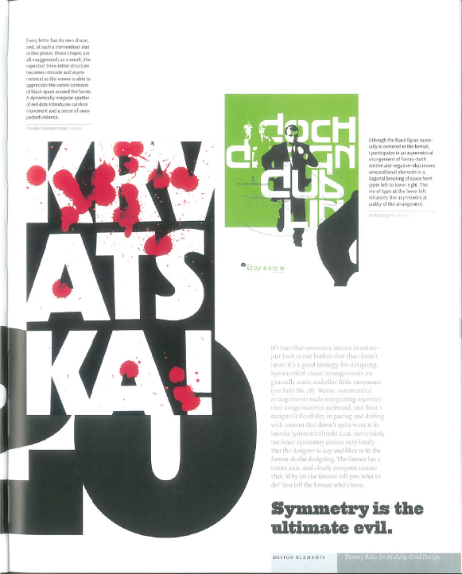
  <figcaption>
    <h3>20. Symmetry is the ultimate evil</h3>
    

      Use perfect symmetry cautiously. When a symmetrical structure becomes static, introduce contrast, directional tension, or an intentional disruption.
    

  </figcaption>
</figure>

        

        <blockquote>
          

            <strong>Source:</strong>
            Samara, T. (2007) <em>Design Elements: A Graphic Style Manual</em>. Rockport Publishers. Images (pp. 10–29) are included for educational review.
          

        </blockquote>

      

    

  

<!-- 
/////////////////
SECTION 2
/////////////////
-->

  

    2. Choose three style pairings
    
      Select three options and use one pairing for each composition.
    
  

Choose **three of the five options** below. Apply each selected pairing to one required format.

| Option | Leading style | Gestalt principles | Samara rules | Required visual direction |
|---|---|---|---|---|
| **1** | **Atomic Age** | Symmetry and Order + Invariance | **5. Show one thing first.** **20. Symmetry is the ultimate evil.** | Use starbursts, orbiting forms, rockets, atoms, boomerangs, and mid-century geometry. Repeat recognizable forms at different scales, rotations, or positions. Begin with an ordered structure, then disrupt perfect symmetry through an offset shape, text block, or directional element. |
| **2** | **Wacky PoMo** | Figure/Ground + Similarity | **9. Treat type like image.** **19. Look to history—do not repeat it.** | Use expressive typography, irregular frames, arrows, lines, cartoon-like forms, and repeated graphic fragments. Create shifting relationships between foreground and background while using repeated colours, shapes, or typographic treatments to connect the composition. Reference postmodern design without copying an existing work. |
| **3** | **Whimsigothic** | Symmetry and Order + Figure/Ground | **4. Use two typefaces—maximum.** **13. Distribute light and dark.** | Use mirrored celestial or botanical motifs, ornamental structures, dark colour fields, and concentrated highlights. Establish visual balance through symmetry while using contrast between light and dark areas to separate or shift the figure and background. |
| **4** | **Synthwave** | Common Fate + Invariance | **6. Pick colours for a purpose.** **18. Move it! Static equals dull.** | Use perspective grids, repeated directional forms, neon gradients, glowing horizons, and recognizable shapes repeated at different scales. Lines and forms should appear to move in a shared direction, while changes in size, rotation, or perspective create depth without making the repeated forms unrecognizable. |
| **5** | **Solarpunk** | Similarity + Prägnanz | **10. Keep type friendly.** **17. Try to ignore fashion. Really!** | Combine ecological, technological, architectural, and community elements through repeated colours, shapes, materials, or symbols. Organize complex information into a clear and stable visual structure that can be understood quickly. Develop the style from the concept rather than copying a current trend. |kjakls

### Note on Rule 20

Rule 20 does not mean that symmetry is prohibited in this activity. Use symmetry to establish order, then examine whether the composition becomes too static. Introduce an intentional disruption when contrast, movement, or hierarchy is needed.

<!-- 
/////////////////
SECTION 3
/////////////////
-->

  

    3. Assign one pairing to each required format
    
      Create one poster, two connected app screens, and one new photomontage.
    
  

Create one composition in each category:

| Category | Required format | Main software |
|---|---|---|
| **Graphic design** | Poster | Adobe Illustrator |
| **UI design** | Two connected app screens | Adobe Illustrator |
| **Photomontage** | Photographic collage using image layers and texture | Adobe Photoshop |

Assign one of your three selected style pairings to each required format. Consider which pairing best supports the purpose, structure, and intended audience of each composition.

## Review the required formats

  <!-- Poster -->
  <figure class="format-option-card">
    <h3>Poster</h3>
    

      A poster communicates information about an event, campaign, organization, product, or public message within one vertical or horizontal composition.
    

    

      It should establish a clear focal point and guide the viewer through the title, imagery, supporting information, and practical details.
    

    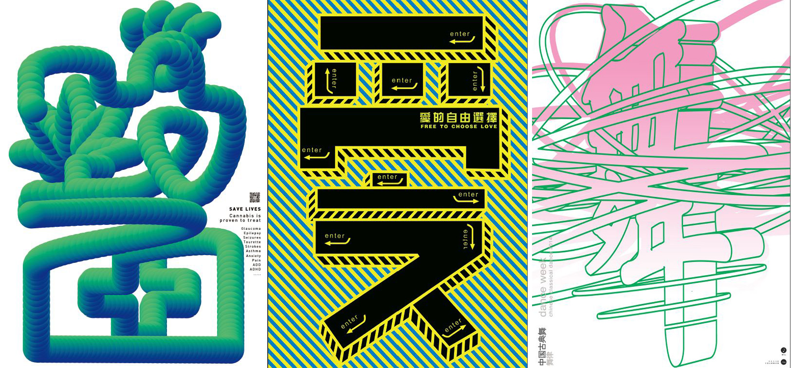
    <figcaption>
      Example: Poster by Chinesse designer <a href="https://typomania.net/2019/speakers-2019/xu-li/" target="_blank" rel="noopener noreferrer">Xu Li</a>
    </figcaption>
  </figure>

  <!-- App screens -->
  <figure class="format-option-card">
    <h3>Two App Screens</h3>
    

      App screens organize information and controls so that a user can understand the interface and complete a specific action.
    

    

      Create one introductory or home screen and one connected secondary screen. The two screens must share consistent navigation, typography, colour, buttons, icons, spacing, and visual hierarchy.
    

    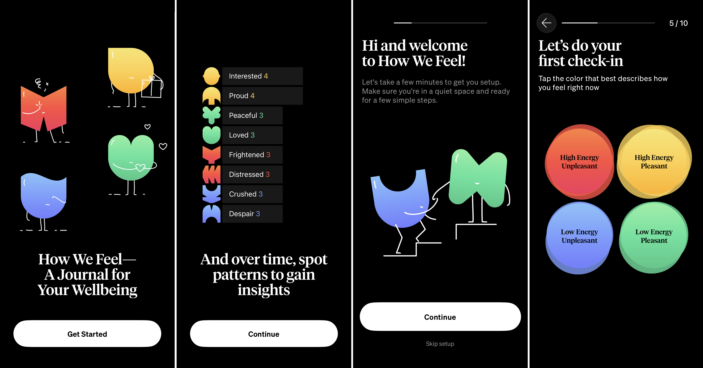
    <figcaption>
      Example: <a href="https://howwefeel.org/" target="_blank" rel="noopener noreferrer">How We Feel</a> App developed by Strand & Form. 
    </figcaption>
  </figure>

  <!-- Photomontage -->
  <figure class="format-option-card">
    <h3>Photomontage</h3>
    

      A photomontage combines photographs, textures, fragments, and graphic elements to construct a new image or visual argument.
    

    

      The Part 2 photomontage must use at least one new original DSLR photograph and develop a concept that is different from the Part 1 composition.
    

    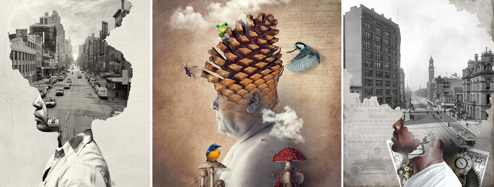
    <figcaption>
      Example: Photomontage by Italian artist <a href="https://andreacostantini.com/" target="_blank" rel="noopener noreferrer">Andrea Costantini</a>
    </figcaption>
  </figure>

## Assign the style pairings

Use each selected pairing once:

- Assign one pairing to the poster.
- Assign one pairing to the two app screens.
- Assign one pairing to the photomontage.
- Do not repeat the same style pairing across two formats.

The poster and app screens must use the format options that were not completed in Part 1. The photomontage must be a new composition with a new concept and a new original photograph.

<!-- 
/////////////////
SECTION 4
/////////////////
-->

  

    4. Plan and sketch the three compositions
    
      Define the concept and create one annotated sketch for each required format.
    
  

Create one planning sketch for each composition:

- One poster
- Two connected app screens
- One photomontage

The sketches may be drawn by hand, photographed or scanned, or created digitally. They do not need to be polished, but the structure and written notes must be clear.

For the app design, place both screens on the same planning page and use arrows or notes to show how the user moves from the first screen to the second.

Use simple shapes, lines, labels, and arrows to show where the main elements will appear.

<fieldset class="equipment-checklist">
  <legend>Planning requirements for each composition</legend>

  <label class="checklist-item">
    <input type="checkbox">
    
      <strong>Identify the format.</strong>
      State whether the sketch is for the poster, app screens, or photomontage.
    
  </label>

  <label class="checklist-item">
    <input type="checkbox">
    
      <strong>Define the concept and audience.</strong>
      Write one sentence explaining what the composition communicates and who it is intended for.
    
  </label>

  <label class="checklist-item">
    <input type="checkbox">
    
      <strong>Identify the style pairing.</strong>
      Name the selected style, two Gestalt principles, and two Samara rules.
    
  </label>

  <label class="checklist-item">
    <input type="checkbox">
    
      <strong>Draw the main structure.</strong>
      Show the placement of images, text, shapes, interface controls, sections, and other important elements.
    
  </label>

  <label class="checklist-item">
    <input type="checkbox">
    
      <strong>Mark the visual organization.</strong>
      Identify the focal area, reading order, grouping, connections, boundaries, movement, and negative space.
    
  </label>

  <label class="checklist-item">
    <input type="checkbox">
    
      <strong>Add visual notes.</strong>
      Include brief notes about the planned colours, imagery, textures, typography, and recognizable characteristics of the selected style.
    
  </label>

  <label class="checklist-item">
    <input type="checkbox">
    
      <strong>Prepare the sketches for submission.</strong>
      Photograph, scan, or export the sketches clearly, then combine them into one three-page PDF in the following order: poster, app screens, and photomontage.
    
  </label>
</fieldset>

Save the completed planning document as:

- **Format:** PDF
- **Filename:** `Lastname-Firstname-CompTech3-Part2-Sketches.pdf`

Ask the instructor for feedback before beginning the final digital compositions.

<!-- 
/////////////////
SECTION 5
/////////////////
-->

  

    5. Set up the digital files
    
      Create the required Illustrator and Photoshop documents using the correct dimensions, layers, and filenames.
    
  

<!-- 
/////////////////
SUB-SECTION A
/////////////////
-->

  

    Graphic Design: Poster
    
      Set up the Illustrator document and review the references required to create the poster.
    
  

Use Adobe Illustrator to create the poster. Adobe Photoshop may be used to prepare raster images.

> **Embed all linked images before exporting.** Points will be deducted when linked images are missing or not embedded.

### Document setup

| Setting | Requirement |
|---|---|
| Filename | `Lastname-Firstname-CompTech3-Part2-Poster` |
| Units | Inches |
| Size | 11 × 17 in vertical or 17 × 11 in horizontal |
| Bleed | 0.3 in on all sides |
| Colour mode | RGB |
| Raster effects | High, 300 PPI |
| Guides | Inner rectangular border 0.5 in from the edges |
| Layers | Guides, Composition, Background |

### Poster design tutorials

  <iframe
    src="https://www.youtube.com/embed/XeQo6fT0n_o?si=0UiNLZHDC1gbWn6f"
    title="All 20+ Effects in Adobe Illustrator Explained"
    allow="accelerometer; autoplay; clipboard-write; encrypted-media; gyroscope; picture-in-picture; web-share"
    allowfullscreen>
  </iframe>

> **Additional Illustrator reference:** Review [Tamaken Design](https://www.instagram.com/tamaken_design/){:target="_blank"} for visual references and short image and video tutorials on creating specific effects, shapes, patterns, gradients, and transformations in Adobe Illustrator. Adapt individual techniques to your own concept rather than copying a complete design.

<!-- 
/////////////////
SUB-SECTION B
/////////////////
-->

  

    UI Design: Two App Screens
    
      Set up two Illustrator artboards and design a clear relationship between the screens.
    
  

Use Adobe Illustrator to create two connected app screens. Adobe Photoshop may be used to prepare images and textures.

The screens are static interface mockups. No programming or functional prototype is required.

> **Embed all linked images before exporting.** Points will be deducted when linked images are missing or not embedded.

### Document setup

| Setting | Requirement |
|---|---|
| Filename | `Lastname-Firstname-CompTech3-Part2-App` |
| Units | Pixels |
| Artboard size | 1125 × 2436 px |
| Number of artboards | Two |
| Bleed | 10 px on all sides |
| Colour mode | RGB |
| Raster effects | High, 300 PPI |
| Guides | Inner rectangular border 50 px from the edges of each artboard |
| Layers | Guides, Composition, Background |

### Screen requirements

- **Screen 1:** Create an introductory, home, or landing screen that establishes the app’s purpose.
- **Screen 2:** Create a connected screen that allows the user to access information or complete one clear action.
- Use consistent navigation, buttons, icons, typography, colour, spacing, and visual hierarchy across both screens.
- Use arrows or notes in the sketch to explain how the user moves from Screen 1 to Screen 2.

### App design tutorials

  <iframe
    src="https://www.youtube.com/embed/XeQo6fT0n_o?si=0UiNLZHDC1gbWn6f"
    title="All 20+ Effects in Adobe Illustrator Explained"
    allow="accelerometer; autoplay; clipboard-write; encrypted-media; gyroscope; picture-in-picture; web-share"
    allowfullscreen>
  </iframe>

> **Additional Illustrator reference:** Review [Tamaken Design](https://www.instagram.com/tamaken_design/){:target="_blank"} for visual references and short image and video tutorials on creating specific effects, shapes, patterns, gradients, and transformations in Adobe Illustrator. Use effects only when they support the interface concept and remain readable.

<!-- 
/////////////////
SUB-SECTION C
/////////////////
-->

  

    Photomontage
    
      Take a new original DSLR photograph and set up the layered Photoshop document.
    
  

Create a new photomontage in Adobe Photoshop using photographs, textures, image fragments, and graphic elements.

The final composition must include **at least one new original photograph taken specifically for Part 2**. Do not reuse the original photograph submitted for Part 1.

The following files are required for submission:

- The completed photomontage saved as a layered TIFF, with all layers preserved and editable
- The original, unedited camera file used to satisfy the Part 2 photography requirement

### Original photography requirement

Book and use a **Canon EOS Rebel T4i DSLR camera**.

Set the camera to **Aperture Priority (`Av`) mode** and photograph a subject, object, texture, place, or environment that supports the new concept.

The original photograph must remain identifiable within the final composition, even when it is cropped, layered, adjusted, or transformed.

### Camera tutorials

- [Canon Rebel T4i Quick Reference Guide](https://jac307.github.io/summer-camp/tutorials/Photography/00_Canon_T4i_Quick_Reference.html){:target="_blank"}
- [Canon Rebel T4i Camera and Lens Anatomy](https://jac307.github.io/summer-camp/tutorials/Photography/01_Camera_and_Lens_Anatomy.html){:target="_blank"}
- [Camera Setup and Aperture Priority Mode](https://jac307.github.io/summer-camp/tutorials/Photography/02_Camera_Setup_and_Av_Mode.html){:target="_blank"}

### Photoshop document setup

| Setting | Requirement |
|---|---|
| Filename | `Lastname-Firstname-CompTech3-Part2-Photomontage` |
| Units | Inches |
| Size | 11 × 17 in vertical or 17 × 11 in horizontal |
| Resolution | 300 PPI |
| Colour mode | RGB |
| Bit depth | 16 bits |

### Photomontage tutorials

  <iframe
    src="https://www.youtube.com/embed/5j9_ywshuDw?si=Rq7xh98wm4SoDXY4"
    title="Beginner's Guide to Photoshop Collages"
    allow="accelerometer; autoplay; clipboard-write; encrypted-media; gyroscope; picture-in-picture; web-share"
    allowfullscreen>
  </iframe>

  <iframe
    src="https://www.youtube.com/embed/VsSjXNOE7NM?si=cIoo4sbk5tVRM-S9"
    title="Master the Pen Tool in Under 8 Minutes in Photoshop"
    allow="accelerometer; autoplay; clipboard-write; encrypted-media; gyroscope; picture-in-picture; web-share"
    allowfullscreen>
  </iframe>

  <iframe
    src="https://www.youtube.com/embed/fts5PKVXzIg?si=5djqN06fKTR4TZE3"
    title="How to Make Double Exposure Effect in Adobe Photoshop"
    allow="accelerometer; autoplay; clipboard-write; encrypted-media; gyroscope; picture-in-picture; web-share"
    allowfullscreen>
  </iframe>

<!-- 
/////////////////
SECTION 6
/////////////////
-->

  

    6. Create and review the three compositions
    
      Develop the poster, app screens, and photomontage from the approved sketches, then review the conceptual, visual, and technical requirements.
    
  

Use the approved sketches as the starting point for each composition:

- One poster
- Two connected app screens
- One photomontage

The final compositions do not need to reproduce the sketches exactly. Adjust the spacing, scale, colour, typography, imagery, interface elements, and hierarchy when these elements do not work effectively in the digital file.

Each decision should support the concept, selected style, assigned Gestalt principles, Samara rules, and purpose of the design format.

<fieldset class="equipment-checklist">
  <legend>Review each composition before exporting</legend>

  <label class="checklist-item">
    <input type="checkbox">
    
      <strong>The concept is clear.</strong>
      The composition communicates a specific subject, purpose, message, or function.
    
  </label>

  <label class="checklist-item">
    <input type="checkbox">
    
      <strong>The format is used appropriately.</strong>
      The design works as a poster, two connected app screens, or a photomontage and responds to the purpose of that format.
    
  </label>

  <label class="checklist-item">
    <input type="checkbox">
    
      <strong>The selected style is recognizable.</strong>
      At least three characteristics of the style are visible and adapted to the composition rather than copied directly from an example.
    
  </label>

  <label class="checklist-item">
    <input type="checkbox">
    
      <strong>Both Gestalt principles organize the composition.</strong>
      The assigned principles are clearly visible through balance, links, boundaries, emphasis, or directional movement.
    
  </label>

  <label class="checklist-item">
    <input type="checkbox">
    
      <strong>Both Samara rules guide the design.</strong>
      The assigned rules influence the typography, hierarchy, colour, movement, contrast, originality, or communication strategy.
    
  </label>

  <label class="checklist-item">
    <input type="checkbox">
    
      <strong>The visual hierarchy is clear.</strong>
      The viewer can identify the focal area, reading order, grouped elements, directional movement, and negative space.
    
  </label>

  <label class="checklist-item">
    <input type="checkbox">
    
      <strong>The visual elements are consistent.</strong>
      Colour, typography, imagery, shapes, textures, and spacing work together as one coherent composition.
    
  </label>

  <label class="checklist-item">
    <input type="checkbox">
    
      <strong>The app screens form one interface system.</strong>
      Both screens use consistent controls and show a clear relationship or user path.
    
  </label>

  <label class="checklist-item">
    <input type="checkbox">
    
      <strong>The file is technically complete.</strong>
      The dimensions, colour mode, resolution, margins, guides, layers, embedded images, and filename follow the instructions.
    
  </label>

  <label class="checklist-item">
    <input type="checkbox">
    
      <strong>The photomontage requirements are complete.</strong>
      A new Part 2 DSLR photograph is used, the TIFF preserves active layers, and the original unedited camera file is ready for submission.
    
  </label>
</fieldset>

Make final corrections before exporting the poster and app screens as PDF files and saving the photomontage as a layered TIFF.

<!-- 
/////////////////
SECTION 7
/////////////////
-->

  

    7. Export and submit Part 2
    
      Export the sketches and three compositions, then post a short description of each work.
    
  

## Required files

| Item | Required filename |
|---|---|
| Sketches PDF | `Lastname-Firstname-CompTech3-Part2-Sketches.pdf` |
| Poster PDF | `Lastname-Firstname-CompTech3-Part2-Poster.pdf` |
| App screens PDF | `Lastname-Firstname-CompTech3-Part2-App.pdf` |
| Layered photomontage TIFF | `Lastname-Firstname-CompTech3-Part2-Photomontage.tiff` |
| Original photograph | `Lastname-Firstname-CompTech3-Part2-Photography.JPG` |

The app PDF must contain both artboards as two pages in the correct order.

## Written descriptions

Post a **250-word description for each composition** directly in Avenue to Learn.

Each description must clearly explain the design rather than only listing the required principles.

For each composition:

1. State the concept and selected visual style.
2. Identify the two Gestalt principles and two Samara rules used.
3. Select **one specific and visible element of the design**, such as a title, button, frame, colour area, image, line, symbol, or group of shapes.
4. Write a short analysis of that element. Describe exactly where it appears, how it is designed, which principle or rule it demonstrates, and how it supports the concept or intended function.

Do not make general statements about the composition as a whole. Focus on one concrete example that can be clearly identified in the submitted design.

> Confirm that all files open correctly before submitting. Incorrect filenames, missing files, incomplete document setup, missing embedded images, or flattened photomontage layers will affect the grade.

---

Credits: Jessica A. Rodríguez
