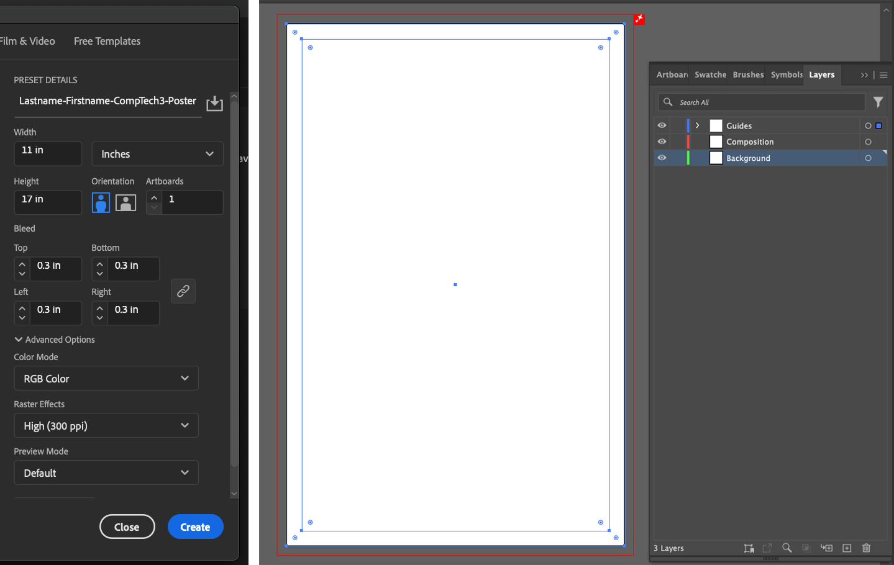

[MEDIA 2DF3](README.md)

-------------------------------------------------------------------------------

<h1 style="color: darkred;">Composition Techniques III – Part 1</h1>

<figure style="width: 50vw; margin: auto;">
  
  <figcaption style="text-align: center; font-style: italic; margin-top: 0.5em;">
    Examples by previous students.
  </figcaption>
</figure>

## Objective

Create **three digital compositions**, each combining **two different Gestalt Principles of Design** from the list below:  
1. Symmetry  
2. Connectedness  
3. Common Region  
4. Focal Point  
5. Common Fate  

Each composition should demonstrate how the selected principles interact to affect **form**, **structure**, and **visual perception**.  
Use what you’ve learned so far (e.g., layout, grids, colour theory, texture) along with the **new Gestalt concepts and examples** introduced in class to produce designs that are **intentional**, **engaging**, and **format-aware**.

**Software** 
- **Adobe Illustrator** (vector-based) – for general layout, shapes, and composition setup  
- **Adobe Photoshop** (pixel-based) – for textures, photomontage, or image-based enhancements

## Activities  
**Complete the following activities in order. Ask your professor for help if needed.**

---

<h3 style="color: darkred;">[15–20 min] Sketching</h3>

You may sketch using a **digital or physical notebook**.  
According to Wikipedia, a sketch is “a rapidly executed freehand drawing that is not usually intended as a finished work.”

#### Task:
- Sketch **three compositions** (one per format), each combining **two different Gestalt principles** from the list above.
- Explore how these principles interact visually to create structure and meaning.
- Use the formats you did **not use in Part 1** (one format per composition).

#### Composition Formats (Choose one per sketch):
- **Graphic Design** → Logo or Poster  
- **UI Design** → One-page website mockup or App intro + second screen  
- **Photomontage** → A photographic composition using collage and texture  

#### Focus on:
- Artistic experimentation – explore **unexpected visual relationships**  
- Communication – ensure Gestalt principles support **clarity and impact**  
- Negative space and layering – enhance **visual hierarchy**  
- Viewer experience – guide the eye and create **unity in complexity**  
- Colour & contrast – use them to support perceptual grouping and focus  

> Ask the professor for feedback during sketching!

---

<h3 style="color: darkred;">[15 min] Setup</h3>

Set up your documents in **Adobe Illustrator** and/or **Photoshop** based on the format of each composition.  
You must follow the appropriate setup tutorial and use correct **file naming** conventions.

---

### Graphic Design (Logo or Poster)  

- **Primary Software**: Adobe Illustrator
- **Optional**: Adobe Photoshop (for prepping raster images)
- Don’t forget to **embed all linked images**.

#### Setup for Logo design

**Your Illustrator document must include the following settings for Logo Design:**
- **Naming Protocol**: `Lastname-Firstname-CompTech3-Logo`
- **Units:** Pixels  
- **Size:** 1000 × 1000 px (1:1 aspect ratio)
- **Bleed:** 10 px (on all sides)   
- **Color Mode:** RGB  
- **Raster Effects:** High (300 PPI)

**Required Layers:**
- **Guides Layer**: Include an inner rectangular border at **-20 px** from the edges.  
- **Composition Layer**: This is where your main shapes should go.  
- **Background Layer**: Add any background colors or images here.

#### Setup for Poster design.

**Your Illustrator document must include the following settings for Poster Design:**
- **Naming Protocol**: `Lastname-Firstname-CompTech3-Poster`
- **Units:** Inches  
- **Size:** 11 × 17 in (vertical) or 17 × 11 in (horizontal) (Tabloid size)
- **Bleed:** 0.3 in (on all sides)   
- **Color Mode:** RGB  
- **Raster Effects:** High (300 PPI)
- Inner rectangle boundaries of -0.5 in.

**Required Layers:**
- **Guides Layer**: Include an inner rectangular border at **–0.5 in** from the edges.  
- **Composition Layer**: This is where your main shapes should go.  
- **Background Layer**: Add any background colors or images here.

---

#### Recommended tutorials

<iframe width="560" height="315" src="https://www.youtube.com/embed/8kz0bZQDm60?si=H4R5TaLiks80geV6" title="YouTube video player" frameborder="0" allow="accelerometer; autoplay; clipboard-write; encrypted-media; gyroscope; picture-in-picture; web-share" referrerpolicy="strict-origin-when-cross-origin" allowfullscreen></iframe>

<iframe width="560" height="315" src="https://www.youtube.com/embed/AUxtDCyaPFg?si=u9MD48P1sKyNpx8K" title="YouTube video player" frameborder="0" allow="accelerometer; autoplay; clipboard-write; encrypted-media; gyroscope; picture-in-picture; web-share" referrerpolicy="strict-origin-when-cross-origin" allowfullscreen></iframe>

<iframe width="560" height="315" src="https://www.youtube.com/embed/svd4WQE_92Y?si=O0_aL82zce8HYo40" title="YouTube video player" frameborder="0" allow="accelerometer; autoplay; clipboard-write; encrypted-media; gyroscope; picture-in-picture; web-share" referrerpolicy="strict-origin-when-cross-origin" allowfullscreen></iframe>

---

### UI/UX Design (Website or App Screens)  

- **Primary Software**: Adobe Illustrator
- **Optional**: Adobe Photoshop (for preparing assets/images)
- Don’t forget to **embed all linked images**.

#### Setup for Website design.

**Your Illustrator document must include the following settings for Web Design:**
- **Naming Protocol**: `Lastname-Firstname-CompTech3-Website`
- **Units:** Pixels  
- **Size:** 1920 x 1080 px (Web-Large size)
- **Bleed:** 10 px (on all sides)   
- **Color Mode:** RGB  
- **Raster Effects:** High (300 PPI)

**Required Layers:**
- **Guides Layer**: Include an inner rectangular border at **–50 px** from the edges.  
- **Composition Layer**: This is where your main shapes should go.  
- **Background Layer**: Add any background colors or images here.

#### Setup for App design.

**Your Illustrator document must include the following settings for Mobile Design:**
- **Naming Protocol**: `Lastname-Firstname-CompTech3-App`
- **Units:** Pixels  
- **Size:** 1125 x 2436 px (iPhone X)
- **Artboards:** 2
- **Bleed:** 10 px (on all sides)   
- **Color Mode:** RGB  
- **Raster Effects:** High (300 PPI)

**Required Layers:**
- **Guides Layer**: Include an inner rectangular border at **–50 px** from the edges.  
- **Composition Layer**: This is where your main shapes should go.  
- **Background Layer**: Add any background colors or images here.

---

### Photomontage  

- **Primary Software**: Adobe Photoshop
- **Optional**: Adobe Illustrator ((for preparing or exporting vector-based elements)
- **Naming Protocol**: `Lastname-Firstname-CompTech3-2.psd`

#### Follow these tutorials to properly set up your document for Photomontage.

**Your Photoshop document must include the following settings for Photo-Collage:**
- **Units:** Inches  
- **Size:** 11 × 17 in (vertical) or 17 × 11 in (horizontal) (Tabloid size)
- **Color Mode:** RGB  
- **Raster Effects:** High (300 PPI) 

---

#### Recommended tutorials

<iframe width="560" height="315" src="https://www.youtube.com/embed/icNXrgD08qE?si=m7zAQ1JK1wQHwAP4" title="YouTube video player" frameborder="0" allow="accelerometer; autoplay; clipboard-write; encrypted-media; gyroscope; picture-in-picture; web-share" referrerpolicy="strict-origin-when-cross-origin" allowfullscreen></iframe>

<iframe width="560" height="315" src="https://www.youtube.com/embed/iOYz669WNpU?si=24OeqEx7oEo1Qe7n" title="YouTube video player" frameborder="0" allow="accelerometer; autoplay; clipboard-write; encrypted-media; gyroscope; picture-in-picture; web-share" referrerpolicy="strict-origin-when-cross-origin" allowfullscreen></iframe>

---

<h3 style="color: darkred;">[Rest of class] Create Your Compositions</h3>

Ask yourself as you work:
- Are the **Gestalt principles clearly integrated** and visually understandable?
- Does the composition **guide the viewer’s eye** effectively?
- Are **form, space, contrast, and balance** working together harmoniously?
- Does the final output align with your **sketch and chosen format**?

---

<h3 style="color: darkred;">📥 Final Submission</h3>

Submit the following:

1. A **single PDF** file containing your **three sketches**  
   - Naming: `Lastname-Firstname-CompTech3-Sketches.pdf`

2. **Three separate PDF files**, one for each **digital composition**  
   - **Naming:** `Lastname-Firstname-CompTech3-4.pdf`
   - **Naming:** `Lastname-Firstname-CompTech3-5.pdf`
   - **Naming:** `Lastname-Firstname-CompTech3-6.pdf`

3. **Two-sentence description for each composition**  
   - Post directly into **Avenue to Learn** (not as a file)  
   - Each description must briefly explain the concept and identify the Gestalt principles used  

**Example**:  
> "This composition explores urban isolation through the use of Figure/Ground and Continuity. The contrast between overlapping silhouettes and blurred cityscapes emphasizes the fragmented experience of city life."

> ❗ **Follow submission and naming instructions carefully to avoid losing points.**

---
