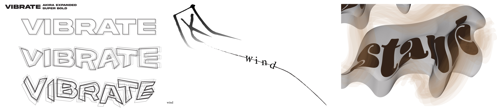
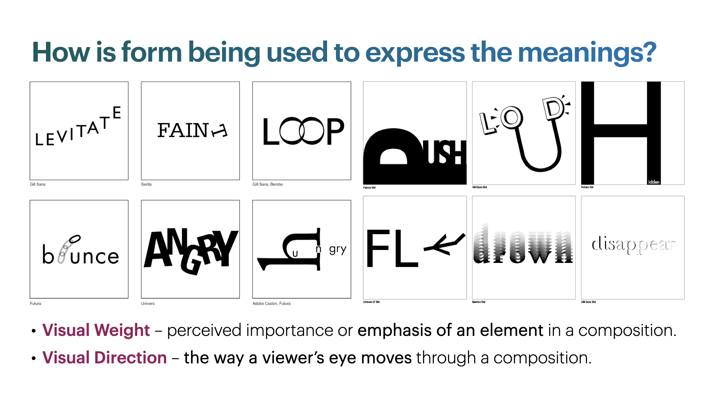
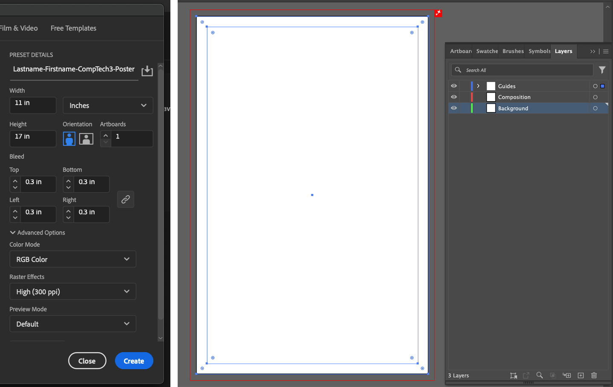

[MEDIA 2DF3](README.md)

-------------------------------------------------------------------------------

<h1 style="color: darkred;">Composition Techniques IV – Typographic Expression</h1>

<figure style="width: 100%; margin: auto;">
  
  <figcaption style="text-align: center; font-style: italic; margin-top: 0.5em;">
    Examples by previous students.
  </figcaption>
</figure>

## Objective

Create **two typographic compositions** that visually express the meaning of selected words by manipulating letterforms. Inspired by **Bruno Munari’s** ideas in *The Shape of Words*, this activity explores how **typographic form, contrast, spacing, distortion, and composition** can be used to visually communicate ideas.

Each composition should:
- Clearly reflect the meaning of the word through visual treatment of type
- Demonstrate conceptual strength and creative experimentation
- Maintain consistency in **quality**, **craft**, and **style** across all three compositions

**Software**:  
- **Adobe Illustrator** (vector-based composition)  
- **Adobe Photoshop** (texture/image-based processing only)

## Activities  
**Complete the following activities in order. Ask your professor for help if needed.**

---

<h3 style="color: darkred;">[40–50 min] Tutorial – Recreation Exercise</h3>

### Task:
Follow the provided step-by-step tutorial on **expressive typography** to understand how to manipulate letterforms effectively.

<iframe width="560" height="315" src="https://www.youtube.com/embed/3wk9KfgIj7I?si=6lZyZLtmrfT6CMzE" title="YouTube video player" frameborder="0" allow="accelerometer; autoplay; clipboard-write; encrypted-media; gyroscope; picture-in-picture; web-share" referrerpolicy="strict-origin-when-cross-origin" allowfullscreen></iframe>

- Complete the tutorial **exactly as instructed**
- Export and upload your final document as your **first submission**
- **Naming Protocol**: `Lastname-Firstname-CompTech4-Tutorial.pdf`

> ⚠️ **Important**: Make sure you follow the document setup instructions to avoid losing points.

---

<h3 style="color: darkred;">[15–20 min] Sketching – Concept Development</h3>

Choose **two words** that you will explore through typographic design.  
Create **two sketches**—one for each word—conceptualizing how you will convey its meaning visually.

#### Use the following references and techniques:
- **Munari’s The Shape of Words** – Think about how letterforms can reflect meaning  
- **Visual Weight** – Bold vs. light, dense vs. open  
- **Visual Direction** – Flow, alignment, movement  
- **Design Principles** – Wong’s Principles (e.g., contrast, repetition, gradation) or Gestalt Principles (e.g., proximity, continuity, figure/ground)

> 💡 Tip: Consider how the **form of the word enhances the meaning**. For example, the word “fall” might descend diagonally, or “sharp” could use angular cuts.

---

<h3 style="color: darkred;">[Rest of Class] Create Your Final Compositions</h3>

#### Document Setup (Required)  

**Your Illustrator document must include the following settings for Poster Design:**
- **Naming Protocol**: `Lastname-Firstname-CompTech4-#`
- **Units:** Inches  
- **Size:** 11 × 17 in
- **Bleed:** 0.3 in (on all sides)   
- **Color Mode:** RGB  
- **Raster Effects:** High (300 PPI)

**Required Layers:**
- **Guides Layer**: Include an inner rectangular border at **–0.5 in** from the edges.  
- **Composition Layer**: This is where your main shapes should go.  
- **Background Layer**: Add any background colors or images here.

#### Design Requirements:
- Use **Adobe Illustrator** to build your final compositions
- Present **three variations** per word (as done in the tutorial)
- Letterforms must be **manually modified**
- If using images or textures, make sure they are **embedded** in the Illustrator file.

Things to Consider:
- **Legibility vs. Expression** – Ensure the word is still readable while expressive  
- **Negative Space** – Use space intentionally to reinforce meaning  
- **Hierarchy & Composition** – Guide the viewer’s eye across the layout  
- **Consistency** – Maintain a cohesive design style across all three pieces

---

<h3 style="color: darkred;">📥 Final Submission</h3>

1. Resulting document from following tutorial: `Lastname-Firstname-CompTech4-Tutorial.pdf`

2. A **single PDF file** containing your **sketches** for all four compositions  
   - **Naming:** `Lastname-Firstname-CompTech4-Sketches.pdf`

3. **Two separate PDF files**, one for each **final composition**  
   - **Naming:**  
     - `Lastname-Firstname-CompTech4-1.pdf`  
     - `Lastname-Firstname-CompTech4-2.pdf`

> 📌 **Failure to follow document setup or naming instructions may result in a grade deduction.**

---
