[MEDIAART 2DF3](README.md)

# Composition Techniques IV – Typographic Expression

<figure style="width: 100%; margin: auto;">
  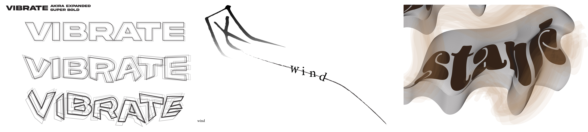
  <figcaption style="text-align: center; font-style: italic; margin-top: 0.5em;">
    Examples by previous students.
  </figcaption>
</figure>

## Goal

Design and create **four expressive typographic compositions** based on two selected words. For each word, create one **positive** and one **negative** version that visually communicates its meaning through the manipulation of letterforms.

The activity builds on **Bruno Munari’s** ideas in *The Shape of Words* and concepts developed throughout Composition Techniques I–III.

Each word pair must combine:

- **One selected word** + **One clear concept** that guides the manipulation of the letterforms
- **One Wong principle:** repetition, similarity, gradation, anomaly, concentration, and contrast
- **One Gestalt principle:** closure, common region, continuity, proximity, multistability, and similarity
- **One colour approach** that supports the concept, mood, hierarchy, and positive–negative relationship

## Activity overview

- **Learning Test:** One tutorial recreation
- **Final compositions:** Four
- **Words:** Two
- **Versions per word:** One positive + one negative
- **Software:** Adobe Illustrator
- **Optional image processing:** Adobe Photoshop

## Accessibility and learning support

- The written instructions on this page contain the required steps. The embedded video provides an additional demonstration.
- You may use zoom, screen magnification, keyboard navigation, adapted input devices, colour-identification tools, or other assistive technology.
- Do not rely on colour alone to distinguish the positive and negative versions; use figure–ground, shape, structure, or another visible difference.
- If sketching, manipulating letterforms, using Illustrator, or completing another required process creates an access barrier, contact the instructor to arrange an alternative method that demonstrates the same learning outcomes.

## Complete the activity in four stages

Complete the following stages in order.

<!-- 
/////////////////
SECTION 1
/////////////////
-->

  

    Stage 1: Review the concepts
    
      Review expressive typography, positive and negative form, and previous composition principles before beginning the activity.
    
  

  

#### Bruno Munari — The Shape of Words

Bruno Munari explored how the **visual form of language** can communicate beyond the literal meaning of a word.

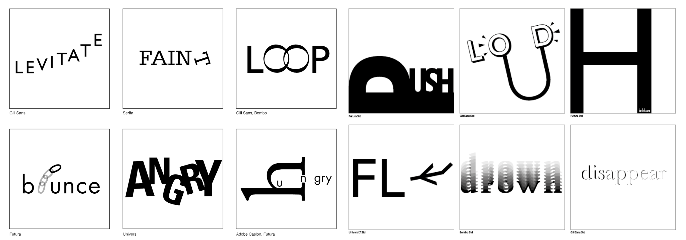

Consider how you can manipulate:

- **Scale:** Enlarge or reduce individual letters or parts of letters.
- **Weight:** Create differences between heavy, light, dense, and open forms.
- **Spacing:** Compress, separate, overlap, or interrupt letters.
- **Direction:** Rotate, tilt, curve, ascend, descend, or redirect the word.
- **Proportion:** Stretch, compress, widen, narrow, or distort letterforms.
- **Repetition:** Repeat letters, fragments, shapes, or typographic structures.
- **Cropping:** Allow parts of letters to move outside the format.
- **Fragmentation:** Cut, divide, remove, or reorganize parts of letterforms.
- **Negative space:** Use empty areas as an active part of the word.
- **Composition:** Use placement and hierarchy to reinforce the meaning of the word.

> The visual treatment should communicate the meaning of the word. Do not apply effects only for decoration.

---

#### Positive and Negative Form

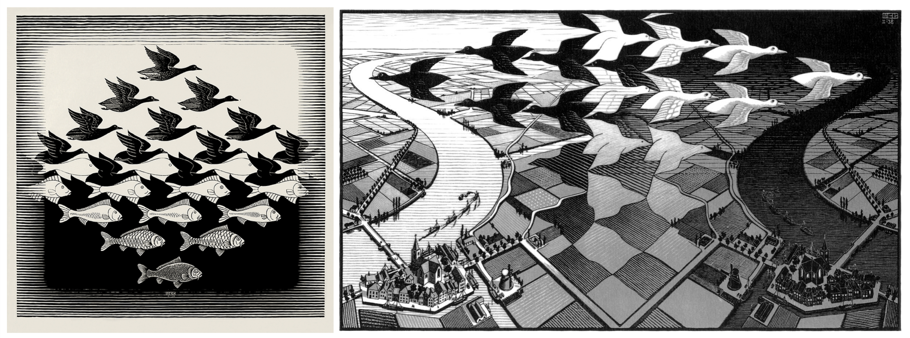

For this activity, each word must be developed into both a **positive** and a **negative** typographic composition.

| Version | Approach |
|---|---|
| **Positive** | The letterforms operate primarily as the visible **figure** against the surrounding space. |
| **Negative** | The word is constructed, revealed, or emphasized through **negative space**, cut-outs, surrounding forms, or reversed figure–ground relationships. |

> **Do not simply invert the colours of the positive composition.** The negative version must be redesigned so that the relationship between the word, surrounding forms, and empty space changes.

The positive and negative versions should clearly belong to the **same conceptual system**, but each must solve the figure–ground relationship differently.

---

#### Wong principles

Select **one Wong principle for each word**.

You may select from principles explored in previous Composition Techniques activities:

  <!-- Repetition -->
  <figure class="gestalt-principle-card">
    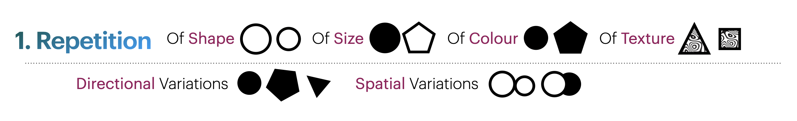

    <figcaption>
      <h3 role="heading" aria-level="5">Repetition</h3>
      

        Repeat letters, fragments, forms, intervals, or structures to create consistency, rhythm, and visual order across the typographic composition.
      

    </figcaption>
  </figure>

  <!-- Similarity -->
  <figure class="gestalt-principle-card">
    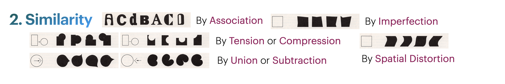

    <figcaption>
      <h3 role="heading" aria-level="5">Similarity</h3>
      

        Create related letterforms that remain visually connected while varying selected characteristics such as scale, proportion, direction, or weight.
      

    </figcaption>
  </figure>

  <!-- Gradation -->
  <figure class="gestalt-principle-card">
    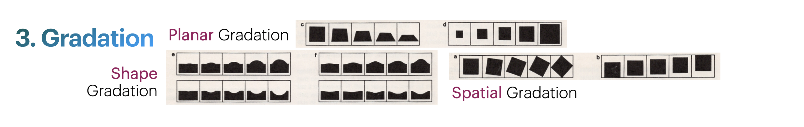

    <figcaption>
      <h3 role="heading" aria-level="5">Gradation</h3>
      

        Develop a progressive change in scale, direction, spacing, weight, shape, or position to create movement and visual transition.
      

    </figcaption>
  </figure>

  <!-- Anomaly -->
  <figure class="gestalt-principle-card">
    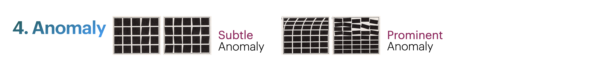

    <figcaption>
      <h3 role="heading" aria-level="5">Anomaly</h3>
      

        Interrupt an established typographic system with an intentional irregularity to create emphasis, tension, or a shift in attention.
      

    </figcaption>
  </figure>

  <!-- Concentration -->
  <figure class="gestalt-principle-card">
    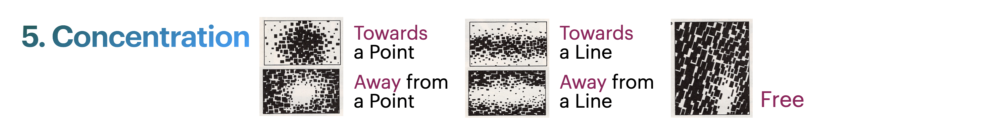

    <figcaption>
      <h3 role="heading" aria-level="5">Concentration</h3>
      

        Control density by clustering or dispersing letters and typographic elements to create focal areas, rhythm, or directional emphasis.
      

    </figcaption>
  </figure>

  <!-- Contrast -->
  <figure class="gestalt-principle-card">
    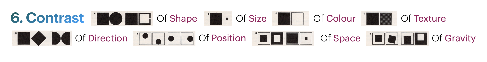

    <figcaption>
      <h3 role="heading" aria-level="5">Contrast</h3>
      

        Use strong differences in size, weight, direction, density, shape, or value to create emphasis and clarify visual relationships.
      

    </figcaption>
  </figure>

---

#### Gestalt principles

Select **one Gestalt principle for each word**.

You may use principles explored in previous activities, including:

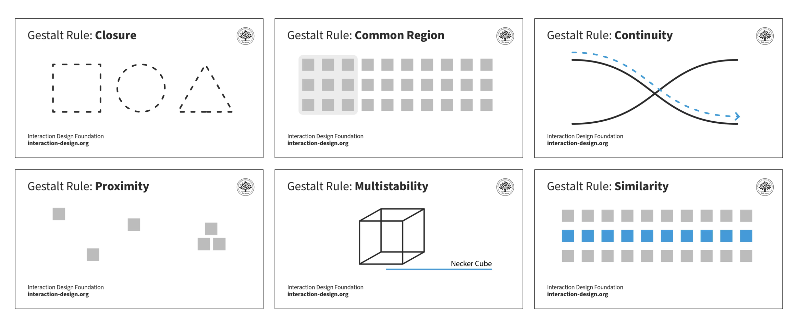

| Principle | Consider in typography |
|---|---|
| **Closure** | Remove parts of letters while retaining enough information for the viewer to complete them. |
| **Common Region** | Group typographic elements through enclosed or shared areas. |
| **Continuity** | Create visual paths that guide the viewer through letters or across the word. |
| **Proximity** | Use spacing to create or separate relationships between typographic elements. |
| **Multistability** | Create more than one possible visual interpretation. |
| **Similarity** | Group elements through shared visual characteristics. |

---

#### Colour Theory

Colour theory examines how colours relate to one another and how they influence visual perception. Consider how **hue, saturation, value, contrast, harmony, and proportion** can support hierarchy, emphasis, mood, and meaning within the composition.

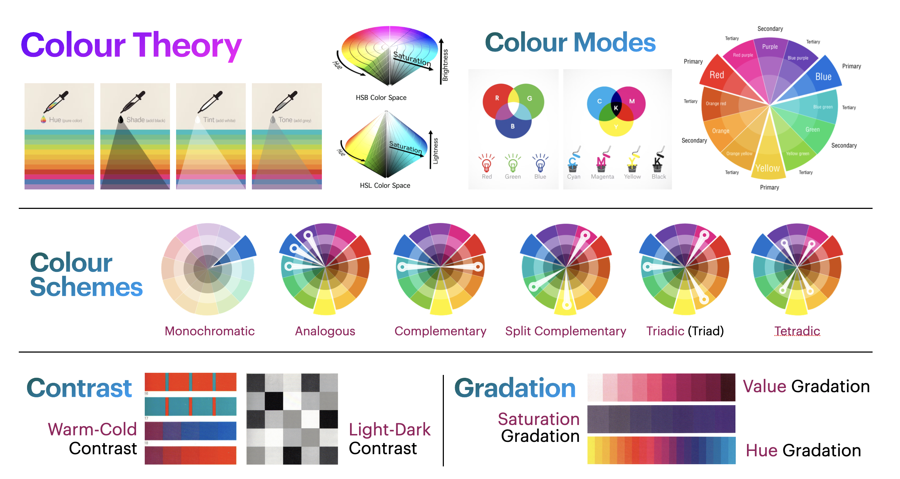

  

<!-- 
/////////////////
SECTION 2
/////////////////
-->

  

    Stage 2: Complete the Learning Test
    
      Follow the expressive typography tutorial exactly and submit the completed recreation before beginning the original compositions.
    
  

#### Follow the tutorial

  <iframe
    src="https://www.youtube.com/embed/3wk9KfgIj7I?si=6lZyZLtmrfT6CMzE"
    title="Expressive typography tutorial"
    allow="accelerometer; autoplay; clipboard-write; encrypted-media; gyroscope; picture-in-picture; web-share"
    allowfullscreen>
  </iframe>

[Open the “Expressive typography tutorial” tutorial directly](https://www.youtube.com/embed/3wk9KfgIj7I?si=6lZyZLtmrfT6CMzE)

> **Required Learning Test:** Follow the tutorial **step by step and as demonstrated**. This activity tests your ability to reproduce the demonstrated techniques before applying them independently.

The Learning Test is a recreation exercise. Do not redesign the tutorial outcome or substitute your own word at this stage. You may, however, use your own images for the exercise. 

> Make sure all images are embedded in the Illustrator file before exporting.

#### Submit the Learning Test

Export the completed tutorial exercise as:

- **Format:** PDF
- **Filename:** `Lastname-Firstname-CompTech4-LearningTest.pdf`

**Learning Test check**

- [ ] **The complete tutorial was followed.** All required steps and demonstrated typographic treatments are present.
- [ ] **The letterforms were manipulated as demonstrated.** The exercise shows the techniques introduced in the tutorial rather than an unrelated redesign.
- [ ] **The PDF displays correctly.** Open the exported PDF and confirm that no elements are missing (such as images not embedded) or incorrectly cropped.
- [ ] **The filename is correct.** The file is saved as Lastname-Firstname-CompTech4-LearningTest.pdf .

<!-- 
/////////////////
SECTION 3
/////////////////
-->

  

    Stage 3: Select the words and sketch the four compositions
    
      Choose two words, assign previous composition principles, and plan one positive and one negative version of each word.
    
  

#### Select two words

Choose **two different words** that can be explored visually through typography.

Select words with enough conceptual possibilities to support substantial manipulation of their letterforms.

Consider:

- Action
- Movement
- Emotion
- Physical qualities
- Spatial relationships
- Transformation
- Rhythm
- Weight
- Tension
- Expansion or compression
- Sound
- Speed
- Direction

> Avoid choosing a word only because it is easy to illustrate literally. Select a word that allows for creative experimentation, conceptual development, and original typographic solutions. Creativity and originality will be part of the grade.

For each word, identify:

1. Its meaning.
2. The visual characteristics associated with that meaning.
3. One **Wong principle**.
4. One **Gestalt principle**.
5. The **colour approach**, including the intended palette, contrast, mood, and relationship between positive and negative space.

Use a different Wong and Gestalt principle for each word.

#### Create four planning sketches

Create:

1. **Word 1 — Positive**
2. **Word 1 — Negative**
3. **Word 2 — Positive**
4. **Word 2 — Negative**

The sketches may be created by hand or digitally.

They do not need to be polished, but the typographic structure and written annotations must be clear.

Save the completed sketch document as:

- **Format:** PDF
- **Pages:** 2
- **Order:** (1st Page) Word 1 Positive, Word 1 Negative, (2nd Page) Word 2 Positive, Word 2 Negative
- **Filename:** `Lastname-Firstname-CompTech4-Sketches.pdf`

Ask the instructor for feedback before beginning the final digital compositions.

<!-- 
/////////////////
SECTION 4
/////////////////
-->

  

    Stage 4: Create the four typographic compositions
    
      Create one positive and one negative composition for each word while applying the assigned Wong principle, Gestalt principle, and colour approach.
    
  

##### Document setup
  
Create **two Illustrator files**, one for each word.
      
Each Illustrator file must contain **two artboards**:

- Artboard 1 — Positive version
- Artboard 2 — Negative version

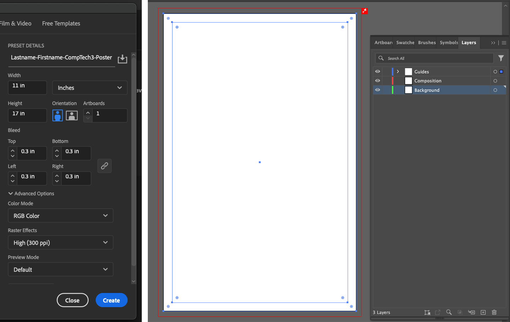

> Alternatively, **you may create the document in a horizontal / landscape format** instead of vertical, depending on the structure and direction established in your sketches.

| Setting | Requirement |
|---|---|
| Units | Inches |
| Artboard size | 11 × 17 in (vertical) or 17 × 11 in (horizontal) |
| Artboards | 2 per word |
| Bleed | 0.3 in on all sides |
| Colour mode | RGB |
| Raster effects | High, 300 PPI |
| Guides | Inner rectangular border 0.5 in from the edges |
| Layers | Guides, Composition, Background |

**File Names**
- `Lastname-Firstname-CompTech4-1.ai`
- `Lastname-Firstname-CompTech4-2.ai`

##### Required layers

**1. Guides**

- 0.5 in inner margin guides
- Any additional alignment or construction guides

> All construction grids or lines that are not intentionally part of the design must be converted into guides.

**2. Composition**

- Letterforms
- Vector shapes
- Typographic fragments
- Graphic elements that form part of the composition

**3. Background**

- Background colour
- Background shapes
- Background images or textures, when applicable

> If raster images or textures are used, **embed them in Illustrator before exporting**.

##### Manually modify the letterforms

Begin with a typeface appropriate to your concept, then transform the typography into original visual material.

The final design should not depend only on an unchanged font. Use Illustrator tools to **manipulate**:

|               |                  |                    |
| ------------- | ---------------- | ------------------ |
| Anchor points | Paths            | Individual letters |
| Counters      | Strokes          | Shapes             |
| Scale         | Width and height | Rotation           |
| Position      | Spacing          | Cropping           |
| Fragmentation | Repetition       |                    |

> The modifications should reinforce the **meaning of the word**.

###### Word 1

Create one **positive** and one **negative** version using the same:

- **Wong principle**
- **Gestalt principle**
- **Colour approach**
- Concept and typographic system

**Positive version**

Use the word primarily as the visible **figure**. Apply manual letterform manipulation, intentional hierarchy, composition, and colour to support the word’s meaning and visual emphasis.

**Negative version**

Redesign the same word through **negative space** and figure–ground relationships using cut-outs, counters, surrounding shapes, incomplete forms, or removed areas.

> The negative version must be **redesigned**, not created by simply reversing or inverting the positive version.

###### Word 2

Repeat the same process using a **different Wong and Gestalt principle combination** and a colour approach developed for Word 2.

The positive and negative versions should belong to the same conceptual system while presenting different figure–ground solutions.

##### Across all four compositions

Consider:

- **Meaning:** Does the visual treatment reinforce the word?
- **Creativity:** Does the composition present an original and imaginative typographic solution rather than a literal or predictable treatment?
- **Legibility vs. expression:** Can the viewer still recognize the word?
- **Wong principle:** Is the selected principle clearly visible?
- **Gestalt principle:** Does the principle influence how the word is perceived?
- **Colour:** Does the colour approach support meaning, mood, hierarchy, emphasis, and the positive–negative relationship?
- **Visual direction:** Does the composition guide the viewer's eye?
- **Consistency:** Do the positive and negative versions clearly belong to the same word system?

##### Export the two word pairs

Export **one PDF for each word**.

Save as:

- `Lastname-Firstname-CompTech4-1.pdf`
- `Lastname-Firstname-CompTech4-2.pdf`

When saving the PDFs, enable **Preserve Illustrator Editing Capabilities**.

##### Final file check

Open each submitted PDF twice:

**Final PDF checklist**

- [ ] **Check the concept and meaning.** Confirm that the typographic treatment clearly supports the meaning of the selected word and demonstrates an original visual approach.
- [ ] **Check the positive and negative versions.** Confirm that both versions belong to the same conceptual system but use clearly different figure–ground solutions.
- [ ] **Check the design principles.** Confirm that the selected Wong principle, Gestalt principle, colour approach, and manual letterform manipulation are clearly visible in both versions.
- [ ] **Check the PDF in a PDF viewer.** Confirm that both pages display correctly and no unintended guides or construction elements appear.
- [ ] **Check the PDF in Adobe Illustrator.** Confirm that the file opens correctly and remains editable.
- [ ] **Check editability.** Confirm that the vector objects remain editable and that the PDF has not been flattened.
- [ ] **Check the layers, guides, and margins.** Confirm that the Guides, Composition, and Background layers remain separate and contain the correct material, and that the required margin guides remain available in Illustrator.
- [ ] **Check embedded images.** Confirm that any raster images or textures used in the compositions are embedded and do not rely on linked files.
- [ ] **Check the filenames.** Confirm that both PDFs follow the required naming structure exactly.

  

---

## Submission files

| Item | Required filename |
|---|---|
| Learning Test PDF | `Lastname-Firstname-CompTech4-LearningTest.pdf` |
| Four planning sketches | `Lastname-Firstname-CompTech4-Sketches.pdf` |
| Word 1 — Positive + Negative | `Lastname-Firstname-CompTech4-1.pdf` |
| Word 2 — Positive + Negative | `Lastname-Firstname-CompTech4-2.pdf` |

Files that cannot be opened, identified, or accessed may need to be resubmitted and may be considered late. Missing files, unchanged letterforms, simple colour inversion instead of a redesigned negative composition, missing principles, unembedded images, flattened PDFs, or incomplete document setup will affect the grade.

---

Credits: Jessica A. Rodríguez
