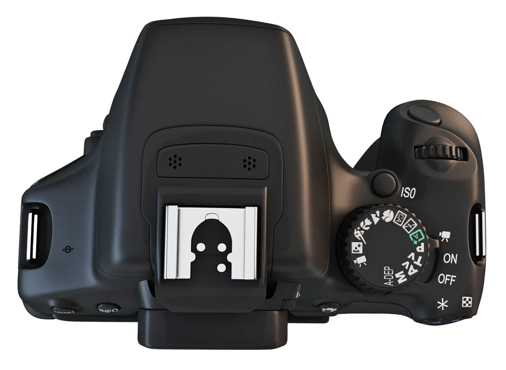
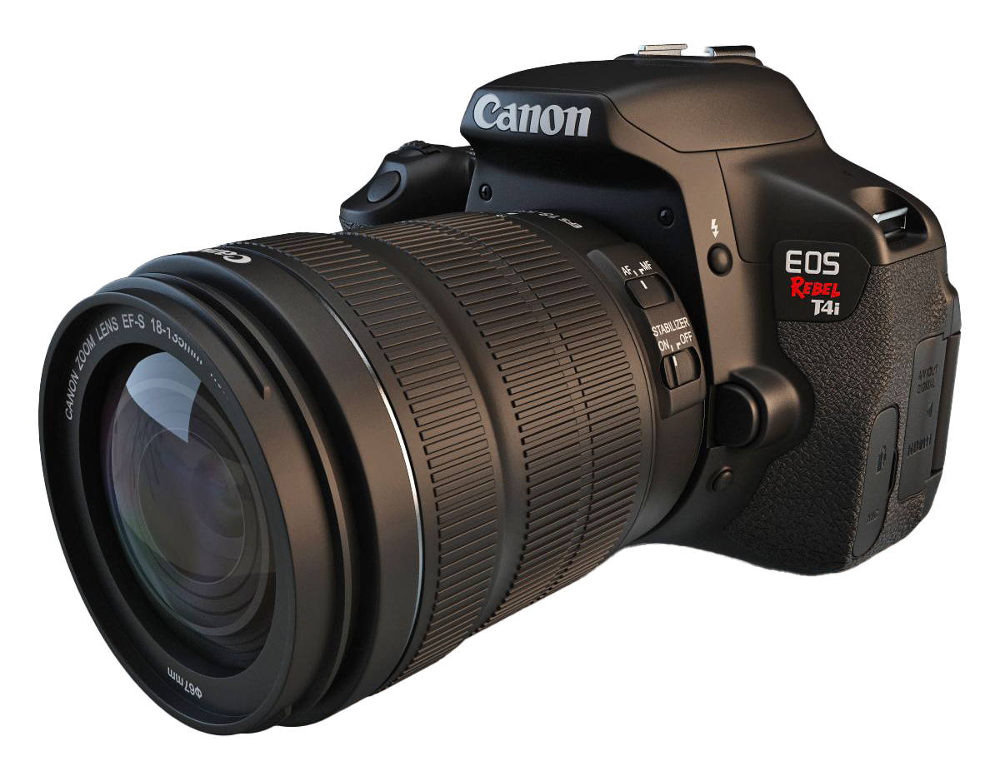
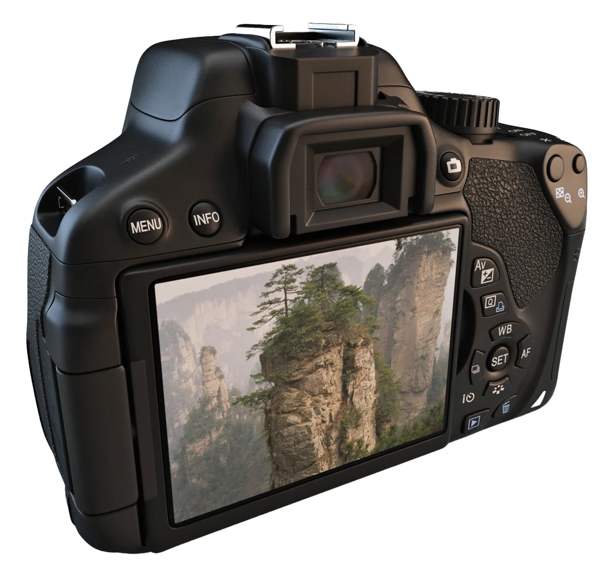
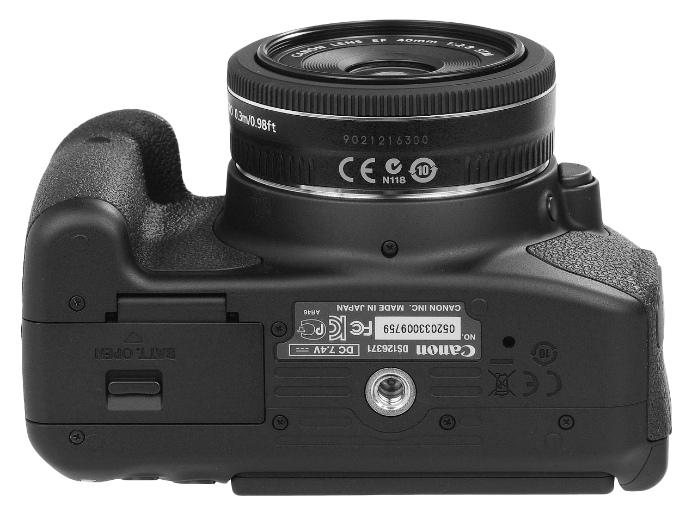
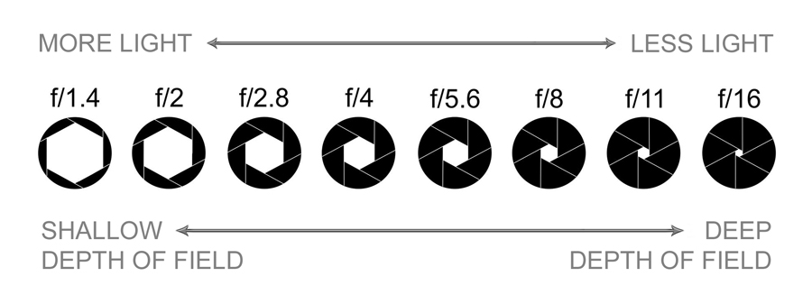

[MEDIAART 2B06](../README.md)

# DSRL Camera

This walkthrough introduces the camera controls and settings needed to use a DSRL Camera, specifically the Canon EOS Rebel T4i and T5i.

<!-- 
/////////////////
SECTION 1
/////////////////
-->

  

    1. Locate the main camera controls
    
      Identify the buttons, rings, and switches used during the activity.
    
  

  

## Camera body

  

    

    <button
      class="image-hotspot is-active"
      style="--hotspot-x: 84%; --hotspot-y: 29%;"
      type="button"
      aria-label="Shutter button"
      aria-pressed="true"
      data-target="camera-shutter"
    >
      1
    </button>

    <button
      class="image-hotspot"
      style="--hotspot-x: 88%; --hotspot-y: 41%;"
      type="button"
      aria-label="Main control dial"
      aria-pressed="false"
      data-target="camera-control-dial"
    >
      2
    </button>

    <button
      class="image-hotspot"
      style="--hotspot-x: 75%; --hotspot-y: 49%;"
      type="button"
      aria-label="ISO button"
      aria-pressed="false"
      data-target="camera-iso"
    >
      3
    </button>

    <button
      class="image-hotspot"
      style="--hotspot-x: 74%; --hotspot-y: 68%;"
      type="button"
      aria-label="Mode dial"
      aria-pressed="false"
      data-target="camera-mode"
    >
      4
    </button>

    <button
      class="image-hotspot"
      style="--hotspot-x: 89%; --hotspot-y: 67%;"
      type="button"
      aria-label="Power switch"
      aria-pressed="false"
      data-target="camera-power"
    >
      5
    </button>

  

  

    <section
      id="camera-shutter"
      class="image-information-panel"
      tabindex="-1"
    >
      
Control 1

      <h3>Shutter button</h3>

      

        Press halfway to activate autofocus. Press fully to take the
        photograph.
      

    </section>

    <section
      id="camera-control-dial"
      class="image-information-panel"
      tabindex="-1"
      hidden
    >
      
Control 2

      <h3>Main control dial</h3>

      

        Turn this dial to change the aperture while the camera is set to
        Aperture Priority mode.
      

    </section>

    <section
      id="camera-iso"
      class="image-information-panel"
      tabindex="-1"
      hidden
    >
      
Control 3

      <h3>ISO button</h3>

      

        Press this button to open the ISO settings. Begin with ISO 100 or
        200 for the Photo Film activity.
      

    </section>

    <section
      id="camera-mode"
      class="image-information-panel"
      tabindex="-1"
      hidden
    >
      
Control 4

      <h3>Mode dial</h3>

      

        Selects the camera’s shooting mode. Turn the dial to
        <code>Av</code> for this activity.
      

    </section>

    <section
      id="camera-power"
      class="image-information-panel"
      tabindex="-1"
      hidden
    >
      
Control 5

      <h3>Power switch</h3>

      

        Turns the camera on and off. Turn the camera off before removing
        the SD card or changing the lens.
      

    </section>

  

## Lens controls

  

    

    <button
      class="image-hotspot is-active"
      style="--hotspot-x: 66%; --hotspot-y: 36%;"
      type="button"
      aria-label="Autofocus and manual focus switch"
      aria-pressed="true"
      data-target="lens-focus-switch"
    >
      1
    </button>

    <button
      class="image-hotspot"
      style="--hotspot-x: 34%; --hotspot-y: 37%;"
      type="button"
      aria-label="Focus ring"
      aria-pressed="false"
      data-target="lens-focus-ring"
    >
      2
    </button>

    <button
      class="image-hotspot"
      style="--hotspot-x: 53%; --hotspot-y: 45%;"
      type="button"
      aria-label="Zoom ring"
      aria-pressed="false"
      data-target="lens-zoom-ring"
    >
      3
    </button>

    <button
      class="image-hotspot"
      style="--hotspot-x: 68%; --hotspot-y: 49%;"
      type="button"
      aria-label="Image stabilization switch"
      aria-pressed="false"
      data-target="lens-stabilizer"
    >
      4
    </button>

  

  

    <section
      id="lens-focus-switch"
      class="image-information-panel"
      tabindex="-1"
    >
      
Control 1

      <h3>AF/MF switch</h3>

      

        Use <code>AF</code> for autofocus. Use <code>MF</code> when you
        want to focus manually with the focus ring.
      

      

        Begin with <code>AF</code> for the Photo Film activity.
      

    </section>

    <section
      id="lens-focus-ring"
      class="image-information-panel"
      tabindex="-1"
      hidden
    >
      
Control 2

      <h3>Focus ring</h3>

      

        Turn this ring to adjust focus when the lens is set to
        <code>MF</code>.
      

      

        Turn the ring slowly and use the camera screen or viewfinder to
        check which part of the image appears sharp.
      

    </section>

    <section
      id="lens-zoom-ring"
      class="image-information-panel"
      tabindex="-1"
      hidden
    >
      
Control 3

      <h3>Zoom ring</h3>

      

        Turn this ring to change the focal length and adjust how much of
        the scene appears inside the frame.
      

      

        A shorter focal length creates a wider view. A longer focal
        length brings distant subjects closer.
      

    </section>

    <section
      id="lens-stabilizer"
      class="image-information-panel"
      tabindex="-1"
      hidden
    >
      
Control 4

      <h3>Image Stabilization switch</h3>

      

        Turn Image Stabilization <strong>on</strong> when photographing
        handheld to reduce camera shake.
      

      

        Turn it <strong>off</strong> when the camera is mounted on a
        tripod.
      

    </section>

  

## Viewing and back controls

  

    

    <button
      class="image-hotspot is-active"
      style="--hotspot-x: 56%; --hotspot-y: 23%;"
      type="button"
      aria-label="Viewfinder"
      aria-pressed="true"
      data-target="back-viewfinder"
    >
      1
    </button>

    <button
      class="image-hotspot"
      style="--hotspot-x: 42%; --hotspot-y: 62%;"
      type="button"
      aria-label="LCD screen"
      aria-pressed="false"
      data-target="back-lcd"
    >
      2
    </button>

    <button
      class="image-hotspot"
      style="--hotspot-x: 75%; --hotspot-y: 28%;"
      type="button"
      aria-label="Live View button"
      aria-pressed="false"
      data-target="back-liveview"
    >
      3
    </button>

    <button
      class="image-hotspot"
      style="--hotspot-x: 22%; --hotspot-y: 36%;"
      type="button"
      aria-label="Menu button"
      aria-pressed="false"
      data-target="back-menu"
    >
      4
    </button>

    <button
      class="image-hotspot"
      style="--hotspot-x: 35%; --hotspot-y: 36%;"
      type="button"
      aria-label="Info button"
      aria-pressed="false"
      data-target="back-info"
    >
      5
    </button>

    <button
      class="image-hotspot"
      style="--hotspot-x: 78%; --hotspot-y: 72%;"
      type="button"
      aria-label="Playback button"
      aria-pressed="false"
      data-target="back-playback"
    >
      6
    </button>

    <button
      class="image-hotspot"
      style="--hotspot-x: 82%; --hotspot-y: 50%;"
      type="button"
      aria-label="Main camera controls"
      aria-pressed="false"
      data-target="back-controls"
    >
      7
    </button>

  

  

    <section
      id="back-viewfinder"
      class="image-information-panel"
      tabindex="-1"
    >
      
Control 1

      <h3>Viewfinder</h3>

      

        Use the viewfinder to frame the photograph while looking through
        the camera.
      

      

        This is especially useful in bright outdoor conditions when the
        LCD screen may be harder to see clearly.
      

    </section>

    <section
      id="back-lcd"
      class="image-information-panel"
      tabindex="-1"
      hidden
    >
      
Control 2

      <h3>LCD screen</h3>

      

        The LCD screen displays menus, live view, and captured
        photographs.
      

      

        Use it to review images, check focus, and adjust settings.
      

    </section>

    <section
      id="back-liveview"
      class="image-information-panel"
      tabindex="-1"
      hidden
    >
      
Control 3

      <h3>Live View button</h3>

      

        This button activates Live View so you can compose the photograph
        on the LCD screen instead of using the viewfinder.
      

      

        Use it when you want a larger view of the scene or when checking
        focus more carefully.
      

    </section>

    <section
      id="back-menu"
      class="image-information-panel"
      tabindex="-1"
      hidden
    >
      
Control 4

      <h3>Menu button</h3>

      

        Opens the camera’s main menu, where you can change settings such
        as image quality, formatting, and other camera options.
      

    </section>

    <section
      id="back-info"
      class="image-information-panel"
      tabindex="-1"
      hidden
    >
      
Control 5

      <h3>Info button</h3>

      

        Changes the information shown on the camera screen.
      

      

        Use it to display or hide shooting information while you work.
      

    </section>

    <section
      id="back-playback"
      class="image-information-panel"
      tabindex="-1"
      hidden
    >
      
Control 6

      <h3>Playback button</h3>

      

        Opens your captured photographs on the LCD screen.
      

      

        Use it to review framing, focus, and exposure after taking a
        shot.
      

    </section>

    <section
      id="back-controls"
      class="image-information-panel"
      tabindex="-1"
      hidden
    >
      
Control 7

      <h3>Main camera controls</h3>

      

        These buttons and the central <code>SET</code> button are used to
        adjust common shooting settings.
      

    </section>

  

## Bottom and lens-mount controls

  

    

    <button
      class="image-hotspot is-active"
      style="--hotspot-x: 21%; --hotspot-y: 69%;"
      type="button"
      aria-label="Battery compartment"
      aria-pressed="true"
      data-target="bottom-battery"
    >
      1
    </button>

    <button
      class="image-hotspot"
      style="--hotspot-x: 59%; --hotspot-y: 76%;"
      type="button"
      aria-label="Tripod mount"
      aria-pressed="false"
      data-target="bottom-tripod"
    >
      2
    </button>

  

  

    <section
      id="bottom-battery"
      class="image-information-panel"
      tabindex="-1"
    >
      
Control 1

      <h3>Battery compartment</h3>

      

        Open this compartment to insert or remove the camera battery.
      

      

        Turn the camera off before removing the battery. Check the battery
        level before beginning a shoot.
      

    </section>

    <section
      id="bottom-tripod"
      class="image-information-panel"
      tabindex="-1"
      hidden
    >
      
Control 2

      <h3>Tripod mount</h3>

      

        The threaded mount connects the camera to a tripod or tripod
        plate.
      

      

        Tighten the plate until the camera is secure, but do not
        overtighten it.
      

    </section>

  

## Storage and cable connections

  

    

    <button
      class="image-hotspot is-active"
      style="--hotspot-x: 68%; --hotspot-y: 70%;"
      type="button"
      aria-label="SD card slot"
      aria-pressed="true"
      data-target="side-sd-card"
    >
      1
    </button>

    <button
      class="image-hotspot"
      style="--hotspot-x: 35%; --hotspot-y: 69%;"
      type="button"
      aria-label="A/V output and HDMI ports"
      aria-pressed="false"
      data-target="side-video-ports"
    >
      2
    </button>

    <button
      class="image-hotspot"
      style="--hotspot-x: 25%; --hotspot-y: 72%;"
      type="button"
      aria-label="Microphone port"
      aria-pressed="false"
      data-target="side-microphone"
    >
      3
    </button>

  

  

    <section
      id="side-sd-card"
      class="image-information-panel"
      tabindex="-1"
    >
      
Control 1

      <h3>SD card slot</h3>

      

        Open this cover to insert or remove the SD card used to store
        photographs and video files.
      

      

        Turn the camera off before removing the card. Press the card
        gently until it releases.
      

    </section>

    <section
      id="side-video-ports"
      class="image-information-panel"
      tabindex="-1"
      hidden
    >
      
Control 2

      <h3>A/V OUT and HDMI ports</h3>

      

        Open this cover to access the camera’s digital output connections.
      

      

        Keep the cover closed when the ports are not in use.
      

    </section>

    <section
      id="side-microphone"
      class="image-information-panel"
      tabindex="-1"
      hidden
    >
      
Control 3

      <h3>Microphone port</h3>

      

        Open this cover to connect an external microphone with a compatible
        3.5 mm audio cable.
      

    </section>

  

  

<!-- 
/////////////////
SECTION 2
/////////////////
-->

  

    2. Use the camera menu and control buttons
    
      Set the camera to Aperture Priority mode and learn the buttons used to change settings and review photographs.
    
  

## Step 1: Turn on the camera and select Aperture Priority

Before using the back controls, turn on the camera and set the shooting mode to **Aperture Priority (Av)**.

<fieldset class="equipment-checklist">
  <legend>Camera mode checklist</legend>

  <label class="checklist-item">
    <input type="checkbox">
    
      <strong>Turn on the camera.</strong>
      Move the power switch from <code>OFF</code> to <code>ON</code>.
    
  </label>

  <label class="checklist-item">
    <input type="checkbox">
    
      <strong>Set the mode dial to <code>Av</code>.</strong>
      Turn the dial until <code>Av</code> aligns with the mode marker.
    
  </label>
</fieldset>

In **Aperture Priority mode**, you choose the aperture and the camera automatically selects the shutter speed.

Aperture affects how much light enters the camera and how much of the image appears in focus. You will learn more about aperture and depth of field later in this walkthrough.

> Keep the camera set to <code>Av</code> for the Photo Film activity.

---

## Step 2: Learn the main back controls

Use the interactive image below to review the buttons you will use most often.

  

    

    <button
      class="image-hotspot is-active"
      style="--hotspot-x: 69%; --hotspot-y: 7%;"
      type="button"
      aria-label="Zoom out and thumbnail button"
      aria-pressed="true"
      data-target="menu-zoom-out"
    >
      1
    </button>

    <button
      class="image-hotspot"
      style="--hotspot-x: 82%; --hotspot-y: 7%;"
      type="button"
      aria-label="Zoom in button"
      aria-pressed="false"
      data-target="menu-zoom-in"
    >
      2
    </button>

    <button
      class="image-hotspot"
      style="--hotspot-x: 46%; --hotspot-y: 38%;"
      type="button"
      aria-label="Exposure compensation and aperture button"
      aria-pressed="false"
      data-target="menu-exposure"
    >
      3
    </button>

    <button
      class="image-hotspot"
      style="--hotspot-x: 50%; --hotspot-y: 50%;"
      type="button"
      aria-label="Quick Control button"
      aria-pressed="false"
      data-target="menu-q"
    >
      4
    </button>

    <button
      class="image-hotspot"
      style="--hotspot-x: 54%; --hotspot-y: 63%;"
      type="button"
      aria-label="White balance button"
      aria-pressed="false"
      data-target="menu-wb"
    >
      5
    </button>

    <button
      class="image-hotspot"
      style="--hotspot-x: 55%; --hotspot-y: 75%;"
      type="button"
      aria-label="SET button and navigation controls"
      aria-pressed="false"
      data-target="menu-set"
    >
      6
    </button>

    <button
      class="image-hotspot"
      style="--hotspot-x: 65%; --hotspot-y: 77%;"
      type="button"
      aria-label="Autofocus button"
      aria-pressed="false"
      data-target="menu-af"
    >
      7
    </button>

    <button
      class="image-hotspot"
      style="--hotspot-x: 45%; --hotspot-y: 92%;"
      type="button"
      aria-label="Playback button"
      aria-pressed="false"
      data-target="menu-playback"
    >
      8
    </button>

    <button
      class="image-hotspot"
      style="--hotspot-x: 60%; --hotspot-y: 95%;"
      type="button"
      aria-label="Erase button"
      aria-pressed="false"
      data-target="menu-erase"
    >
      9
    </button>

  

  

    <section
      id="menu-zoom-out"
      class="image-information-panel"
      tabindex="-1"
    >
      
Control 1

      <h3>Zoom out / Thumbnail button</h3>

      

        Use this button during playback to zoom out from an image.
      

      

        It can also help you view multiple images as thumbnails when reviewing photographs.
      

    </section>

    <section
      id="menu-zoom-in"
      class="image-information-panel"
      tabindex="-1"
      hidden
    >
      
Control 2

      <h3>Zoom in button</h3>

      

        Use this button during playback to zoom in and inspect image details.
      

      

        This is useful when checking whether an image is in focus.
      

    </section>

    <section
      id="menu-exposure"
      class="image-information-panel"
      tabindex="-1"
      hidden
    >
      
Control 3

      <h3>Av +/- button</h3>

      

        This button is used for aperture and exposure-related adjustments.
      

      

        In some situations, it is used together with the control dial to adjust exposure compensation.
      

      

        For Week 1, your main task is to keep the camera in <code>Av</code> mode and understand that this button is part of the exposure controls.
      

    </section>

    <section
      id="menu-q"
      class="image-information-panel"
      tabindex="-1"
      hidden
    >
      
Control 4

      <h3>Q button</h3>

      

        Press <code>Q</code> to open the <strong>Quick Control</strong> screen.
      

      

        This is one of the most important buttons for Week 1 because it gives quick access to common settings such as image quality, white balance, and focus-related options.
      

    </section>

    <section
      id="menu-wb"
      class="image-information-panel"
      tabindex="-1"
      hidden
    >
      
Control 5

      <h3>WB button</h3>

      

        Opens the white balance settings.
      

      

        For Week 1, keep white balance set to <strong>AWB</strong> (Auto White Balance).
      

    </section>

    <section
      id="menu-set"
      class="image-information-panel"
      tabindex="-1"
      hidden
    >
      
Control 6

      <h3>SET button and navigation controls</h3>

      

        The arrow buttons move through menus and photographs.
      

      

        The central <code>SET</code> button confirms a selection.
      

      

        You will use these controls often when changing settings and reviewing images.
      

    </section>

    <section
      id="menu-af"
      class="image-information-panel"
      tabindex="-1"
      hidden
    >
      
Control 7

      <h3>AF button</h3>

      

        Opens autofocus-related settings.
      

      

        For Week 1, students should generally begin by using autofocus unless the assignment specifically asks for manual focus.
      

    </section>

    <section
      id="menu-playback"
      class="image-information-panel"
      tabindex="-1"
      hidden
    >
      
Control 8

      <h3>Playback button</h3>

      

        Opens your captured photographs on the LCD screen.
      

      

        Use it to review framing, focus, and exposure after taking a shot.
      

    </section>

    <section
      id="menu-erase"
      class="image-information-panel"
      tabindex="-1"
      hidden
    >
      
Control 9

      <h3>Erase button</h3>

      

        Deletes the currently selected photograph during playback.
      

      

        Avoid deleting files in the field unless you are certain the image is unusable.
      

    </section>

  

---

## Step 3: Use the Quick Control screen

The <code>Q</code> button provides access to the settings used most often.

### Initial setup

1. Confirm that the shooting mode is already set to <code>Av</code>.
2. Confirm that you are working with **Manual Focus (MF)**
3. In your main back controls, **press WB** and Set White Balance to **Daylight** (sun icon).
4. In your main back controls, **press Q** and set Image Quality (last lower-right option) to **RAW + JPEG**. Each photograph will create two files when using RAW + JPEG. Keep both files when transferring your work.

> Check these settings whenever you borrow a camera. Another user may have changed them.

  <iframe
    src="https://www.youtube.com/embed/XZxC7vGaQWE?si=A5YPSkFbYKYX-90F"
    title="Canon DSLR menu and basic settings"
    allow="accelerometer; autoplay; clipboard-write; encrypted-media; gyroscope; picture-in-picture; web-share"
    allowfullscreen>
  </iframe>

<!-- 
/////////////////
SECTION 3
/////////////////
-->

  

    3. Set the aperture and ISO
    
      Lean what is aperture and ISO and how to change their values. 
    
  

## What is aperture?

Aperture is the opening inside the lens. It affects how much light enters the camera and how much of the scene appears sharp.

Aperture is measured in **f-stops**.

- A **wide aperture**, such as `f/3.5` or `f/5.6`, creates a shallow depth of field. The subject may appear sharp while the background appears blurred.
- A **narrow aperture**, such as `f/8` or `f/11`, creates a deeper depth of field. More of the scene may appear sharp.

> A smaller f-number means a wider opening. A larger f-number means a narrower opening.

## Set the aperture

1. Confirm that the shooting mode is set to <code>Av</code>.
2. Press <strong>Q</strong> to open the Quick Control screen. Select <strong>Aperture (F#)</strong>, then turn the main control dial to change the f-stop. Watch the video below for a demonstration.
3. Take two photographs of the same subject using different aperture settings:
   - Use the lowest available f-number, such as <code>f/4</code> or <code>f/5.6</code>, for a blurred background.
   - Use <code>f/8</code> or <code>f/11</code> to keep more of the scene in focus.
4. Review both photographs and compare which areas appear sharp.
5. Repeat the process by changing the aperture one stop at a time. Keep the framing and subject position the same so you can clearly see what changes.

  <iframe
    src="https://www.youtube.com/embed/OBf9pbXMMC0?si=7cP-9zbh_uJloTqH"
    title="How to set aperture on a Canon DSLR camera"
    allow="accelerometer; autoplay; clipboard-write; encrypted-media; gyroscope; picture-in-picture; web-share"
    allowfullscreen>
  </iframe>

## What is ISO?

ISO affects image brightness and visible digital noise. A higher ISO can produce a brighter image in low-light conditions, but it may also increase noise and reduce fine detail. A lower ISO produces a cleaner image, but it requires more available light, a wider aperture, or a slower shutter speed.

> The goal is to find a balance: use an ISO high enough to achieve a usable exposure, but low enough to preserve detail and reduce visible noise.

## Set ISO

1. Confirm that the shooting mode is set to <code>Av</code>.
2. Press <strong>Q</strong> to open the Quick Control screen. Select <strong>ISO</strong>, then turn the main control dial to change the value. Watch the video below for a demonstration.
3. Take two photographs of the same subject using different ISO settings:
   - Take the first photograph at <code>ISO 100</code>, the lowest standard setting.
   - Take the second photograph at <code>ISO 6400</code> or <code>ISO 12800</code.
4. Review both photographs and compare the amount of digital noise and fine detail. Also notice whether the camera selected a different shutter speed.
5. Repeat the process by increasing the ISO one level at a time. Keep the framing, subject position, aperture, and lighting consistent so you can clearly see what changes.

  <iframe
    src="https://www.youtube.com/embed/VHa82yZ1Pjo?si=Sb5gCwQtmqSD3etl"
    title="How to set ISO on a Canon DSLR camera"
    allow="accelerometer; autoplay; clipboard-write; encrypted-media; gyroscope; picture-in-picture; web-share"
    allowfullscreen>
  </iframe>

<!-- 
/////////////////
SECTION 4
/////////////////
-->

  

    4. Recharge and return the camera
    
      Charge the battery and return all borrowed equipment in good condition.
    
  

Complete this checklist before returning the camera.

<fieldset class="equipment-checklist">
  <legend>Camera return checklist</legend>

  <label class="checklist-item">
    <input type="checkbox">
    
      <strong>Confirm that your files have been transferred and backed up.</strong>
      Make sure your photographs are saved in at least two locations before returning the equipment.
    
  </label>

  <label class="checklist-item">
    <input type="checkbox">
    
      <strong>Turn off the camera.</strong>
      Move the power switch to <code>OFF</code>.
    
  </label>

  <label class="checklist-item">
    <input type="checkbox">
    
      <strong>Replace the lens cap.</strong>
      Make sure the cap is securely attached to protect the lens.
    
  </label>

  <label class="checklist-item">
    <input type="checkbox">
    
      <strong>Recharge the battery.</strong>
      Remove the battery from the camera, place it in the charger, and charge it fully.
    
  </label>

  <label class="checklist-item">
    <input type="checkbox">
    
      <strong>Gather all borrowed equipment.</strong>
      Check that you have the camera, battery, charger, lens, strap, and any other items included with the equipment.
    
  </label>

  <label class="checklist-item">
    <input type="checkbox">
    
      <strong>Return the complete equipment kit.</strong>
      Place all items in their case and return them in good condition.
    
  </label>
</fieldset>

> Report any missing, damaged, or malfunctioning equipment when you return the camera.

---

Credits: Jessica A. Rodríguez
