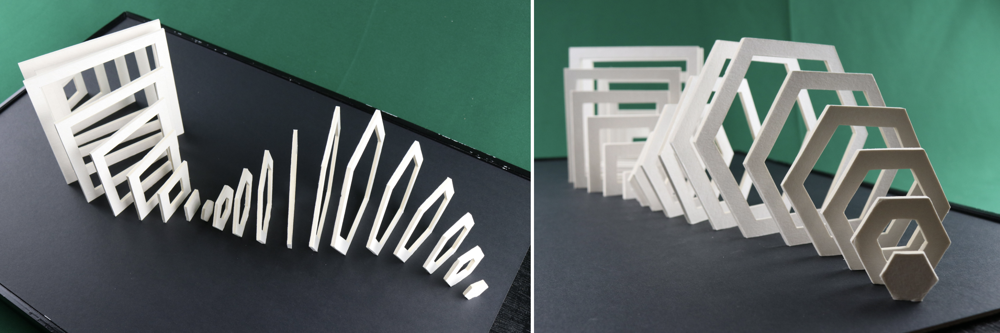

[← MEDIA 2DF3](README.md) | [Project 1 Overview](P1-README.md)

---

<h1 style="color: darkred;">P1 – In-Class Work I: Brainstorm, Sketch & Laser-Cut Prep</h1>  
*Group Project – 3 to 4 students per group*

<figure style="width: 100%; margin: auto;">
  
  <figcaption style="text-align: center; font-style: italic; margin-top: 0.5em;">
    Examples from the internet.
  </figcaption>
</figure>

---

> ⚠️ You must complete the **online Thode Makerspace training modules** on **Avenue to Learn** and the **in-person training** *before* this session.

In this session, your group will collaboratively **plan and prototype** a three-dimensional composition using sketches and digital tools. You will explore **form, repetition, and spatial relationships**, and prepare your designs for **laser-cutting using Inkscape**—the required software for the Thode Makerspace.

---

<h2 style="color: darkred;">[30 min] Brainstorming & Concept Sketching</h2>

Work together to generate ideas for your composition, inspired by **Wong’s Elements of Two-Dimensional Design** and sculptural principles of **form through repetition**. Create a Brainstorming document where you can add notes + sketches.  

### Your group sketch must:
- Include **20–30 individual planes** arranged over a defined **base**.
  > You will be provided with **birchwood plates** (24 × 12 in, 0.3 in thick) --charged to your **McMaster account**.
- Apply at least **three** of the following design principles:  
  *Form, Repetition, Structure, Similarity, Gradation, Radiation, Anomaly, Contrast, Concentration*.
- Clearly define the **shape**, **dimensions** (width and height), and **spacing** of each plane.
- Incorporate variation in **height**, **depth**, and/or **angle**.
- Propose a **colour scheme** based on gradation (see below).  
- Identify potential **connectors or supports** between planes.
- You must consider the shape, size, and color of the base.

### Color Scheme - Gradient Strategy:
- Assign each shape a **single solid colour**, arranged to produce a **visible gradient transition**
- You may design:
  - **Linear gradients** (e.g., red to blue)
  - **Multi-step gradients** (e.g., rainbow blends)
- Use **HSV (Hue, Saturation, Value)** to guide your colour shifts:
  - **Hue** → controls colour change
  - **Saturation** → intensity of each step
  - **Value** → brightness and darkness across the range

---

<h2 style="color: darkred;"> Illustrator → Inkscape Workflow </h2>

Use **Adobe Illustrator** and **Inkscape** to transform your sketches into vector-ready files for laser-cutting.

### What is Inkscape?

**Inkscape** is a free, open-source vector graphics editor similar to Adobe Illustrator. It allows you to design using precise **paths**, making it ideal for digital fabrication.

While we are using Inkscape because it is **required by the Thode Makerspace**, learning to adapt to different software platforms is a valuable skill for any media artist. Being proficient across both proprietary and open-source tools strengthens your ability to work in a variety of **production environments**, from galleries to labs to community-based studios.  

### Adobe Illustrator

Use the previous tutorials + this new tutorial on Rulers and Grid to complete this project.

+ [Composition Techniques I - Part 1](Comp-Tech-1-Part1.md)
+ [Composition Techniques I - Part 2](Comp-Tech-1-Part2.md)

<iframe src="https://www.iorad.com/player/2622699/Adobe-Illustrator-9--Rulers--Grids--and-Snap-to-Grid?src=iframe&oembed=1" width="100%" height="500px" style="width: 100%; height: 500px; border-bottom: 1px solid #ccc;" referrerpolicy="strict-origin-when-cross-origin" frameborder="0" webkitallowfullscreen="webkitallowfullscreen" mozallowfullscreen="mozallowfullscreen" allowfullscreen="allowfullscreen" allow="camera; microphone; clipboard-write;" sandbox="allow-scripts allow-forms allow-same-origin allow-presentation allow-downloads allow-modals allow-popups allow-popups-to-escape-sandbox allow-top-navigation allow-top-navigation-by-user-activation"></iframe>

---

<h2 style="color: darkred;">[20 min] Individual Exercise – Illustrator → Inkscape Workflow Practice</h2>

Before starting the group prototype, **each student** will complete a **short individual exercise** to practice the laser-cut file workflow.  
> ⚠️ **Before leaving class**, you must **show your test file to the instructor** to receive comments and troubleshooting feedback.

Follow this step-by-step tutorial:    

### Overview

1. **Open a new Adobe Illustrator file:**
   - Size: Letter  
   - Color Mode: RGB  
   - Artboards: 2  

2. **Create two simple composed vector shapes** combining two shapes together using the *Relationships of Form*:  
   - Use **one artboard per shape**.  
   - Do **not use fill**; set the stroke to **black (1 pt)**.  
   - Each must be a **single closed shape** — use **Pathfinder** to combine multiple shapes.  

3. **Export each shape as an `.SVG` file.**

4. **Open a new Inkscape file:**
   - Units: Inches  
   - Page Size: **24 × 12 in**  
   - Color Mode: RGB  
   - Artboards: 1  

5. **Import the SVGs into Inkscape** and prepare them for laser-cutting:
   - Remove all fills.  
   - Set the stroke color to **Red (R=255, G=0, B=0)**.  
   - Opacity should be **100%**.  
   - Set **stroke width = 0.001 in** (or **0.10 px** if your version uses pixels).  

6. **Align both shapes** within the 24 × 12 in canvas.  

7. **Save your Inkscape file** as SVG. No unique name required.

8. **Add your name** to the waiting list for the professor to check your file before you leave class.  
*No submission is required for this activity.*

> ⚠️ **Before leaving class**, you must **show your test file to the instructor** to receive comments and troubleshooting feedback.  
> This ensures your workflow and file setup are correct before starting the group design.

---

<h2 style="color: darkred;">[45–60 min] Group Work – Vector File Production for Laser-Cutting</h2>

Once everyone has completed the individual practice, your group will begin preparing the **actual vector files** for your collaborative design.

### Group Tasks
- **Divide shapes among members** so each student is responsible for a section of the design.  
- After dividing the shapes, **each group member** should create their shapes in a similar document as follows:

1. **Open a new Adobe Illustrator file:**
   - Size: Letter  
   - Color Mode: RGB  
   - Artboards: Choose the number of shapes you have  

2. **Create your vector shapes** (e.g., square, circle, or custom polygon):  
   - Use **one artboard per shape**.  
   - Do **not use fill**; set the stroke to **black (1 pt)**.  
   - Each must be a **single closed shape** — use **Pathfinder** to combine multiple objects if needed.
   - ⚠️ **Be careful with the measurements of your shapes!** Follow the **width and height** your group agreed on for each shape.  

3. **Export each shape as an `.SVG` file.**

4. **Once all members finish**, import all shapes into a shared Inkscape document(s) to assemble the group’s full composition. Open a new document(s) sized **24 × 12 in** and **import your SVGs into Inkscape**  
   - Each birchwood plate must be represented in a **separate 24 × 12 in document**.
   - Carefully plan the **layout and spacing** to maximize use of the sheet and **avoid wasted material**.
   - Prepare each file for **laser-cutting** by removing fills, setting stroke color to **Red (R=255, G=0, B=0)**, and adjusting the stroke width to **0.001 in (or 0.10 px)**.
   - Save your Inkscape files as **.SVG**, named as: `Group-#-Plate-1.svg`, `Group-#-Plate-2.svg`, etc.

> ⚠️ The birchwood plates are **24 × 12 in** — ensure your compositions fit within this limit to avoid material waste.  
> Double-check all **measurements, spacing, and layer organization** before saving.

---

<h3 style="color: darkred;">📥 Submission</h3>

1. Group brainstorming notes and sketches
   - **Naming Protocol**: `Group-#-Notes.pdf`

2. Lasser-Cutting Prep Files
   - **File naming:** `Group-#-Plate-1.svg`, `Group-#-Plate-2.svg`, etc.
     - Double-check all **measurements**, **spacing**, and **layer organization**.

Review the **required materials list** for Part 2 under [Project 1 Overview](P1-README.md) and bring them to the next class.

> 📌 **Failure to follow document setup or naming instructions may result in a grade deduction.**

---
