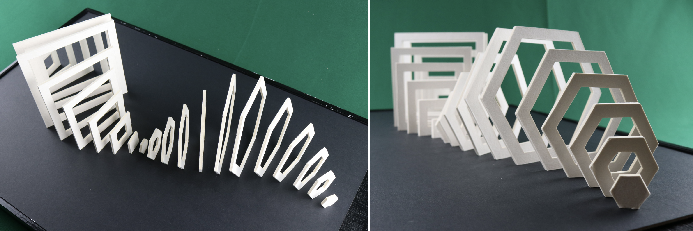

[← MEDIAART 2DF3](README.md) | [Project 1 Overview](P1-README.md)

---

# P1 – In-Class Work I: Concept, Sketching & Laser-Cut Preparation

*Group Project – 4 students per group*

<figure style="width: 100%; margin: auto;">
  
  <figcaption style="text-align: center; font-style: italic; margin-top: 0.5em;">
    Examples from the internet.
  </figcaption>
</figure>

---

> ⚠️ You must complete the **online Thode Makerspace training modules** on **Avenue to Learn** and the required **in-person training** before participating in laser cutting.

## Goal

During this session, your group will develop the **concept, structure, shapes, base, and laser-cut files** for Project 1.

The final project must build on concepts explored in **Composition Techniques I and II**, including form relationships, repetition and variation, structure, space, texture, visual hierarchy, colour theory, and colour proportioning.

All final vector production for laser cutting and engraving must be completed in **Inkscape**, the software required by the Thode Makerspace.  

The planning document should be **designed and assembled in Adobe InDesign**.

## Complete the activity in four stages

Complete the following stages in order.

<!-- 
/////////////////
SECTION 1
/////////////////
-->

  

    Stage 1: Review and apply previous design concepts
    
      Connect the project to the formal, spatial, textural, and colour concepts developed in Composition Techniques I and II.
    
  

Your group must develop the project using concepts explored throughout **Composition Techniques I and II**.

##### Composition Techniques I

+ [Composition Techniques I - Part 1](Comp-Tech-1-Part1.md)
+ [Composition Techniques I - Part 2](Comp-Tech-1-Part2.md)

Consider how your structure applies:

- Interrelationships of Form
- Repetition and repetition arrangements
- Similarity
- Gradation
- Anomaly
- Concentration
- Radiation
- Contrast
- Space
- Texture
- Grid and structural organization
- Dot, Line, Plane, and Mass
- Surface Activity
- Breaking Space
- Arranging Form

Your project should translate these ideas from a **two-dimensional composition into a three-dimensional physical structure**.

##### Composition Techniques II

The final project will also apply:

* Colour schemes
* Colour contrast
* Colour perspective
* Colour gradation
* Colour proportioning
* Relationships between dominant, secondary, and accent colours

> Colour will be developed in **Part 2**. During this session (Part 1), concentrate on creating a strong structure that can later support an intentional colour system.

You do not need to force every principle into every individual shape. Instead, the **complete project should demonstrate that your group is intentionally working with the major formal, spatial, textural, and colour concepts developed in Composition Techniques I and II.**

<!-- 
/////////////////
SECTION 2
/////////////////
-->

  

    Stage 2: Brainstorm, sketch, and prepare the concept document
    
      Develop the structure collaboratively and create a designed InDesign document containing the concept, sketches, measurements, and material planning.
    
  

#### Develop the group concept

Work together to create a three-dimensional composition built from approximately **20–30 two-dimensional planes** organized on a defined base.

The composition should explore:

- Repetition and variation
- Layering
- Height and depth
- Direction and angle
- Positive and negative space
- Rhythm
- Density
- Structural relationships
- Engraved surface texture

> Each group member must contribute to the planning. Contributions may include ideas, sketches, measurements, annotations, file preparation, or another approved method.

#### Design the base

The composition must include a physical **base**.

The base may be:

- Square
- Rectangle
- Circle
- Oval
- Triangle
- Diamond
- Polygon
- Irregular or custom vector shape

> The base should be treated as part of the **composition**, not simply as a support placed underneath it.

Consider:

- Shape
- Size
- Orientation
- Relationship to the repeated planes
- Negative space
- Placement of the planes
- Overall silhouette

#### Work within the material limit

Each group receives exactly:

* **Two birchwood sheets**
* **24 × 12 in each**
* **0.3 in thick**

> **Everything must fit within these two sheets.**

This includes:

* The base
* All repeated planes
* Connectors
* Supports
* Additional structural pieces

Plan dimensions carefully before preparing the final files.

> Consider how shapes can be rotated, nested, or reorganized to reduce unused areas while maintaining adequate spacing for laser cutting.

#### Plan engraved texture

Texture must be incorporated into the project through **laser engraving**.

Think about how engraved lines, patterns, marks, or repeated structures can create **Surface Activity**.

The engraved texture should support the overall design rather than function as unrelated decoration.

Possible approaches include:

- Repeated lines
- Directional marks
- Geometric patterns
- Organic patterns
- Gradation of density
- Concentration
- Repetition
- Changes in spacing
- Linear textures
- Custom vector patterns

Clearly identify in your sketches:

* Which areas will be **cut**
* Which areas will be **engraved**

> Cutting lines and engraving lines require different laser-file settings. Follow the tutorials provided later in this activity exactly.

---

#### Create the Brainstorming and Design Document

Each group must create **one shared Project 1 planning document in Adobe InDesign**.

The document will continue to be updated throughout the project.

##### Document setup

Use:

* **Software:** Adobe InDesign
* **Page size:** Letter — 8.5 × 11 in
* **Orientation:** Portrait or landscape, depending on your design
* **Pages:** As many as necessary to communicate the project clearly
* **Export:** PDF
* **Filename:** `Group-#-Project1-Design.pdf`

<iframe src="https://www.iorad.com/player/2776270/InDesign---Introduction?iframeHash=mobilequick-1&src=iframe&oembed=1" width="100%" height="500px" style="width: 100%; height: 500px; border-bottom: 1px solid #ccc;" referrerpolicy="strict-origin-when-cross-origin" frameborder="0" webkitallowfullscreen="webkitallowfullscreen" mozallowfullscreen="mozallowfullscreen" allowfullscreen="allowfullscreen" allow="camera; microphone; clipboard-write;" sandbox="allow-scripts allow-forms allow-same-origin allow-presentation allow-downloads allow-modals allow-popups allow-popups-to-escape-sandbox allow-top-navigation allow-top-navigation-by-user-activation"></iframe>

> **Warning:** Images placed in an InDesign document are usually linked to their original file location. If you move, rename, or delete a linked image, InDesign may no longer be able to find it. You may see a low-resolution preview and a Missing Link warning. You will need to relink the image to its new location.

The planning PDF is not simply a collection of notes and sketches. It must be a **designed document**.

Pay attention to:

- Layout
- Margins
- Alignment
- Typography
- Hierarchy
- Image placement
- Scale
- Spacing
- Consistency across pages

> Your sketches should be placed intentionally and should feel visually integrated with the written information.

##### The document must include

1. **Group number and student names**
2. **Concept statement**
   * Briefly explain the central idea of the structure.
3. **Design concepts**
   * Identify how the project connects to concepts from Composition Techniques I and II.
4. **Annotated 3-dimensional sketches**
   * Show the overall three-dimensional structure.
   * Explain how the planes change in scale, shape, direction, spacing, height, or position.
   * Show how planes will connect to and interact with the base.
5. **Base design**
   * Clearly show its shape and dimensions.
   * If used, identify the areas where engraved texture will be applied.
6. **Plane designs**
   * Show the planned shapes and their dimensions.
   * Show the planned connectors and their dimensions. 
   * Clearly identify the areas where engraved texture will be applied.
7. **Material planning**
    * Include **one image of each birchwood sheet layout**, showing how all shapes and structural pieces will be arranged on the two sheets.

> **Do not include a finalized colour palette in this document.** Colour will be developed during Part 

Ask the instructor for feedback before preparing the final laser files.

<!-- 
/////////////////
SECTION 3
/////////////////
-->

  

    Stage 3: Adobe Illustrator ➔ Inkscape workflow
    
      Create accurately measured vector shapes in Adobe Illustrator, then open the file in Inkscape to check and prepare the required cutting and engraving settings.
    
  

For this project, you will create and measure your artwork in **Adobe Illustrator**, then use an **SVG file** to open and check the artwork in **Inkscape** before preparing the cutting and engraving settings.

---

### Step 1: Work on Adobe Illustrator

Create a **new project** with the following settings: 

| Setting              | Requirement         |
| -------------------- | ------------------- |
| Software             | Adobe Illustrator   |
| Units                | Inches              |
| Page size            | **24 × 12 in**      |
| Artboard             | 2                   |
| Material represented | One birchwood sheet |
| Number of files      | **1**               |

**Follow the tutorial** to learn how to:

- create the required Adobe Illustrator file;
- set the document size using inches;
- use Illustrator’s measurement tools and panels to create shapes at exact dimensions;
- check object width, height, and placement; and
- set the correct cutting vs engaving settings

<!-- ADD ILLUSTRATOR FILE SETUP / MEASUREMENTS TUTORIAL HERE -->

#### Create and Arrange all project components

Across the two artboards, include:

* Base
* Repeated planes
* Connectors
* Supports
* Any other required elements
* Engraved texture

> The complete physical project must fit within these **two artworks only**.

Arrange the pieces efficiently to minimize material waste.

Consider:

* Rotation
* Nesting
* Spacing
* Shape orientation
* Accurate dimensions
* Relationship between cutting and engraving paths

Do not resize pieces simply to make them fit unless the change has also been approved in your design.

#### Export as SVG

**SVG** stands for **Scalable Vector Graphics**. It is a vector file format that stores artwork as shapes, paths, lines, and other editable vector information rather than as pixels.

Because SVG files are vector-based, they can be resized without becoming pixelated. SVG is also compatible with both **Adobe Illustrator** and **Inkscape**, making it useful for transferring your vector artwork between the two programs.

> Before exporting and moving between programs, check that your shapes, dimensions, and paths have been preserved correctly.

Save the files as:

* `Group-#-Plate-1.svg`
* `Group-#-Plate-2.svg`

**Checklist:**

- [ ] **Everything fits within two birchwood sheets.** The base, repeated planes, connectors, supports, and all other components fit within the two 24 × 12 in files.
- [ ] **The dimensions are correct.** All shapes match the measurements established in the approved design.
- [ ] **The material is used efficiently.** Shapes are arranged intentionally to reduce unnecessary waste.

---

### Step 2: Work on Inskscape

**Inkscape** is a free, open-source vector graphics editor used by the Thode Makerspace for preparing laser-cut files.

For this project, **all production files must be finalized in Inkscape**.

> Learning to move between different software environments is an important part of digital design and fabrication. The same concepts you have practiced in Illustrator (vector paths, shapes, measurements, alignment, layers, and precise transformations) can be applied in Inkscape.

#### Tutorial 2 — Open your SVG in Inkscape and check cutting vs. engraving lines

Follow the tutorial to open your **SVG files** in Inkscape and check that each vector path is prepared for the correct laser process.

You will review:

- how to open your SVG file in Inkscape;
- which shapes and base elements should be **cut completely through the birchwood**;
- which lines and patterns should be **engraved into the surface of the wood**;
- how to apply the required settings for cutting and engraving; and
- how to check that each path is assigned to the correct process before laser production.

<!-- ADD INKSCAPE CUTTING / ENGRAVING CHECK TUTORIAL HERE -->

> **Cutting lines and engraving lines are not interchangeable.** Before submitting your file, confirm that every path uses the correct settings for its intended function.

#### Save the checked SVG files

> The Thode Makerspace uses Inkscape as part of the workflow for sending vector files to the laser-cutting software, so **SVG is the required file format for production**.

After you have opened your files in **Inkscape** and confirmed that all cutting and engraving lines use the correct settings, save the final files as **SVG**.

Save the files as:

- `Group-#-Plate-1.svg`
- `Group-#-Plate-2.svg`

**Checklist:**

- [ ] **The cutting paths are correct.** Every element intended to be cut uses the required cutting-line settings.
- [ ] **The engraving paths are correct.** Every texture or surface treatment uses the required engraving-line settings.
- [ ] **Unintended fills have been removed.** Only the fills required by the laser-cutting and engraving workflow remain.
- [ ] **Duplicate and overlapping paths have been removed.** There are no repeated paths or accidental overlapping cutting lines.
- [ ] **The filenames are correct.** Both SVG files follow the required naming structure.

> Corrections may be required before your scheduled laser-cutting session.

---

## Submission

Submit **three files per group**:

| Item                                            | Required filename             |
| ----------------------------------------------- | ----------------------------- |
| Designed concept, information, and sketches PDF | `Group-#-Project1-Design.pdf` |
| Birchwood Plate 1                               | `Group-#-Plate-1.svg`         |
| Birchwood Plate 2                               | `Group-#-Plate-2.svg`         |

Files that cannot be opened, identified, or accessed may need to be resubmitted and may be considered late. Missing document requirements, material-limit errors, or incorrect cutting and engraving settings will affect the grade.

> The instructor will provide feedback **1–2 days after the submission deadline for Part 1**. If revisions are required, your group must **correct or update the Inkscape files before the scheduled laser-cutting session** and **re-upload the revised files to Avenue to Learn**.
> Review the **required materials list** for Part 2 under [Project 1 Overview](P1-README.md) and bring the required materials to the next class.

---

Credits: Jessica A. Rodríguez
