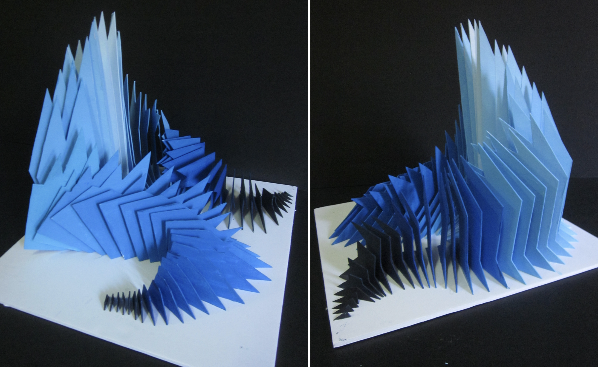

[← MEDIA 2DF3](README.md) | [Project 1 Overview](P1-README.md)

---

<h1 style="color: darkred;">P1 – In-Class Work II: Laser Cutting, Surface Prep, & Colour Planning</h1>  
*Group Project – 3 to 4 students per group*

<figure style="width: 80%; margin: auto;">
  
  <figcaption style="text-align: center; font-style: italic; margin-top: 0.5em;">
    Examples from the internet.
  </figcaption>
</figure>

---

> ⚠️ You must complete the setup of your **Inkscape documents** *before* this session to participate in the laser-cutting session.

In this session, you will move from digital preparation to **material production and colour design**. Each group will:
- Print their components using the **laser cutter** at the Thode Makerspace.
- Sand and prep their birchwood shapes
- Mix a **custom gradient-based colour palette** using **HSV principles** and **primary pigments only**

> Your goal is to create a consistent and visually engaging **gradient transition** across your composition —no texture is allowed.

---

<h2 style="color: darkred;">Colour Mixing & Gradient Design (45–60 min)</h2>

Your group will applied your **gradient effect across your entire composition**, using **solid colours** assigned **one per plane** to simulate colour flow and variation.

### Colour Mixing Rules:
- All colours must be **hand-mixed**—no pre-mixed paints allowed. Allow paints: **red, yellow, blue, white, and black**
- Mix your full palette in advance before applying colour to the pieces
- Mix **enough paint for at least 2–3 coats** per shape.  
- Store your mixed colours in the **required labeled containers** for later use and touch-ups.

### Follow these tips for Successful Colour Design:
- Mix **small test batches** before committing to full sets
- Plan your **gradient transitions on paper** before painting

---

<h3 style="color: darkred;">📥 Submission</h3>

1. Upload a photo of your **final colour palette ** to Avenue to Learn using the provided format.  
   - **Naming Protocol**: `Group-#-ColorPalette.pdf`

Check the rest of the instruction below as well as the [Final Submission Guidelines](P1-Final-Submission.md)

> 📌 **Failure to follow file setup or naming instructions may result in a grade deduction.**

---

<h2 style="color: darkred;">Laser Cutting Session (2-3 hours) </h2>

Each group will meet their scheduled appointment at the **Thode Makerspace** to complete the laser-cutting of their designs.

### Reminders:
- The instructor will be present during these sessions.  
- Carefully handle and collect your cut birchwood pieces.
- Keep track of any small components or connectors.

> ⚠️ Groups that miss their appointment will be responsible for rescheduling directly with the Makerspace and may delay their project progress.

---

<h2 style="color: darkred;">Surface Prep & White Base Coat</h2>

After cutting and collecting your pieces, your group must prepare the surfaces for painting.

### Required Steps:
- Use **fine grit sandpaper** to lightly sand all birchwood pieces.  
  > Focus on removing burn marks, splinters, and any uneven edges caused by the laser cutter.
- Once sanded, clean them and apply a **solid white base coat** to each shape.  
  > This primer layer ensures brightness and consistency in your final colours.

> ⚠️ Do not skip this step. Groups will lose points if visible imperfections or inconsistent colour coverage are observed in the final project.

Allow the white base coat to **fully dry** before moving to colour application.

---

<h2 style="color: darkred;">Colour Application</h2>

Follow these tips for Successful Colour Design:  
- You **must** apply a base coat of **white** before any colour
- Keep brush strokes **smooth and consistent**
- Apply **2–3 thin layers** for full, even coverage
- Allow each layer to **fully dry** before continuing

---
