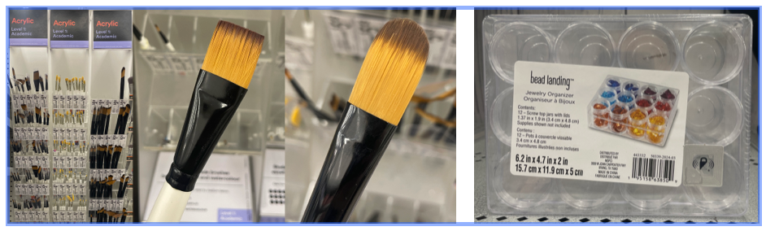
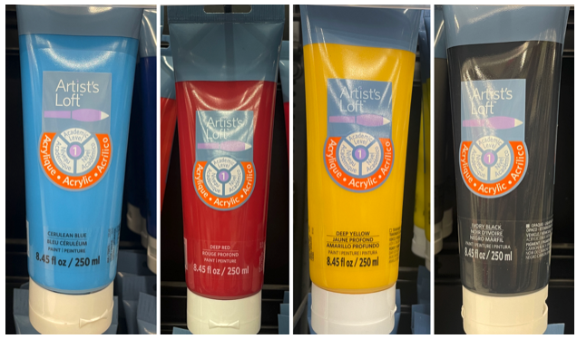

[MEDIA 2DF3](README.md)

-------------------------------------------------------------------------------

<h1 style="color: darkred;">Project 1 – Vector to Volume</h1> 
*Group Project (3–4 students)*

<figure style="width: 100%; margin: auto;">
  
  <figcaption style="text-align: center; font-style: italic; margin-top: 0.5em;">
    Examples by previous students working with Project 1 – Vector to Volume
  </figcaption>
</figure>

## Overview

In this project, students will collaborate in small groups (**3–4 students**) to design and construct a **three-dimensional composition** made from **two-dimensional vector-based shapes**.

Working from sketch to prototype, students will explore how flat geometry can be transformed into dynamic structures through repetition, layering, and spatial organization.  

The process includes **hand-sketching**, **digital design using Illustrator and Inkscape**, and **laser-cutting on birchwood**.  

Final compositions will demonstrate the application of **Wong’s Elements of Two-Dimensional Design** and **basic Colour Theory**, while experimenting with physical materiality and structure.

> **This project is inspired by the paper-engineered sculptural work of <a href="https://www.mattshlian.com/" target="_blank">Matt Shlian</a>.**

---

## Index

- [Part 1 – In-Class Work I: Brainstorm, Sketch & Laser-Cut Prep](P1-InClassWork-I.md)
- [Part 2 – In-Class Work II: Laser Cutting, Surface Prep, & Colour Planning](P1-InClassWork-II.md)
- [Final Submission Guidelines](P1-Final-Submission.md)

---

## Notes

- ⚠️ Students must complete **Thode’s Makerspace Training Modules** on **Avenue to Learn** and the **in-person training** prior to any Project-1 session. ⚠️
- A **laser-cutting session must be booked** at the **Thode Makerspace** in advance for production.  
  The instructor will confirm group printing schedules during Week 2.
- **Required materials** include: 
  - Birchwood sheets (0.3 in thick, 24 × 12 in).
  > Estimated shared cost: **$20 per group** --Birchwood sheets will be charged through the McMaster's accounts.
  - Paint, and basic tools --see below.
  > Estimated shared cost: **$30 per group** --Each group must bring the required materials for Part 2 – In-Class Work II.
  - **Fine Grit Sandpaper** (for smoothing laser-cut edges)
  > The instructor will provide the sandpaper.
- All plates must be designed in **Inkscape**, the software required by the Makerspace.

❗ **Reminder:** This is a collaborative project. Design work, cutting, and assembly must be shared equally among all group members. Participation, time management, and group communication will be factored into the evaluation.

---

## Required Materials for Project 1

All materials can be purchased at:

- <a href="https://www.michaels.com/" target="_blank">Michaels</a> , or  
- <a href="https://g.co/kgs/x8QeG6p" target="_blank">Mixed Media Art Shop</a>, 1058 King St W, Hamilton, ON L8S 1G7

> **Important:** Each student must purchase a **good quality brush** for painting.  
> Visible brush marks on birchwood surfaces will result in **grade deductions**.

---

### Group Materials (1 set per group)

- **Bead Landing Jewelry Organizer** (for storing mixed paints)  
  Size: 6.2 in × 4.7 in × 2 in, at least 15 **separate** compartments  
  *Option:* <a href="https://www.michaels.com/product/simply-simmons-short-handle-flat-wash-brush-10472892?michaelsStore=5610&inv=2" target="_blank">30 Container Bead Organizer by Bead Landing – **$18** </a>
  *Option:* <a href="https://www.amazon.ca/Huaxiangoh-Containers-8-85x5-31x2-16in-Embroidery-Accessories/dp/B08GH8964N/ref=sr_1_10?dib=eyJ2IjoiMSJ9.I3YLW1Fb0_vOKsin33IJCeRn77bC5E07aT5U-P4Hmn21qQK5bZjlaNJ5VxsFbsDHPAIPy2-GUngmVRN8VzVm7GHG4CRCCUnL9j8w0BL53GK9QbJ6r2fb9Og20GK4YefBvxldUddOWNb30HDVBy0FoFmVZU6XERGR814ViD5-1AQxgBNQrs32odbIujZFgi95Gebx-o3rJ2k-tDaUhGHLkiTduc8HZkXOyWcV5SJZfYw5jMzmxD6CaEMwl1Jje0nGHaWyVZb70lYy9wJxpqV6D861vnHq-LsFQrkzAYWgNJE.j0KTphf1aHe7mRoGuJcCflx1M8itYuEK1yBCVFDBmMQ&dib_tag=se&gad_source=1&hvadid=679286654804&hvdev=c&hvexpln=0&hvlocphy=9060779&hvnetw=g&hvocijid=1908508043514503255--&hvqmt=e&hvrand=1908508043514503255&hvtargid=kwd-2257552828487&hydadcr=13567_13405808&keywords=bead%2Blanding%2Bjewelry%2Borganizer&mcid=a6023cbfe3ad3a9fb179bd3fcf439089&qid=1754154074&sr=8-10&th=1" target="_blank">30 Slots Diamond Painting Storage Containers – **$14** </a>

- **Wood Glue**  
  *Option:* Gorilla® Wood Glue (118.29 ml) – **$4.99 × 2**

---

---

### Individual Materials (each student)

- **Acrylic Brush (Level 1: Academic, Medium–Large size)**  
  *Option:* <a href="https://www.michaels.com/product/simply-simmons-short-handle-flat-wash-brush-10472892?michaelsStore=5610&inv=2" target="_blank">Simply Simmons Short Handle Flat Wash Brush – **$5** </a>
  *Option:* <a href="https://www.michaels.com/product/royal-langnickel-essentials-long-handle-flat-brush-10476226?michaelsStore=5610&inv=5" target="_blank">Royal & Langnickel® Essentials™ Long Handle Flat Brush – **$5** </a> 
  > ✨ Must be **good quality** to avoid streaks and marks on painted wood.

- **Cheap Brush (for glue application, small size)**

---

### Paints (per group)

All groups **must purchase**:
- **White** and **Black** acrylic paint (for base coating, and adjusting value & saturation)
- At least **two** of the **primary colours (Red, Blue, Yellow)**  
> Select based on the hues needed for your group's gradient palette.

**Option 1: <a href="https://www.michaels.com/product/liquitex-basics-acrylic-paint-85oz-10474509?michaelsStore=5610&inv=1" target="_blank">Liquitex Basics Acrylics</a>**
- Titanium White (400 ml) – **$19.99**
- Primary Blue (250 ml) – **$13.99**
- Primary Red (250 ml) – **$13.99**
- Primary Yellow (250 ml) – **$13.99**
- Ivory Black (250 ml) – **$13.99**

#### **Option 2: <a href="https://www.michaels.com/product/acrylic-paint-by-artist's-loft-85oz-10517078?michaelsStore=5610&inv=3" target="_blank">Artist’s Loft Acrylic</a>**
- Titanium White (250 ml) × 2 – **$10.49 × 2**
- Cerulean Blue (250 ml) – **$10.49**
- Deep Red (250 ml) – **$10.49**
- Deep Yellow (250 ml) – **$10.49**
- Ivory Black (250 ml) – **$10.49**

---

